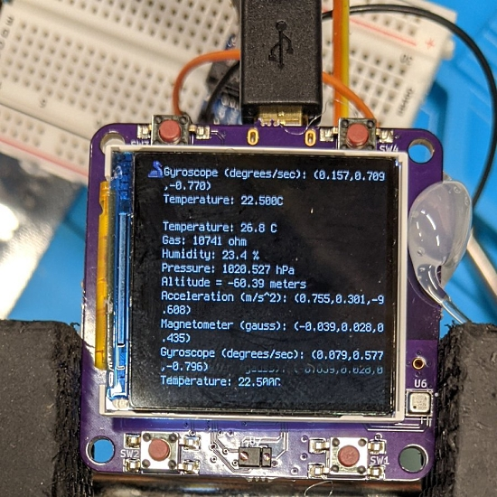
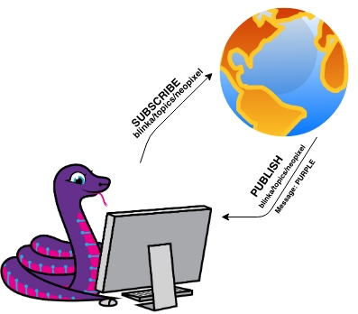
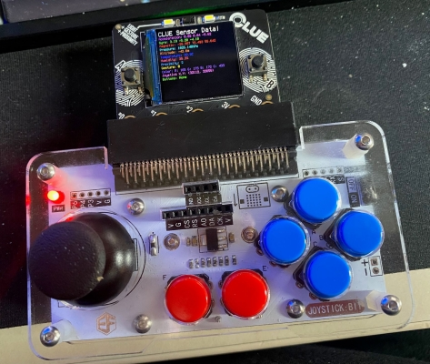
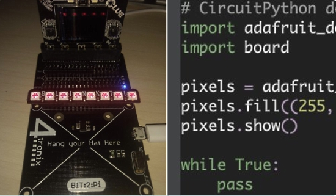
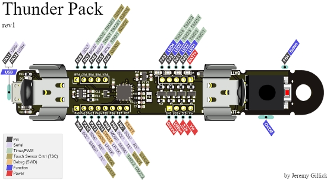
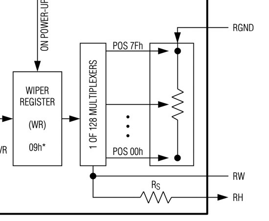
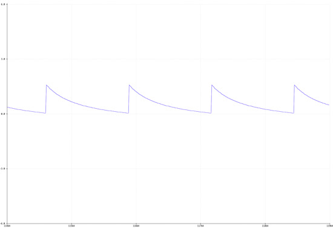
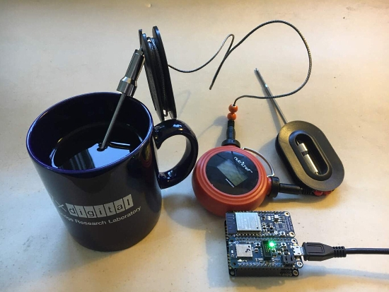

- [X] Kattni updates
- [X] change date
- [ ] update title
- [ ] Feature story
- [ ] Update  for images
- [ ] All images 550w max only
- [ ] Link "View this email in your browser."

View this email in your browser.

Hi everyone! It's the latest Python for Microcontrollers newsletter, brought you by the community! We're on [Discord](https://discord.gg/HYqvREz), [Twitter](https://twitter.com/search?q=circuitpython&src=typed_query&f=live), and for past newsletters - [view them all here](https://www.adafruitdaily.com/category/circuitpython/). If you're reading this on the web, [subscribe here](https://www.adafruitdaily.com/). Let's get started!

## CircuitPython libraries are now using the latest Pylint and Black formatting!

Adafruit has completed updated every CircuitPython library to use the latest version of Pylint and implemented the Black Python formatter. Pylint is a tool for linting code. Linting is the process of checking your code for basic stylistic mistakes. It doesn’t verify that your code works, it simply checks that it looks as good as possible and is readable by others. Black is a really useful code formatting tool maintained by the Python Software Foundation. It reformats files to improve readability. When you contribute code to CircuitPython libraries, your code will be checked for both. You’ll be able to make any fixes at that point, but it’s much easier to set up Pylint and Black on your machine and run them locally.

We have a guide to help! The [Improve Your Code with Pylint and Black guide](https://learn.adafruit.com/improve-your-code-with-pylint) was recently updated to include installation and usage of Black, as well as to reflect the update to the latest Pylint. You are no longer required to specify a particular version of Pylint or Python to be able to check your code locally. The process should be much simpler now. Check out the guide and you’ll be up and running in no time! - [Adafruit](https://blog.adafruit.com/2020/03/17/circuitpython-libraries-are-now-using-the-latest-pylint-and-black-formatting/)

## The OSHW Summit wrist badge gets USB programming support

Drew Fustini posts "I sense Blinka is excited to no longer be tethered to a j-link. Time to code some CircuitPython from the comfort of USB". Drew was on this past Wednesday's [Show and Tell](https://learn.adafruit.com/show-and-tell) ([video](https://youtu.be/VmVkX_7PkLs)). - [Twitter](https://twitter.com/pdp7/status/1240376749105598468)

## MQTT in CircuitPython with Ethernet

The MQTT in CircuitPython guide has been updated to include setup instructions and code for use with Ethernet for CircuitPython.

> So, you have a CircuitPython project and want to connect it to the internet? You may want to consider adding MQTT to your project. MQTT is an extremely popular and lightweight protocol which can connect your project to the internet and quickly process network events.

In this guide, you will set up your CircuitPython board with the necessary libraries, connect to the internet and connect your CircuitPython board to either a MQTT broker of your choice or the free Adafruit IO MQTT broker. We’ve included code-walkthrough and advanced usage sections to this guide so you can roll your own MiniMQTT project!

More: [Updated Guide]() and [Blog](https://blog.adafruit.com/2020/03/18/updated-guide-mqtt-in-circuitpython-circuitpython-python-mqttorg-adafruit-adafruitlearningsystem-ethernet-mqtt-adafruit/)

## News from around the web!

Raspberry Pi Thermal-Visual Player combines the images from a Raspberry Pi camera and an Adafruit MLX90640 thermal camera on screen using CircuitPython. - [Twitter](https://twitter.com/_skipt_/status/1240148972951474176) and [GitHub](https://github.com/9nut/thermalplayer)

Pigweed is a collection of embedded-targeted libraries. They are open source for 32-bit microcontroller development released by Google. They address the classic challenge in the embedded space of reducing the time from running git clone to having a binary executing on a device, setting up an entire suite of tools needed for non-trivial production embedded projects. - [Google Blog](https://opensource.googleblog.com/2020/03/pigweed-collection-of-embedded-libraries.html) and [Source](http://pigweed.googlesource.com/)

Allowing studenta access to the serial REPL in CircuitPython on Chromebooks can be difficult on centrally locked down devices. Here is a web based IDE (crafted in HTML and JavaScript) that lets you see the REPL. Luckily due to WebUSB, this is actually possible as long as you are using a modern version of Chrome. - [Forum Post](https://forums.adafruit.com/viewtopic.php?f=60&t=163583) and [GitHub](https://github.com/Mr-Coxall/CircuitPython-IDE)

CircuitPython work to interface an Adafruit CLUE board with the Elecfreaks Joystick:bits. - [Twitter](https://twitter.com/Codepope/status/1241433175227760642) and [Blog](https://codepope.dev/a-clue-and-a-joystick-bit/)

David Glaude writes "Pimoroni famous Blinkt! is just a bunch of 8 APA-102 connected to GPIO 23 and 24. 4tronix_uk map that to micro:bit pin 16 and 5. In Adafruit CircuitPython, APA-102 is named DotStar. Driving the Blinkt! from the Clue was done in a matter of minutes." - [Twitter](https://twitter.com/DavidGlaude/status/1240394392751476736)

PyDev of the Week: Jessica Garson on [Mouse vs Python](http://www.blog.pythonlibrary.org/2020/03/16/pydev-of-the-week-jessica-garson/)

#ICYDNCI What was the most popular, most clicked link, in [last week's newsletter](https://www.adafruitdaily.com/2020/03/17/clue-gets-10-out-of-10-join-the-largest-show-and-tell-in-the-world-wednesday-7pm-et-and-more-python-adafruit-circuitpython-circuitpython-micropython-thepsf-adafruit/)? [title](url).

## Made with Mu

Why Mu? Mu tries to make it as easy as possible to get started with programming but aims to help you graduate to "real" development tools soon after. Everything in Mu is the "real thing" but presented in as simple and obvious way possible. It's like the toddling stage in learning to walk: you're finding your feet and once you're confident, you should move on and explore! Put simply, Mu aims to foster autonomy. Try out Mu today! - [codewith.mu](https://codewith.mu/)

## Coming soon

A pull request is pending to support CircuitPython on the Thunder pack board. The board includes an integrated battery, power management system, an STM32F11xx Arm microcontroller, USB bootloader, 4 high-power PWM outputs, and 12 GPIOs. - [Project GitHub](https://github.com/jgillick/ThunderPack/tree/STM32F4) and [CircuitPython PR](https://github.com/adafruit/circuitpython/pull/2723)

## New Learn Guides!

[Adafruit Bonsai Buckaroo](https://learn.adafruit.com/adafruit-bonsai-buckaroo) from [Kattni](https://learn.adafruit.com/users/kattni)

[Adafruit HTS221 - Temperature & Humidity Sensor](https://learn.adafruit.com/adafruit-hts221-temperature-humidity-sensor) from [Bryan Siepert](https://learn.adafruit.com/users/siddacious)

[Adding a Single Board Computer to PlatformDetect for Blinka](https://learn.adafruit.com/adding-a-single-board-computer-to-platformdetect-for-blinka) from [Melissa LeBlanc-Williams](https://learn.adafruit.com/users/MakerMelissa)

[Burning Fire Wizard Staff](https://learn.adafruit.com/burning-fire-wizard-staff) from [Erin St. Blaine](https://learn.adafruit.com/users/firepixie)

[MX MIDI Guitar](https://learn.adafruit.com/mx-midi-guitar) from [Noe and Pedro](https://learn.adafruit.com/users/pixil3d)

## CircuitPython Libraries!

CircuitPython support for hardware continues to grow. We are adding support for new sensors and breakouts all the time, as well as improving on the drivers we already have. As we add more libraries and update current ones, you can keep up with all the changes right here!

For the latest drivers, download the [Adafruit CircuitPython Library Bundle](https://circuitpython.org/libraries).

If you'd like to contribute, CircuitPython libraries are a great place to start. Have an idea for a new driver? File an issue on [CircuitPython](https://github.com/adafruit/circuitpython/issues)! Interested in helping with current libraries? Check out the [CircuitPython.org Contributing page](https://circuitpython.org/contributing). We've included open pull requests and issues from the libraries, and details about repo-level issues that need to be addressed. We have a guide on [contributing to CircuitPython with Git and Github](https://learn.adafruit.com/contribute-to-circuitpython-with-git-and-github) if you need help getting started. You can also find us in the #circuitpython channel on the [Adafruit Discord](https://adafru.it/discord). Feel free to contact Kattni (@kattni) with any questions.

You can check out this [list of all the CircuitPython libraries and drivers available](https://github.com/adafruit/Adafruit_CircuitPython_Bundle/blob/master/circuitpython_library_list.md). 

The current number of CircuitPython libraries is **221**!

**Updated Libraries!**

Here's this week's updated CircuitPython libraries:

 * [Adafruit_CircuitPython_LSM6DS](https://github.com/adafruit/Adafruit_CircuitPython_LSM6DS)
 * [Adafruit_CircuitPython_Wiznet5k](https://github.com/adafruit/Adafruit_CircuitPython_Wiznet5k)
 * [Adafruit_CircuitPython_IL0398](https://github.com/adafruit/Adafruit_CircuitPython_IL0398)
 * [Adafruit_CircuitPython_JWT](https://github.com/adafruit/Adafruit_CircuitPython_JWT)
 * [Adafruit_CircuitPython_CursorControl](https://github.com/adafruit/Adafruit_CircuitPython_CursorControl)
 * [Adafruit_CircuitPython_BitmapSaver](https://github.com/adafruit/Adafruit_CircuitPython_BitmapSaver)
 * [Adafruit_CircuitPython_AzureIoT](https://github.com/adafruit/Adafruit_CircuitPython_AzureIoT)
 * [Adafruit_CircuitPython_CAP1188](https://github.com/adafruit/Adafruit_CircuitPython_CAP1188)
 * [Adafruit_CircuitPython_IL0373](https://github.com/adafruit/Adafruit_CircuitPython_IL0373)
 * [Adafruit_CircuitPython_WSGI](https://github.com/adafruit/Adafruit_CircuitPython_WSGI)
 * [Adafruit_CircuitPython_HX8357](https://github.com/adafruit/Adafruit_CircuitPython_HX8357)
 * [Adafruit_CircuitPython_ILI9341](https://github.com/adafruit/Adafruit_CircuitPython_ILI9341)
 * [Adafruit_CircuitPython_Nunchuk](https://github.com/adafruit/Adafruit_CircuitPython_Nunchuk)
 * [Adafruit_CircuitPython_SSD1322](https://github.com/adafruit/Adafruit_CircuitPython_SSD1322)
 * [Adafruit_CircuitPython_SSD1331](https://github.com/adafruit/Adafruit_CircuitPython_SSD1331)
 * [Adafruit_CircuitPython_SSD1351](https://github.com/adafruit/Adafruit_CircuitPython_SSD1351)
 * [Adafruit_CircuitPython_ICM20649](https://github.com/adafruit/Adafruit_CircuitPython_ICM20649)
 * [Adafruit_CircuitPython_SSD1608](https://github.com/adafruit/Adafruit_CircuitPython_SSD1608)
 * [Adafruit_CircuitPython_ST7735R](https://github.com/adafruit/Adafruit_CircuitPython_ST7735R)
 * [Adafruit_CircuitPython_PYOA](https://github.com/adafruit/Adafruit_CircuitPython_PYOA)
 * [Adafruit_CircuitPython_IterTools](https://github.com/adafruit/Adafruit_CircuitPython_IterTools)
 * [Adafruit_CircuitPython_ST7789](https://github.com/adafruit/Adafruit_CircuitPython_ST7789)
 * [Adafruit_CircuitPython_ST7735](https://github.com/adafruit/Adafruit_CircuitPython_ST7735)
 * [Adafruit_CircuitPython_SSD1327](https://github.com/adafruit/Adafruit_CircuitPython_SSD1327)
 * [Adafruit_CircuitPython_DymoScale](https://github.com/adafruit/Adafruit_CircuitPython_DymoScale)
 * [Adafruit_CircuitPython_Hue](https://github.com/adafruit/Adafruit_CircuitPython_Hue)
 * [Adafruit_CircuitPython_LIFX](https://github.com/adafruit/Adafruit_CircuitPython_LIFX)
 * [Adafruit_CircuitPython_MSA301](https://github.com/adafruit/Adafruit_CircuitPython_MSA301)
 * [Adafruit_CircuitPython_hashlib](https://github.com/adafruit/Adafruit_CircuitPython_hashlib)
 * [Adafruit_CircuitPython_TLV493D](https://github.com/adafruit/Adafruit_CircuitPython_TLV493D)
 * [Adafruit_CircuitPython_NTP](https://github.com/adafruit/Adafruit_CircuitPython_NTP)
 * [Adafruit_CircuitPython_BD3491FS](https://github.com/adafruit/Adafruit_CircuitPython_BD3491FS)
 * [Adafruit_CircuitPython_BMP3XX](https://github.com/adafruit/Adafruit_CircuitPython_BMP3XX)
 * [Adafruit_CircuitPython_DS3502](https://github.com/adafruit/Adafruit_CircuitPython_DS3502)
 * [Adafruit_CircuitPython_MPRLS](https://github.com/adafruit/Adafruit_CircuitPython_MPRLS)
 * [Adafruit_CircuitPython_DPS310](https://github.com/adafruit/Adafruit_CircuitPython_DPS310)
 * [Adafruit_CircuitPython_VS1053](https://github.com/adafruit/Adafruit_CircuitPython_VS1053)
 * [Adafruit_CircuitPython_ATECC](https://github.com/adafruit/Adafruit_CircuitPython_ATECC)
 * [Adafruit_CircuitPython_MCP4728](https://github.com/adafruit/Adafruit_CircuitPython_MCP4728)
 * [Adafruit_CircuitPython_AS726x](https://github.com/adafruit/Adafruit_CircuitPython_AS726x)
 * [Adafruit_CircuitPython_VEML6075](https://github.com/adafruit/Adafruit_CircuitPython_VEML6075)
 * [Adafruit_CircuitPython_TMP007](https://github.com/adafruit/Adafruit_CircuitPython_TMP007)
 * [Adafruit_CircuitPython_TLC59711](https://github.com/adafruit/Adafruit_CircuitPython_TLC59711)
 * [Adafruit_CircuitPython_TFmini](https://github.com/adafruit/Adafruit_CircuitPython_TFmini)
 * [Adafruit_CircuitPython_PCT2075](https://github.com/adafruit/Adafruit_CircuitPython_PCT2075)
 * [Adafruit_CircuitPython_MAX9744](https://github.com/adafruit/Adafruit_CircuitPython_MAX9744)
 * [Adafruit_CircuitPython_TMP006](https://github.com/adafruit/Adafruit_CircuitPython_TMP006)
 * [Adafruit_CircuitPython_VCNL4040](https://github.com/adafruit/Adafruit_CircuitPython_VCNL4040)
 * [Adafruit_CircuitPython_ProgressBar](https://github.com/adafruit/Adafruit_CircuitPython_ProgressBar)
 * [Adafruit_CircuitPython_TPA2016](https://github.com/adafruit/Adafruit_CircuitPython_TPA2016)
 * [Adafruit_CircuitPython_LPS35HW](https://github.com/adafruit/Adafruit_CircuitPython_LPS35HW)
 * [Adafruit_CircuitPython_MAX31856](https://github.com/adafruit/Adafruit_CircuitPython_MAX31856)
 * [Adafruit_CircuitPython_MLX90614](https://github.com/adafruit/Adafruit_CircuitPython_MLX90614)
 * [Adafruit_CircuitPython_MPL115A2](https://github.com/adafruit/Adafruit_CircuitPython_MPL115A2)
 * [Adafruit_CircuitPython_SharpMemoryDisplay](https://github.com/adafruit/Adafruit_CircuitPython_SharpMemoryDisplay)
 * [Adafruit_CircuitPython_MCP9600](https://github.com/adafruit/Adafruit_CircuitPython_MCP9600)
 * [Adafruit_CircuitPython_STMPE610](https://github.com/adafruit/Adafruit_CircuitPython_STMPE610)
 * [Adafruit_CircuitPython_MLX90640](https://github.com/adafruit/Adafruit_CircuitPython_MLX90640)
 * [Adafruit_CircuitPython_DS2413](https://github.com/adafruit/Adafruit_CircuitPython_DS2413)
 * [Adafruit_CircuitPython_Trellis](https://github.com/adafruit/Adafruit_CircuitPython_Trellis)
 * [Adafruit_CircuitPython_MIDI](https://github.com/adafruit/Adafruit_CircuitPython_MIDI)
 * [Adafruit_CircuitPython_Thermistor](https://github.com/adafruit/Adafruit_CircuitPython_Thermistor)
 * [Adafruit_CircuitPython_SSD1305](https://github.com/adafruit/Adafruit_CircuitPython_SSD1305)
 * [Adafruit_CircuitPython_miniQR](https://github.com/adafruit/Adafruit_CircuitPython_miniQR)
 * [Adafruit_CircuitPython_turtle](https://github.com/adafruit/Adafruit_CircuitPython_turtle)
 * [Adafruit_CircuitPython_ImageLoad](https://github.com/adafruit/Adafruit_CircuitPython_ImageLoad)
 * [Adafruit_CircuitPython_RPLIDAR](https://github.com/adafruit/Adafruit_CircuitPython_RPLIDAR)
 * [Adafruit_CircuitPython_VEML7700](https://github.com/adafruit/Adafruit_CircuitPython_VEML7700)
 * [Adafruit_CircuitPython_TLC5947](https://github.com/adafruit/Adafruit_CircuitPython_TLC5947)
 * [Adafruit_CircuitPython_Gizmo](https://github.com/adafruit/Adafruit_CircuitPython_Gizmo)
 * [Adafruit_CircuitPython_SI5351](https://github.com/adafruit/Adafruit_CircuitPython_SI5351)
 * [Adafruit_CircuitPython_IRRemote](https://github.com/adafruit/Adafruit_CircuitPython_IRRemote)
 * [Adafruit_CircuitPython_LIS3MDL](https://github.com/adafruit/Adafruit_CircuitPython_LIS3MDL)
 * [Adafruit_CircuitPython_AWS_IOT](https://github.com/adafruit/Adafruit_CircuitPython_AWS_IOT)
 * [Adafruit_CircuitPython_PyPortal](https://github.com/adafruit/Adafruit_CircuitPython_PyPortal)
 * [Adafruit_CircuitPython_GC_IOT_Core](https://github.com/adafruit/Adafruit_CircuitPython_GC_IOT_Core)
 * [Adafruit_CircuitPython_AdafruitIO](https://github.com/adafruit/Adafruit_CircuitPython_AdafruitIO)
 * [Adafruit_CircuitPython_TrellisM4](https://github.com/adafruit/Adafruit_CircuitPython_TrellisM4)
 * [Adafruit_CircuitPython_LPS2X](https://github.com/adafruit/Adafruit_CircuitPython_LPS2X)
 * [Adafruit_CircuitPython_LIS2MDL](https://github.com/adafruit/Adafruit_CircuitPython_LIS2MDL)
 * [Adafruit_CircuitPython_BLE](https://github.com/adafruit/Adafruit_CircuitPython_BLE)
 * [Adafruit_CircuitPython_HTS221](https://github.com/adafruit/Adafruit_CircuitPython_HTS221)
 * [Adafruit_CircuitPython_MPU6050](https://github.com/adafruit/Adafruit_CircuitPython_MPU6050)
 * [Adafruit_CircuitPython_PyBadger](https://github.com/adafruit/Adafruit_CircuitPython_PyBadger)
 * [Adafruit_CircuitPython_binascii](https://github.com/adafruit/Adafruit_CircuitPython_binascii)
 * [Adafruit_CircuitPython_miniesptool](https://github.com/adafruit/Adafruit_CircuitPython_miniesptool)
 * [Adafruit_CircuitPython_RSA](https://github.com/adafruit/Adafruit_CircuitPython_RSA)
 * [Adafruit_CircuitPython_Debouncer](https://github.com/adafruit/Adafruit_CircuitPython_Debouncer)
 * [Adafruit_CircuitPython_SSD1306](https://github.com/adafruit/Adafruit_CircuitPython_SSD1306)
 * [Adafruit_CircuitPython_Bitmap_Font](https://github.com/adafruit/Adafruit_CircuitPython_Bitmap_Font)
 * [Adafruit_CircuitPython_MiniMQTT](https://github.com/adafruit/Adafruit_CircuitPython_MiniMQTT)

**PyPI Download Stats!**

We've written a special library called Adafruit Blinka that makes it possible to use CircuitPython Libraries on [Raspberry Pi and other compatible single-board computers](https://learn.adafruit.com/circuitpython-on-raspberrypi-linux/). Adafruit Blinka and all the CircuitPython libraries have been deployed to PyPI for super simple installation on Linux! Here are the top 10 CircuitPython libraries downloaded from PyPI in the last week, including the total downloads for those libraries:

Keep an eye out here for updated download stats coming soon!

## What’s the team up to this week?

What is the team up to this week? Let’s check in!

**Bryan**

This week I'm working on the breakout for the DS1841 Temperature-Controlled, Non-Volatile I2C Logarithmic Resistor from Maxim. This chip is super cool. It's intended purpose is to provide temperature compensated bias control for avalanche photodiodes (APDs) used in optical transceivers. They're new to me, but apparently APDs are commonly used because they have a high sensitivity and wide bandwidth at the cost of being sensitive to temperature fluctuations. This chip can help with that! You can check out [this app note](https://www.maximintegrated.com/en/design/technical-documents/app-notes/1/1831.html) if you want to learn a bit more about APDs.

While most of us don't have a private fiber optic network with fussy APDs, the DS1841 has enough bells and whistles that I'm sure you'll be able to find a use for it in a project. It's basically an I2C controller potentiometer with a logarithmic curve, so you can use it in place of a mechanical log potentiometer to allow you to control it programmatically. Furthermore, the temperature compensation uses a LUT (look up table) to allow the user to adjust how the resistance varies according to temperature. You can however turn off the temperature based adjustment and use the LUT directly to give you the same control over the behavior of the resistance!

I'm looking forward to seeing what you all can do with this chip. While testing I've got it hooked up in a simple voltage divider. You could do something similar to control all sorts of things. LEDs, DC/DC converters, Op-Amps, the possibilities are endless!

**Dan**

I've been able to connect via BLE with some inexpensive readily available cooking thermometers. The ones I have all identify as "iBBQ". Someone on the great world wide web [wrote up its BLE specs](https://gist.github.com/uucidl/b9c60b6d36d8080d085a8e3310621d64), and I was able to create a CircuitPython library quickly.

I'd never used [adafruit.io](https://adafruit.io/) for anything before, so I cooked up a quick demo which gets temperatures and battery status via BLE and sends it on it via an [AirLift FeatherWing](https://www.adafruit.com/product/4264). I used the latest [CircuitPython MQTT library](https://learn.adafruit.com/mqtt-in-circuitpython/circuitpython-wifi-usage) which Brent R. released just yesterday. It worked great!

I'm also working on a CircuitPython library that implements all the services we provide for the [Bluefruit Playground app](https://learn.adafruit.com/bluefruit-playground-app). We have [Arduino code](https://github.com/adafruit/Adafruit_nRF52_Arduino/blob/master/libraries/Bluefruit52Lib/examples/Peripheral/bluefruit_playground/bluefruit_playground.ino) for this, but haven't implemented it in CircuitPython yet. When I finish you'll be able to both send and receive data for all the on-board sensors, buttons, and peripherals on the Circuit Playground Bluefruit and the CLUE boards.

Finally, I'm still debugging spurious writes to the SAMD51 internal flash -- no breakthroughs yet, but I have some clues.

**Jeff**

Together with PaintYourDragon, we are working on a new library for LED panels.  Dragon is doing the heavy lifting, creating the low level code (and Arduino bindings); I'm adapting it to fit CircuitPython.  In the future, CircuitPython will be able to drive displays like these, probably using the displayio module that is used for LCD and e-ink displays:

We are also working towards releasing version 5.1.0 of the core CircuitPython code, and I am doing more of the release-related tasks this time around.  Two exciting additions are ulab, which I've talked about in other updates; and support for "f-strings", a more modern and concise way to build strings than "%" or ".format()".  Both of these features are expected to be available on higher powered CircuitPython devices with SAMD51, nRF, and STM microcontrollers.

**Kattni**

This week, we finished updating all the CircuitPython libraries to use the latest Pylint and implemented the Black Python formatter. This was a huge project - thanks to Dylan for all his hard work. We updated the [Pylint guide](https://learn.adafruit.com/improve-your-code-with-pylint) to include Black and reference the latest version of Pylint. If you're going to contribute code to a CircuitPython library, check out this guide for how to ensure your code is up to standards.

I'm currently working on the Bonsai Buckaroo guide. This guide will have all the details on the board, and examples for both the CLUE and the micro:bit. Keep an eye out for that coming soon!

**Lucian**

**Melissa**

This past week I have been working on a guide for adding a new Single Board Computer to PlatformDetect, which is the first part of adding a new Board to Blinka. You can check out the guide, which is available at [https://learn.adafruit.com/adding-a-single-board-computer-to-platformdetect-for-blinka](https://learn.adafruit.com/adding-a-single-board-computer-to-platformdetect-for-blinka).

After finishing that guide, I started on the guide for the next part, which is adding a new board to Blinka. This is probably the most difficult guide I've written due to the complexities of adding a new board and trying to explain it in an easy to understand way. Be sure to look out for the new Blinka guide coming soon.

In addition to the new guide, I will be applying a new look to the Web Bluetooth Dashboard that I had worked on a couple of weeks ago that one of our designers came up with. Be sure to look out for that as well.

**Scott**

This week I've continued adding low power support to the different chip families. SAMD51 and SAMD21 now work. The Spresense port is building but untested.

This week I'm working on STM32 support and hopefully starting iMX RT support after that. The trickiest bit is providing a higher resolution clock for PulseIn to use.

Once they are all preliminarily tested, I'll put out a call for folks to test it. So, keep an eye out.

Lastly, on Saturday I streamed myself working on TinyLogicFriend, which is logic analyzer firmware built on top of TinyUSB. It will hook into Sigrok on the desktop side. There is also a [recording of the stream](https://www.youtube.com/watch?v=qetJHmfNA_g).

## Events

The Python Software Foundation, organizers of PyCon US 2020 [released a message March 20th](https://pycon.blogspot.com/2020/03/pycon-us-2020-in-pittsburgh.html), have made the difficult decision to cancel the event in light of the COVID-19 pandemic. They are still working on the situation, and those affected should read their announcement. They are looking to host PyCon US 2021 in Pittsburgh, Pennsylvania, USA. - [PyCon Blog](https://pycon.blogspot.com/2020/03/pycon-us-2020-in-pittsburgh.html)

## Latest releases

CircuitPython's stable release is [#.#.#](https://github.com/adafruit/circuitpython/releases/latest) and its unstable release is [#.#.#-##.#](https://github.com/adafruit/circuitpython/releases). New to CircuitPython? Start with our [Welcome to CircuitPython Guide](https://learn.adafruit.com/welcome-to-circuitpython).

[2019####](https://github.com/adafruit/Adafruit_CircuitPython_Bundle/releases/latest) is the latest CircuitPython library bundle.

[v#.#.#](https://micropython.org/download) is the latest MicroPython release. Documentation for it is [here](http://docs.micropython.org/en/latest/pyboard/).

[#.#.#](https://www.python.org/downloads/) is the latest Python release. The latest pre-release version is [#.#.#](https://www.python.org/download/pre-releases/).

[1640 Stars](https://github.com/adafruit/circuitpython/stargazers) Like CircuitPython? [Star it on GitHub!](https://github.com/adafruit/circuitpython)

## Call for help – CircuitPython messaging to other languages!

We [recently posted on the Adafruit blog](https://blog.adafruit.com/2018/08/15/help-bring-circuitpython-messaging-to-other-languages-circuitpython/) about bringing CircuitPython messaging to other languages, one of the exciting features of CircuitPython 4 and later versions is translated control and error messages. Native language messages will help non-native English speakers understand what is happening in CircuitPython even though the Python keywords and APIs will still be in English. If you would like to help, [please post](https://github.com/adafruit/circuitpython/issues/1098) to the main issue on GitHub and join us on [Discord](https://adafru.it/discord).

We made this graphic with translated text, we could use your help with that to make sure we got the text right, please check out the text in the image – if there is anything we did not get correct, please let us know. Dan sent me this [handy site too](http://helloworldcollection.de/#Human).

## jobs.adafruit.com - Find a dream job, find great candidates!

[jobs.adafruit.com](https://jobs.adafruit.com/) has returned and folks are posting their skills (including CircuitPython) and companies are looking for talented makers to join their companies - from Digi-Key, to Hackaday, Microcenter, Raspberry Pi and more.

## 17,220 thanks!

The Adafruit Discord community, where we do all our CircuitPython development in the open, reached over 17,220 humans, thank you! We've had a recent surge in members and we believe it is a place for everyone to come together. Join today! [https://adafru.it/discord](https://adafru.it/discord)

## ICYMI - In case you missed it

The wonderful world of Python on hardware! This is our first video-newsletter-podcast that we’ve started! The news comes from the Python community, Discord, Adafruit communities and more. It’s part of the weekly newsletter, then we have a segment on ASK an ENGINEER and this is the video slice from that! The complete Python on Hardware weekly videocast [playlist is here](https://www.youtube.com/playlist?list=PLjF7R1fz_OOXRMjM7Sm0J2Xt6H81TdDev). 

This video podcast is on [iTunes](https://itunes.apple.com/us/podcast/python-on-hardware/id1451685192?mt=2), [YouTube](https://www.youtube.com/playlist?list=PLjF7R1fz_OOXRMjM7Sm0J2Xt6H81TdDev), [IGTV (Instagram TV](https://www.instagram.com/adafruit/channel/)), and [XML](https://itunes.apple.com/us/podcast/python-on-hardware/id1451685192?mt=2).

[Weekly community chat on Adafruit Discord server CircuitPython channel - Audio / Podcast edition](https://itunes.apple.com/us/podcast/circuitpython-weekly-meeting/id1451685016) - Audio from the Discord chat space for CircuitPython, meetings are usually Mondays at 2pm ET, this is the audio version on [iTunes](https://itunes.apple.com/us/podcast/circuitpython-weekly-meeting/id1451685016), Pocket Casts, [Spotify](https://adafru.it/spotify), and [XML feed](https://adafruit-podcasts.s3.amazonaws.com/circuitpython_weekly_meeting/audio-podcast.xml).

And lastly, we are working up a one-spot destination for all things podcast-able here - [podcasts.adafruit.com](https://podcasts.adafruit.com/)

## Codecademy "Learn Hardware Programming with CircuitPython"

Codecademy, an online interactive learning platform used by more than 45 million people, has teamed up with the leading manufacturer in STEAM electronics, Adafruit Industries, to create a coding course, "Learn Hardware Programming with CircuitPython". The course is now available in the [Codecademy catalog](https://www.codecademy.com/learn/learn-circuitpython?utm_source=adafruit&utm_medium=partners&utm_campaign=circuitplayground&utm_content=pythononhardwarenewsletter).

Python is a highly versatile, easy to learn programming language that a wide range of people, from visual effects artists in Hollywood to mission control at NASA, use to quickly solve problems. But you don’t need to be a rocket scientist to accomplish amazing things with it. This new course introduces programmers to Python by way of a microcontroller — CircuitPython — which is a Python-based programming language optimized for use on hardware.

CircuitPython’s hardware-ready design makes it easier than ever to program a variety of single-board computers, and this course gets you from no experience to working prototype faster than ever before. Codecademy’s interactive learning environment, combined with Adafruit's highly rated Circuit Playground Express, present aspiring hardware hackers with a never-before-seen opportunity to learn hardware programming seamlessly online.

Whether for those who are new to programming, or for those who want to expand their skill set to include physical computing, this course will have students getting familiar with Python and creating incredible projects along the way. By the end, students will have built their own bike lights, drum machine, and even a moisture detector that can tell when it's time to water a plant.

Visit Codecademy to access the [Learn Hardware Programming with CircuitPython](https://www.codecademy.com/learn/learn-circuitpython?utm_source=adafruit&utm_medium=partners&utm_campaign=circuitplayground&utm_content=pythononhardwarenewsletter) course and Adafruit to purchase a [Circuit Playground Express](https://www.adafruit.com/product/3333).

Codecademy has helped more than 45 million people around the world upgrade their careers with technology skills. The company’s online interactive learning platform is widely recognized for providing an accessible, flexible, and engaging experience for beginners and experienced programmers alike. Codecademy has raised a total of $43 million from investors including Union Square Ventures, Kleiner Perkins, Index Ventures, Thrive Capital, Naspers, Yuri Milner and Richard Branson, most recently raising its $30 million Series C in July 2016.

## Contribute!

The CircuitPython Weekly Newsletter is a CircuitPython community-run newsletter emailed every Tuesday. The complete [archives are here](https://www.adafruitdaily.com/category/circuitpython/). It highlights the latest CircuitPython related news from around the web including Python and MicroPython developments. To contribute, edit next week's draft [on GitHub](https://github.com/adafruit/circuitpython-weekly-newsletter/tree/gh-pages/_drafts) and [submit a pull request](https://help.github.com/articles/editing-files-in-your-repository/) with the changes. Join our [Discord](https://adafru.it/discord) or [post to the forum](https://forums.adafruit.com/viewforum.php?f=60) for any further questions.
