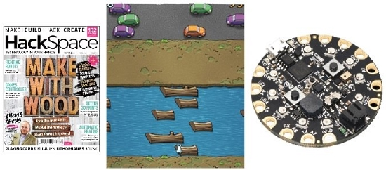
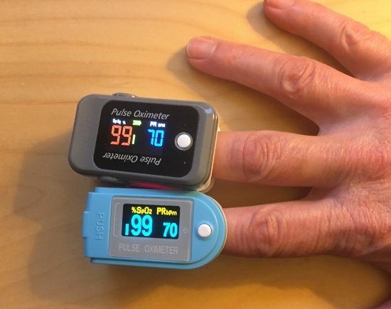

- [X] Kattni updates
- [X] change date
- [ ] update title
- [ ] Feature story
- [ ] Update  for images
- [ ] All images 550w max only
- [ ] Link "View this email in your browser."

[View this email]() in your browser.

Hi everyone! It's the latest Python for Microcontrollers newsletter, brought you by the community! We're on [Discord](https://discord.gg/HYqvREz), [Twitter](https://twitter.com/search?q=circuitpython&src=typed_query&f=live), and for past newsletters - [view them all here](https://www.adafruitdaily.com/category/circuitpython/). If you're reading this on the web, [subscribe here](https://www.adafruitdaily.com/).Here we go!

## CircuitPython 5.1.0 Release Candidate 0

CircuitPython 5.1.0-rc0 is the latest minor revision of CircuitPython, and now a release candidate. If this release does not have show-stopper issues, it will be re-released as 5.1.0, the first 5.1.x stable release. Downloads are available from [circuitpython.org](https://circuitpython.org/downloads)! 

- New features and improvements since 5.0.0
- ulab, a numpy-like fast vector module (#2583 and others). Thanks @v923z, @jepler
- Perform mathematical operations 10-50x as fast as raw CircuitPython
- Enabled on almost all boards except those with samd21 microcontrollers
- Guide: https://learn.adafruit.com/ulab-crunch-numbers-fast-with-circuitpython/overview
- Support for “f-strings”, a more convenient way to build strings dynamically. (#2690) Thanks @klardotsh, @jepler
- Enabled on almost all boards except those with samd21 microcontrollers.
- mpy-cross signals certain syntax errors better (#2670). Thanks @jepler
- nRF now properly handles unaligned disk reads (#2662). Thanks @jepler
- New builds of unix port and mpy-cross facilitate testing (#2672). Thanks @jepler
- STM port: add PulseOut (#2668). Thanks @hierophect
- STM port: add PulseIn (#2697). Thanks @hierophect
- STM port: fix some GPIO clocking issues (#2680). Thanks @hierophect
- STM port: rename directory to reflect the scope of the port (#2699). Thanks @hierophect
- STM port: change ST drivers submodule to match TinyUSB (#2701). Thanks @hierophect
- Winterbloom Sol: Disable USB HID descriptor (#2681). Thanks @theacodes
- Support importing native modules in native packages (#2657). Thanks @tannewt
- Document proximity and sound_level in design guide (#2684). Thanks @caternuson
- Improve argument validation in displayio (#2666). thanks @dhalbert
- Add TG-Watch02A board (#2695). Thanks @TG-Techie
- Add UARTLogger2 board (#2705). Thanks @nightskysk
- Fix DotStar status LED init (#2712). Thanks @tannewt

Thank you to all who used, tested, contributed, helped out, and participated on GitHub and/or Discord. - [Blog](https://blog.adafruit.com/2020/03/26/circuitpython-5-1-0-rc-0-released-adafruit-circuitpython/)

## HackSpace Magazine Issue 29

The new HackSpace Magazine Issue 29 presents making a frogger-like game in CircuitPython. An Adafruit Circuit Playground Express is used as a tilt-sensor controller.

> The tribute to this game in the new Code the Classics Volume 1 book is called Infinite Bunner, and works in much the same way, except you control a bunny. All this hopping got us thinking about a controller. Our initial idea was that since the animals jump, so should the controller. The accelerometer can detect freefall, so it shouldn’t be too hard to convert those into button presses. However, it turns out that computer-controlled frogs and rabbits can jump much, much faster than humans can, and we really struggled to get a working game mechanic, so we compromised a little and worked with ‘flicks’.

[Blog](https://blog.adafruit.com/2020/03/24/hackspace-magazine-issue-29-make-a-frogger-style-game-with-circuitpython-and-circuit-playground-express-circuitpython-circuitplaygroundexpress-gaming-hackspacemag/) and [Magazine](https://hackspace.raspberrypi.org/issues/29).

## EduBlocks 3.1.0

Joshua Lowe has provided an update on the state of EduBlocks, a tool to make the transition from Scratch to Python easy via drag and drop Python.

You can view the new updates via https://beta.app.edublocks.org and anything will be uploaded there too.

Josh posts that “I’d really like to get some feedback from you about the changes I’ve made as this is really helpful for me to know.“ - [Blog](https://blog.adafruit.com/2020/03/26/updates-for-edublocks-python-education-programming-edu_blocks/)

## News from around the web!

#ICYDNCI What was the most popular, most clicked link, in [last week's newsletter](https://www.adafruitdaily.com/2020/03/24/together-well-make-it-python-adafruit-circuitpython-circuitpython-micropython-thepsf-adafruit/)? [We'll make it together](https://blog.adafruit.com/2020/03/22/covid/).

## Made with Mu

Why Mu? Mu tries to make it as easy as possible to get started with programming but aims to help you graduate to "real" development tools soon after. Everything in Mu is the "real thing" but presented in as simple and obvious way possible. It's like the toddling stage in learning to walk: you're finding your feet and once you're confident, you should move on and explore! Put simply, Mu aims to foster autonomy. Try out Mu today! - [codewith.mu](https://codewith.mu/)

## Coming soon

## New Learn Guides!

[Chauncey the Flower Care Bot with CLUE and Bonsai Buckaroo](https://learn.adafruit.com/chauncey-flower-watering-bot-clue) from [John Park](https://learn.adafruit.com/users/johnpark)

## Updated Guides - Now With More Python!

**You can use CircuitPython libraries on Raspberry Pi!** We're updating all of our CircuitPython guides to show how to wire up sensors to your Raspberry Pi, and load the necessary CircuitPython libraries to get going using them with Python. We'll be including the updates here so you can easily keep track of which sensors are ready to go. Check it out!

Keep checking back for more updated guides!

## CircuitPython Libraries!

CircuitPython support for hardware continues to grow. We are adding support for new sensors and breakouts all the time, as well as improving on the drivers we already have. As we add more libraries and update current ones, you can keep up with all the changes right here!

For the latest drivers, download the [Adafruit CircuitPython Library Bundle](https://circuitpython.org/libraries).

If you'd like to contribute, CircuitPython libraries are a great place to start. Have an idea for a new driver? File an issue on [CircuitPython](https://github.com/adafruit/circuitpython/issues)! Interested in helping with current libraries? Check out the [CircuitPython.org Contributing page](https://circuitpython.org/contributing). We've included open pull requests and issues from the libraries, and details about repo-level issues that need to be addressed. We have a guide on [contributing to CircuitPython with Git and Github](https://learn.adafruit.com/contribute-to-circuitpython-with-git-and-github) if you need help getting started. You can also find us in the #circuitpython channel on the [Adafruit Discord](https://adafru.it/discord). Feel free to contact Kattni (@kattni) with any questions.

You can check out this [list of all the CircuitPython libraries and drivers available](https://github.com/adafruit/Adafruit_CircuitPython_Bundle/blob/master/circuitpython_library_list.md). 

The current number of CircuitPython libraries is **223**!

**New Libraries!**

Here's this week's new CircuitPython libraries:

 * [Adafruit_CircuitPython_DS1841](https://github.com/adafruit/Adafruit_CircuitPython_DS1841)

**Updated Libraries!**

Here's this week's updated CircuitPython libraries:

 * [Adafruit_CircuitPython_Logging](https://github.com/adafruit/Adafruit_CircuitPython_Logging)
 * [Adafruit_CircuitPython_Display_Text](https://github.com/adafruit/Adafruit_CircuitPython_Display_Text)
 * [Adafruit_CircuitPython_IL91874](https://github.com/adafruit/Adafruit_CircuitPython_IL91874)
 * [Adafruit_CircuitPython_SSD1325](https://github.com/adafruit/Adafruit_CircuitPython_SSD1325)
 * [Adafruit_CircuitPython_DisplayIO_SSD1305](https://github.com/adafruit/Adafruit_CircuitPython_DisplayIO_SSD1305)
 * [Adafruit_CircuitPython_BLE_Apple_Media](https://github.com/adafruit/Adafruit_CircuitPython_BLE_Apple_Media)
 * [Adafruit_CircuitPython_BLE_Magic_Light](https://github.com/adafruit/Adafruit_CircuitPython_BLE_Magic_Light)
 * [Adafruit_CircuitPython_Debug_I2C](https://github.com/adafruit/Adafruit_CircuitPython_Debug_I2C)
 * [Adafruit_CircuitPython_SSD1675](https://github.com/adafruit/Adafruit_CircuitPython_SSD1675)
 * [Adafruit_CircuitPython_Display_Notification](https://github.com/adafruit/Adafruit_CircuitPython_Display_Notification)
 * [Adafruit_CircuitPython_RGBLED](https://github.com/adafruit/Adafruit_CircuitPython_RGBLED)
 * [Adafruit_CircuitPython_BLE_Radio](https://github.com/adafruit/Adafruit_CircuitPython_BLE_Radio)
 * [Adafruit_CircuitPython_PCD8544](https://github.com/adafruit/Adafruit_CircuitPython_PCD8544)
 * [Adafruit_CircuitPython_BLE_Apple_Notification_Center](https://github.com/adafruit/Adafruit_CircuitPython_BLE_Apple_Notification_Center)
 * [Adafruit_CircuitPython_Touchscreen](https://github.com/adafruit/Adafruit_CircuitPython_Touchscreen)
 * [Adafruit_CircuitPython_VCNL4010](https://github.com/adafruit/Adafruit_CircuitPython_VCNL4010)
 * [Adafruit_CircuitPython_OneWire](https://github.com/adafruit/Adafruit_CircuitPython_OneWire)
 * [Adafruit_CircuitPython_TestRepo](https://github.com/adafruit/Adafruit_CircuitPython_TestRepo)
 * [Adafruit_CircuitPython_TCA9548A](https://github.com/adafruit/Adafruit_CircuitPython_TCA9548A)
 * [Adafruit_CircuitPython_VL6180X](https://github.com/adafruit/Adafruit_CircuitPython_VL6180X)
 * [Adafruit_CircuitPython_BluefruitSPI](https://github.com/adafruit/Adafruit_CircuitPython_BluefruitSPI)
 * [Adafruit_CircuitPython_MAX31855](https://github.com/adafruit/Adafruit_CircuitPython_MAX31855)
 * [Adafruit_CircuitPython_BLE_Cycling_Speed_and_Cadence](https://github.com/adafruit/Adafruit_CircuitPython_BLE_Cycling_Speed_and_Cadence)
 * [Adafruit_CircuitPython_DS18X20](https://github.com/adafruit/Adafruit_CircuitPython_DS18X20)
 * [Adafruit_CircuitPython_NeoPixel_SPI](https://github.com/adafruit/Adafruit_CircuitPython_NeoPixel_SPI)
 * [Adafruit_CircuitPython_VC0706](https://github.com/adafruit/Adafruit_CircuitPython_VC0706)
 * [Adafruit_CircuitPython_RTTTL](https://github.com/adafruit/Adafruit_CircuitPython_RTTTL)
 * [Adafruit_CircuitPython_TSL2591](https://github.com/adafruit/Adafruit_CircuitPython_TSL2591)
 * [Adafruit_CircuitPython_BusDevice](https://github.com/adafruit/Adafruit_CircuitPython_BusDevice)
 * [Adafruit_CircuitPython_MCP230xx](https://github.com/adafruit/Adafruit_CircuitPython_MCP230xx)
 * [Adafruit_CircuitPython_MLX90393](https://github.com/adafruit/Adafruit_CircuitPython_MLX90393)
 * [Adafruit_CircuitPython_LIDARLite](https://github.com/adafruit/Adafruit_CircuitPython_LIDARLite)
 * [Adafruit_CircuitPython_Pixie](https://github.com/adafruit/Adafruit_CircuitPython_Pixie)
 * [Adafruit_CircuitPython_SI4713](https://github.com/adafruit/Adafruit_CircuitPython_SI4713)
 * [Adafruit_CircuitPython_DS3231](https://github.com/adafruit/Adafruit_CircuitPython_DS3231)
 * [Adafruit_CircuitPython_RA8875](https://github.com/adafruit/Adafruit_CircuitPython_RA8875)
 * [Adafruit_CircuitPython_SI7021](https://github.com/adafruit/Adafruit_CircuitPython_SI7021)
 * [Adafruit_CircuitPython_Waveform](https://github.com/adafruit/Adafruit_CircuitPython_Waveform)
 * [Adafruit_CircuitPython_IS31FL3731](https://github.com/adafruit/Adafruit_CircuitPython_IS31FL3731)
 * [Adafruit_CircuitPython_MatrixKeypad](https://github.com/adafruit/Adafruit_CircuitPython_MatrixKeypad)
 * [Adafruit_CircuitPython_ESP_ATcontrol](https://github.com/adafruit/Adafruit_CircuitPython_ESP_ATcontrol)
 * [Adafruit_CircuitPython_BLE_Heart_Rate](https://github.com/adafruit/Adafruit_CircuitPython_BLE_Heart_Rate)
 * [Adafruit_CircuitPython_AM2320](https://github.com/adafruit/Adafruit_CircuitPython_AM2320)
 * [Adafruit_CircuitPython_TSL2561](https://github.com/adafruit/Adafruit_CircuitPython_TSL2561)
 * [Adafruit_CircuitPython_MAX7219](https://github.com/adafruit/Adafruit_CircuitPython_MAX7219)
 * [Adafruit_CircuitPython_TinyLoRa](https://github.com/adafruit/Adafruit_CircuitPython_TinyLoRa)
 * [Adafruit_CircuitPython_Fingerprint](https://github.com/adafruit/Adafruit_CircuitPython_Fingerprint)
 * [Adafruit_CircuitPython_MPL3115A2](https://github.com/adafruit/Adafruit_CircuitPython_MPL3115A2)
 * [Adafruit_CircuitPython_CCS811](https://github.com/adafruit/Adafruit_CircuitPython_CCS811)
 * [Adafruit_CircuitPython_VEML6070](https://github.com/adafruit/Adafruit_CircuitPython_VEML6070)
 * [Adafruit_CircuitPython_INA260](https://github.com/adafruit/Adafruit_CircuitPython_INA260)
 * [Adafruit_CircuitPython_MCP4725](https://github.com/adafruit/Adafruit_CircuitPython_MCP4725)
 * [Adafruit_CircuitPython_Slideshow](https://github.com/adafruit/Adafruit_CircuitPython_Slideshow)
 * [Adafruit_CircuitPython_SHT31D](https://github.com/adafruit/Adafruit_CircuitPython_SHT31D)
 * [Adafruit_CircuitPython_RFM9x](https://github.com/adafruit/Adafruit_CircuitPython_RFM9x)
 * [Adafruit_CircuitPython_US100](https://github.com/adafruit/Adafruit_CircuitPython_US100)
 * [Adafruit_CircuitPython_DS1307](https://github.com/adafruit/Adafruit_CircuitPython_DS1307)
 * [Adafruit_CircuitPython_PCF8523](https://github.com/adafruit/Adafruit_CircuitPython_PCF8523)
 * [Adafruit_CircuitPython_LSM9DS0](https://github.com/adafruit/Adafruit_CircuitPython_LSM9DS0)
 * [Adafruit_CircuitPython_HTU21D](https://github.com/adafruit/Adafruit_CircuitPython_HTU21D)
 * [Adafruit_CircuitPython_LSM303_Accel](https://github.com/adafruit/Adafruit_CircuitPython_LSM303_Accel)
 * [Adafruit_CircuitPython_HID](https://github.com/adafruit/Adafruit_CircuitPython_HID)
 * [Adafruit_CircuitPython_AMG88xx](https://github.com/adafruit/Adafruit_CircuitPython_AMG88xx)
 * [Adafruit_CircuitPython_FXOS8700](https://github.com/adafruit/Adafruit_CircuitPython_FXOS8700)
 * [Adafruit_CircuitPython_TCS34725](https://github.com/adafruit/Adafruit_CircuitPython_TCS34725)
 * [Adafruit_CircuitPython_EPD](https://github.com/adafruit/Adafruit_CircuitPython_EPD)
 * [Adafruit_CircuitPython_NeoTrellis](https://github.com/adafruit/Adafruit_CircuitPython_NeoTrellis)
 * [Adafruit_CircuitPython_BLE_Eddystone](https://github.com/adafruit/Adafruit_CircuitPython_BLE_Eddystone)
 * [Adafruit_CircuitPython_GPS](https://github.com/adafruit/Adafruit_CircuitPython_GPS)
 * [Adafruit_CircuitPython_Crickit](https://github.com/adafruit/Adafruit_CircuitPython_Crickit)
 * [Adafruit_CircuitPython_Thermal_Printer](https://github.com/adafruit/Adafruit_CircuitPython_Thermal_Printer)
 * [Adafruit_CircuitPython_CharLCD](https://github.com/adafruit/Adafruit_CircuitPython_CharLCD)
 * [Adafruit_CircuitPython_LIS3DH](https://github.com/adafruit/Adafruit_CircuitPython_LIS3DH)
 * [Adafruit_CircuitPython_MotorKit](https://github.com/adafruit/Adafruit_CircuitPython_MotorKit)
 * [Adafruit_CircuitPython_ADS1x15](https://github.com/adafruit/Adafruit_CircuitPython_ADS1x15)
 * [Adafruit_CircuitPython_RGB_Display](https://github.com/adafruit/Adafruit_CircuitPython_RGB_Display)
 * [Adafruit_CircuitPython_ServoKit](https://github.com/adafruit/Adafruit_CircuitPython_ServoKit)
 * [Adafruit_CircuitPython_Register](https://github.com/adafruit/Adafruit_CircuitPython_Register)
 * [Adafruit_CircuitPython_SimpleIO](https://github.com/adafruit/Adafruit_CircuitPython_SimpleIO)
 * [Adafruit_CircuitPython_MCP3xxx](https://github.com/adafruit/Adafruit_CircuitPython_MCP3xxx)
 * [Adafruit_CircuitPython_MCP9808](https://github.com/adafruit/Adafruit_CircuitPython_MCP9808)
 * [Adafruit_CircuitPython_FocalTouch](https://github.com/adafruit/Adafruit_CircuitPython_FocalTouch)
 * [Adafruit_CircuitPython_LSM303DLH_Mag](https://github.com/adafruit/Adafruit_CircuitPython_LSM303DLH_Mag)
 * [Adafruit_CircuitPython_INA219](https://github.com/adafruit/Adafruit_CircuitPython_INA219)
 * [Adafruit_CircuitPython_74HC595](https://github.com/adafruit/Adafruit_CircuitPython_74HC595)
 * [Adafruit_CircuitPython_LSM9DS1](https://github.com/adafruit/Adafruit_CircuitPython_LSM9DS1)
 * [Adafruit_CircuitPython_MPR121](https://github.com/adafruit/Adafruit_CircuitPython_MPR121)
 * [Adafruit_CircuitPython_SGP30](https://github.com/adafruit/Adafruit_CircuitPython_SGP30)
 * [Adafruit_CircuitPython_ADT7410](https://github.com/adafruit/Adafruit_CircuitPython_ADT7410)
 * [Adafruit_CircuitPython_FeatherWing](https://github.com/adafruit/Adafruit_CircuitPython_FeatherWing)
 * [Adafruit_CircuitPython_PCA9685](https://github.com/adafruit/Adafruit_CircuitPython_PCA9685)
 * [Adafruit_CircuitPython_FancyLED](https://github.com/adafruit/Adafruit_CircuitPython_FancyLED)
 * [Adafruit_CircuitPython_BME280](https://github.com/adafruit/Adafruit_CircuitPython_BME280)
 * [Adafruit_CircuitPython_Motor](https://github.com/adafruit/Adafruit_CircuitPython_Motor)
 * [Adafruit_CircuitPython_BNO055](https://github.com/adafruit/Adafruit_CircuitPython_BNO055)
 * [Adafruit_CircuitPython_framebuf](https://github.com/adafruit/Adafruit_CircuitPython_framebuf)
 * [Adafruit_CircuitPython_PN532](https://github.com/adafruit/Adafruit_CircuitPython_PN532)
 * [Adafruit_CircuitPython_RFM69](https://github.com/adafruit/Adafruit_CircuitPython_RFM69)
 * [Adafruit_CircuitPython_DotStar](https://github.com/adafruit/Adafruit_CircuitPython_DotStar)
 * [Adafruit_CircuitPython_HT16K33](https://github.com/adafruit/Adafruit_CircuitPython_HT16K33)
 * [Adafruit_CircuitPython_LED_Animation](https://github.com/adafruit/Adafruit_CircuitPython_LED_Animation)
 * [Adafruit_CircuitPython_MMA8451](https://github.com/adafruit/Adafruit_CircuitPython_MMA8451)
 * [Adafruit_CircuitPython_DisplayIO_SSD1306](https://github.com/adafruit/Adafruit_CircuitPython_DisplayIO_SSD1306)
 * [Adafruit_CircuitPython_AVRprog](https://github.com/adafruit/Adafruit_CircuitPython_AVRprog)
 * [Adafruit_CircuitPython_SD](https://github.com/adafruit/Adafruit_CircuitPython_SD)
 * [Adafruit_CircuitPython_WS2801](https://github.com/adafruit/Adafruit_CircuitPython_WS2801)
 * [Adafruit_CircuitPython_BMP280](https://github.com/adafruit/Adafruit_CircuitPython_BMP280)
 * [Adafruit_CircuitPython_Requests](https://github.com/adafruit/Adafruit_CircuitPython_Requests)
 * [Adafruit_CircuitPython_BME680](https://github.com/adafruit/Adafruit_CircuitPython_BME680)
 * [Adafruit_CircuitPython_seesaw](https://github.com/adafruit/Adafruit_CircuitPython_seesaw)
 * [Adafruit_CircuitPython_ESP32SPI](https://github.com/adafruit/Adafruit_CircuitPython_ESP32SPI)
 * [Adafruit_CircuitPython_NeoPixel](https://github.com/adafruit/Adafruit_CircuitPython_NeoPixel)
 * [Adafruit_CircuitPython_ADXL34x](https://github.com/adafruit/Adafruit_CircuitPython_ADXL34x)
 * [Adafruit_CircuitPython_FRAM](https://github.com/adafruit/Adafruit_CircuitPython_FRAM)
 * [Adafruit_CircuitPython_AdafruitIO](https://github.com/adafruit/Adafruit_CircuitPython_AdafruitIO)
 * [Adafruit_CircuitPython_DRV2605](https://github.com/adafruit/Adafruit_CircuitPython_DRV2605)
 * [Adafruit_CircuitPython_VL53L0X](https://github.com/adafruit/Adafruit_CircuitPython_VL53L0X)
 * [Adafruit_CircuitPython_FXAS21002C](https://github.com/adafruit/Adafruit_CircuitPython_FXAS21002C)
 * [Adafruit_CircuitPython_GFX](https://github.com/adafruit/Adafruit_CircuitPython_GFX)
 * [Adafruit_CircuitPython_CircuitPlayground](https://github.com/adafruit/Adafruit_CircuitPython_CircuitPlayground)
 * [Adafruit_CircuitPython_CLUE](https://github.com/adafruit/Adafruit_CircuitPython_CLUE)
 * [Adafruit_CircuitPython_BluefruitConnect](https://github.com/adafruit/Adafruit_CircuitPython_BluefruitConnect)
 * [Adafruit_CircuitPython_DHT](https://github.com/adafruit/Adafruit_CircuitPython_DHT)
 * [Adafruit_CircuitPython_CPython](https://github.com/adafruit/Adafruit_CircuitPython_CPython)
 * [Adafruit_CircuitPython_BoardTest](https://github.com/adafruit/Adafruit_CircuitPython_BoardTest)
 * [Adafruit_CircuitPython_MAX31865](https://github.com/adafruit/Adafruit_CircuitPython_MAX31865)
 * [Adafruit_CircuitPython_APDS9960](https://github.com/adafruit/Adafruit_CircuitPython_APDS9960)
 * [Adafruit_CircuitPython_Display_Button](https://github.com/adafruit/Adafruit_CircuitPython_Display_Button)
 * [Adafruit_CircuitPython_Display_Shapes](https://github.com/adafruit/Adafruit_CircuitPython_Display_Shapes)
 * [Adafruit_CircuitPython_HCSR04](https://github.com/adafruit/Adafruit_CircuitPython_HCSR04)
 * [Adafruit_CircuitPython_L3GD20](https://github.com/adafruit/Adafruit_CircuitPython_L3GD20)
 * [Adafruit_CircuitPython_RockBlock](https://github.com/adafruit/Adafruit_CircuitPython_RockBlock)
 * [Adafruit_CircuitPython_BLE_BroadcastNet](https://github.com/adafruit/Adafruit_CircuitPython_BLE_BroadcastNet)
 * [Adafruit_CircuitPython_MLX90640](https://github.com/adafruit/Adafruit_CircuitPython_MLX90640)
 * [Adafruit_CircuitPython_PCT2075](https://github.com/adafruit/Adafruit_CircuitPython_PCT2075)
 * [Adafruit_Blinka](https://github.com/adafruit/Adafruit_Blinka)

**PyPI Download Stats!**

We've written a special library called Adafruit Blinka that makes it possible to use CircuitPython Libraries on [Raspberry Pi and other compatible single-board computers](https://learn.adafruit.com/circuitpython-on-raspberrypi-linux/). Adafruit Blinka and all the CircuitPython libraries have been deployed to PyPI for super simple installation on Linux! Here are the top 10 CircuitPython libraries downloaded from PyPI in the last week, including the total downloads for those libraries:

Keep an eye out here for updated download stats coming soon!

## What’s the team up to this week?

What is the team up to this week? Let’s check in!

**Bryan**

This week I finished up the DS1841 libraries for CircuitPython and Arduino including support for manually setting the wiper, editing and using the LUT, and enabling or disabling the temperature compensation feature. Now that we will have a log potentiometer, I hope to see more people using these handy little I2C helpers to give them programatic control over parts of their circuit.

Next up I'm starting the long process of migrating all of our Arduino library repositories on GitHub over to using GitHub Actions for continuous integration. Having a solid CI system is invaluable for making sure that tedious things like checking formatting and documentation are still up to snuff without relying on humans to remember to check regularly. For folks with _many_ repositories and _many_ contributors, a good CI system is basically required. 

GitHub Actions is particularly useful because it's well integrated with GitHub, which many folks use for hosting their projects. We have a _lot_ of repositories, so having a common framework for CI and project hosting is going to help keep things in check.

**Dan**

In the Bluetooth Low Energy device-of-the-week world, I'm now working on CircuitPython BLE drivers to connect to a couple of different low-cost pulse oximeters. I am reliably getting data from one, and am working on the other.

I had a breakthrough on the SAMD51 spurious flash writes problem with the help of community members, and am now testing a fix. It appears we just need to set the brownout voltage detection to higher than the factory preset value.

**Jeff**

With my big projects, there's not much to show this week. The RGB matrix code with Protomatter is slowly improving, but more work is needed to make it behave 100% like a SPI or I2C display, and to make sure we lay the best groundwork for future framebuffer-bsaed displays.

But the little things matter too! A pull request merged this week will improve the error message when assigning to properties that are read-only. Formerly, the error would state "'SPI' object has no property 'frequency'", but in a future release of CircuitPython it will say "'SPI' object cannot assign property 'frequency'", giving a better experience when troubleshooting your code.

**Kattni**

This week we've all had our lives turned a bit upside down. Remember you're not alone in this, and the Adafruit community is here to support you. Reach out to us on the [Adafruit Discord](https://adafru.it/discord) for any reason. There are thousands of people in the same situation, all continuing to gather together to support each other through this. Remember to share your projects and ideas, and continue to help others navigate this uncertain situation. We are strongest together.

I worked on updating a couple of guides with new revisions of the boards: the [APDS9960 proximity, color, light and gesture sensor](https://learn.adafruit.com/adafruit-apds9960-breakout) and the [VL6180 time of flight sensor](https://learn.adafruit.com/adafruit-vl6180x-time-of-flight-micro-lidar-distance-sensor-breakout). We added STEMMA connectors to both boards, and I updated the guides with updated photos, wiring diagrams, schematics and pinouts. The guides now have everything needed to get started with your new STEMMA compatible breakouts.

We've also begun the process of applying to [certify](https://certification.oshwa.org/) some of our Adafruit hardware as Open Source with the [Open Source Hardware Association](https://www.oshwa.org/). We're starting with our [CircuitPython compatible microcontroller boards](https://www.adafruit.com/category/956). Dylan has gathered the necessary info and started submitting the applications. We'll keep you posted on the progress. We're looking forward to being a part of the growing [list of OSHWA certified Open Source projects](https://certification.oshwa.org/list.html)!

**Lucian**

This past two weeks I've been working on transitioning the STM32 Port over to the H7 and F7. This has been a two parter - on the one hand I've been adding new functionality to support the Cortex M7 and new peripheral types featured on these chips, but on the other I've been revisiting and fixing old and inflexible code that wasn't built to handle chips outside of the STM32F4 series. One recent addition has been Python scripts to auto-generate peripheral code for the different variations of STM32 SoCs, as well as a revamp of how packages are managed in the Microcontroller module. 

While I have my first version compiled and running on the H743 Nucleo, I'm still testing to make sure that the new changes do not break F4 builds like the Feather or Discovery boards. I've also been keeping tabs on other STM32 work that's been done by others recently, such as the new NVM module for flash memory, and the low power work being done by Scott via the RTC module. 

Outside of Circuitpython, I've been in touch with some open-source colleagues who are working on projects that they hope will combat the spread of COVID19. I'm hoping I'll have more updates about that soon. 

**Melissa**

This week I finished up a Follow-up guide for adding new Single Board Computers to Blinka. Where as the first guide was about adding detection code so that Blinka knew which board it was working with, this guide was the real meat about actually adding your board to Blinka. You can check out the guide at https://learn.adafruit.com/adding-a-single-board-computer-to-blinka.

I also worked on re-skinning the Web Bluetooth Dashboard that I worked on a few weeks ago to make it match the Adafruit website much better. This was more than just changing some colors and adding a logo, but required working on developing some new panels so that it looked much better for the user.

**Scott**

Up to the start of this week I was continuing my work on sleep. I wrapped up STM32 and then iMX RT when surprisingly quickly. So, sleep is getting close and will need thorough testing. The PR will be out of draft once two dependent PRs are merged in.

While I wait for those PRs, I've swapped to BLE MIDI. I've got MIDI coming out of CircuitPython and am working on getting MIDI in going. It's been quick so far and should wrap up soon. There are a few fixes to CircuitPython core that will be needed for it. I'm excited to hack an nRF52840 into some of these old 80s era piano keyboards I have to give them midi in and out. :-)

Once BLE MIDI is done, I'll circle back to sleep and get that code checked in as well. Exciting times!

## Upcoming events!

## Latest releases

CircuitPython's stable release is [#.#.#](https://github.com/adafruit/circuitpython/releases/latest) and its unstable release is [#.#.#-##.#](https://github.com/adafruit/circuitpython/releases). New to CircuitPython? Start with our [Welcome to CircuitPython Guide](https://learn.adafruit.com/welcome-to-circuitpython).

[2019####](https://github.com/adafruit/Adafruit_CircuitPython_Bundle/releases/latest) is the latest CircuitPython library bundle.

[v#.#.#](https://micropython.org/download) is the latest MicroPython release. Documentation for it is [here](http://docs.micropython.org/en/latest/pyboard/).

[#.#.#](https://www.python.org/downloads/) is the latest Python release. The latest pre-release version is [#.#.#](https://www.python.org/download/pre-releases/).

[1646 Stars](https://github.com/adafruit/circuitpython/stargazers) Like CircuitPython? [Star it on GitHub!](https://github.com/adafruit/circuitpython)

## Call for help – CircuitPython messaging to other languages!

We [recently posted on the Adafruit blog](https://blog.adafruit.com/2018/08/15/help-bring-circuitpython-messaging-to-other-languages-circuitpython/) about bringing CircuitPython messaging to other languages, one of the exciting features of CircuitPython 4 and later versions is translated control and error messages. Native language messages will help non-native English speakers understand what is happening in CircuitPython even though the Python keywords and APIs will still be in English. If you would like to help, [please post](https://github.com/adafruit/circuitpython/issues/1098) to the main issue on GitHub and join us on [Discord](https://adafru.it/discord).

We made this graphic with translated text, we could use your help with that to make sure we got the text right, please check out the text in the image – if there is anything we did not get correct, please let us know. Dan sent me this [handy site too](http://helloworldcollection.de/#Human).

## jobs.adafruit.com - Find a dream job, find great candidates!

[jobs.adafruit.com](https://jobs.adafruit.com/) has returned and folks are posting their skills (including CircuitPython) and companies are looking for talented makers to join their companies - from Digi-Key, to Hackaday, Microcenter, Raspberry Pi and more.

## NUMBER thanks!

The Adafruit Discord community, where we do all our CircuitPython development in the open, reached over NUMBER humans, thank you! Join today! [https://adafru.it/discord](https://adafru.it/discord)

## ICYMI - In case you missed it

The wonderful world of Python on hardware! This is our first video-newsletter-podcast that we’ve started! The news comes from the Python community, Discord, Adafruit communities and more. It’s part of the weekly newsletter, then we have a segment on ASK an ENGINEER and this is the video slice from that! The complete Python on Hardware weekly videocast [playlist is here](https://www.youtube.com/playlist?list=PLjF7R1fz_OOXRMjM7Sm0J2Xt6H81TdDev). 

This video podcast is on [iTunes](https://itunes.apple.com/us/podcast/python-on-hardware/id1451685192?mt=2), [YouTube](https://www.youtube.com/playlist?list=PLjF7R1fz_OOXRMjM7Sm0J2Xt6H81TdDev), [IGTV (Instagram TV](https://www.instagram.com/adafruit/channel/)), and [XML](https://itunes.apple.com/us/podcast/python-on-hardware/id1451685192?mt=2).

[Weekly community chat on Adafruit Discord server CircuitPython channel - Audio / Podcast edition](https://itunes.apple.com/us/podcast/circuitpython-weekly-meeting/id1451685016) - Audio from the Discord chat space for CircuitPython, meetings are usually Mondays at 2pm ET, this is the audio version on [iTunes](https://itunes.apple.com/us/podcast/circuitpython-weekly-meeting/id1451685016), Pocket Casts, [Spotify](https://adafru.it/spotify), and [XML feed](https://adafruit-podcasts.s3.amazonaws.com/circuitpython_weekly_meeting/audio-podcast.xml).

And lastly, we are working up a one-spot destination for all things podcast-able here - [podcasts.adafruit.com](https://podcasts.adafruit.com/)

## Codecademy "Learn Hardware Programming with CircuitPython"

Codecademy, an online interactive learning platform used by more than 45 million people, has teamed up with the leading manufacturer in STEAM electronics, Adafruit Industries, to create a coding course, "Learn Hardware Programming with CircuitPython". The course is now available in the [Codecademy catalog](https://www.codecademy.com/learn/learn-circuitpython?utm_source=adafruit&utm_medium=partners&utm_campaign=circuitplayground&utm_content=pythononhardwarenewsletter).

Python is a highly versatile, easy to learn programming language that a wide range of people, from visual effects artists in Hollywood to mission control at NASA, use to quickly solve problems. But you don’t need to be a rocket scientist to accomplish amazing things with it. This new course introduces programmers to Python by way of a microcontroller — CircuitPython — which is a Python-based programming language optimized for use on hardware.

CircuitPython’s hardware-ready design makes it easier than ever to program a variety of single-board computers, and this course gets you from no experience to working prototype faster than ever before. Codecademy’s interactive learning environment, combined with Adafruit's highly rated Circuit Playground Express, present aspiring hardware hackers with a never-before-seen opportunity to learn hardware programming seamlessly online.

Whether for those who are new to programming, or for those who want to expand their skill set to include physical computing, this course will have students getting familiar with Python and creating incredible projects along the way. By the end, students will have built their own bike lights, drum machine, and even a moisture detector that can tell when it's time to water a plant.

Visit Codecademy to access the [Learn Hardware Programming with CircuitPython](https://www.codecademy.com/learn/learn-circuitpython?utm_source=adafruit&utm_medium=partners&utm_campaign=circuitplayground&utm_content=pythononhardwarenewsletter) course and Adafruit to purchase a [Circuit Playground Express](https://www.adafruit.com/product/3333).

Codecademy has helped more than 45 million people around the world upgrade their careers with technology skills. The company’s online interactive learning platform is widely recognized for providing an accessible, flexible, and engaging experience for beginners and experienced programmers alike. Codecademy has raised a total of $43 million from investors including Union Square Ventures, Kleiner Perkins, Index Ventures, Thrive Capital, Naspers, Yuri Milner and Richard Branson, most recently raising its $30 million Series C in July 2016.

## Contribute!

The CircuitPython Weekly Newsletter is a CircuitPython community-run newsletter emailed every Tuesday. The complete [archives are here](https://www.adafruitdaily.com/category/circuitpython/). It highlights the latest CircuitPython related news from around the web including Python and MicroPython developments. To contribute, edit next week's draft [on GitHub](https://github.com/adafruit/circuitpython-weekly-newsletter/tree/gh-pages/_drafts) and [submit a pull request](https://help.github.com/articles/editing-files-in-your-repository/) with the changes. Join our [Discord](https://adafru.it/discord) or [post to the forum](https://forums.adafruit.com/viewforum.php?f=60) for any further questions.
