- [X] Kattni updates
- [ ] change date
- [ ] update title
- [ ] Feature story
- [ ] Update  for images
- [ ] All images 550w max only
- [ ] Link "View this email in your browser."

Template last updated on 04-15-2020 Change podcast URL to short version Kattni got

View this email in your browser.

Hi everyone! It's the latest Python for Microcontrollers newsletter, brought you by the community! We're on [Discord](https://discord.gg/HYqvREz), [Twitter](https://twitter.com/search?q=circuitpython&src=typed_query&f=live), and for past newsletters - [view them all here](https://www.adafruitdaily.com/category/circuitpython/). If you're reading this on the web, [subscribe here](https://www.adafruitdaily.com/). Let's get started!

## Microsoft Garage announces Device Simulator Express upgrade with Adafruit CLUE and Python

Microsoft Garage has posted another upgrade for their project Device Simulator Express! This one uses a VS code extension to program microcontollers with/without the device, now with support for the BBC micro:bit and the Adafruit CLUE board with CircuitPython - [Twitter](https://twitter.com/MSFTGarage/status/1250513323990216704), [Article](https://www.microsoft.com/en-us/garage/blog/2020/04/device-simulator-express-expands-to-the-bbc-microbit-and-adafruit-clue/), and [Windows 10 app](https://marketplace.visualstudio.com/items?itemName=ms-python.devicesimulatorexpress).

## Article

Text

## Desk of Ladyada Posts Feature CircuitPython This Week

Limor "Ladyada" Fried broadcasts project progress and new gear from her desk. This week, there have been two broadcasts, both related to CircuitPython:

[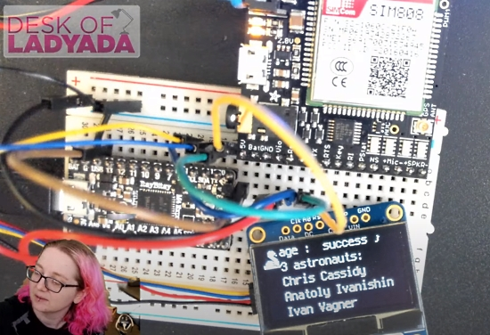](https://youtu.be/7SzhAdJV_Ss)

Ladyada shows CircuitPython connecting through a cellular modem to a data source and displaying on an OLED screen - [Blog](https://blog.adafruit.com/2020/04/12/we-are-back-deskofladyada-all-about-the-esp32-s2-by-espressif-systems-adafruit-espressifsystem-esp32s2-get-it-on-digkey/) and [YouTube](https://youtu.be/7SzhAdJV_Ss).
 
[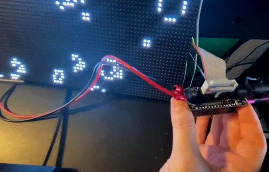](https://youtu.be/x8MAx_PMnN4)
 
Ladyada tests out a new PR, adding support for ‘hub75’ style RGB matricies to CircuitPython. This also honors Professor John Conway, who was an amazing mathematician who recently passed away. Conway's Game of Life uses simple rules on a matrix of data to create organic-seeming lifecycles. This 32×64 matrix is being driven by an Adafruit Feather M4, with SAMD51 and nRF52840 support coming soon - [Blog](https://blog.adafruit.com/2020/04/19/conways-game-of-life-on-rgb-matrix-using-circuitpython-adafruit-circuitpython/) and [YouTube](https://youtu.be/x8MAx_PMnN4).

## Deep Dive into TinyUSB on ESP32-S2 with Scott Shawcroft

[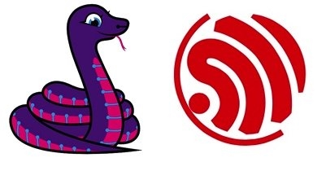](https://youtu.be/DjC53UXKN7k)

Scott Shawcroft (@tannewt on Twitter) - chief CircuitPython developer - streamed a live session on porting CircuitPython to the new ESP32-S2 chip - [YouTube](https://youtu.be/DjC53UXKN7k).

## Adafruit Update

Adafruit Industries continues to run with 100% of employees being paid and continuing to work. Most are working remotely, with some working in the Manhattan, New York factory as an essential service and business under NYC Executive Order 202.6 Capabilities. Adafruit was deemed an essential service to distribute/make some PPE (Personal Protection Equipment) such as face shields, and manufacturer electronics for essential life-saving/preserving equipment and development which is needed in New York and beyond. -[Blog](https://blog.adafruit.com/2020/03/22/covid/)

Face shield production continues at Adafruit - [Adafruit Blog](https://blog.adafruit.com/2020/04/20/face-shield-production-continues-adafruit-adafruit-manufacturing-manufacturingmonday-faceshield-ppeforhealthcareworkers-timelapse-manufacturingmonday/).

Adafruit has applied for a COVID-19 manufacturing grant to make masks in NYC - [Adafruit Blog](https://blog.adafruit.com/2020/04/18/adafruit-has-applied-for-a-covid-19-manufacturing-grant-to-make-masks-in-nyc-fuzehub-empirestatedev-nycedc-mfg-mep-americaworkstogether-newyorktough/).

## Adafruit hardware being certified Open Source

Adafruit has always been an open source hardware company, predating the [Open Source Hardware Association](https://oshwa.org) (OSHWA) certification process. We have begun submitting all of our hardware to OSHWA for certification as Open Source. Adafruit currently has 46 total boards certified. This week **NNN** new boards were certified including:

* [Adafruit DS1307 Real Time Clock Assembled Breakout Board](https://certification.oshwa.org/us000281.html)
* [Adafruit Metro M4](https://certification.oshwa.org/us000279.html)
* [Adafruit AirLift FeatherWing – ESP32 WiFi Co-Processor](https://certification.oshwa.org/us000277.html)

## News from around the web!

[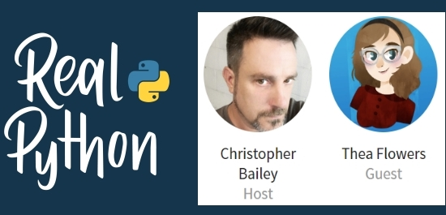](https://realpython.com/podcasts/rpp/5/)

The Real Python Podcast: Exploring CircuitPython with Thea Flowers - [Real Python](https://realpython.com/podcasts/rpp/5/).

[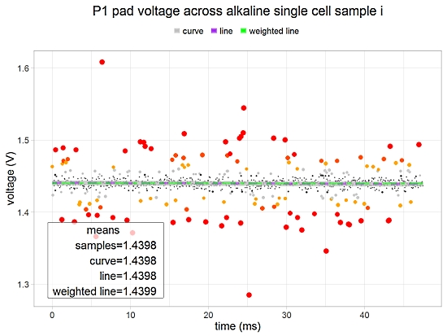](https://forums.adafruit.com/viewtopic.php?f=60&t=164636)

Sampling an analog-to-digital (ADC) controller in CircuitPython with data graphs - [Adafruit Forums](https://forums.adafruit.com/viewtopic.php?f=60&t=164636) and [GitHub](https://github.com/kevinjwalters/mini-projects/tree/master/clue-metal-detector/results/alkalinecell).

[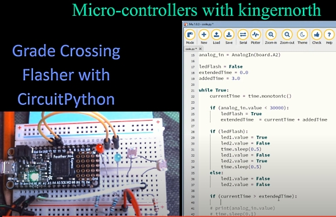](https://www.youtube.com/watch?v=wZHha2Z2qy4)

A grade crossing flasher with an Adafruit Feather M4 Express and CircuitPython - [YouTube](https://www.youtube.com/watch?v=wZHha2Z2qy4).

[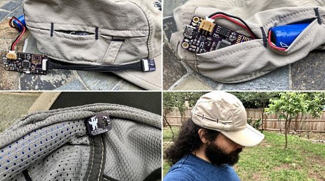](https://twitter.com/i/status/1243349759366217729)

Additional work on the thermometer hat programmed in CircuitPython - [Twitter](https://twitter.com/i/status/1243349759366217729).

[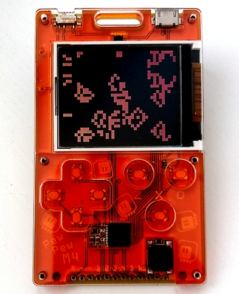](https://twitter.com/SzymonJakubiak/status/1251043560314613760)

Conway's Game of Life ported to the Pew Pew M4 with CircuitPython - [Twitter](https://twitter.com/SzymonJakubiak/status/1251043560314613760) and [GitHub](https://github.com/dobra-dobra/CircuitPython-Game-of-Life).

A Makerfabs assembly video for the Pew Pew M4 - [YouTube](https://www.youtube.com/watch?v=m5lZwVgA690).

Tweaking the Adafruit CircuitPython libraries for the MLX90640 IR sensor so that it can be read using MicroPython on the Pycom wipy 3.0 - [Twitter](https://twitter.com/i/status/1250426318568583170) and [GitHub](https://github.com/avsg8/MLX90640_micropython).

[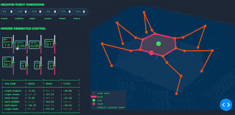](https://github.com/mithi/hexapod-robot-simulator)

Mithi's Hexapod Robot Simulator provides a Python, numpy, and plotly based simulator for modeling hexapod robots - [GitHub](https://github.com/mithi/hexapod-robot-simulator).

#ICYDNCI What was the most popular, most clicked link, in [last week's newsletter](https://link)? [title](url).

## Made with Mu

Why Mu? Mu tries to make it as easy as possible to get started with programming but aims to help you graduate to "real" development tools soon after. Everything in Mu is the "real thing" but presented in as simple and obvious way possible. It's like the toddling stage in learning to walk: you're finding your feet and once you're confident, you should move on and explore! Put simply, Mu aims to foster autonomy. Try out Mu today! - [codewith.mu](https://codewith.mu/)

## Coming soon

## New Boards Supported by CircuitPython

The number of supported microcontrollers and Single Board Computers (SBC) grows every week. This section outlines which boards have been included in CircuitPython or added to [CircuitPython.org](https://circuitpython.org/).

This week we had X new boards added!

- [Board name](url)

Looking for adding a new board to CircuitPython? It's highly encouraged! Adafruit has two guides to help you do so:

- [How to Add a New Board to CircuitPython](https://learn.adafruit.com/how-to-add-a-new-board-to-circuitpython/overview)
- [How to add a New Board to the circuitpython.org website](https://learn.adafruit.com/how-to-add-a-new-board-to-the-circuitpython-org-website)
- [Adding a Single Board Computer to PlatformDetect for Blinka](https://learn.adafruit.com/adding-a-single-board-computer-to-platformdetect-for-blinka)
- [Adding a Single Board Computer to Blinka](https://learn.adafruit.com/adding-a-single-board-computer-to-blinka)

## New Learn Guides!

Here are new guides released on the Adafruit Learning System in the last week:

[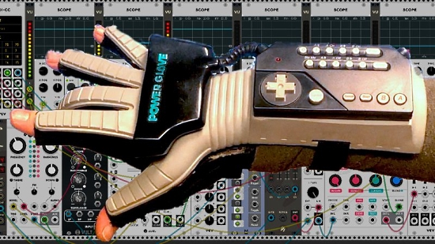](https://learn.adafruit.com/)

[Power Glove Wireless MIDI Controller](https://learn.adafruit.com/power-glove-bluetooth-midi-controller) from [John Park](https://learn.adafruit.com/users/johnpark)

[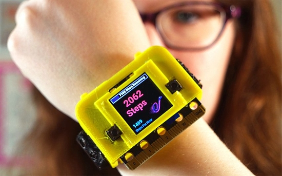](https://learn.adafruit.com/clue-step-counter-st-lsm6ds33)

[CLUE Step Counter with ST LSM6DS33](https://learn.adafruit.com/clue-step-counter-st-lsm6ds33) from [Liz Clark](https://learn.adafruit.com/users/BlitzCityDIY)

[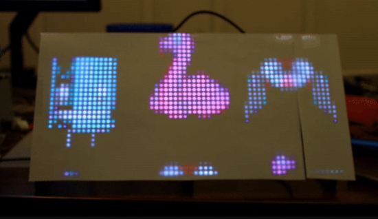](https://learn.adafruit.com/rgb-led-matrices-matrix-panels-with-circuitpython)

[RGB LED Matrices with CircuitPython]() by [Phillip Burgess](https://learn.adafruit.com/users/pburgess) and [Jeff Epler](https://learn.adafruit.com/users/jepler)

## Updated Guides - Now With More Python!

**You can use CircuitPython libraries on Raspberry Pi!** We're updating all of our CircuitPython guides to show how to wire up sensors to your Raspberry Pi, and load the necessary CircuitPython libraries to get going using them with Python. We'll be including the updates here so you can easily keep track of which sensors are ready to go. Check it out!

Keep checking back for more updated guides!

## CircuitPython Libraries!

CircuitPython support for hardware continues to grow. We are adding support for new sensors and breakouts all the time, as well as improving on the drivers we already have. As we add more libraries and update current ones, you can keep up with all the changes right here!

For the latest drivers, download the [Adafruit CircuitPython Library Bundle](https://circuitpython.org/libraries).

If you'd like to contribute, CircuitPython libraries are a great place to start. Have an idea for a new driver? File an issue on [CircuitPython](https://github.com/adafruit/circuitpython/issues)! Interested in helping with current libraries? Check out the [CircuitPython.org Contributing page](https://circuitpython.org/contributing). We've included open pull requests and issues from the libraries, and details about repo-level issues that need to be addressed. We have a guide on [contributing to CircuitPython with Git and Github](https://learn.adafruit.com/contribute-to-circuitpython-with-git-and-github) if you need help getting started. You can also find us in the #circuitpython channel on the [Adafruit Discord](https://adafru.it/discord). Feel free to contact Kattni (@kattni) with any questions.

You can check out this [list of all the CircuitPython libraries and drivers available](https://github.com/adafruit/Adafruit_CircuitPython_Bundle/blob/master/circuitpython_library_list.md). 

The current number of CircuitPython libraries is **225**!

**New Libraries!**

Here's this week's new CircuitPython libraries:

 * [Adafruit_CircuitPython_BitbangIO](https://github.com/adafruit/Adafruit_CircuitPython_BitbangIO)

**Updated Libraries!**

Here's this week's updated CircuitPython libraries:

We updated many of the libraries this week - too many to include here! Check out the [Libraries section of the State of CircuitPython + Libraries + Blinka report](https://adafruit-circuit-python.s3.amazonaws.com/adabot/bin/reports/circuitpython_library_report_20200417.txt) for a detailed list.

**PyPI Download Stats!**

We've written a special library called Adafruit Blinka that makes it possible to use CircuitPython Libraries on [Raspberry Pi and other compatible single-board computers](https://learn.adafruit.com/circuitpython-on-raspberrypi-linux/). Adafruit Blinka and all the CircuitPython libraries have been deployed to PyPI for super simple installation on Linux! Here are the top 10 CircuitPython libraries downloaded from PyPI in the last week, including the total downloads for those libraries:

Keep an eye out here for updated download stats coming soon!

## What’s the team up to this week?

What is the team up to this week? Let’s check in!

**Bryan**

Short week for me, so I wrapped up the LIS3DH library refactor to allow for the use of the H3LIS331 and LIS331HH, siblings of the LIS3DH. This type of refactor will likely become more and more common as sensor manufacturers look to expand their offerings by spinning off new products based on existing ones.

Otherwise I started playing around with the [SSI2164 Quad Voltage Controller Amplifier made by Sound Semiconductor](http://www.soundsemiconductor.com/downloads/ssi2164datasheet.pdf). This chip is an update by Dave Rossum to his SSM2164 with a few improvements. I'm currently pairing it with an OPA4171 to bone up on my analog skills with an eye towards building filters and oscillators.

**Dan**

I had to do another revision of the UF2 bootloader fixes for SAMD51, and fixed a regression on SAMD21. The latest version now works well, and is released as [v3.9.0](https://github.com/adafruit/uf2-samdx1/releases/tag/v3.9.0). All the SAMD51 board Learn Guides now have pages describing how to update the bootloader, and the v3.9.0 download links are now on [circuitpython.org](https://circuitpython.org/).

I am now circling back to implementing the Adafruit BLE services needed to talk to the [Bluefruit Playground app](https://learn.adafruit.com/bluefruit-playground-app). We have an Arduino version of the board program for that app, and after I finish this [library](https://github.com/adafruit/Adafruit_CircuitPython_BLE_Adafruit), you'll be able to talk to the app in CircuitPython as well.

**Jeff**

[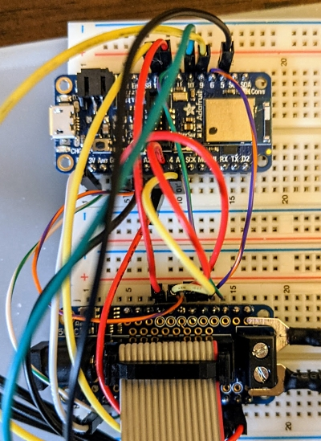](https://circuitpython.org/)

Work on RGB Matrix support in CircuitPython continues.  The initial Pull Request is accepted, but there's still work to do to make the API easier to use.  Here, I'm testing the wiring for the Feather nRF52840 Express.  While the guide will focus on the Feather M4 Express—because it has a compatible shield and doesn't require custom wiring—we'll also include wiring guidance for Feather nRF52840 Express and Sense, ItsyBitsy M4, and ItsyBitsy nRF52840.

**Kattni**

This week I finished up going through the Library Infrastructure Issues on the circuitpython.org [Contributing page](https://circuitpython.org/contributing). There's a series of checks that will always have something listed, but most of what can be "fixed" has been. Out of this project came some suggested updates to our Adabot script that generates the list to ensure we're getting the best possible information on that list. The updates to Adabot are in the works thanks to Sommersoft.

We're continuing to submit our boards to OSHWA for certification and more approvals are coming in. Check out the [Certified Open Source Hardware Projects Directory](https://certification.oshwa.org/list.html?q=adafruit) to see all the Adafruit certified Open Source hardware.

**Lucian**

These past two weeks I've been working on wrapping up the work on the STM32 H7 and F7 support, adding the F7 series of MCUs, support for Busio, revamped organization for linker files, internal flash improvements, and some file generation scripts with Python to make adding new boards more straightforward. When merged the STM32 port of Circuitpython will support two new boards, the Nucleo F767 and Nucleo H743, and will have dramatically improved flash performance across the entire port (simple testing suggests a 10x+ speed increase on most boards without external flash.)

The H7 series has a staggering amount of RAM, 1MB in total, so I also added more advanced memory management to its startup code so it can take better advantage of its 480MHz processor speed. This code is similar to that used on the i.MX boards from NXP, and allows for very fast memory use via the TCM (tightly coupled RAM). Without it, code on processors this fast is bogged down by instruction and data accesses and can't make use of its full potential. The H7 is most often used for projects involving cameras or LCD screens. I'm hoping the sheer stats of this line of MCUs will allow new categories of project to be programmed in Circuitpython. 

**Melissa**

This past week, I was focused on getting the Onion Omega2+ working with Blinka. I had previously been attempting to get it working with OpenWRT. I switched over to using the OnionOS that comes on the board by default and I was able to get I2C and UART working in addition to the GPIO. SPI was still having some difficulty reading values even though the correct signals were appearing. I put that on hold for the moment, but expect to finish it up soon.

After that, I switched over to writing the SPI module for the external CircuitPython BitBangIO library. This is to manually flip the GPIO pins for boards that have neither the BitBangIO module or working hardware SPI. It actually worked well on the Raspberry Pi, but ran pretty slowly on the Jetson Nano. It would still work for communicating with sensors. The library is on [GitHub](https://github.com/adafruit/Adafruit_CircuitPython_BitbangIO). I will be adding an I2C module to the library soon as well.

**Scott**

[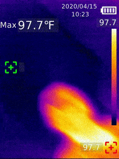](https://circuitpython.org/)

I'm getting closer and closer to wrapping up the lower power work. While I wait for review cycles I've started a couple other projects.

Last week I took my first glimpse at the ESP32-S2 by getting TinyUSB running on the Saola dev board. I streamed my adventures last Friday on the Adafruit channels and posted it - [YouTube](https://www.youtube.com/watch?v=5zq8RHXVdSI). I'll likely be streaming this Friday as well at 2pm Pacific. My next step is to establish the port folder in CircuitPython and start connecting the CircuitPython build system to the ESP-IDF build system. I've been lots of help from UnexpectedMaker and Espressif folks so thanks to them!

I've been reviewing lots of awesome PRs and also attending the Python Language Summit which is online just like PyCon - [via YouTube](https://www.youtube.com/channel/UCMjMBMGt0WJQLeluw6qNJuA/videos).

Tuesday night Ladyada got me a dump of the USB traffic for a fever scanner. I've been hacking on the protocol to extract the image and the maximum temperature. The goal is to build an open source app to connect to the device rather than the proprietary Windows app that the manufacturer provides.

## Upcoming events!

[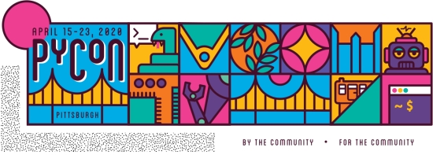](https://us.pycon.org/2020/remote/)

The PyCon US 2020 team announces planned talks, tutorials, posters, and much more online. 

To participate, Go to the [PyCon US 2020 Remote page](https://us.pycon.org/2020/remote/) to subscribe to receive 5-8 email notifications over the next 6 weeks for published online content. Also you may subscribe to the [PyCon 2020 YouTube Channel](https://www.youtube.com/channel/UCMjMBMGt0WJQLeluw6qNJuA). Expected content:

- Recorded talks and tutorials
- Online Summit and Hatchery programs
- Poster presenters sharing their creations
- Startup Row company presentations
- Sponsor workshop videos and job postings

The organizers appreciate the community’s patience as they work through the logistics of gathering and uploading the recordings.  The goal is to begin providing content about April 15, 2020, right when PyCon was scheduled to begin.

**Send Your Events In**

As for other events, with the COVID pandemic, most in-person events are postponed or cancelled. If you know of virtual events or events that may occur in the future, please let us know on Discord or on Twitter with hashtag #CircuitPython.

## Latest releases

CircuitPython's stable release is [#.#.#](https://github.com/adafruit/circuitpython/releases/latest) and its unstable release is [#.#.#-##.#](https://github.com/adafruit/circuitpython/releases). New to CircuitPython? Start with our [Welcome to CircuitPython Guide](https://learn.adafruit.com/welcome-to-circuitpython).

[2019####](https://github.com/adafruit/Adafruit_CircuitPython_Bundle/releases/latest) is the latest CircuitPython library bundle.

[v#.#.#](https://micropython.org/download) is the latest MicroPython release. Documentation for it is [here](http://docs.micropython.org/en/latest/pyboard/).

[#.#.#](https://www.python.org/downloads/) is the latest Python release. The latest pre-release version is [#.#.#](https://www.python.org/download/pre-releases/).

[1670 Stars](https://github.com/adafruit/circuitpython/stargazers) Like CircuitPython? [Star it on GitHub!](https://github.com/adafruit/circuitpython)

## Call for help – CircuitPython messaging to other languages!

We [recently posted on the Adafruit blog](https://blog.adafruit.com/2018/08/15/help-bring-circuitpython-messaging-to-other-languages-circuitpython/) about bringing CircuitPython messaging to other languages, one of the exciting features of CircuitPython 4 and later versions is translated control and error messages. Native language messages will help non-native English speakers understand what is happening in CircuitPython even though the Python keywords and APIs will still be in English. If you would like to help, [please post](https://github.com/adafruit/circuitpython/issues/1098) to the main issue on GitHub and join us on [Discord](https://adafru.it/discord).

We made this graphic with translated text, we could use your help with that to make sure we got the text right, please check out the text in the image – if there is anything we did not get correct, please let us know. Dan sent me this [handy site too](http://helloworldcollection.de/#Human).

## jobs.adafruit.com - Find a dream job, find great candidates!

[jobs.adafruit.com](https://jobs.adafruit.com/) has returned and folks are posting their skills (including CircuitPython) and companies are looking for talented makers to join their companies - from Digi-Key, to Hackaday, Microcenter, Raspberry Pi and more.

## 18,109 thanks!

The Adafruit Discord community, where we do all our CircuitPython development in the open, reached over 18,109 humans, thank you! Join today! [https://adafru.it/discord](https://adafru.it/discord)

## ICYMI - In case you missed it

[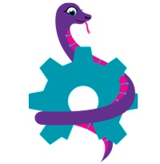](https://www.youtube.com/playlist?list=PLjF7R1fz_OOXRMjM7Sm0J2Xt6H81TdDev)

The wonderful world of Python on hardware! This is our first video-newsletter-podcast that we’ve started! The news comes from the Python community, Discord, Adafruit communities and more. It’s part of the weekly newsletter, then we have a segment on ASK an ENGINEER and this is the video slice from that! The complete Python on Hardware weekly videocast [playlist is here](https://www.youtube.com/playlist?list=PLjF7R1fz_OOXRMjM7Sm0J2Xt6H81TdDev). 

This video podcast is on [iTunes](https://itunes.apple.com/us/podcast/python-on-hardware/id1451685192?mt=2), [YouTube](http://adafru.it/pohepisodes), [IGTV (Instagram TV](https://www.instagram.com/adafruit/channel/)), and [XML](https://itunes.apple.com/us/podcast/python-on-hardware/id1451685192?mt=2).

[Weekly community chat on Adafruit Discord server CircuitPython channel - Audio / Podcast edition](https://itunes.apple.com/us/podcast/circuitpython-weekly-meeting/id1451685016) - Audio from the Discord chat space for CircuitPython, meetings are usually Mondays at 2pm ET, this is the audio version on [iTunes](https://itunes.apple.com/us/podcast/circuitpython-weekly-meeting/id1451685016), Pocket Casts, [Spotify](https://adafru.it/spotify), and [XML feed](https://adafruit-podcasts.s3.amazonaws.com/circuitpython_weekly_meeting/audio-podcast.xml).

And lastly, we are working up a one-spot destination for all things podcast-able here - [podcasts.adafruit.com](https://podcasts.adafruit.com/)

## Codecademy "Learn Hardware Programming with CircuitPython"

Codecademy, an online interactive learning platform used by more than 45 million people, has teamed up with the leading manufacturer in STEAM electronics, Adafruit Industries, to create a coding course, "Learn Hardware Programming with CircuitPython". The course is now available in the [Codecademy catalog](https://www.codecademy.com/learn/learn-circuitpython?utm_source=adafruit&utm_medium=partners&utm_campaign=circuitplayground&utm_content=pythononhardwarenewsletter).

Python is a highly versatile, easy to learn programming language that a wide range of people, from visual effects artists in Hollywood to mission control at NASA, use to quickly solve problems. But you don’t need to be a rocket scientist to accomplish amazing things with it. This new course introduces programmers to Python by way of a microcontroller — CircuitPython — which is a Python-based programming language optimized for use on hardware.

CircuitPython’s hardware-ready design makes it easier than ever to program a variety of single-board computers, and this course gets you from no experience to working prototype faster than ever before. Codecademy’s interactive learning environment, combined with Adafruit's highly rated Circuit Playground Express, present aspiring hardware hackers with a never-before-seen opportunity to learn hardware programming seamlessly online.

Whether for those who are new to programming, or for those who want to expand their skill set to include physical computing, this course will have students getting familiar with Python and creating incredible projects along the way. By the end, students will have built their own bike lights, drum machine, and even a moisture detector that can tell when it's time to water a plant.

Visit Codecademy to access the [Learn Hardware Programming with CircuitPython](https://www.codecademy.com/learn/learn-circuitpython?utm_source=adafruit&utm_medium=partners&utm_campaign=circuitplayground&utm_content=pythononhardwarenewsletter) course and Adafruit to purchase a [Circuit Playground Express](https://www.adafruit.com/product/3333).

Codecademy has helped more than 45 million people around the world upgrade their careers with technology skills. The company’s online interactive learning platform is widely recognized for providing an accessible, flexible, and engaging experience for beginners and experienced programmers alike. Codecademy has raised a total of $43 million from investors including Union Square Ventures, Kleiner Perkins, Index Ventures, Thrive Capital, Naspers, Yuri Milner and Richard Branson, most recently raising its $30 million Series C in July 2016.

## Contribute!

The CircuitPython Weekly Newsletter is a CircuitPython community-run newsletter emailed every Tuesday. The complete [archives are here](https://www.adafruitdaily.com/category/circuitpython/). It highlights the latest CircuitPython related news from around the web including Python and MicroPython developments. To contribute, edit next week's draft [on GitHub](https://github.com/adafruit/circuitpython-weekly-newsletter/tree/gh-pages/_drafts) and [submit a pull request](https://help.github.com/articles/editing-files-in-your-repository/) with the changes. Join our [Discord](https://adafru.it/discord) or [post to the forum](https://forums.adafruit.com/viewforum.php?f=60) for any further questions.
