- [X] Kattni updates
- [ ] change date
- [ ] update title
- [ ] Feature story
- [ ] Update  for images
- [ ] All images 550w max only
- [ ] Link "View this email in your browser."

Template last updated on 04-15-2020 Change podcast URL to short version Kattni got

View this email in your browser.

Hello!  This is the latest Python for Microcontrollers newsletter, brought you by the community! We're on [Discord](https://discord.gg/HYqvREz), [Twitter](https://twitter.com/search?q=circuitpython&src=typed_query&f=live), and for past newsletters - [view them all here](https://www.adafruitdaily.com/category/circuitpython/). If you're reading this on the web, [subscribe here](https://www.adafruitdaily.com/). Here's the week's news:

## CircuitPython 5.3.0-rc0 is out

CircuitPython 5.3.0-rc0 is the latest minor revision of CircuitPython and a release candidate. If this release does not have show-stopper issues, it will be re-released as 5.3.0, the first 5.3.x stable release. This release adds support for 3 new boards, adds the RGBMatrix driver for RGB LED matrices, and more.

Downloads are available from [circuitpython.org](https://circuitpython.org/)! The site makes it easy to select the correct file and language for your board.

New features and improvements since 5.2.0
* Add support for RGB Matrix display
* Add a fill method to displayio.Bitmap
* Make the colors used by the stage library compatible with those used in the displayio library
* Multiple improvements to the STM32 port
* Improvements to the litex port
* Improvements to ulab
* Use “checkout@v2” in the CircuitPython build process
* Fix the maximum keycode in keyboard HID descriptor
* Fix bad submodule patk
* Add the NFC Copy Cat board
* Use Sphinx 3 to build the documentation

3 New boards since 5.2.0
* nfc_copy_cat
* nucleo_f767zi
* nucleo_h743zi_2

See the release page for additional information - [GitHub](https://htmledit.squarefree.com/) and the [Adafruit Blog](https://blog.adafruit.com/2020/04/22/circuitpython-5-3-0-rc-0-released/).

## MicroPython Turns Seven

[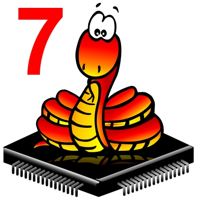](https://twitter.com/micropython/status/1254050294620737536)

April 29th is MicroPython's 7th birthday! To celebrate, the MicroPython team will pick a winner to receive a [Pyboard D-series](https://store.micropython.org/product/PYBD-SF2-W4F2) with the runner-up getting a MicroPython T-shirt - [Twitter](https://twitter.com/micropython/status/1254050294620737536) and [Facebook](https://www.facebook.com/micropython/).

## Porting the Cyanobyte Python I2C Driver Creator to MicroPython

[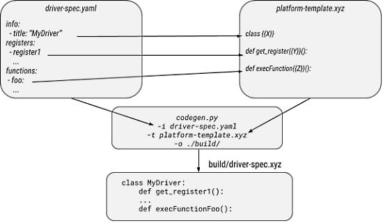](https://github.com/google/cyanobyte/tree/master/test/sampleData/micropython)

A new port of Cyanobyte, the Google driver generator, to Micropython automatically generates I2C drivers in a standardized way. It also supports Raspberry Pi. Author Nick Felker states "(It) shouldn't be hard to support CircuitPython too". - [Twitter](https://twitter.com/HandNF/status/1254527279625109506) and [GitHub](https://github.com/google/cyanobyte/tree/master/test/sampleData/micropython).

## Harvard University Offering Free Online Courses Including Programming

Harvard is offering free online courses. They state they have 448 courses with 6 million students in 193 countries. The selection includes their CS50 programming classes. Check out "CS50's Web Programming with Python and JavaScript" which is 12 weeks long and billed as available now - [Harvard.edu](https://online-learning.harvard.edu/catalog).

## HackSpace Magazine Reviews the ulab Library for CircuitPython

[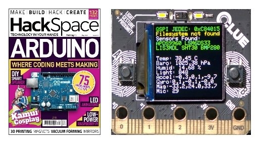](https://blog.adafruit.com/2020/04/24/hackspace-magazine-issue-30-circuitpython-ulab-clue-adafruit-circuitpython-hackspacemag-adafruit/)

HackSpace Magazine Issue 30 features an article on the new ulab (pronounced microlab) library port to CircuitPython. ulab is a subset of the Python monster data crunching library numpy. An Adafruit CLUE board is used to demonstrate the power of fast mathematics on microcontrollers - [Blog](https://blog.adafruit.com/2020/04/24/hackspace-magazine-issue-30-circuitpython-ulab-clue-adafruit-circuitpython-hackspacemag-adafruit/).

## A New CircuitPython Library for eInk Displays from PlasticLogic

[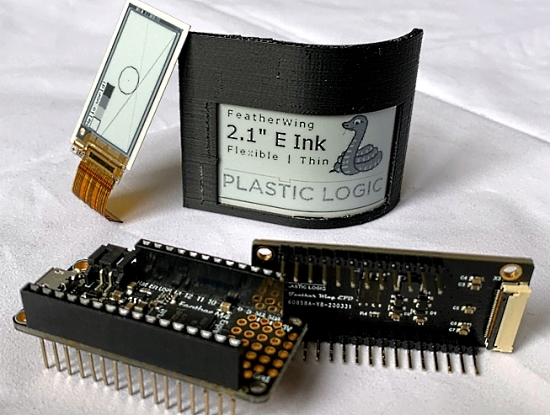](https://github.com/plasticlogic/pl-micro-epd)

PlastiLogic of Dresden, Germany, has released pl-micro-epd. This is a library and tools written in CircuitPython for their flexible organic eInk displays. - [GitHub](https://github.com/plasticlogic/pl-micro-epd)

## Adafruit Update

Adafruit Industries continues to run with 100% of employees being paid and continuing to work. Most are working remotely, with some working in the Manhattan, New York factory as an essential service and business under NYC Executive Order 202.6 Capabilities. Adafruit was deemed an essential service to distribute/make some PPE (Personal Protection Equipment) such as face shields, and manufacturer electronics for essential life-saving/preserving equipment and development which is needed in New York and beyond. -[Blog](https://blog.adafruit.com/2020/03/22/covid/)

xxxx Adafruit updates xxxx

## Adafruit hardware being certified Open Source

Adafruit has always been an open source hardware company, predating the [Open Source Hardware Association](https://oshwa.org) (OSHWA) certification process. We have begun submitting all of our hardware to OSHWA for certification as Open Source. This week **48** new boards were certified including:

* [Adafruit Feather M0 WiFi](https://www.adafruit.com/product/3061)
* [Adafruit Crickit for Circuit Playground Express](https://www.adafruit.com/product/3093)
* [Adafruit Monster M4SK](https://www.adafruit.com/product/4343)

## News from around the web!

[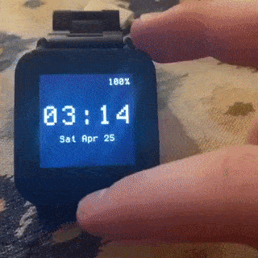](https://twitter.com/TG_Techie/status/1253948404914405377)

A custom designed CircuitPython watch. Software and hardware use the nRF52840 chip in a custom motherboard / chassis - [Twitter](https://twitter.com/TG_Techie/status/1253948404914405377).

[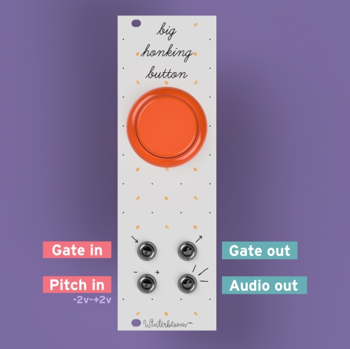](https://blog.thea.codes/designing-big-honking-button/)

Designing Winterbloom's Big Honking Button, programmable in CircuitPython - [thea.codes](https://blog.thea.codes/designing-big-honking-button/).

A PyPortal Google calendar viewer which uses the Adafruit PyPortal- [ryantwalton.com](http://ryantwalton.com/projects/pyportal-google-viewer).

An experimental port of MicroPython to the ResMed S10 CPAP/BiPAP machines - [GitHub](https://github.com/osresearch/micropython/tree/airbreak/ports/stm32/boards/AIRBREAK) and [Twitter](https://twitter.com/qrs/status/1253693470184747008).

SimStapler Simulator - [scruss.com](https://scruss.com/blog/2020/04/25/simstapler-simulator/) and [YouTube](https://youtu.be/5KEwg6bWdI8).

[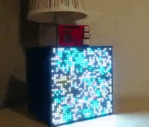](https://twitter.com/FerriTheMaker/status/1252976579015258112)

A Game of Life inspired project with an Adafruit RGB matrix, a Raspberry Pi and Python - [Twitter](https://twitter.com/FerriTheMaker/status/1252976579015258112).

[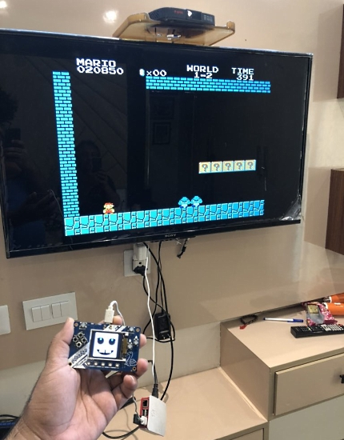](https://twitter.com/iAyanPahwa/status/1253698458516549637)

Playing NES on bigger screen now using RetroPie running on a Raspberry Pi and an Adafruit PyBadge as game controller running CircuitPython and a HID keyboard program - [Twitter](https://twitter.com/iAyanPahwa/status/1253698458516549637).

Using a Raspberry Pi as a SWD programmer to flash CircuitPython on a Particle Xenon Board - [CodeNSolder](https://codensolder.com/blog/rip-swd-programmer).

[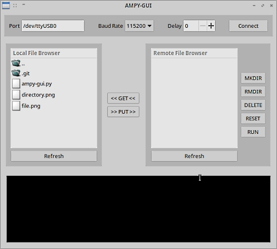](https://github.com/dork3nergy/ampy-gui)

ampy-gui: a Gtk 3.0 GUI for Adafruit's ampy CLI ESP32 tool - [GitHub](https://github.com/dork3nergy/ampy-gui).

Multithreading in Python for Finance - [towardsdatascience](https://towardsdatascience.com/multithreading-in-python-for-finance-fc1425664e74).

[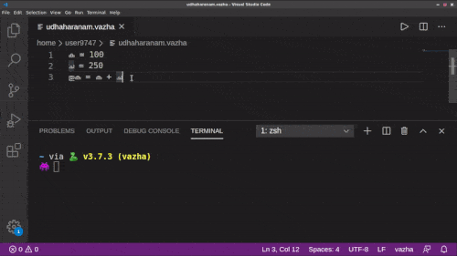](https://twitter.com/albin_user9747/status/1254456495187492865)

Vazha Script: a malayalam version of Python - [Twitter](https://twitter.com/albin_user9747/status/1254456495187492865) and [GitHub](https://github.com/user9747/Vazha).

[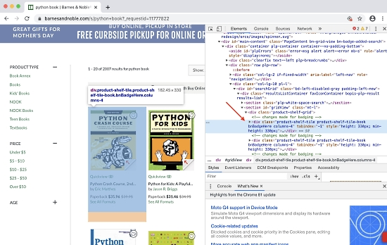](https://janowski.dev/blog/how-develop-extensible-web-scraper-python-requests-and-bs4/)

How to develop extensible web scraper with Python, requests and bs4 - [janowski.com](https://janowski.dev/blog/how-develop-extensible-web-scraper-python-requests-and-bs4/).

A Python Numpy library video tutorial For beginners - [miroh.com](https://morioh.com/p/6c467c084eb2) and [YouTube](https://youtu.be/9K52u0Dy9QA).

Converting a 1927 vintage desk phone into a mobile phone with talk and text, with a PyBoard and MicroPython - [Vintage Radio](https://www.vintage-radio.net/forum/showthread.php?t=159534) and [Twitter](https://twitter.com/micropython/status/1254050289553899525).

#ICYDNCI What was the most popular, most clicked link, in [last week's newsletter](https://www.adafruitdaily.com/2020/04/21/device-simulator-adds-clue-54-oshwa-certified-boards-and-more-python-adafruit-circuitpython-circuitpython-micropython-thepsf/)? [Visual Studio Code - Device Simulator Express](https://marketplace.visualstudio.com/items?itemName=ms-python.devicesimulatorexpress).

## Edit Python Code with the Mu Editor

[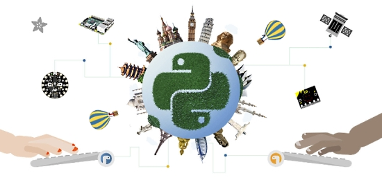](https://codewith.mu/)

Why Mu? Mu tries to make it as easy as possible to get started with programming but aims to help you graduate to "real" development tools soon after. Everything in Mu is the "real thing" but presented in as simple and obvious way possible. It's like the toddling stage in learning to walk: you're finding your feet and once you're confident, you should move on and explore! Put simply, Mu aims to foster autonomy. Try out Mu today! - [codewith.mu](https://codewith.mu/)

## New Boards Supported by CircuitPython

The number of supported microcontrollers and Single Board Computers (SBC) grows every week. This section outlines which boards have been included in CircuitPython or added to [CircuitPython.org](https://circuitpython.org/).

This week we had X new boards added!

- [Board name](url)

Looking for adding a new board to CircuitPython? It's highly encouraged! Adafruit has two guides to help you do so:

- [How to Add a New Board to CircuitPython](https://learn.adafruit.com/how-to-add-a-new-board-to-circuitpython/overview)
- [How to add a New Board to the circuitpython.org website](https://learn.adafruit.com/how-to-add-a-new-board-to-the-circuitpython-org-website)
- [Adding a Single Board Computer to PlatformDetect for Blinka](https://learn.adafruit.com/adding-a-single-board-computer-to-platformdetect-for-blinka)
- [Adding a Single Board Computer to Blinka](https://learn.adafruit.com/adding-a-single-board-computer-to-blinka)

## New Learn Guides!

[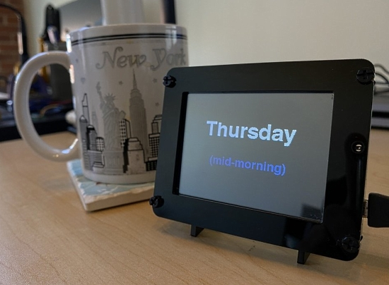](https://learn.adafruit.com/pyportal-quarantine-clock)

[PyPortal Quarantine Clock](https://learn.adafruit.com/pyportal-quarantine-clock) from [Brent Rubell](https://learn.adafruit.com/users/brubell)

## Updated Guides - Now With More Python!

**You can use CircuitPython libraries on Raspberry Pi!** We're updating all of our CircuitPython guides to show how to wire up sensors to your Raspberry Pi, and load the necessary CircuitPython libraries to get going using them with Python. We'll be including the updates here so you can easily keep track of which sensors are ready to go. Check it out!

Keep checking back for more updated guides!

## CircuitPython Libraries!

CircuitPython support for hardware continues to grow. We are adding support for new sensors and breakouts all the time, as well as improving on the drivers we already have. As we add more libraries and update current ones, you can keep up with all the changes right here!

For the latest drivers, download the [Adafruit CircuitPython Library Bundle](https://circuitpython.org/libraries).

If you'd like to contribute, CircuitPython libraries are a great place to start. Have an idea for a new driver? File an issue on [CircuitPython](https://github.com/adafruit/circuitpython/issues)! Interested in helping with current libraries? Check out the [CircuitPython.org Contributing page](https://circuitpython.org/contributing). We've included open pull requests and issues from the libraries, and details about repo-level issues that need to be addressed. We have a guide on [contributing to CircuitPython with Git and Github](https://learn.adafruit.com/contribute-to-circuitpython-with-git-and-github) if you need help getting started. You can also find us in the #circuitpython channel on the [Adafruit Discord](https://adafru.it/discord). Feel free to contact Kattni (@kattni) with any questions.

You can check out this [list of all the CircuitPython libraries and drivers available](https://github.com/adafruit/Adafruit_CircuitPython_Bundle/blob/master/circuitpython_library_list.md). 

The current number of CircuitPython libraries is **226**!

**New Libraries!**

Here's this week's new CircuitPython libraries:

 * [Adafruit_CircuitPython_FONA](https://github.com/adafruit/Adafruit_CircuitPython_FONA)

**Updated Libraries!**

Here's this week's updated CircuitPython libraries:

 * [Adafruit_CircuitPython_Debouncer](https://github.com/adafruit/Adafruit_CircuitPython_Debouncer)
 * [Adafruit_CircuitPython_RGB_Display](https://github.com/adafruit/Adafruit_CircuitPython_RGB_Display)
 * [Adafruit_CircuitPython_LSM6DS](https://github.com/adafruit/Adafruit_CircuitPython_LSM6DS)
 * [Adafruit_CircuitPython_BLE](https://github.com/adafruit/Adafruit_CircuitPython_BLE)
 * [Adafruit_CircuitPython_MiniMQTT](https://github.com/adafruit/Adafruit_CircuitPython_MiniMQTT)
 * [Adafruit_CircuitPython_AM2320](https://github.com/adafruit/Adafruit_CircuitPython_AM2320)
 * [Adafruit_CircuitPython_ESP32SPI](https://github.com/adafruit/Adafruit_CircuitPython_ESP32SPI)
 * [Adafruit_CircuitPython_LIS2MDL](https://github.com/adafruit/Adafruit_CircuitPython_LIS2MDL)
 * [Adafruit_Blinka](https://github.com/adafruit/Adafruit_Blinka)

**PyPI Download Stats!**

We've written a special library called Adafruit Blinka that makes it possible to use CircuitPython Libraries on [Raspberry Pi and other compatible single-board computers](https://learn.adafruit.com/circuitpython-on-raspberrypi-linux/). Adafruit Blinka and all the CircuitPython libraries have been deployed to PyPI for super simple installation on Linux! Here are the top 10 CircuitPython libraries downloaded from PyPI in the last week, including the total downloads for those libraries:

Keep an eye out here for updated download stats coming soon!

## What’s the team up to this week?

What is the team up to this week? Let’s check in!

**Bryan**

This week I continued working to migrate it repositories to GitHub Actions for continuous integration. Things are moving along smoothly and I've got a nice workflow developed that makes it fairly straightforward to move a repo over.

I'm also working on migrating the Arduino libraries that are not already using it to use [our Adafruit_BusIO library](https://github.com/adafruit/Adafruit_BusIO) to handle communicating with chips over SPI and I2C. I'm particularly fond of the [Adafruit_BusIO_RegisterBIts](https://adafruit.github.io/Adafruit_BusIO/html/class_adafruit___bus_i_o___register_bits.html) class to handle all the bit masking and manipulation necessary for toggling groups of bits within a register without stepping on the other bits. Doing this type of manipulation by hand is a great way to create a bug that's tricky to find, so using a library such as ours that gets a lot of testing through use is a good way to reduce the chances of such a mistake biting you.

Most of you will have heard about the passing of [John Conway](https://en.wikipedia.org/wiki/John_Horton_Conway), who is most famously known as the creator of [Conway's Game of Life](https://en.wikipedia.org/wiki/Conway%27s_Game_of_Life), a classic example of how a simple set of rules can create and amazing variety of behaviors. Programming a version of Conway's Game of Life is a right of passage for programmers around the world, myself included. If you know how to program and you haven't given it a try, give it a whirl!

**Dan**

I'm still working on implementing the Adafruit BLE services needed to talk to the [Bluefruit Playground app](https://learn.adafruit.com/bluefruit-playground-app). It is mostly done, but there were some changes needed to CircuitPython. After that's done I will look at using bleak on a host computer to implement \_bleio under Blinka.

I'm also going to look at BLE-capable bathroom scales and blood pressure monitors, so we can talk to them too.

**Jeff**

I released CircuitPython 5.3.0-rc.0 this week.  If you encounter any problems with it, please let us know on Discord, the forums, or on github.  Thank you to all who contributed to this new version, it is a community effort.

The RGB Matrix code (formerly known as Protomatter) I've been working on for several weeks is in the new release, and the related guide has been [published](https://learn.adafruit.com/rgb-led-matrices-matrix-panels-with-circuitpython).

We've got pinouts for 5 different CircuitPython boards and 4 examples ranging from simple scrolling text to an implementation of John Conway's "Game of Life".

John Conway's dedication to "recreational mathematics" was an important element in my own development of love for mathematics and computers.  Conway recently passed away.

Photo of John Conway from [Wikimedia](https://commons.wikimedia.org/wiki/File:John_H_Conway_2005_(cropped).jpg) by Thane Plambeck, license CC-BY-2.0

**Kattni**

I've been working on going through the GitHub issues across all of our CircuitPython libraries. Our helpful friend Adabot includes generating a list of all the open issues and PRs across all of the libraries, and aggregates them on [circuitpython.org](https://circuitpython.org/contributing). Many issues and PRs are closed within days or less of opening, but a significant number are long-standing. Some of them are that way for a reason, but there are definitely a few that were simply missed, needed further action, or have been resolved but not closed. The plan here is not to close everything out, but to catch the few and get them taken care of. This week, I found a couple of issues waiting on replies, and a few that had already been resolved and simply needed to be closed. Thanks to Carter for picking up two issues and getting new PRs submitted to address them. As well, I found a long-standing PR that needed a couple of simple changes, and the original author was available to get those submitted - thanks to [@tgs](https://github.com/tgs) for patience and perseverance!

Expect to see activity on some older issues and PRs. If you are the author of any of those, and wish to have someone take another look, feel free to ping me and I'll do what I can. With no action for an extended period of time, some of them may simply be closed out - please don't see it as negative if yours ends up closed. Remember, you can always reopen or resubmit a PR or issue if you find time later to return to it.

We've finished submitting all of the Adafruit hardware to the [Open Source Hardware Association](https://oshwa.org) for certification - and the certifications have been rapidly going through. Adafruit is now the number one open source certified company! Thanks so much to Dylan for all of his hard work getting everything submitted.

**Lucian**

**Melissa**

This past week I focused on moving several repositories over from using Travis CI to GitHub Actions. One of the things involved in doing that was going through and making sure the code was formatted properly and documented. The hardest library to move over was Blinka because it involved addressing over 800 items that PyLint found. Most of these were making sure all of the files, classes, and public functions were properly documented, but it had code improvement suggestions as well. However, it was completely worth it because now when new code is submitted, it will be checked that it is properly formatted prior to being merged in.

I also finished up adding support for the Onion Omega2+ in Blinka and merged it in and tested it. I had to adjust the SPI module that I wrote for the Adafruit PureIO library to work with the MIPS chip and it works just as well as the built-in SpiDev module. I also tested I2C and UART and so far it seems to be working great. You can get more information about it at https://circuitpython.org/blinka/onion_omega2plus/.

**Scott**

At the end of last week I finished the RGBMatrix and STM32 F7/H7 reviews. Then, I continued work on the ESP32-S2 port. I streamed my work at 2pm Pacific on Friday and plan to this week as well. Here is last week's: https://www.youtube.com/watch?v=DjC53UXKN7k

This week I circled back to my never-ending low power PR. I merged in the STM32 changes, tested and fixed it. So, fingers crossed, it should be close to being merged. Timing should be good because more folks have been asking for it. Expect to see it in 5.4.0.

The rest of this week and next will hopefully be ESP32-S2 focused. I'm looking forwards to jumping back in.

## Upcoming events!

With many more online conferences, this may be an opportunity for people worldwide to join in who have not had an opportunity to travel. Contact organizers to see how you might participate in online events.

The PyCon US 2020 team is holding talks, tutorials, posters, and much more online. 

Visit the [PyCon US 2020 Remote page](https://us.pycon.org/2020/remote/) for published online content. Also you may subscribe to the [PyCon 2020 YouTube Channel](https://www.youtube.com/channel/UCMjMBMGt0WJQLeluw6qNJuA).

Available resources:

- Recorded talks and tutorials
- Online Summit and Hatchery programs
- Poster presenters sharing their creations
- Startup Row company presentations
- Sponsor workshop videos

[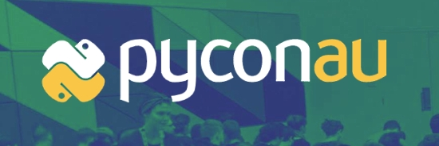](https://2020.pycon.org.au/)

PyCon AU has announced they are holding PyConline AU, an online event, in August 2020 -  [pycon.org.au](https://2020.pycon.org.au/).

PyCon India 2020: the premier conference in India on using and developing the Python programming language. Held online October 3-5, 2020. A [call for proposals](https://in.pycon.org/cfp/2020/proposals/) is now open through August 14, 2020. - [pycon.org](https://in.pycon.org/2020/) and [Twitter](https://twitter.com/pyconindia)

### Send Your Events In

As for other events, with the COVID pandemic, most in-person events are postponed or cancelled. If you know of virtual events or events that may occur in the future, please let us know on Discord or on Twitter with hashtag #CircuitPython.

## Latest releases

CircuitPython's stable release is [#.#.#](https://github.com/adafruit/circuitpython/releases/latest) and its unstable release is [#.#.#-##.#](https://github.com/adafruit/circuitpython/releases). New to CircuitPython? Start with our [Welcome to CircuitPython Guide](https://learn.adafruit.com/welcome-to-circuitpython).

[2019####](https://github.com/adafruit/Adafruit_CircuitPython_Bundle/releases/latest) is the latest CircuitPython library bundle.

[v#.#.#](https://micropython.org/download) is the latest MicroPython release. Documentation for it is [here](http://docs.micropython.org/en/latest/pyboard/).

[#.#.#](https://www.python.org/downloads/) is the latest Python release. The latest pre-release version is [#.#.#](https://www.python.org/download/pre-releases/).

[1676 Stars](https://github.com/adafruit/circuitpython/stargazers) Like CircuitPython? [Star it on GitHub!](https://github.com/adafruit/circuitpython)

## Call for help – CircuitPython messaging to other languages!

We [recently posted on the Adafruit blog](https://blog.adafruit.com/2018/08/15/help-bring-circuitpython-messaging-to-other-languages-circuitpython/) about bringing CircuitPython messaging to other languages, one of the exciting features of CircuitPython 4 and later versions is translated control and error messages. Native language messages will help non-native English speakers understand what is happening in CircuitPython even though the Python keywords and APIs will still be in English. If you would like to help, [please post](https://github.com/adafruit/circuitpython/issues/1098) to the main issue on GitHub and join us on [Discord](https://adafru.it/discord).

We made this graphic with translated text, we could use your help with that to make sure we got the text right, please check out the text in the image – if there is anything we did not get correct, please let us know. Dan sent me this [handy site too](http://helloworldcollection.de/#Human).

## jobs.adafruit.com - Find a dream job, find great candidates!

[jobs.adafruit.com](https://jobs.adafruit.com/) has returned and folks are posting their skills (including CircuitPython) and companies are looking for talented makers to join their companies - from Digi-Key, to Hackaday, Microcenter, Raspberry Pi and more.

## NUMBER thanks!

The Adafruit Discord community, where we do all our CircuitPython development in the open, reached over NUMBER humans, thank you! Join today! [https://adafru.it/discord](https://adafru.it/discord)

## ICYMI - In case you missed it

The wonderful world of Python on hardware! This is our first video-newsletter-podcast that we’ve started! The news comes from the Python community, Discord, Adafruit communities and more. It’s part of the weekly newsletter, then we have a segment on ASK an ENGINEER and this is the video slice from that! The complete Python on Hardware weekly videocast [playlist is here](https://www.youtube.com/playlist?list=PLjF7R1fz_OOXRMjM7Sm0J2Xt6H81TdDev). 

This video podcast is on [iTunes](https://itunes.apple.com/us/podcast/python-on-hardware/id1451685192?mt=2), [YouTube](http://adafru.it/pohepisodes), [IGTV (Instagram TV](https://www.instagram.com/adafruit/channel/)), and [XML](https://itunes.apple.com/us/podcast/python-on-hardware/id1451685192?mt=2).

[Weekly community chat on Adafruit Discord server CircuitPython channel - Audio / Podcast edition](https://itunes.apple.com/us/podcast/circuitpython-weekly-meeting/id1451685016) - Audio from the Discord chat space for CircuitPython, meetings are usually Mondays at 2pm ET, this is the audio version on [iTunes](https://itunes.apple.com/us/podcast/circuitpython-weekly-meeting/id1451685016), Pocket Casts, [Spotify](https://adafru.it/spotify), and [XML feed](https://adafruit-podcasts.s3.amazonaws.com/circuitpython_weekly_meeting/audio-podcast.xml).

And lastly, we are working up a one-spot destination for all things podcast-able here - [podcasts.adafruit.com](https://podcasts.adafruit.com/)

## Codecademy "Learn Hardware Programming with CircuitPython"

Codecademy, an online interactive learning platform used by more than 45 million people, has teamed up with the leading manufacturer in STEAM electronics, Adafruit Industries, to create a coding course, "Learn Hardware Programming with CircuitPython". The course is now available in the [Codecademy catalog](https://www.codecademy.com/learn/learn-circuitpython?utm_source=adafruit&utm_medium=partners&utm_campaign=circuitplayground&utm_content=pythononhardwarenewsletter).

Python is a highly versatile, easy to learn programming language that a wide range of people, from visual effects artists in Hollywood to mission control at NASA, use to quickly solve problems. But you don’t need to be a rocket scientist to accomplish amazing things with it. This new course introduces programmers to Python by way of a microcontroller — CircuitPython — which is a Python-based programming language optimized for use on hardware.

CircuitPython’s hardware-ready design makes it easier than ever to program a variety of single-board computers, and this course gets you from no experience to working prototype faster than ever before. Codecademy’s interactive learning environment, combined with Adafruit's highly rated Circuit Playground Express, present aspiring hardware hackers with a never-before-seen opportunity to learn hardware programming seamlessly online.

Whether for those who are new to programming, or for those who want to expand their skill set to include physical computing, this course will have students getting familiar with Python and creating incredible projects along the way. By the end, students will have built their own bike lights, drum machine, and even a moisture detector that can tell when it's time to water a plant.

Visit Codecademy to access the [Learn Hardware Programming with CircuitPython](https://www.codecademy.com/learn/learn-circuitpython?utm_source=adafruit&utm_medium=partners&utm_campaign=circuitplayground&utm_content=pythononhardwarenewsletter) course and Adafruit to purchase a [Circuit Playground Express](https://www.adafruit.com/product/3333).

Codecademy has helped more than 45 million people around the world upgrade their careers with technology skills. The company’s online interactive learning platform is widely recognized for providing an accessible, flexible, and engaging experience for beginners and experienced programmers alike. Codecademy has raised a total of $43 million from investors including Union Square Ventures, Kleiner Perkins, Index Ventures, Thrive Capital, Naspers, Yuri Milner and Richard Branson, most recently raising its $30 million Series C in July 2016.

## Contribute!

The CircuitPython Weekly Newsletter is a CircuitPython community-run newsletter emailed every Tuesday. The complete [archives are here](https://www.adafruitdaily.com/category/circuitpython/). It highlights the latest CircuitPython related news from around the web including Python and MicroPython developments. To contribute, edit next week's draft [on GitHub](https://github.com/adafruit/circuitpython-weekly-newsletter/tree/gh-pages/_drafts) and [submit a pull request](https://help.github.com/articles/editing-files-in-your-repository/) with the changes. Join our [Discord](https://adafru.it/discord) or [post to the forum](https://forums.adafruit.com/viewforum.php?f=60) for any further questions.
