- [X] Kattni updates
- [ ] change date
- [ ] update title
- [ ] Feature story
- [ ] Update  for images
- [ ] All images 550w max only
- [ ] Link "View this email in your browser."

View this email in your browser.

Hi everyone! It's the latest Python for Microcontrollers newsletter, brought you by the community! We're on [Discord](https://discord.gg/HYqvREz), [Twitter](https://twitter.com/search?q=circuitpython&src=typed_query&f=live), and for past newsletters - [view them all here](https://www.adafruitdaily.com/category/circuitpython/). If you're reading this on the web, [subscribe here](https://www.adafruitdaily.com/). Let's get started!

## ESP32-S2 Hack Chat with Adafruit

[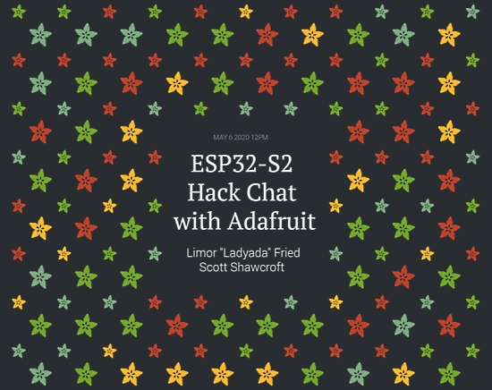](https://hackaday.io/event/170992-esp32-s2-hack-chat-with-adafruit)

Announced in September 2019, the ESP32-S2 is finally making it into hobbyist's hands. With WiFi, a much faster CPU, scads of GPIO, ADCs, a RISC-V co-processor, native USB, and the promise of very low current draw, the ESP32-S2 may prove to be popular with hobbyists as it becomes established.

To talk through the new chip's potential, Limor "Ladyada" Fried and Scott Shawcroft, both of Adafruit Industries, will join Hackaday.io on the Hack Chat. Learn everything you need to know about the ESP32-S2, and how to put it to work for you.

Tune in on Wednesday, May 6, 2020 at noon US Pacific Time - [Hackaday.io](https://hackaday.io/event/170992-esp32-s2-hack-chat-with-adafruit).

## CircuitPython Version 5.3.0 Stable is Available

CircuitPython 5.3.0 Stable is the latest minor revision of CircuitPython. This release adds support for 3 new boards, adds the RGBMatrix driver for RGB LED matrices, and more.

New features and improvements since 5.2.0

* Add support for RGB Matrix display
* Add a fill method to displayio.Bitmap
* Make the colors used by the stage library compatible with those used in the displayio library
* Multiple improvements to the STM32 port
* Improvements to the litex port
* Improvements to ulab
* Use “checkout@v2” in the CircuitPython build process
* Fix the maximum keycode in keyboard HID descriptor
* Fix bad submodule patk
* Add the NFC Copy Cat board
* Use Sphinx 3 to build the documentation

3 New boards since 5.2.0

* nfc_copy_cat
* nucleo_f767zi
* nucleo_h743zi_2

See the release page for additional information – [GitHub](https://github.com/adafruit/circuitpython/releases) and the [Adafruit Blog](https://blog.adafruit.com/2020/04/30/circuitpython-5-3-0-released/).

## An MQTT-based CircuitPython Library for Azure IoT

[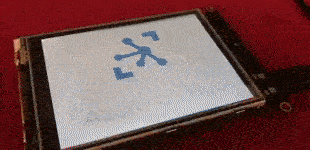](https://techcommunity.microsoft.com/t5/internet-of-things/use-circuitpython-with-iot-central/ba-p/1276986)

As a Hackathon exploration, Microsoft adapted an IoT Central Python library to create an MQTT-based CircuitPython library for Azure IoT. CircuitPython, Adafruit’s version of Python for embedded development, is easy to use and significantly lowers the barrier of entry for building cool IoT solutions. This library has been tested with the PyPortal device (which has a broad set of capabilities, including a TFT touchscreen display) and a PyBadge. Both of these devices are able to connect via an ESP32 serving as a wi-fi coprocessor - [Microsoft Tech Community Blog](https://techcommunity.microsoft.com/t5/internet-of-things/use-circuitpython-with-iot-central/ba-p/1276986#).

Microsoft asks interested parties to check it out and provide feedback - [GitHub](https://github.com/elhorton/Circuitpython-AzureIoT).

If you’re interested in seeing more of CircuitPython or MicroPython in Azure IoT, let them know by filling out [a quick form](https://forms.office.com/Pages/ResponsePage.aspx?id=v4j5cvGGr0GRqy180BHbRyKaGeYFaYdNly2bhngkmi5URUhKRFFSUVZWM1ZPNklYNEtOUThOT1dSTS4u).

This project coplements work by Brent Rubell at Adafruit in creating the Adafruit_CircuitPython_AzureIoT library - [GitHub](https://github.com/adafruit/Adafruit_CircuitPython_AzureIoT).

## The Adafruit Internet of Things Monthly Newsletter

The May issue of the Adafruit Internet of Things Monthly Newsletter is out with a great number of CircuitPython-related topics. You can catch the ICYMI version - [Adafruit Blog](https://blog.adafruit.com/2020/05/01/icymi-adafruit-iot-monthly-quarantine-clock-smarter-than-your-speaker-and-more-adafruit-iot-newsletter-icymi-adafruit-adafruitio-circuitpython/).

With over 1,400 subscribers, this monthly newsletter keeps you informed on IoT. Subscribe spam free - [Adafruit Daily](https://www.adafruitdaily.com/).

## Adafruit Update

Adafruit Industries continues to run with 100% of employees being paid and continuing to work. Most are working remotely, with some working in the Manhattan, New York factory as an essential service and business under NYC Executive Order 202.6 Capabilities. Adafruit was deemed an essential service to distribute/make some PPE (Personal Protection Equipment) such as face shields, and manufacturer electronics for essential life-saving/preserving equipment and development which is needed in New York and beyond - [Blog](https://blog.adafruit.com/2020/03/22/covid/).

- [Laser Cutting a Face Shield](https://blog.adafruit.com/2020/05/04/laser-cutting-a-face-shield-adafruit-manufacturingmonday-video/) (as seen through a thermal camera)
- [NYC makes recap … 7m masks for New Yorkers, 50,000 swabs, make and buy in the USA](https://blog.adafruit.com/2020/05/03/nyc-makes-recap-7m-masks-for-new-yorkers-50000-swabs-make-and-buy-in-the-usa-printparts-envisiontec-nycedc-nygovcuomo-nycmayor/)
- [4/29/2020 photos and videos of the day](https://blog.adafruit.com/2020/04/29/4-29-2020-photos-and-videos-of-the-day-adafruitchronicles-americaworkstogether-newyorktough/)

## 400+ Textbooks made free for download

[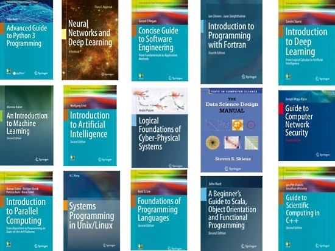](https://twitter.com/MIT_CSAIL/status/1257323849131134976)

MIT CSAIL posts that "Springer just made 400+ textbooks free to download, including CS books on Python, deep learning, data science & AI." 

Great timing! If you are looking for some programing books in general and Python programming in specific, this is great! - [Twitter](https://twitter.com/MIT_CSAIL/status/1257323849131134976) and [Springer](https://link.springer.com/search?facet-content-type=%22Book%22&package=mat-covid19_textbooks&facet-discipline=%22Computer+Science%22).

## Adafruit hardware being certified Open Source

Adafruit has always been an open source hardware company, predating the [Open Source Hardware Association](https://oshwa.org) (OSHWA) certification process. We have begun submitting all of our hardware to OSHWA for certification as Open Source. This week **161** new boards were certified including:

* [Adafruit Ethernet FeatherWing](https://www.adafruit.com/product/3201)
* [Adafruit HUZZAH32 - ESP32](https://www.adafruit.com/product/3591)
* [Teensy 3.X Feather Adapter](https://www.adafruit.com/product/3200)

## News from around the web!

The Evo M51 Module is a Feather-sized board feauturing both a Microchip SAMD51 microcontroller and a MAX 10 FPGA. The board is designed to support CircuitPython and is also programmable with the Arduino IDE  - [Alorium Technology](https://www.aloriumtech.com/evo/) and [YouTube](https://www.youtube.com/watch?v=AQAxEhB8_UE&feature=youtu.be).

The Melbourne MicroPython Meetup presents their March-April News Roundup, discussing the latest MicroPython news. This issue has a shout out to Adafruit and Scott Shawcroft on CircuitPython: "Especially loving the inspiring way that you folks are running the business in such a difficult time. Stay safe and keep up the amazing work!" - [Twitter](https://twitter.com/matt_trentini/status/1256908219307323392) and [GitHub.io](https://melbournemicropythonmeetup.github.io/March-April-News-Roundup/).

[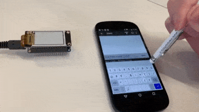](https://github.com/plasticlogic/pl-micro-epd)

[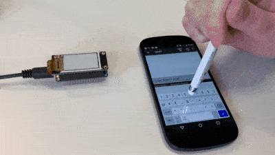](https://github.com/plasticlogic/pl-micro-epd)

A follow-up to last week and the PlasticLogic ePaper displays. They have two new video demonstrations. Check out the repo for their code and details - [GitHub](https://github.com/plasticlogic/pl-micro-epd).

[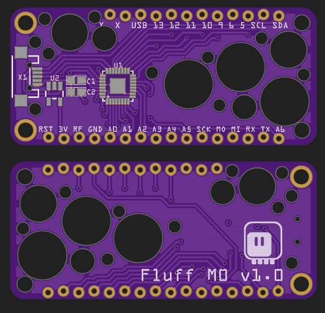](https://twitter.com/deshipu/status/1257011053285834756)

The Fluff M0 is the simplest, least expensive board in the Feather form factor with a Microchip SAMD21 processor - [Hackaday.io](https://hackaday.io/project/171381-fluff-m0) and [Twitter](https://twitter.com/deshipu/status/1257011053285834756).

[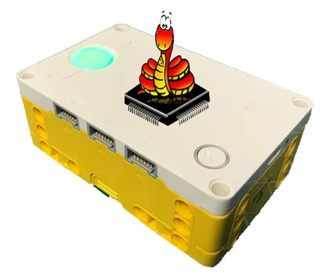](https://twitter.com/biglesp/status/1257231153309900801)

The Lego SPIKE Prime controller runs MicroPython inside. This makes for some interesting projects like a Star Wars X-Wing Robot - [Twitter](https://twitter.com/biglesp/status/1257231153309900801), [Blog](https://bigl.es/microcontroller-monday-lego-spike-prime/), [YouTube](https://www.youtube.com/watch?time_continue=2&v=Z7eUZ3R4W5g&feature=emb_logo) and general information on SPIKE and MicroPython via [Instructables](https://www.instructables.com/id/MicroPython-on-SPIKE-Prime/).

[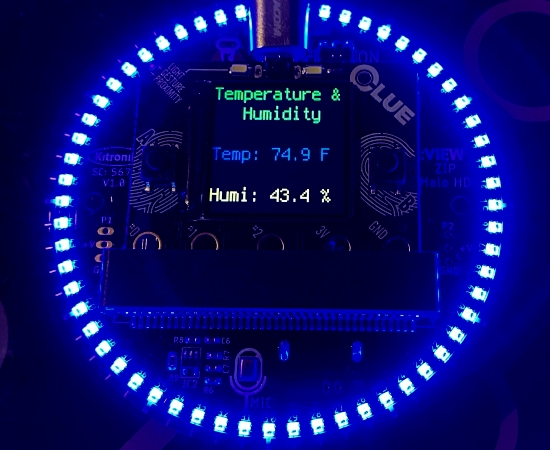](https://twitter.com/Kwalseth/status/1255568602289209349)

Using an Adafruit CLUE and a Kitronik Ziphalohd as a temperature monitor - [Twitter](https://twitter.com/Kwalseth/status/1255568602289209349).

[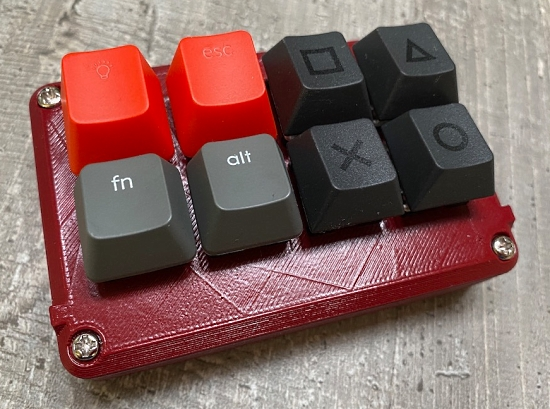](https://makeandymake.github.io/2020/05/02/seeeduino-xiao-circuitpython-usb-hid-macro-keypad.html)

Build a simple USB HID Macropad using Seeeduino Xiao and CircuitPython - [Make Andy Make](https://makeandymake.github.io/2020/05/02/seeeduino-xiao-circuitpython-usb-hid-macro-keypad.html).

[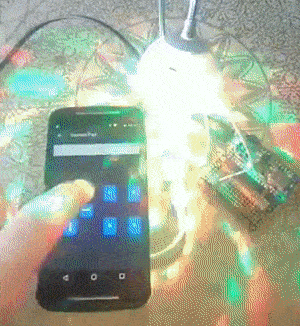](https://twitter.com/DavidGlaude/status/1256612823251267586?s=20)

Controlling a USB powered disco light from Bluetooth - [Twitter](https://twitter.com/DavidGlaude/status/1256612823251267586?s=20).

Building a work-from-home "On Air" light with Circuit Playground Express - [GitHub](https://github.com/jkeefe/wfh-on-air-light).

Program Lattice MachX02/3 FPGAs with CircuitPython. It works over I2C or SPI, no JTAG required - [GitHub](https://github.com/gsteiert/machXOprog) and [Twitter](https://twitter.com/fpgahelper/status/1256803164688281600).

[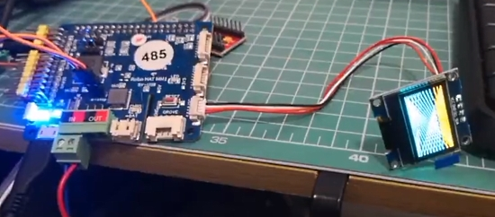](https://twitter.com/RoboticMasters/status/1256577151827996674)

An I2C OLED display working with CircuitPython and the Robo HAT MM1 automation controller - [Twitter](https://twitter.com/RoboticMasters/status/1256577151827996674).

Microsoft Windows 10 May 2019 Update installs a Python command to redirect users to download a version from the Windows Store - good, yes? It is reported that this puts the redirect ahead of any actual CPython installed on the machine - bad, yes. The simple fix is to turn off the application alias using the "Manage app execution aliases" in settings - [Microsoft](https://devblogs.microsoft.com/python/python-in-the-windows-10-may-2019-update/), [Twitter Issue](https://twitter.com/CasualEffects/status/1256806906015907841) and [Twitter Fix](https://twitter.com/havesp/status/1257295202785640448).

[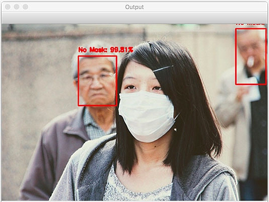](https://www.pyimagesearch.com/2020/05/04/covid-19-face-mask-detector-with-opencv-keras-tensorflow-and-deep-learning/)

COVID-19: Face Mask Detector with Python, OpenCV, Keras/TensorFlow, and Deep Learning - [PyImageSearch](https://www.pyimagesearch.com/2020/05/04/covid-19-face-mask-detector-with-opencv-keras-tensorflow-and-deep-learning/).

[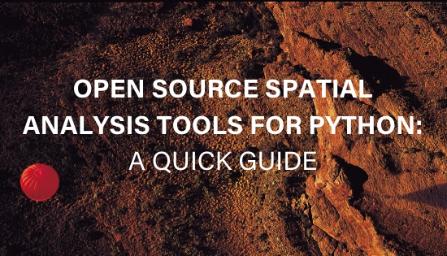](https://makepath.com/open-source-spatial-analysis-tools-a-quick-guide/)

Open Source Spatial Analysis Tools for Python: a quick guide - [makepath](https://makepath.com/open-source-spatial-analysis-tools-a-quick-guide/).

[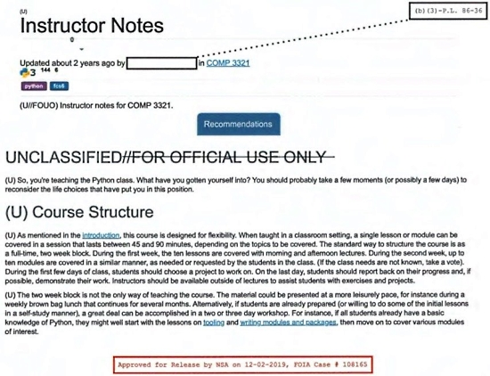](https://blog.adafruit.com/2020/02/09/learn-python-from-the-nsa-sorta-nsagov/)

[Chris](https://twitter.com/chris_swenson/status/1225836060938125313) put in a FOIA request to the United States NSA for their Python training materials and got back a 400-page printout of their COMP 3321 training course – [PDF](https://cdn-blog.adafruit.com/uploads/2020/02/python_NSA.pdf). Some take aways from it - [Post](https://kushaldas.in/posts/python-course-inside-of-nsa-via-a-foia-request.html).

PyDev of the Week – Samuel Hinton on [Mouse vs Python](https://www.blog.pythonlibrary.org/2020/05/04/pydev-of-the-week-samuel-hinton/)

#ICYDNCI What was the most popular, most clicked link, in [last week's newsletter](https://link)? [title](url).

## New Boards Supported by CircuitPython

The number of supported microcontrollers and Single Board Computers (SBC) grows every week. This section outlines which boards have been included in CircuitPython or added to [CircuitPython.org](https://circuitpython.org/).

This week we had another new board added:

- [Rock Pi S](https://circuitpython.org/blinka/rock_pi_s/)

Looking for adding a new board to CircuitPython? It's highly encouraged! Adafruit has two guides to help you do so:

- [How to Add a New Board to CircuitPython](https://learn.adafruit.com/how-to-add-a-new-board-to-circuitpython/overview)
- [How to add a New Board to the circuitpython.org website](https://learn.adafruit.com/how-to-add-a-new-board-to-the-circuitpython-org-website)
- [Adding a Single Board Computer to PlatformDetect for Blinka](https://learn.adafruit.com/adding-a-single-board-computer-to-platformdetect-for-blinka)
- [Adding a Single Board Computer to Blinka](https://learn.adafruit.com/adding-a-single-board-computer-to-blinka)

## New Learn Guides!

[PyPortal Quarantine Clock](https://learn.adafruit.com/pyportal-quarantine-clock) from [Brent Rubell](https://learn.adafruit.com/users/brubell)

[CircuitPython CLUE I Ching Caster](https://learn.adafruit.com/clue-i-ching-caster) from [Carter Nelson](https://learn.adafruit.com/users/caternuson)

[Pulse Oximeter Wireless Data Logger](https://learn.adafruit.com/pulse-oximeter-wireless-data-logger) from [John Park](https://learn.adafruit.com/users/johnpark)

[UTi165 Thermal Fever Scanner Camera](https://learn.adafruit.com/uti165-thermal-fever-scanner-camera) from [Ladyada](https://learn.adafruit.com/users/adafruit2)

## Updated Guides - Now With More Python!

**You can use CircuitPython libraries on Raspberry Pi!** We're updating all of our CircuitPython guides to show how to wire up sensors to your Raspberry Pi, and load the necessary CircuitPython libraries to get going using them with Python. We'll be including the updates here so you can easily keep track of which sensors are ready to go. Check it out!

Keep checking back for more updated guides!

## CircuitPython Libraries!

CircuitPython support for hardware continues to grow. We are adding support for new sensors and breakouts all the time, as well as improving on the drivers we already have. As we add more libraries and update current ones, you can keep up with all the changes right here!

For the latest drivers, download the [Adafruit CircuitPython Library Bundle](https://circuitpython.org/libraries).

If you'd like to contribute, CircuitPython libraries are a great place to start. Have an idea for a new driver? File an issue on [CircuitPython](https://github.com/adafruit/circuitpython/issues)! Interested in helping with current libraries? Check out the [CircuitPython.org Contributing page](https://circuitpython.org/contributing). We've included open pull requests and issues from the libraries, and details about repo-level issues that need to be addressed. We have a guide on [contributing to CircuitPython with Git and Github](https://learn.adafruit.com/contribute-to-circuitpython-with-git-and-github) if you need help getting started. You can also find us in the #circuitpython channel on the [Adafruit Discord](https://adafru.it/discord). Feel free to contact Kattni (@kattni) with any questions.

You can check out this [list of all the CircuitPython libraries and drivers available](https://github.com/adafruit/Adafruit_CircuitPython_Bundle/blob/master/circuitpython_library_list.md). 

The current number of CircuitPython libraries is **227**!

**New Libraries!**

Here's this week's new CircuitPython libraries:

 * [Adafruit_CircuitPython_BLE_BerryMed_Pulse_Oximeter](https://github.com/adafruit/Adafruit_CircuitPython_BLE_BerryMed_Pulse_Oximeter)

**Updated Libraries!**

Here's this week's updated CircuitPython libraries:

 * [Adafruit_CircuitPython_LSM6DS](https://github.com/adafruit/Adafruit_CircuitPython_LSM6DS)
 * [Adafruit_CircuitPython_ADXL34x](https://github.com/adafruit/Adafruit_CircuitPython_ADXL34x)
 * [Adafruit_CircuitPython_BNO055](https://github.com/adafruit/Adafruit_CircuitPython_BNO055)
 * [Adafruit_CircuitPython_CCS811](https://github.com/adafruit/Adafruit_CircuitPython_CCS811)
 * [Adafruit_CircuitPython_Pypixelbuf](https://github.com/adafruit/Adafruit_CircuitPython_Pypixelbuf)
 * [Adafruit_CircuitPython_PyPortal](https://github.com/adafruit/Adafruit_CircuitPython_PyPortal)
 * [Adafruit_CircuitPython_NeoPixel_SPI](https://github.com/adafruit/Adafruit_CircuitPython_NeoPixel_SPI)
 * [Adafruit_CircuitPython_DS2413](https://github.com/adafruit/Adafruit_CircuitPython_DS2413)
 * [Adafruit_CircuitPython_AzureIoT](https://github.com/adafruit/Adafruit_CircuitPython_AzureIoT)
 * [Adafruit_CircuitPython_NeoPixel](https://github.com/adafruit/Adafruit_CircuitPython_NeoPixel)

**PyPI Download Stats!**

We've written a special library called Adafruit Blinka that makes it possible to use CircuitPython Libraries on [Raspberry Pi and other compatible single-board computers](https://learn.adafruit.com/circuitpython-on-raspberrypi-linux/). Adafruit Blinka and all the CircuitPython libraries have been deployed to PyPI for super simple installation on Linux! Here are the top 10 CircuitPython libraries downloaded from PyPI in the last week, including the total downloads for those libraries:

Keep an eye out here for more download stats coming soon!

## What’s the team up to this week?

What is the team up to this week? Let’s check in!

**Bryan**

The highlight of this week has been working on a project to add the joy of clacky keyboards to the Trellis family! I'm working on a board that has the same 60x60mm dimensions and tessellated I2C pads as the Trellis, NeoTrellis and NeoTrellis M4. This one will be different from the other members of the Trellis because I've replaced the elastomer buttons with mechanical keyboard switches!

Instead of the 4x4 grid of squishy elastomer buttons you'll get a 3x3 array of sockets that fit standard Cherry MX switches. There is a huge range of different switches available from "Bryan, mute your mic" levels of clickyness to buttery soft, silent as a ninja "linear" switches. And since the switches are mounted in sockets instead of soldered in, you can change them out at your whim.

There are still a few things to figure out about the design but I'm hopeful this will pan out and perhaps be just the start ;)

**Dan**

I released the BLE pulse oximeter library, now that the Learn Guide for that project is published.

I've been going in circles a bit on some core changes for BLE PacketBuffer, to make sure it works with the new Adafruit services. I should be done with that soon.

I've tried a BLE-capable body-weight scale and a blood pressure monitor. Unfortunately neither use the standard services defined by the Bluetooth organization, so there will be some reverse engineering.

**Jeff**

[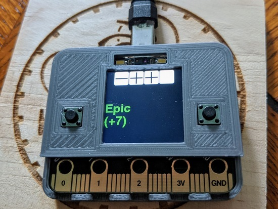](https://circuitpython.org/)

For the past week, I've been working on adding RGBMatrix support to the Feather STM32F407.  This is the first time the initial work of porting to a new microcontroller has fallen to me instead of Phil B., and the first real work I've done on an STM microcontroller, so it has been a learning experience.

For fun, I eagerly printed the new [slim enclosure for Adafruit CLUE](https://learn.adafruit.com/clue-slim-case) and used it for a little project with displayio:  A die roller for the FATE role playing system.  In FATE, you use 4 special dice (labeled +, - and blank) together with your character's inherent skill to determine an outcome.  It was a fun chance to learn a little more about how the accelerometer and proximity sensor work, because you can either shake the CLUE or touch the sensor above the screen to roll the dice.

**Kattni**

This week, I've been going through all the open GitHub issues across all of the CircuitPython libraries. While there are many longstanding issues that need to remain open, there are many that can be addressed in some way. I've been pinging original authors to get status updates, closing completed issues, and putting in PRs to resolve some of the quick ones. Expect to see activity across many of the libraries over the next couple of weeks.

As well, I added a new capability to the Circuit Playground library. You can now check which board you have connected, Express or Bluefruit. There are two options. First is the option to check which board is connected and return that piece of information. Second is the option to specify which board to look for and use that to execute code based on which board is connected, e.g. if a Circuit Playground Bluefruit is connected, run the following code. This came out of the sound meter example failing to work on Circuit Playground Bluefruit. There are some features that are not supported by Circuit Playground Express, so it allows for writing sound related code that works on both Express and Bluefruit.

**Lucian**

This past week has mostly been carryover from the previous week, with new bugfixes and documentation changes. I've written a new ReadMe for the STM32 port, which should make it easier for newcomers to understand the port's structure and start getting builds loaded with the new `make flash` command. I've also been doing miscellaneous work on bugfixes, reviews, and a lot of reading about the i.MX RT. 

In my personal time, I risked a drive into the plague-zones (Boston) to retrieve some gear for board testing and a new circuitpython project. While I was there I got to see the PPE manufacturing setup running at the Makerspace where I normally work full time, Artisan's Asylum. They're taking safety very seriously and still churning out seriously impressive quantities of equipment. It was great to see that everyone is safe and to hear updates from them - from an approved distance of 6ft, of course. 

**Melissa**

[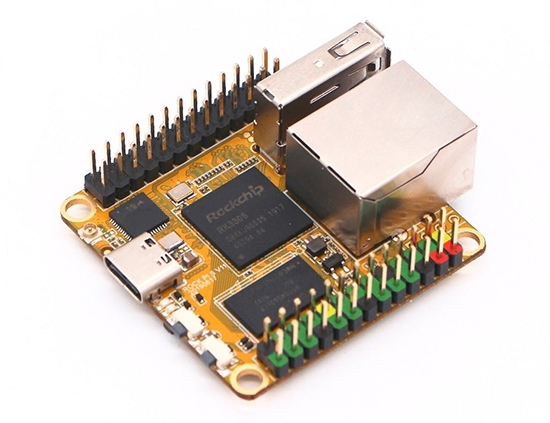](https://circuitpython.org/)

This past week I worked on adding the Rock Pi S to Blinka. This included adding some more tools such as a SysFS Pin wrapper so that there are more options to add new boards to Blinka. Additionally, I added Pulse Width Modulation support and Analog Input support to the Rock Pi S, which is the first time I had added those features.

Next up, I will be focusing on improving I2C support of the Raspberry Pi including adding support for unusual configurations as well as working on adding I2C to the external bitbangio CircuitPython library.

**Scott**

At the end of last week I worked more on the ESP32-S2 port. I got CircuitPython to the point of linking the files together and, with the help of folks from my stream, generating lots of linking errors (Previously we had many compiler errors). The end of this week, I'll continue working on the port by fixing the linker issues.

The start of this week was spent on the lower_power PR. There was a weird USB issue on SAMD21 that only came up with certain USB host computers. I got it reproduced here and then Thach also reproduced it and then fixed it. So, it should be ready to merge. :fingers_crossed:

I've also been helping Dylan convert the inline native module docs from RST to Python stubs. That way we'll be able to provide stubs to editors like VS Code that can use it to help with completions.

dunkmann00 has also been working to get PixelBuf launched so that folks have faster NeoPixels. There are a few administrative things to do like releasing the libraries and then updating the frozen version but that shouldn't be too hard.

Lastly, I chatted yesterday with Helen Leigh about CircuitPython for her upcoming Make magazine article. I look forward to reading it.

Thanks to everyone who has helped me this week!

## Upcoming events!

PyCon2020 Online has launched! Head over to https://us.pycon.org/2020/online/ to access new content weekly. Pythonistas come together every year to learn, network & discuss great ideas in person at PyCon. That can't happen this year, but everyone can get together virtually!  - [Announcement](https://mailchi.mp/us.pycon.org/pycon-news-501443).

You can [subscribe to the PyCon 2020 Online mailing list](https://us.pycon.org/2020/online/) to receive updates as they are published online. Check out talks, tutorials, Charlas, & Startup Row along with the [Virtual Expo Hall](https://us.pycon.org/2020/sponsors/virtualexpohall/). 

Items of note:

- How to build an intelligent "indoor garden" with microcontrollers, CircuitPython, and IoT - [YouTube](https://www.youtube.com/watch?v=8STo1-rRV1E).
- 9 Years of PyLadies: Lessons Learned and What Comes Next - [YouTube](https://www.youtube.com/watch?v=KRwpY2TixAs).

[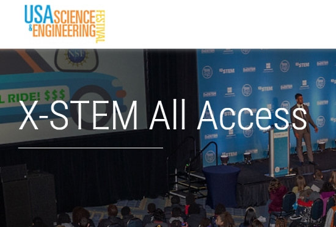](https://usasciencefestival.org/x-stem-all-access-2020/)

The USA Science & Engineering Festival is to offer their popular X-STEM conference in a virtual format! X-STEM All Access is an engaging, entertaining, educational, and interactive online STEM experience for kids.  Through a series of daily livestream events, students will hear from an exclusive group of visionaries who aim to empower and inspire kids about careers in science, technology, engineering, and mathematics.

X-STEM All Access presentations will be geared toward a middle and high school level audience (grades 6 to 12), but kids and adults of all ages are welcome to join. Educators are encouraged to include X-STEM All Access into their distance learning curriculum.

There will be daily presentations on May 13, 14, 15, 18, and 19th, 2020 from 1-2 pm US EDT.

There is no cost to attend. Register on their website - [usasciencefestival.org](https://usasciencefestival.org/x-stem-all-access-2020/).

EuroPython 2020 this year will be an online conference from July 23-26. They are planning the following structure:

* 2 conference days with keynotes, talks, lightning talks, poster session (Thursday and Friday)
* 2 sprint days with multiple sprint teams (Saturday and Sunday)

Attending the conference days will require a ticket, participating in the sprint days will be free - [EuroPython](https://blog.europython.eu/post/614102095419850752/europython-2020-online-conference-from-july-23-26).

PyCon AU has announced they are holding PyConline AU, an online event, in August 2020 -  [pycon.org.au](https://2020.pycon.org.au/).

PyCon India 2020: the premier conference in India on using and developing the Python programming language. Held online October 3-5, 2020. A [call for proposals](https://in.pycon.org/cfp/2020/proposals/) is now open through August 14, 2020. - [Website](https://in.pycon.org/2020/) and [Twitter](https://twitter.com/pyconindia)
**Send Your Events In**

As for other events, with the COVID pandemic, most in-person events are postponed or cancelled. If you know of virtual events or events that may occur in the future, please let us know on Discord or on Twitter with hashtag #CircuitPython.

## Latest releases

CircuitPython's stable release is [5.3.0](https://github.com/adafruit/circuitpython/releases/latest). New to CircuitPython? Start with our [Welcome to CircuitPython Guide](https://learn.adafruit.com/welcome-to-circuitpython).

[20200502](https://github.com/adafruit/Adafruit_CircuitPython_Bundle/releases/latest) is the latest CircuitPython library bundle.

[v1.12](https://micropython.org/download) is the latest MicroPython release. Documentation for it is [here](http://docs.micropython.org/en/latest/pyboard/).

[3.8.2](https://www.python.org/downloads/) is the latest Python release. The latest pre-release version is [3.9.0a6](https://www.python.org/download/pre-releases/).

[1683 Stars](https://github.com/adafruit/circuitpython/stargazers) Like CircuitPython? [Star it on GitHub!](https://github.com/adafruit/circuitpython)

## Call for help – CircuitPython messaging to other languages!

We [recently posted on the Adafruit blog](https://blog.adafruit.com/2018/08/15/help-bring-circuitpython-messaging-to-other-languages-circuitpython/) about bringing CircuitPython messaging to other languages, one of the exciting features of CircuitPython 4 and later versions is translated control and error messages. Native language messages will help non-native English speakers understand what is happening in CircuitPython even though the Python keywords and APIs will still be in English. If you would like to help, [please post](https://github.com/adafruit/circuitpython/issues/1098) to the main issue on GitHub and join us on [Discord](https://adafru.it/discord).

We made this graphic with translated text, we could use your help with that to make sure we got the text right, please check out the text in the image – if there is anything we did not get correct, please let us know. Dan sent me this [handy site too](http://helloworldcollection.de/#Human).

## jobs.adafruit.com - Find a dream job, find great candidates!

[jobs.adafruit.com](https://jobs.adafruit.com/) has returned and folks are posting their skills (including CircuitPython) and companies are looking for talented makers to join their companies - from Digi-Key, to Hackaday, Microcenter, Raspberry Pi and more.

## 18,515 thanks!

The Adafruit Discord community, where we do all our CircuitPython development in the open, reached over 18,515 humans, thank you! Join today! [https://adafru.it/discord](https://adafru.it/discord)

## ICYMI - In case you missed it

The wonderful world of Python on hardware! This is our first video-newsletter-podcast that we’ve started! The news comes from the Python community, Discord, Adafruit communities and more. It’s part of the weekly newsletter, then we have a segment on ASK an ENGINEER and this is the video slice from that! The complete Python on Hardware weekly videocast [playlist is here](https://www.youtube.com/playlist?list=PLjF7R1fz_OOXRMjM7Sm0J2Xt6H81TdDev). 

This video podcast is on [iTunes](https://itunes.apple.com/us/podcast/python-on-hardware/id1451685192?mt=2), [YouTube](http://adafru.it/pohepisodes), [IGTV (Instagram TV](https://www.instagram.com/adafruit/channel/)), and [XML](https://itunes.apple.com/us/podcast/python-on-hardware/id1451685192?mt=2).

[Weekly community chat on Adafruit Discord server CircuitPython channel - Audio / Podcast edition](https://itunes.apple.com/us/podcast/circuitpython-weekly-meeting/id1451685016) - Audio from the Discord chat space for CircuitPython, meetings are usually Mondays at 2pm ET, this is the audio version on [iTunes](https://itunes.apple.com/us/podcast/circuitpython-weekly-meeting/id1451685016), Pocket Casts, [Spotify](https://adafru.it/spotify), and [XML feed](https://adafruit-podcasts.s3.amazonaws.com/circuitpython_weekly_meeting/audio-podcast.xml).

And lastly, we are working up a one-spot destination for all things podcast-able here - [podcasts.adafruit.com](https://podcasts.adafruit.com/)

## Codecademy "Learn Hardware Programming with CircuitPython"

Codecademy, an online interactive learning platform used by more than 45 million people, has teamed up with the leading manufacturer in STEAM electronics, Adafruit Industries, to create a coding course, "Learn Hardware Programming with CircuitPython". The course is now available in the [Codecademy catalog](https://www.codecademy.com/learn/learn-circuitpython?utm_source=adafruit&utm_medium=partners&utm_campaign=circuitplayground&utm_content=pythononhardwarenewsletter).

Python is a highly versatile, easy to learn programming language that a wide range of people, from visual effects artists in Hollywood to mission control at NASA, use to quickly solve problems. But you don’t need to be a rocket scientist to accomplish amazing things with it. This new course introduces programmers to Python by way of a microcontroller — CircuitPython — which is a Python-based programming language optimized for use on hardware.

CircuitPython’s hardware-ready design makes it easier than ever to program a variety of single-board computers, and this course gets you from no experience to working prototype faster than ever before. Codecademy’s interactive learning environment, combined with Adafruit's highly rated Circuit Playground Express, present aspiring hardware hackers with a never-before-seen opportunity to learn hardware programming seamlessly online.

Whether for those who are new to programming, or for those who want to expand their skill set to include physical computing, this course will have students getting familiar with Python and creating incredible projects along the way. By the end, students will have built their own bike lights, drum machine, and even a moisture detector that can tell when it's time to water a plant.

Visit Codecademy to access the [Learn Hardware Programming with CircuitPython](https://www.codecademy.com/learn/learn-circuitpython?utm_source=adafruit&utm_medium=partners&utm_campaign=circuitplayground&utm_content=pythononhardwarenewsletter) course and Adafruit to purchase a [Circuit Playground Express](https://www.adafruit.com/product/3333).

Codecademy has helped more than 45 million people around the world upgrade their careers with technology skills. The company’s online interactive learning platform is widely recognized for providing an accessible, flexible, and engaging experience for beginners and experienced programmers alike. Codecademy has raised a total of $43 million from investors including Union Square Ventures, Kleiner Perkins, Index Ventures, Thrive Capital, Naspers, Yuri Milner and Richard Branson, most recently raising its $30 million Series C in July 2016.

## Contribute!

The CircuitPython Weekly Newsletter is a CircuitPython community-run newsletter emailed every Tuesday. The complete [archives are here](https://www.adafruitdaily.com/category/circuitpython/). It highlights the latest CircuitPython related news from around the web including Python and MicroPython developments. To contribute, edit next week's draft [on GitHub](https://github.com/adafruit/circuitpython-weekly-newsletter/tree/gh-pages/_drafts) and [submit a pull request](https://help.github.com/articles/editing-files-in-your-repository/) with the changes. Join our [Discord](https://adafru.it/discord) or [post to the forum](https://forums.adafruit.com/viewforum.php?f=60) for any further questions.
