- [X] Kattni updates
- [ ] change date
- [ ] update title
- [ ] Feature story
- [ ] Update  for images
- [ ] All images 550w max only
- [ ] Link "View this email in your browser."

View this email in your browser.

Hi everyone! It's the latest Python for Microcontrollers newsletter, brought you by the community! We're on [Discord](https://discord.gg/HYqvREz), [Twitter](https://twitter.com/search?q=circuitpython&src=typed_query&f=live), and for past newsletters - [view them all here](https://www.adafruitdaily.com/category/circuitpython/). If you're reading this on the web, [subscribe here](https://www.adafruitdaily.com/). Let's get started!

## CircuitPython 5.4.x Sneak Peaks

Scott Shawcroft has streamed some of the latest work on CircuitPython intended for the next release. 5.4.0 release candidate 0 is expected this week.

[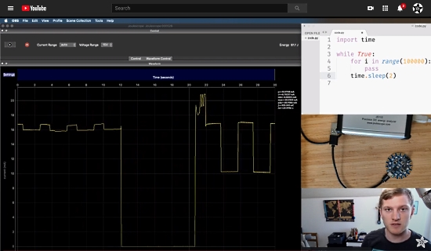](https://www.youtube.com/watch?v=1TniUBJejfY&feature=youtu.be)

A demonstration of lower power usage by shutting down the microcontroller during sleep - [YouTube](https://www.youtube.com/watch?v=1TniUBJejfY&feature=youtu.be).

[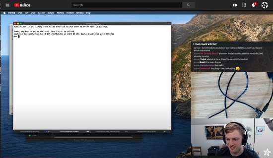](https://www.youtube.com/watch?v=LfUBOF1AWzs)

Scott livestreams with users and gets the CircuitPython REPL working on the ESP32-S2 microcontroller - [YouTube](https://www.youtube.com/watch?v=LfUBOF1AWzs).

[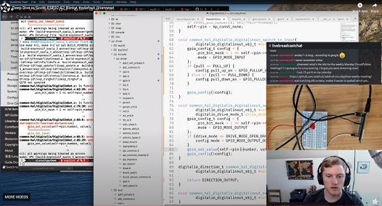](https://www.youtube.com/watch?v=LfUBOF1AWzs)

Finally, Scott has also wired up digitalio on ESP32-S2 to get an LED blinking - [YouTube](https://www.youtube.com/watch?v=LfUBOF1AWzs). Brandon Ashworth has also gotten an LED to blink on this board with CircuitPython - [Twitter](https://twitter.com/brandonvfx).

## Teensy 4.1 Microcontroller Board Released

pjrc.com has opened up sales for the new Teensy 4.1 development board. 

[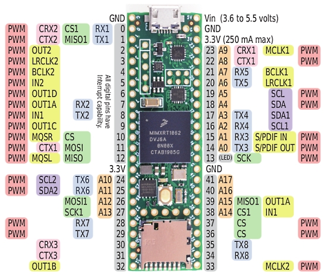](https://www.pjrc.com/store/teensy41.html)

It features improvements over the Teensy 4.0 board to include additional pins, a micro SD slot, and a 10/100 Mbit Ethernet 6 pin interface. Teensy 4.1 includes a USB host port broken out to a five-pin through-hole header on the inside of the PCB, as was done on the 3.5/3.6 versions - [pjrc.com](https://www.pjrc.com/store/teensy41.html) and [Hackaday](https://hackaday.com/2020/05/11/new-teensy-4-1-arrives-with-100-mbps-ethernet-high-speed-usb-8-mb-flash/).

As the board is similar to the Teensy 4.0, which has a current port of CircuitPython, work has begun to port CircuitPython to Teensy 4.1 by Scott Shawcroft.

## Microsoft Opens a New Python Discord Server

Microsoft has started a Discord server specifically aimed at Python. The server follows the [Microsoft Open Source Code of Conduct](https://opensource.microsoft.com/codeofconduct/).

microsoft-python can be joined via [https://aka.ms/python-discord](https://aka.ms/python-discord).

## RGB Matrix Support Extended to the STM32F4 Feather

[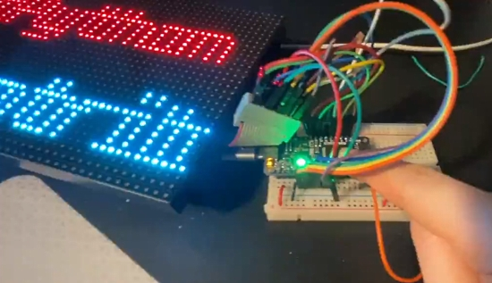](https://blog.adafruit.com/2020/05/10/testing-out-rgb-matrix-support-in-circuitpython-for-stm32f405-st_world-stmicroelectronics/)

CircuitPython received a native library to drive RGB matrices last month using the SAMD51 and nRF52840 microcontrollers. This week, Limor "Ladyada" Fried tests out support in the library for the ST Microelectronics STM32F405 chip available in CircuitPython 5.3.0 - [Twitter](https://twitter.com/adafruit/status/1259627565184147457) and [Blog](https://blog.adafruit.com/2020/05/10/testing-out-rgb-matrix-support-in-circuitpython-for-stm32f405-st_world-stmicroelectronics/).

## cyberDUCK - a self-contained computer that edits and runs CircuitPython

cyberDUCK is billed as a self-contained computer that can edit and run Python files, with USB keyboard input and a display. And it’s shaped like a disaster-recovery duck - [Twitter](https://twitter.com/CycleMatch/status/1258246572766265350), [Hackaday.io](https://hackaday.io/project/171269-cyberdck-a-circuitpython-anatidae), and [YouTube](https://youtu.be/bv5wRY0CV68).

Key features:
- USB Keyboard input
- Display for showing output
- A text editor for creating and editing Python code
- A "REPL"-like command line for entering Python commands (to edit a file, run a file, etc.)

The project uses many strategies to achieve this. As a prototype, the project deliberately takes bits and pieces from others and using glue, Fun-Tak, feathers and bailing wire to make it work.  

- Use a co-processor to take input from a USB keyboard (Arduino-based USB Host for SAMD with software modified from code by gdsports)
- Transmit keyboard input to main processor using UART
- Use a "REPL-interceptor" to allow text input from UART to control the command execution of python input from the keyboard
- Adapt a text editor MicroPython-editor (pye) from robert-hh to run on a CircuitPython Board with attached display. This will edit files by taking input from UART and output to the attached display.  File storage is using on-board non-volatile memory or a memory card

## Adafruit Update

Adafruit Industries continues to run with 100% of employees being paid and continuing to work. Most are working remotely, with some working in the Manhattan, New York factory as an essential service and business under NYC Executive Order 202.6 Capabilities. Adafruit was deemed an essential service to distribute/make some PPE (Personal Protection Equipment) such as face shields, and manufacturer electronics for essential life-saving/preserving equipment and development which is needed in New York and beyond. -[Blog](https://blog.adafruit.com/2020/03/22/covid/)

Photos from the Adafruit factory for last week - [Adafruit Blog](https://blog.adafruit.com/2020/05/08/5-8-2020-photos-and-videos-of-the-day-adafruitchronicles-americaworkstogether-newyorktough/).

**AdaBox Status:** Adafruit notes that, as of Monday May 11th, the upcoming AdaBox subscription is 100% full. Thanks to the community for support during this time. Adafruit encourages folks to check [adabox.com](https://www.adafruit.com/adabox), as there will be some openings before shipment and to sign up to be notified when there are more openings.

## Adafruit Hardware Being Certified Open Source

Adafruit has always been an open source hardware company, predating the [Open Source Hardware Association](https://oshwa.org) (OSHWA) certification process. We have begun submitting all of our hardware to OSHWA for certification as Open Source. This week **102** new boards were certified including:

* [Circuit Playground Express](https://www.adafruit.com/product/3333)
* [Circuit Playground Bluefruit](https://www.adafruit.com/product/4333)
* [Adafruit HalloWing M4 Express](https://www.adafruit.com/product/4300)

## News from around the web!

Build a serverless Martian weather display with CircuitPython and AWS Lambda - [IDK](https://idk.dev/build-a-serverless-martian-weather-display-with-circuitpython-and-aws-lambda/).

[Winterbloom](https://winterbloom.com/) is working on the new Hostess USB host board in the [FeatherWing format](https://github.com/adafruit/awesome-feather/blob/master/README.md) which will be CircuitPython compatible - [Twitter](https://twitter.com/search?q=hostess%20featherwing&src=typed_query).

CircuitPython_NeoSprite: a library for updating NeoPixel arrays from sprite files such as .BMP - [GitHub](https://github.com/aaronaverill/CircuitPython_NeoSprite).

The vectorio library builds on m4 express Feather and draws concrete shapes are composed into a VectorShape which is put into a displayio Group for display - [GitHub PR](https://github.com/adafruit/circuitpython/pull/2873).

An AHRS (Attitude and Heading Reference System) library for CircuitPython - [GitHub](https://github.com/gamblor21/CircuitPython_AHRS).

A number of streamed video tutorials on CircuitPython are available from KingerNorth. A selection from [YouTube](https://www.youtube.com/user/kingernorth):

- [Random Numbers & Timers with CircuitPython & Arduino](https://www.youtube.com/watch?v=H3QS05aK5TQ)
- [Using Servos with Arduino & CircuitPython](https://www.youtube.com/watch?v=ZGGk1XdIIw4)
- [Analog In, Mapping & PWM using CircuitPython & Arduino](https://www.youtube.com/watch?v=euBiE7c_0T0)

[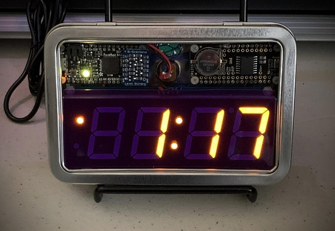](https://twitter.com/CedarGroveMakr/status/1259699103065206784)

A large mint tin LED clock. It features battery backup and a real time clock module with automatic daylight saving adjustments. Uses a rotary encoder for setting time, date, brightness, and enabling/disabling the ticking sound, all in CircuitPython - [Twitter](https://twitter.com/CedarGroveMakr/status/1258174807029411840?s=20).

[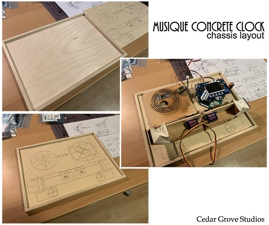](https://twitter.com/CedarGroveMakr/status/1259699103065206784)

[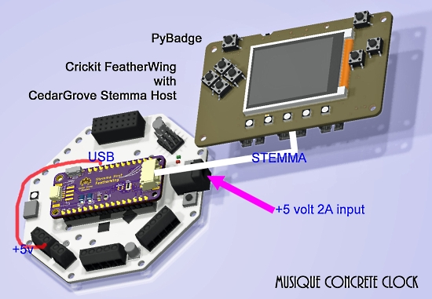](https://twitter.com/CedarGroveMakr/status/1259699103065206784)

A sneak peek of the enclosure base for a project, a restoration of an heirloom cuckoo clock incorporating original antique whistles and gong activated by servos and a solenoid. It uses an Adafruit Crickit controlled by PyBadge and CircuitPython with a custom Stemma Host FeatherWing - [Twitter](https://twitter.com/CedarGroveMakr/status/1259699103065206784).

The clock uses the Cedar Grove Studios Clock_Builder library, a collection of modules and libraries for building standalone RTC clocks - [GitHub](https://github.com/CedarGroveStudios/Clock_Builder).

[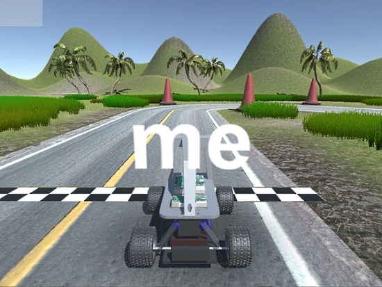](https://www.hackster.io/wallarug/donkey-car-simulator-with-real-rc-controller-628e77)

Donkey Car Simulator with an RC controller. It uses the Robo HAT MM1 and CircuitPython - [Twitter](https://twitter.com/RoboticMasters/status/1259820684550696960), [Hackster IO](https://www.hackster.io/wallarug/donkey-car-simulator-with-real-rc-controller-628e77), and [YouTube](https://youtu.be/Ui0dv2Hvqok).

A smart thermostat with a Raspberry Pi and another version using CircuitPython on an Adafruit Circuit Playground Express - [GitHub](https://github.com/dcbriccetti/smart-thermostat).

A quarantine day counter with an Adafruit PyPortal - [Twitter](https://twitter.com/BrianEnigma/status/1259182271354953735).

[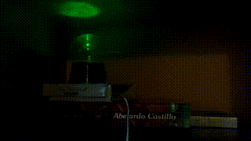](https://github.com/redraw/satellite-passes-esp8266)

Blink an LED when a satellite is passing by, using a Wemis D1 mini and MicroPython - [GitHub](https://github.com/redraw/satellite-passes-esp8266).

[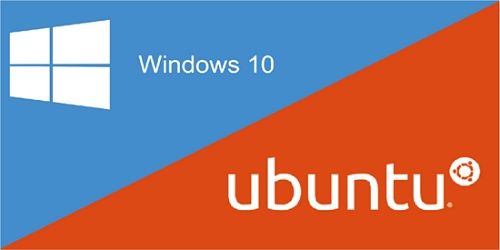](https://makers-with-myson.blog.ss-blog.jp/2020-05-11)

Create a CircuitPython build environment for SPRESENSE on Windows 10 with Windows Subsystem for Linux (WSL) - [Twitter](https://twitter.com/Taro_Yoshino/status/1259855915228020740) and [Blog](https://makers-with-myson.blog.ss-blog.jp/2020-05-11) (Japanese).

[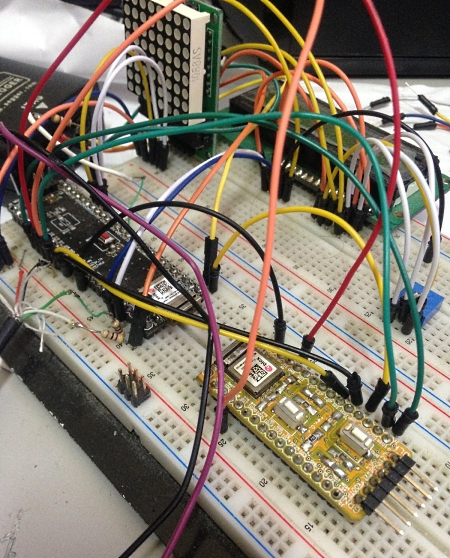](https://nina-b302-com-wifi.blogspot.com/2020/04/nina-b302-adicionando-wifi-circuit.html)

An example of CircuitPython that allows a NINA B302 to communicate with an HTTP WORLDTIME server via a WiFi coprocessor based on NINA W102 in 802.11 mode - [Blog](https://nina-b302-com-wifi.blogspot.com/2020/04/nina-b302-adicionando-wifi-circuit.html) (Portugeuse).

An eye opening comparison of using .join() vs. "+" to join strings in Python - [Towards Data Science](https://towardsdatascience.com/do-not-use-to-join-strings-in-python-f89908307273).

PyDev of the Week – Jan Giacomelli on [Mouse vs Python](https://www.blog.pythonlibrary.org/2020/05/11/pydev-of-the-week-jan-giacomelli/)

CircuitPython Weekly Meeting for May 11th, 2020 [on YouTube](https://youtu.be/k_a4vXGS6CM).

#ICYDNCI What was the most popular, most clicked link, in [last week's newsletter](https://www.adafruitdaily.com/2020/05/05/esp32-s2-hack-chat-circuitpython-5-3-0-and-more-python-adafruit-circuitpython-circuitpython-micropython-thepsf/)? [Springer just made 400+ textbooks free to download](https://twitter.com/MIT_CSAIL/status/1257323849131134976).

## Made with Mu

Why Mu? Mu tries to make it as easy as possible to get started with programming but aims to help you graduate to "real" development tools soon after. Everything in Mu is the "real thing" but presented in as simple and obvious way possible. It's like the toddling stage in learning to walk: you're finding your feet and once you're confident, you should move on and explore! Put simply, Mu aims to foster autonomy. Try out Mu today! - [codewith.mu](https://codewith.mu/)

## New Boards Supported by CircuitPython

The number of supported microcontrollers and Single Board Computers (SBC) grows every week. This section outlines which boards have been included in CircuitPython or added to [CircuitPython.org](https://circuitpython.org/).

No new boards were added to CircuitPython.org this week but work on boards continues.

Looking for adding a new board to CircuitPython? It's highly encouraged! Adafruit has four guides to help you do so:

- [How to Add a New Board to CircuitPython](https://learn.adafruit.com/how-to-add-a-new-board-to-circuitpython/overview)
- [How to add a New Board to the circuitpython.org website](https://learn.adafruit.com/how-to-add-a-new-board-to-the-circuitpython-org-website)
- [Adding a Single Board Computer to PlatformDetect for Blinka](https://learn.adafruit.com/adding-a-single-board-computer-to-platformdetect-for-blinka)
- [Adding a Single Board Computer to Blinka](https://learn.adafruit.com/adding-a-single-board-computer-to-blinka)

## New Learn Guides!

[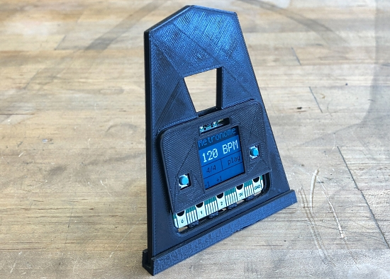](https://learn.adafruit.com/)

[Metronome CLUE](https://learn.adafruit.com/metronome-clue/) from [John Park](https://learn.adafruit.com/users/johnpark)

[CLUE Light Paint Stick with CircuitPython](https://learn.adafruit.com/clue-light-paintstick) from [Phillip Burgess](https://learn.adafruit.com/users/pburgess)

[CLUE Text Telephone Transmitter](https://learn.adafruit.com/clue-teletype-transmitter) from [John Park](https://learn.adafruit.com/users/johnpark)

[CLUE Vertical Garden Weather Visualizer](https://learn.adafruit.com/clue-vertical-garden-weather-visualizer) from [Erin St. Blaine](https://learn.adafruit.com/users/firepixie)

## Updated Guides - Now With More Python!

**You can use CircuitPython libraries on Raspberry Pi!** We're updating all of our CircuitPython guides to show how to wire up sensors to your Raspberry Pi, and load the necessary CircuitPython libraries to get going using them with Python. We'll be including the updates here so you can easily keep track of which sensors are ready to go. Check it out!

Keep checking back for more updated guides!

## CircuitPython Libraries!

CircuitPython support for hardware continues to grow. We are adding support for new sensors and breakouts all the time, as well as improving on the drivers we already have. As we add more libraries and update current ones, you can keep up with all the changes right here!

For the latest drivers, download the [Adafruit CircuitPython Library Bundle](https://circuitpython.org/libraries).

If you'd like to contribute, CircuitPython libraries are a great place to start. Have an idea for a new driver? File an issue on [CircuitPython](https://github.com/adafruit/circuitpython/issues)! Interested in helping with current libraries? Check out the [CircuitPython.org Contributing page](https://circuitpython.org/contributing). We've included open pull requests and issues from the libraries, and details about repo-level issues that need to be addressed. We have a guide on [contributing to CircuitPython with Git and Github](https://learn.adafruit.com/contribute-to-circuitpython-with-git-and-github) if you need help getting started. You can also find us in the #circuitpython channel on the [Adafruit Discord](https://adafru.it/discord). Feel free to contact Kattni (@kattni) with any questions.

You can check out this [list of all the CircuitPython libraries and drivers available](https://github.com/adafruit/Adafruit_CircuitPython_Bundle/blob/master/circuitpython_library_list.md). 

The current number of CircuitPython libraries is **227**!

**Updated Libraries!**

Here's this week's updated CircuitPython libraries:

 * [Adafruit_CircuitPython_RFM9x](https://github.com/adafruit/Adafruit_CircuitPython_RFM9x)
 * [Adafruit_CircuitPython_MSA301](https://github.com/adafruit/Adafruit_CircuitPython_MSA301)
 * [Adafruit_CircuitPython_MLX90640](https://github.com/adafruit/Adafruit_CircuitPython_MLX90640)
 * [Adafruit_CircuitPython_PyPortal](https://github.com/adafruit/Adafruit_CircuitPython_PyPortal)
 * [Adafruit_CircuitPython_TSL2591](https://github.com/adafruit/Adafruit_CircuitPython_TSL2591)
 * [Adafruit_CircuitPython_AS726x](https://github.com/adafruit/Adafruit_CircuitPython_AS726x)
 * [Adafruit_CircuitPython_BLE_Cycling_Speed_and_Cadence](https://github.com/adafruit/Adafruit_CircuitPython_BLE_Cycling_Speed_and_Cadence)
 * [Adafruit_CircuitPython_BLE_iBBQ](https://github.com/adafruit/Adafruit_CircuitPython_BLE_iBBQ)
 * [Adafruit_CircuitPython_BLE_Heart_Rate](https://github.com/adafruit/Adafruit_CircuitPython_BLE_Heart_Rate)
 * [Adafruit_CircuitPython_BLE_MIDI](https://github.com/adafruit/Adafruit_CircuitPython_BLE_MIDI)
 * [Adafruit_CircuitPython_LSM6DS](https://github.com/adafruit/Adafruit_CircuitPython_LSM6DS)
 * [Adafruit_CircuitPython_BitbangIO](https://github.com/adafruit/Adafruit_CircuitPython_BitbangIO)
 * [Adafruit_CircuitPython_ESP32SPI](https://github.com/adafruit/Adafruit_CircuitPython_ESP32SPI)
 * [Adafruit_CircuitPython_FONA](https://github.com/adafruit/Adafruit_CircuitPython_FONA)
 * [Adafruit_CircuitPython_MiniMQTT](https://github.com/adafruit/Adafruit_CircuitPython_MiniMQTT)
 * [Adafruit_CircuitPython_Requests](https://github.com/adafruit/Adafruit_CircuitPython_Requests)
 * [Adafruit_CircuitPython_GPS](https://github.com/adafruit/Adafruit_CircuitPython_GPS)
 * [Adafruit_Blinka](https://github.com/adafruit/Adafruit_Blinka)

**PyPI Download Stats!**

We've written a special library called Adafruit Blinka that makes it possible to use CircuitPython Libraries on [Raspberry Pi and other compatible single-board computers](https://learn.adafruit.com/circuitpython-on-raspberrypi-linux/). Adafruit Blinka and all the CircuitPython libraries have been deployed to PyPI for super simple installation on Linux! Here are the top 10 CircuitPython libraries downloaded from PyPI in the last week, including the total downloads for those libraries:

Keep an eye out for updated download stats coming soon!

## What’s the team up to this week?

What is the team up to this week? Let’s check in!

**Bryan**

The name of the game this week is filters! I've been working on the Arduino library for what I'm now calling the "LIS331" family of high to extremely high g accelerometers. Vibrations are everywhere and since accelerometers are really good at measuring them, to be able to find the data or signal you're interested in from all those measurements it can be useful to be able to say "I definitely don't care about all of that". If you've got a needle in a haystack,  a good first step to find the needle is saying "well, I know the needle isn't in this half," and then proceeding to feed that half to the cows. 

This is where filters come in. Just like a coffee filter that keeps the big grounds of coffee out of your cup, a filter for a sensor like an accelerometer can separate one big pile of stuff into two or more piles of stuff based on some criteria. In the case of a coffee filter, the criteria is "is this piece of stuff small enough that I don't mind having it in my coffee cup?" When talking about measurements from sensors, there’s a lot of different criteria you could use to filter the data, but a common one and one that is built into the LIS331 and many other sensors is filtering based on the frequency of the signal or how fast the signal is changing. Frequency is commonly measured in Hertz or cycles per second.

Here is a graph of the output from the H3LIS331DL while I’m using a tool to create high frequency vibration that causes the acceleration felt by the sensor to change rapidly:

In the area surrounded by the red box, you can see that the graph is pretty jagged and “peaky” because it’s displaying as much as it can of the different acceleration values regardless of frequency. Note the line marked “25” which I've added to this and the next plot as a reference point because the Arduino plotter automatically re-scales the graph.

Now check out this graph of the same vibrations with the built in low pass filter removing all of the signal changing faster than 37 times a second or 37 Hertz:

[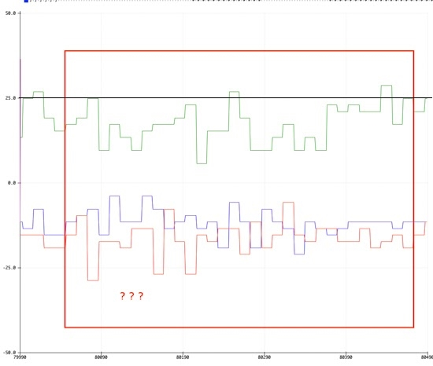](https://circuitpython.org/)

Compared to the previous plot, you can see that the graphs look much cleaner because the high peaks and valleys for each graph have been subdued. This is the 37Hz Low Pass Filter doing its job of only passing along data that is cycling slower than 37Hz.

These sensors also have support for a high pass filter which I’m also working on though I’ll have to come up with a better testing method to verify the output. 

**Dan**

I'm finishing up the [Adafruit BLE Services library](https://github.com/adafruit/Adafruit_CircuitPython_BLE_Adafruit). It provides BLE services that work with the [Bluefruit Playground app](https://learn.adafruit.com/bluefruit-playground-app). I have CircuitPython programs that communicate with the app, in the same way that the [Arduino UF2's we supply](https://learn.adafruit.com/bluefruit-playground-app/firmware) do.

The app is not the only way to use the Adafruit Services library. You'll be able to use the library as a BLE central as well, to get sensor data or control NeoPixels or DotStars.

The library required some changes to the PacketBuffer class core CircuitPython BLE support. I finally finished those changes earlier this week after some false starts.

Next up:
Getting CircuitPython download data automatically again, now that we've switched from GitHub artifacts to Amazon S3 storage for release downloads.
Implementing **\_bleio** using the **bleak** library on host computers.
Trying to communicate with a BLE-capable fever thermometer.

**Jeff**

As seen elsewhere in the newsletter, I helped with the setup of Weblate, to make it easier for the community to contribute translations of CircuitPython.  Please help us out by adding or improving translations.

I started a new project this week to create a version of adafruit_sdcard which is written in C instead of in Python.  We hope that this new version will have higher performance and leave more memory free for your Python code and objects.  Initial results for a single file on a single card show that reading a large file 4096 bytes at a time became about 40% faster.  However, additional testing on multiple SD cards and CircuitPython boards is indicated.

While working on the code, I was inserting and removing the SD card repeatedly.  I think mechanical stress was probably the reason this card broke in two, but software bugs are not entirely ruled out :wink:

[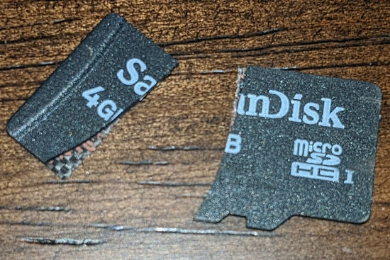](https://circuitpython.org/)

**Kattni**

This week I finished up the CircuitPython library GitHub issue sweep. Between following up with original authors and putting in a few PRs of my own, I managed to close at least 50 issues. As well, I went back through and made sure to label every issue I could, and reply to those I could not. The list available on the [Contributing page on circuitpython.org](https://circuitpython.org/contributing) is sortable by issue label, and now that information is far more useful as each issue is now labeled. If you're interested in contributing to CircuitPython, check it out, it's a great place to start. Good First Issues are available for those who are new or looking for something simple. Otherwise you can look into bug fixes, enhancement requests or documentation updates if you're interested in something a bit more involved. Check it out and feel free to ping us with any questions!

**Lucian**

This week I've been handling mostly bugfixes and reviews, along with some new additions. I added a basic port of the OpenMV, a camera development board hosting the powerful STM32 H743 SoC - a somewhat anemic addition, given that Circuitpython does not support cameras (yet!), but it's also the first third party H7 board supported by the port. Other additions this week included DisplayIO support on the H7 and F7 series, and some initial revisions to the i.MX port to support uni-directional SPI. This week I'll be following up the i.MX work to flesh out the QoL features in Microcontroller, including pin claiming, peripheral reservation, and the like.

On my personal time, I spent a somewhat regrettable amount of effort yesterday getting unicode Japanese support on an e-paper featherwing. My ambition is to eventually have a lightweight smart flashcards system (inspired by Anki) on Circuitpython to study math and languages without a backlight. It's sadly not very impressive yet - the display takes a whopping 40 seconds to update just a handful of glyphs - but asking around it seems there may be some accessible ways to speed it up. Hosting the font on an SD card rather than internal flash will also allow more fleshed out character support. 

[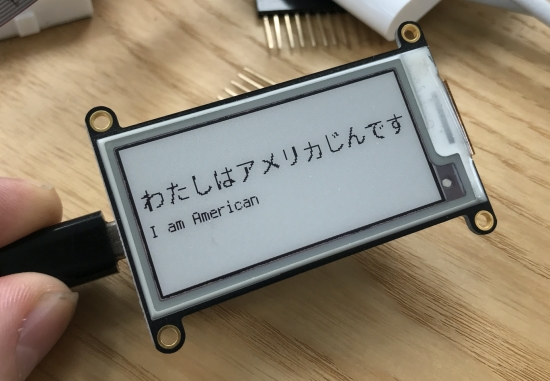](https://circuitpython.org/)

**Melissa**

This past week I focused mostly on adding the I2C protocol to the Adafruit_CircuitPython_BitbangIO library. This was fairly difficult because it seemed any existing examples implementing this were written just slightly differently or largely incomplete. One of the sources that I found most helpful was looking at how CircuitPython had implemented it and using that as a base worked pretty well. I also checked the output when running hardware I2C with my logic analyzer and compared that to the output and I was able to get some good data when I tested with the BME280.

After that, I started working on adding support for the GreatFET one to Blinka. This was inspired by a tweet that I saw by Michael Ossmann where he mentioned that you could run a GreatFET One with Python and the fact that I had received one from Kate Tempkin at the Hackaday SuperCon this past year. I already have it being detected and it seems like it will be pretty straightforward to add.

**Scott**

This week I've been working on CircuitPython for the ESP32-S2. It's all hacked together but I've managed to get the REPL working. On [my stream last week](https://www.youtube.com/watch?v=emvVydYoGxw), I added pin definitions and talked about the linker errors I was hitting. This week, I fixed the linker errors and fixed a few issues at startup with FreeRTOS and TinyUSB. The REPL is now working!!!

The next steps are to get the flash working for the CIRCUITPY drive and then polish it up and merge it. Tune into my live streams, Fridays at 2pm Pacific, for the latest info.

## Call for help -- Translating CircuitPython is now easier than ever!

[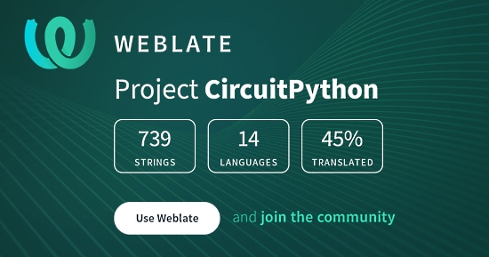](https://hosted.weblate.org/engage/circuitpython/)

One important feature of CircuitPython is translated control and error messages.

With the help of fellow open source project [Weblate](https://weblate.org/), we're making it even easier to add or improve translations.

Sign in with an existing account such as Github, Google or Facebook and start contributing through a simple web interface. No forks or pull requests needed!

As always, if you run into trouble join us on [Discord](https://adafru.it/discord), we're here to help.

## Upcoming events!

PyCon2020 Online has launched! Head over to https://us.pycon.org/2020/online/ to access new content weekly. Pythonistas come together every year to learn, network & discuss great ideas in person at PyCon. That can't happen this year, but everyone can get together virtually!  - [Announcement](https://mailchi.mp/us.pycon.org/pycon-news-501443).

You can [subscribe to the PyCon 2020 Online mailing list](https://us.pycon.org/2020/online/) to receive updates as they are published online. Check out talks, tutorials, Charlas, & Startup Row along with the [Virtual Expo Hall](https://us.pycon.org/2020/sponsors/virtualexpohall/). 

Items of note:

- How to build an intelligent "indoor garden" with microcontrollers, CircuitPython, and IoT - [YouTube](https://www.youtube.com/watch?v=8STo1-rRV1E).
- 9 Years of PyLadies: Lessons Learned and What Comes Next - [YouTube](https://www.youtube.com/watch?v=KRwpY2TixAs).

The USA Science & Engineering Festival is to offer their popular X-STEM conference in a virtual format! X-STEM All Access is an engaging, entertaining, educational, and interactive online STEM experience for kids.  Through a series of daily livestream events, students will hear from an exclusive group of visionaries who aim to empower and inspire kids about careers in science, technology, engineering, and mathematics.

X-STEM All Access presentations will be geared toward a middle and high school level audience (grades 6 to 12), but kids and adults of all ages are welcome to join. Educators are encouraged to include X-STEM All Access into their distance learning curriculum.

There will be daily presentations on May 13, 14, 15, 18, and 19th, 2020 from 1-2 pm US EDT.

There is no cost to attend. Register on their website - [usasciencefestival.org](https://usasciencefestival.org/x-stem-all-access-2020/).

[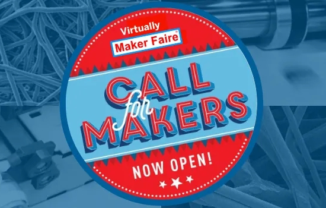](https://makerfaire.com/virtually-maker-faire-call-2020-for-makers/)

May 23, 2020: featuring Makers and projects primarily responding to COVID-19, Virtually Maker Faire provides an opportunity for makers to connect, share their projects and talk about what they do and how they do it. It will take place completely online through video sessions over a 24-hour period and as a curated collection of maker exhibits. The goal is to help makers present their work to a broader public; to gain understanding, support and increasing participation - [Makerfaire](https://makerfaire.com/virtually-maker-faire-call-2020-for-makers/).

[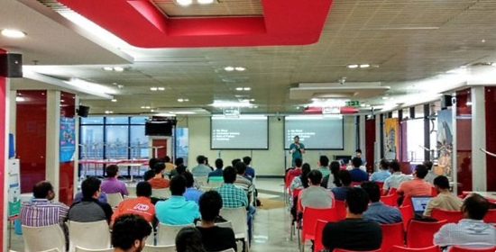](https://www.meetup.com/HydPyGroup/events/270578783/)

The HydPy May Meetup will feature Ayan Pahwa speaking about Programming Microcontrollers using CircuitPython. It is scheduled for May 29, 2020 from 17:00 - 18:00 (GMT+5:30) - [meetup](https://www.meetup.com/HydPyGroup/events/270578783/).

[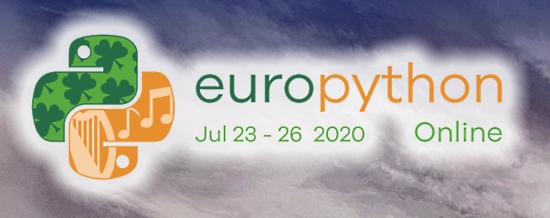](https://ep2020.europython.eu/)

EuroPython 2020 this year will be an online conference from July 23-26. They are planning the following structure:

* 2 conference days with keynotes, talks, lightning talks, poster session (Thursday and Friday)
* 2 sprint days with multiple sprint teams (Saturday and Sunday)

Attending the conference days will require a ticket, participating in the sprint days will be free - [EuroPython](https://blog.europython.eu/post/614102095419850752/europython-2020-online-conference-from-july-23-26).

PyCon AU has announced they are holding PyConline AU, an online event, in August 2020 -  [pycon.org.au](https://2020.pycon.org.au/).

PyCon India 2020: the premier conference in India on using and developing the Python programming language. Held online October 3-5, 2020. A [call for proposals](https://in.pycon.org/cfp/2020/proposals/) is now open through August 14, 2020. - [Website](https://in.pycon.org/2020/) and [Twitter](https://twitter.com/pyconindia)
**Send Your Events In**

As for other events, with the COVID pandemic, most in-person events are postponed or cancelled. If you know of virtual events or events that may occur in the future, please let us know on Discord or on Twitter with hashtag #CircuitPython.

**Send Your Events In**

As for other events, with the COVID pandemic, most in-person events are postponed or cancelled. If you know of virtual events or events that may occur in the future, please let us know on Discord or on Twitter with hashtag #CircuitPython.

## Latest releases

CircuitPython's stable release is [5.3.0](https://github.com/adafruit/circuitpython/releases/latest). New to CircuitPython? Start with our [Welcome to CircuitPython Guide](https://learn.adafruit.com/welcome-to-circuitpython).

[20200508](https://github.com/adafruit/Adafruit_CircuitPython_Bundle/releases/latest) is the latest CircuitPython library bundle.

[v1.12](https://micropython.org/download) is the latest MicroPython release. Documentation for it is [here](http://docs.micropython.org/en/latest/pyboard/).

[3.8.2](https://www.python.org/downloads/) is the latest Python release. The latest pre-release version is [3.9.0a6](https://www.python.org/download/pre-releases/).

[1692 Stars](https://github.com/adafruit/circuitpython/stargazers) Like CircuitPython? [Star it on GitHub!](https://github.com/adafruit/circuitpython)

## jobs.adafruit.com - Find a dream job, find great candidates!

[jobs.adafruit.com](https://jobs.adafruit.com/) has returned and folks are posting their skills (including CircuitPython) and companies are looking for talented makers to join their companies - from Digi-Key, to Hackaday, Microcenter, Raspberry Pi and more.

## 18,737 thanks!

The Adafruit Discord community, where we do all our CircuitPython development in the open, reached over 18,737 humans, thank you! Join today! [https://adafru.it/discord](https://adafru.it/discord)

## ICYMI - In case you missed it

[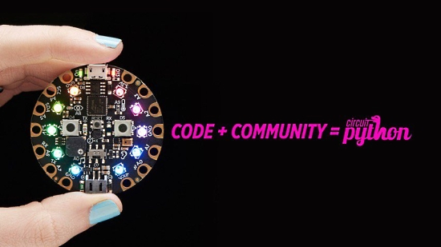](https://www.youtube.com/playlist?list=PLjF7R1fz_OOXRMjM7Sm0J2Xt6H81TdDev)

The wonderful world of Python on hardware! This is our first video-newsletter-podcast that we’ve started! The news comes from the Python community, Discord, Adafruit communities and more. It’s part of the weekly newsletter, then we have a segment on ASK an ENGINEER and this is the video slice from that! The complete Python on Hardware weekly videocast [playlist is here](https://www.youtube.com/playlist?list=PLjF7R1fz_OOXRMjM7Sm0J2Xt6H81TdDev). 

This video podcast is on [iTunes](https://itunes.apple.com/us/podcast/python-on-hardware/id1451685192?mt=2), [YouTube](http://adafru.it/pohepisodes), [IGTV (Instagram TV](https://www.instagram.com/adafruit/channel/)), and [XML](https://itunes.apple.com/us/podcast/python-on-hardware/id1451685192?mt=2).

[Weekly community chat on Adafruit Discord server CircuitPython channel - Audio / Podcast edition](https://itunes.apple.com/us/podcast/circuitpython-weekly-meeting/id1451685016) - Audio from the Discord chat space for CircuitPython, meetings are usually Mondays at 2pm ET, this is the audio version on [iTunes](https://itunes.apple.com/us/podcast/circuitpython-weekly-meeting/id1451685016), Pocket Casts, [Spotify](https://adafru.it/spotify), and [XML feed](https://adafruit-podcasts.s3.amazonaws.com/circuitpython_weekly_meeting/audio-podcast.xml).

And lastly, we are working up a one-spot destination for all things podcast-able here - [podcasts.adafruit.com](https://podcasts.adafruit.com/)

## Codecademy "Learn Hardware Programming with CircuitPython"

Codecademy, an online interactive learning platform used by more than 45 million people, has teamed up with the leading manufacturer in STEAM electronics, Adafruit Industries, to create a coding course, "Learn Hardware Programming with CircuitPython". The course is now available in the [Codecademy catalog](https://www.codecademy.com/learn/learn-circuitpython?utm_source=adafruit&utm_medium=partners&utm_campaign=circuitplayground&utm_content=pythononhardwarenewsletter).

Python is a highly versatile, easy to learn programming language that a wide range of people, from visual effects artists in Hollywood to mission control at NASA, use to quickly solve problems. But you don’t need to be a rocket scientist to accomplish amazing things with it. This new course introduces programmers to Python by way of a microcontroller — CircuitPython — which is a Python-based programming language optimized for use on hardware.

CircuitPython’s hardware-ready design makes it easier than ever to program a variety of single-board computers, and this course gets you from no experience to working prototype faster than ever before. Codecademy’s interactive learning environment, combined with Adafruit's highly rated Circuit Playground Express, present aspiring hardware hackers with a never-before-seen opportunity to learn hardware programming seamlessly online.

Whether for those who are new to programming, or for those who want to expand their skill set to include physical computing, this course will have students getting familiar with Python and creating incredible projects along the way. By the end, students will have built their own bike lights, drum machine, and even a moisture detector that can tell when it's time to water a plant.

Visit Codecademy to access the [Learn Hardware Programming with CircuitPython](https://www.codecademy.com/learn/learn-circuitpython?utm_source=adafruit&utm_medium=partners&utm_campaign=circuitplayground&utm_content=pythononhardwarenewsletter) course and Adafruit to purchase a [Circuit Playground Express](https://www.adafruit.com/product/3333).

Codecademy has helped more than 45 million people around the world upgrade their careers with technology skills. The company’s online interactive learning platform is widely recognized for providing an accessible, flexible, and engaging experience for beginners and experienced programmers alike. Codecademy has raised a total of $43 million from investors including Union Square Ventures, Kleiner Perkins, Index Ventures, Thrive Capital, Naspers, Yuri Milner and Richard Branson, most recently raising its $30 million Series C in July 2016.

## Contribute!

The CircuitPython Weekly Newsletter is a CircuitPython community-run newsletter emailed every Tuesday. The complete [archives are here](https://www.adafruitdaily.com/category/circuitpython/). It highlights the latest CircuitPython related news from around the web including Python and MicroPython developments. To contribute, edit next week's draft [on GitHub](https://github.com/adafruit/circuitpython-weekly-newsletter/tree/gh-pages/_drafts) and [submit a pull request](https://help.github.com/articles/editing-files-in-your-repository/) with the changes. Join our [Discord](https://adafru.it/discord) or [post to the forum](https://forums.adafruit.com/viewforum.php?f=60) for any further questions.
