View this email in your browser.

Happy Tuesday! Here's the latest Python for Microcontrollers newsletter, brought you by the community! We're on [Discord](https://discord.gg/HYqvREz), [Twitter](https://twitter.com/search?q=circuitpython&src=typed_query&f=live), and for past newsletters - [view them all here](https://www.adafruitdaily.com/category/circuitpython/). If you're reading this on the web, [subscribe here](https://www.adafruitdaily.com/). 

## HackSpace Magazine Issue 31 is out now

[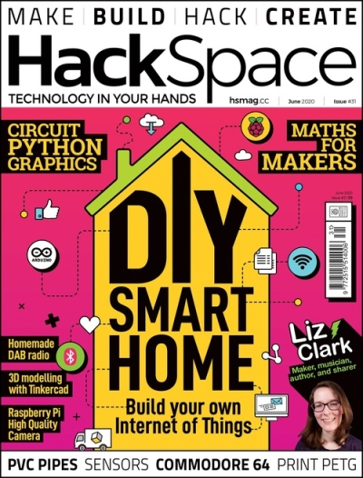](https://hackspace.raspberrypi.org/issues/31)

HackSpace Magazine, published by the Raspberry Pi Foundation, is out, full of DIY, Smart Home, and Internet of Things goodness. Some content relating to Python on microcontrollers:

- Meet The Maker: Liz Clark, an accomplished CircuitPythonista
- Liz' BLE (Bluetooth Low Energy) synthesizer - [Adafruit Guide](https://learn.adafruit.com/ble-synth-with-the-feather-nrf52840-and-circuit-playground-bluefruit)
- Drawing graphs with CircuitPython
- The Pimoroni Enviro+ FeatherWing has an accompanying CircuitPython library

Last Wednesday night: HackSpace editor Ben Everard talked to Ladyada and PT on the Adafruit Show and Tell! - [YouTube](https://youtu.be/QDLIHyGasmo?t=74).

[Read more](https://hackspace.raspberrypi.org/issues/31), [Download PDF](https://hackspace.raspberrypi.org/issues/31/pdf), [buy now](https://store.rpipress.cc/collections/hackspace-magazine/products/hackspace-magazine-31), [subscribe](https://hsmag.cc/adafruit).

## Virtually Maker Faire was held May 23rd

[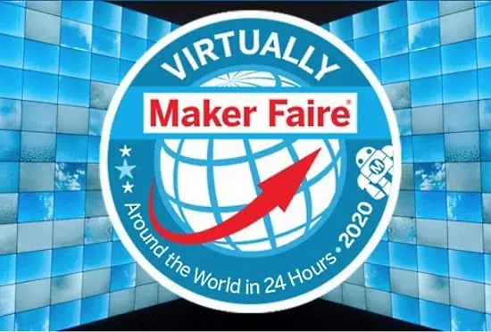](https://makerfaire.com/)

Make.co sponsored Virtually Maker Faire on May 23rd. This online gathering primarily featured Makers responding to COVID-19. 24 hours of presentations, workshops, demos, and exhibits were held across all time zones. Adafruit had a strong presence:

Pivoting in the pandemic – Adafruit NYC - [YouTube](https://youtu.be/a2IP2jWpf9M?t=125) and more on [Open Safely](https://www.adafruit.com/opensafely).

Adafruit Team Member Presentations:

- Hand Wash Timers with MakeCode and CircuitPython by John Park - [YouTube](https://youtu.be/liUxqU6j29U) and [Periscope](https://www.pscp.tv/w/1yNGaQZWjPdGj?t=822)
- Electronics + 3D Printing for Covid-19 with Noe and Pedro Ruiz - [YouTube](https://youtu.be/J1BiKCkCs9A)
- DIY Electronics for Costumes & Art Projects by Erin St. Blaine - [Maker Faire](https://makerfaire.com/maker/entry/71774/)

Information on the event and available videos - [Make](https://makezine.com/2020/05/22/your-guide-to-virtually-maker-faire/), [Make YouTube](https://www.youtube.com/playlist?list=PLwhkA66li5vDXM89Meptx7JiMCN_eYK-A) and [Maker Faire YouTube](https://www.youtube.com/user/MakerFaireVideo/videos).

Virtually Maker Faire - That's a Wrap! With Dale Daugherty and Dr. Sally Applin - [YouTube](https://www.youtube.com/watch?v=kWE0zew_ILE&feature=youtu.be) and [Adafruit's contributions](https://www.youtube.com/watch?v=kWE0zew_ILE&feature=youtu.be&t=281).

## Microsoft Trains OpenAI to Write Python Code

[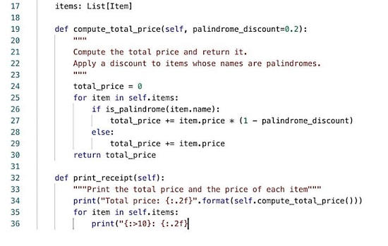](https://www.pscp.tv/Microsoft/1OyKAYWPRrWKb?t=29m19s)

At Microsoft Build last week, a discussion on using the Microsoft supercomputer to train OpenAI on thousands of Open Source GitHub repositories. The data set is used to help programmers generate Python code - [Periscope](https://www.pscp.tv/Microsoft/1OyKAYWPRrWKb?t=29m19s), [YouTube](https://www.youtube.com/watch?v=fZSFNUT6iY8) and [Twitter](https://www.youtube.com/watch?v=fZSFNUT6iY8).

See the entire Microsoft Build video list - [Periscope](https://www.pscp.tv/Microsoft/1OyKAYWPRrWKb).

## Automate testing in multiple Python environments with Nox

Nox is an open source commandline tool that automates testing in multiple Python environments, similar to [tox](https://tox.readthedocs.org/). Unlike tox, Nox uses a standard Python file for configuration. For each session, Nox will automatically create virtualenv with the appropriate interpreter, install the specified dependencies, and run the commands in order - [Website](https://nox.thea.codes/en/stable/), [Tutorial](https://nox.thea.codes/en/stable/tutorial.html) and [GitHub](https://github.com/theacodes/nox).

A new version was released on May 24th - [Changelog](https://nox.thea.codes/en/stable/CHANGELOG.html).

## A CircuitPython Altitude and Heading Reference System (AHRS) Library

[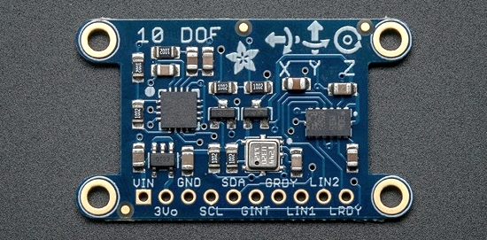](https://github.com/gamblor21/Gamblor21_CircuitPython_AHRS/wiki)

Mark Komus has contributed a CircuitPython library to perform Altitude and Heading Reference System (AHRS) calculations. AHRS takes an accelerometer, gyroscope and magnetometer and combine the data to create orientation data. While previous implementations had been in Arduino ([Adafruit Library](https://github.com/adafruit/Adafruit_AHRS)), this one is written in CircuitPython for fast microcontrollers.

Be sure to get the latest [CircuitPython Library Bundle](https://github.com/adafruit/CircuitPython_Community_Bundle) to get the library - [Documentation](https://github.com/gamblor21/Gamblor21_CircuitPython_AHRS/wiki).

## Translating CircuitPython is now easier than ever and you can help!

[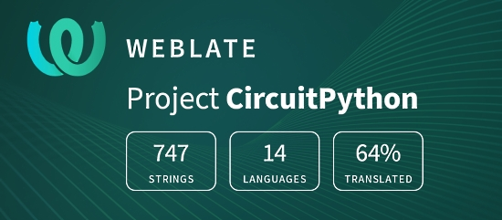](https://hosted.weblate.org/engage/circuitpython/)

One important feature of CircuitPython is translated control and error messages. This week, our community has contributed full translations into German and Dutch and started on Czech.

With the help of fellow open source project [Weblate](https://weblate.org/), we're making it even easier to add or improve translations.

Sign in with an existing account such as Github, Google or Facebook and start contributing through a simple web interface. No forks or pull requests needed! As always, if you run into trouble join us on [Discord](https://adafru.it/discord), we're here to help.

## Adafruit Update

Adafruit Industries continues to run with 100% of employees being paid and continuing to work. Most are working remotely, with some working in the Manhattan, New York factory as an essential service and business under NYC Executive Order 202.6 Capabilities. Adafruit was deemed an essential service to distribute/make some PPE (Personal Protection Equipment) such as face shields, and manufacturer electronics for essential life-saving/preserving equipment and development which is needed in New York and beyond. -[Blog](https://blog.adafruit.com/2020/03/22/covid/)

Ladyada and PT gave a talk at Virtually Maker Faire: Pivoting in the pandemic - Adafruit NYC - [YouTube](https://youtu.be/a2IP2jWpf9M) and Dr. Sally Applin talking about Adafruit in the Endnote - [YouTube](https://www.youtube.com/watch?v=kWE0zew_ILE&feature=youtu.be&t=281).

**Adafruit has started shipping regular (non-emergency) orders after priority orders are filled.**

If you have been waiting to order, feel free to submit your order, noting that the fulfillment time may be longer than pre-COVID – [Shop Adafruit](https://www.adafruit.com/).

Note: there may be a number of out of stock items as manufacturing has been disrupted. Adafruit suggests if an item is out of stock and needed, searching at [resellers](https://www.adafruit.com/distributors) may yield stock. In the US, [Digi-Key](https://www.digikey.com/en/supplier-centers/a/adafruit?WT.z_link_source=Supplier%2520Index) is suggested.

## News from around the web!

[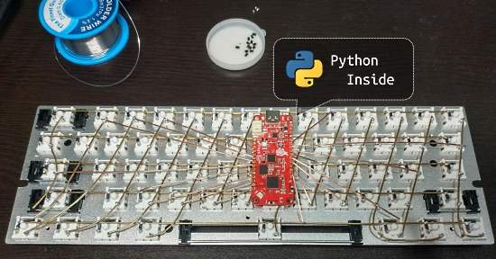](https://github.com/makerdiary/python-keyboard)

A hand-wired USB & Bluetooth keyboard powered by CircuitPython - [GitHub](https://github.com/makerdiary/python-keyboard).

[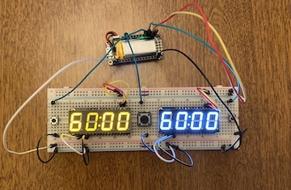](https://github.com/spkuehl/chess-clock)

chess-clock is a CircuitPython library for creating and controlling a chess clock - [GitHub](https://github.com/spkuehl/chess-clock).

Using Bluetooth to talk between a micro:bit and CLUE board in MakeCode and CircuitPython respectively - [Twitter](https://twitter.com/PlusPlusInt/status/1263835321319464960), [CircuitPython Code](https://drive.google.com/file/d/11VC9ARay88x7QFD1vQ5pbqDHNuNcoAaf/view) and [MakeCode](https://makecode.microbit.org/24284-48283-61869-95629).

Trinket Trigger is the simplest of Eurorack modules! Only 8 components, including connectors, but it gives you capsense touch control of a CV and a gate (albeit at 3v3). All controlled by an Adafruit Trinket M0 and CircuitPython - [Twitter](https://twitter.com/todbot/status/1262967885535694848).

[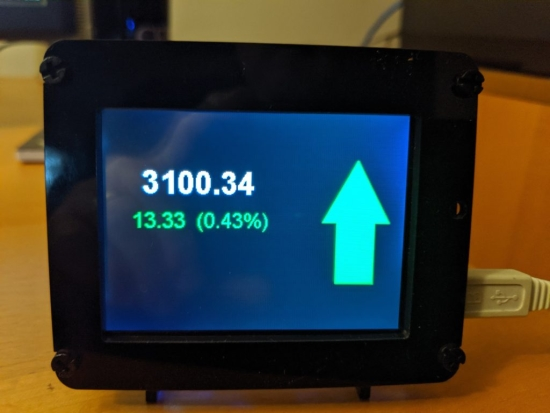](https://www.mcgurrin.info/robots/620/)

An update to the Multi-Function PyPortal Information Display which provides calendar, weather, stock info, shower thoughts, and more - [Blog](https://www.mcgurrin.info/robots/620/), [Twitter](https://twitter.com/hobby_robotics/status/1263520173299990530) and [GitHub](https://github.com/ViennaMike/Multi-Function-PyPortal-Program).

The first Snekboard PCBs have made their way to the creator. In a project update, Keith lays out the last few steps needed before shipping the LEGO®-ready, CircuitPython-capable controllers to backers - [Twitter](https://twitter.com/crowd_supply/status/1263645769099288576) and [Crowd Supply](https://www.crowdsupply.com/keith-packard/snekboard/updates/first-batch).

[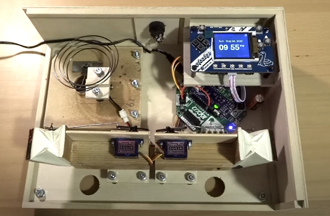](https://www.youtube.com/watch?v=8ur8RdvWqao&feature=youtu.be)

The Musique Concrète cuckoo clock, powered by CircuitPython, is at the test stage. It features an Adafruit PyBadge connected to an Adafruit Cricket for Feather board - [YouTube](https://www.youtube.com/watch?v=8ur8RdvWqao&feature=youtu.be) and [Twitter](https://twitter.com/CedarGroveMakr/status/1264822218074099712).

[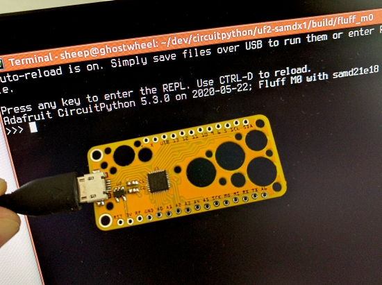](https://twitter.com/deshipu/status/1263818666543546368)

The prototype Fluff M0 boards are up! Fluff M0 is a minimal Feather form-factor board with a SAMD21 chip running CircuitPython - [Twitter](https://twitter.com/deshipu/status/1263818666543546368) and [Hackadayio](https://hackaday.io/project/171381-fluff-m0).

[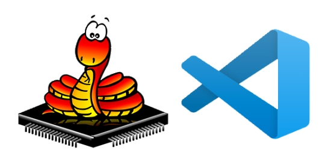](https://phixed.co/blog/micropython-workflow/)

MicroPython Developer Workflow in VS Code - [Phixed](https://phixed.co/blog/micropython-workflow/).

[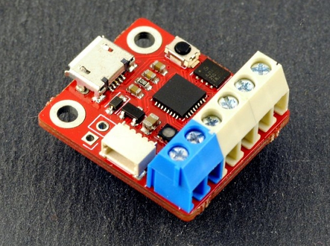](https://www.tindie.com/products/omzlo/fidi-fast-prototyping-with-circuitpython/?utm_source=twitter.com&utm_medium=social&utm_content=tweet&utm_campaign=new_product_tweets)

New on Tindie from Omzlo in Greece comes the FIDI board. It is billed as a small development board running Adafruit's CircuitPython, featuring 6 terminal block connectors and a qwiic connector, designed for fast prototyping. It runs on the ATSAMD21 microcontroller, a 32-bit Arm Cortex M0+ clocked at 48Mhz, as found on many popular Arduino-compatible boards. FIDI is also stated by the developer to be derivative of Arturo182's SERPENTE board (but not affiliated) - [Tindie](https://www.tindie.com/products/omzlo/fidi-fast-prototyping-with-circuitpython/) and [Twitter](https://twitter.com/OmzloElec/status/1262650809248079873).

[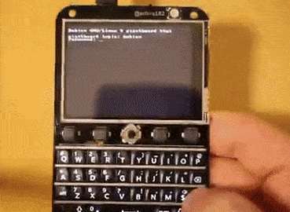](https://twitter.com/timonsku/status/1258136043066478592)

The highly anticipated pairing of the [Giant Board](https://www.crowdsupply.com/groboards/giant-board) (Linux in a Feather form factor which runs Python/CircuitPython) and the Keyboard FeatherWing from [Arturo182](https://www.tindie.com/stores/arturo182/) may be very close to being possible - [Twitter](https://twitter.com/timonsku/status/1258136043066478592).

MARK Educational Robot Kit with MicroPython - [Kickstarter](https://www.kickstarter.com/projects/tinkergen/mark) and [RoboticGizmos](https://www.roboticgizmos.com/mark-educational-robot/).

[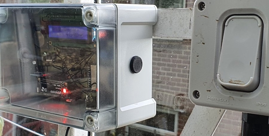](https://www.rs-online.com/designspark/upcycling-old-projects-greenhouse-irrigation-system)

A greenhouse irrigation system with MicroPython and Pycom - [DesignSpark](https://www.rs-online.com/designspark/upcycling-old-projects-greenhouse-irrigation-system).

[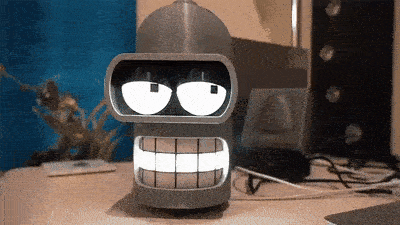](https://www.reddit.com/r/raspberry_pi/comments/g3whxq/i_will_make_my_own_smart_speaker_with_blackjack/)

A 3D-printed, Raspberry Pi Zero W-based Bender assistant with local voice recognition, programmed in Python - [Reddit](https://www.reddit.com/r/raspberry_pi/comments/g3whxq/i_will_make_my_own_smart_speaker_with_blackjack/), [Twitter](https://twitter.com/Hacksterio/status/1265006093551484929), [Hacksterio](https://www.hackster.io/news/futurama-s-bender-makes-a-perfect-personal-voice-assistant-dd234c0b1a1a) and [GitHub](https://github.com/sindar/pRodriguezAssistant).

[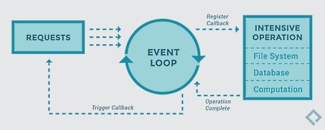](https://www.integralist.co.uk/posts/python-asyncio/)

A Guide to Concurrency in Python with Asyncio - [integralist](https://www.integralist.co.uk/posts/python-asyncio/).

A few scripts for testing the SIM7000E cellular module with Python - [GitHub](https://github.com/tmcadam/sim7000-tools).

[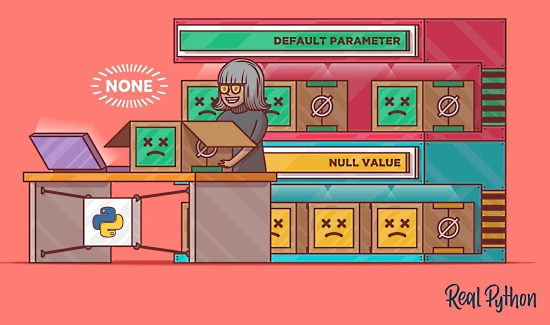](https://realpython.com/null-in-python/)

Null in Python: Understanding Python's NoneType Object - [Real Python](https://realpython.com/null-in-python/).

How to Deprecate a PyPI Package - [Dampfkraft](https://www.dampfkraft.com/code/how-to-deprecate-a-pypi-package.html).

Python Job Hunting in a Pandemic - [Real Python Podcast](https://realpython.com/podcasts/rpp/10/) and [Twitter](https://twitter.com/realpython/status/1264905004311359488).

How to Teach Yourself to Code (online) - [The Startup](https://medium.com/swlh/how-to-teach-yourself-to-code-44d3e902994e).

A guide to Graphical User Interfaces (GUI) for Python - [The Hitchhiker's Guide to Python](https://docs.python-guide.org/scenarios/gui/).

MSS - an ultra fast cross-platform multiple screenshots module in pure Python using ctypes - [GitHub](https://github.com/BoboTiG/python-mss).

PyDev of the Week: Cristi Vlad on [Mouse vs Python](https://www.blog.pythonlibrary.org/2020/05/25/pydev-of-the-week-cristi-vlad/)

#ICYDNCI What was the most popular, most clicked link, in [last week's newsletter](https://www.adafruitdaily.com/2020/05/19/fifty-blinka-boards-python-survey-out-cp-5-4-0-beta-0-and-more-python-adafruit-circuitpython-circuitpython-micropython-thepsf/)? [Fifty Single Board Computers are now Blinka Compatible](https://circuitpython.org/blinka).

## Coming Soon - CircuitPython Pull Requests

[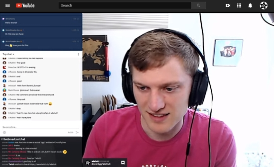](https://github.com/adafruit/circuitpython/pulls)

ESP32-S2 support in CircuitPython for busio, digitalio and pin use tracking is currently undergoing community review prior to merging - [GitHub](https://github.com/adafruit/circuitpython/pull/2931) and Scott Shawcroft stream - [YouTube](https://youtu.be/htY1-RkLtiw).

Framebufferio: Set ground work for smart LEDs as "framebuffers" - [GitHub](https://github.com/adafruit/circuitpython/pull/2914).

Add, demonstrate use of new background task list functionality - [GitHub](https://github.com/adafruit/circuitpython/pull/2879).

tools: Allow specific boards to be built "monolingual" - [GitHub](https://github.com/adafruit/circuitpython/pull/2948).

## New Boards Supported by CircuitPython

The number of supported microcontrollers and Single Board Computers (SBC) grows every week. This section outlines which boards have been included in CircuitPython or added to [CircuitPython.org](https://circuitpython.org/).

This week we had one new board added!

- [AloriumTech Evo M51](https://circuitpython.org/board/aloriumtech_evo_m51/)

Looking for adding a new board to CircuitPython? It's highly encouraged! Adafruit has four guides to help you do so:

- [How to Add a New Board to CircuitPython](https://learn.adafruit.com/how-to-add-a-new-board-to-circuitpython/overview)
- [How to add a New Board to the circuitpython.org website](https://learn.adafruit.com/how-to-add-a-new-board-to-the-circuitpython-org-website)
- [Adding a Single Board Computer to PlatformDetect for Blinka](https://learn.adafruit.com/adding-a-single-board-computer-to-platformdetect-for-blinka)
- [Adding a Single Board Computer to Blinka](https://learn.adafruit.com/adding-a-single-board-computer-to-blinka)

## New Learn Guides!

[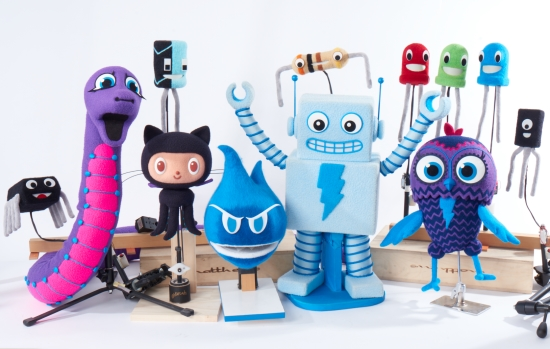](https://learn.adafruit.com/)

[BLE Vibration Bracelet](https://learn.adafruit.com/ble-vibration-bracelet) from [Noe and Pedro](https://learn.adafruit.com/users/pixil3d)

[Yoga Pose Chime](https://learn.adafruit.com/yoga-pose-chime) from [John Park](https://learn.adafruit.com/users/johnpark)

[Textable Sensor with FONA and CircuitPython](https://learn.adafruit.com/textable-sensor-with-fona-and-circuitpython) from [Brent Rubell](https://learn.adafruit.com/users/brubell)

[PyGamer MP3 Player with CircuitPython](https://learn.adafruit.com/pygamer-mp3-player-with-circuitpython) from [Jeff Epler](https://learn.adafruit.com/users/jepler)

[Daily Cheer Automaton](https://learn.adafruit.com/daily-cheer-automaton) from [Dano Wall](https://learn.adafruit.com/users/danowall) and [Andy Doro](https://learn.adafruit.com/users/andydoro)

Guide Update: [Creating and sharing a CircuitPython library](https://learn.adafruit.com/creating-and-sharing-a-circuitpython-library/testing-with-github-actions) by [Dylan Herrada](https://learn.adafruit.com/users/dherrada)

## Updated Guides - Now With More Python!

**You can use CircuitPython libraries on Raspberry Pi!** We're updating all of our CircuitPython guides to show how to wire up sensors to your Raspberry Pi, and load the necessary CircuitPython libraries to get going using them with Python. We'll be including the updates here so you can easily keep track of which sensors are ready to go. Check it out!

Keep an eye out here for more updated guides!

## CircuitPython Libraries!

CircuitPython support for hardware continues to grow. We are adding support for new sensors and breakouts all the time, as well as improving on the drivers we already have. As we add more libraries and update current ones, you can keep up with all the changes right here!

For the latest drivers, download the [Adafruit CircuitPython Library Bundle](https://circuitpython.org/libraries).

If you'd like to contribute, CircuitPython libraries are a great place to start. Have an idea for a new driver? File an issue on [CircuitPython](https://github.com/adafruit/circuitpython/issues)! Interested in helping with current libraries? Check out the [CircuitPython.org Contributing page](https://circuitpython.org/contributing). We've included open pull requests and issues from the libraries, and details about repo-level issues that need to be addressed. We have a guide on [contributing to CircuitPython with Git and Github](https://learn.adafruit.com/contribute-to-circuitpython-with-git-and-github) if you need help getting started. You can also find us in the #circuitpython channel on the [Adafruit Discord](https://adafru.it/discord). Feel free to contact Kattni (@kattni) with any questions.

You can check out this [list of all the CircuitPython libraries and drivers available](https://github.com/adafruit/Adafruit_CircuitPython_Bundle/blob/master/circuitpython_library_list.md). 

The current number of CircuitPython libraries is **230**!

**Updated Libraries!**

Here's this week's updated CircuitPython libraries:

 * [Adafruit_CircuitPython_BluefruitConnect](https://github.com/adafruit/Adafruit_CircuitPython_BluefruitConnect)
 * [Adafruit_CircuitPython_RGB_Display](https://github.com/adafruit/Adafruit_CircuitPython_RGB_Display)
 * [Adafruit_CircuitPython_framebuf](https://github.com/adafruit/Adafruit_CircuitPython_framebuf)
 * [Adafruit_CircuitPython_DS1841](https://github.com/adafruit/Adafruit_CircuitPython_DS1841)
 * [Adafruit_CircuitPython_PyBadger](https://github.com/adafruit/Adafruit_CircuitPython_PyBadger)
 * [Adafruit_CircuitPython_AdafruitIO](https://github.com/adafruit/Adafruit_CircuitPython_AdafruitIO)
 * [Adafruit_CircuitPython_GC_IOT_Core](https://github.com/adafruit/Adafruit_CircuitPython_GC_IOT_Core)
 * [Adafruit_CircuitPython_MiniMQTT](https://github.com/adafruit/Adafruit_CircuitPython_MiniMQTT)
 * [Adafruit_CircuitPython_TestRepo](https://github.com/adafruit/Adafruit_CircuitPython_TestRepo)
 * [Adafruit_CircuitPython_BitbangIO](https://github.com/adafruit/Adafruit_CircuitPython_BitbangIO)
 * [Adafruit_CircuitPython_AzureIoT](https://github.com/adafruit/Adafruit_CircuitPython_AzureIoT)
 * [Adafruit_CircuitPython_MLX90393](https://github.com/adafruit/Adafruit_CircuitPython_MLX90393)
 * [Adafruit_CircuitPython_LED_Animation](https://github.com/adafruit/Adafruit_CircuitPython_LED_Animation)

**PyPI Download Stats!**

We've written a special library called Adafruit Blinka that makes it possible to use CircuitPython Libraries on [Raspberry Pi and other compatible single-board computers](https://learn.adafruit.com/circuitpython-on-raspberrypi-linux/). Adafruit Blinka and all the CircuitPython libraries have been deployed to PyPI for super simple installation on Linux! Here are the top 10 CircuitPython libraries downloaded from PyPI in the last week, including the total downloads for those libraries:

Keep an eye out here for updated download stats coming soon!

## What’s the team up to this week?

What is the team up to this week? Let’s check in!

**Dan**

I've started to work on using the [bleak](https://pypi.org/project/bleak/) Python library for to implement [\_bleio](https://circuitpython.readthedocs.io/en/latest/autoapi/_bleio/index.html) on host computers, analogous to how [Blinka](https://pypi.org/project/Adafruit-Blinka/) emulates native CircuitPython on host computers. Bleak uses Python [asyncio](https://docs.python.org/3/library/asyncio.html), which complicates how it can be called from regular synchronous CircuitPython code. I'm studying up on asyncio and a number of helper libraries.

**Jeff**

It was a long time coming, but the guide was finally published for the PyGamer MP3 Player, affectionately known as JEplayer.  CircuitPython has been able to play MP3s since the release of version 5, but somehow we never released a guide about it.

JEplayer is a bit complex, so it's fortunate that another guide was published this week for MP3s on CircuitPython (and arduino!) that is more tutorial oriented: "Daily Cheer Automaton".  Check that guide out too if you want to add MP3 playback to your CircuitPython projects without the need for a special MP3 decoding chip.

**Kattni**

This week, I've been working with LED animations using the Adafruit CircuitPython LED Animation library. The library is designed to make displaying LED animations super simple, from blinking, to sparkles, to comets and more. Between pixel mapping and animation groups working with pixels in a matrix or other shape, or multiple groups of pixels, like two connected matrices, is a breeze.

Initial testing showed that the way the library was written made it of limited use on the SAMD21 M0 boards, which includes the ubiquitous Circuit Playground Express. So, over the weekend, we worked on a complete refactor of the library to split every animation into its own module making it significantly more modular. The changes were successful - it's at least possible to run all but one of the animations individually on the CPX. Further testing is necessary to determine all of the limitations, but it's much better than it was. We now have a solid API and all additions moving forward will follow it.

Now I am working on an LED animations guide that covers many of the features of the LED Animation library. The guide covers how to use the library overall, the basic, sparkle and rainbow animations, and using the pixel mapping and grouping helpers. It'll include a link to the API documentation in case you want to take it further.

Along the way I am finding a few bugs and things we missed during the refactor, which is always an added bonus of having the opportunity to test something thoroughly. 

**Lucian**

This past week I've been working on the internals of pin management and BusIO on the i.MX chips, whittling away at the issues list on Github. The i.MX had some tricky aspects to this - the SDK for the chip doesn't really have an appropriate "reset pin" function, so keeping resets states consistent with startup required storing in the default states of each pin from the datasheet so they could be restored on reset. I've been working on other miscellaneous improvements to the i.MX Busio module, and reading about the timer peripherals in anticipation of implementing Pulsio.

Over the weekend, I took some time to work on a personal project of mine, support for a type of motor called the [Dynamixel](http://www.robotis.us/dynamixel/). I've been big fan of these motors ever since I used them back in college - they're easy to manage for more complicated robotics projects and have a lot of built in "checks" to keep them from breaking under stress. I've put together a [circuitpython library](https://github.com/hierophect/Circuitpython_Dynamixel) for using the motor (a bit unpolished at the moment) which I'm hoping to submit to the community bundle next week.

To test it out, I tried it on a simple robot I'm calling Hermie (for hermit crab). It's not too sophisticated yet... but we'll see where it goes.

**Melissa**

This week I finished up a couple of small projects including adding an uninstall option for the Script that installs PiTFT drivers on the Raspberry Pi. Some of the guides warn the user that they must not have Kernel Level drivers in order to use displays with the Raspberry Pi, but there wasn't actually a guide that told them how to do it. Now they can easily do it by choosing an uninstall option.

One of the reasons for adding this option was to lay the groundwork for adding displayio to Blinka so that displayio scripts can be run on the Raspberry Pi. It ended up being a bigger project than I initially thought, but I've been working my way through it. Hopefully I'll have something more concrete to show off next week.

**Scott**

At the end of last week I polished up the initial ESP32S2 CircuitPython work - [YouTube](https://www.youtube.com/watch?v=jUkCUbYsgc8) Early this week it was merged in! I quickly followed that up with a PR to finish up `digitalio`. It's ready to merge so it'll be in shortly.

Next, up is `busio` which includes I2C, SPI and UART support. This one module is used to support most of the sensors sold by Adafruit and will unlock many projects.

## Upcoming events!

The HydPy May Meetup will feature Ayan Pahwa speaking about Programming Microcontrollers using CircuitPython. It is scheduled for May 29, 2020 from 17:00 - 18:00 (GMT+5:30) - [meetup](https://www.meetup.com/HydPyGroup/events/270578783/).

EuroPython 2020 this year will be an online conference from July 23-26. They are planning the following structure:

* 2 conference days with keynotes, talks, lightning talks, poster session (Thursday and Friday)
* 2 sprint days with multiple sprint teams (Saturday and Sunday)

Attending the conference days will require a ticket, participating in the sprint days will be free - [EuroPython](https://blog.europython.eu/post/614102095419850752/europython-2020-online-conference-from-july-23-26).

PyCon AU has announced they are holding PyConline AU, an online event, in August 2020 -  [pycon.org.au](https://2020.pycon.org.au/).

PyCon India 2020: the premier conference in India on using and developing the Python programming language. Held online October 3-5, 2020. A [call for proposals](https://in.pycon.org/cfp/2020/proposals/) is now open through August 14, 2020. - [Website](https://in.pycon.org/2020/) and [Twitter](https://twitter.com/pyconindia)

**Send Your Events In**

As for other events, with the COVID pandemic, most in-person events are postponed or cancelled. If you know of virtual events or events that may occur in the future, please let us know on Discord or on Twitter with hashtag #CircuitPython.

## Latest releases

CircuitPython's stable release is [5.3.0](https://github.com/adafruit/circuitpython/releases/latest) and its unstable release is [5.4.0-beta.0](https://github.com/adafruit/circuitpython/releases). New to CircuitPython? Start with our [Welcome to CircuitPython Guide](https://learn.adafruit.com/welcome-to-circuitpython).

[20200523](https://github.com/adafruit/Adafruit_CircuitPython_Bundle/releases/latest) is the latest CircuitPython library bundle.

[v1.12](https://micropython.org/download) is the latest MicroPython release. Documentation for it is [here](http://docs.micropython.org/en/latest/pyboard/).

[3.8.3](https://www.python.org/downloads/) is the latest Python release. The latest pre-release version is [3.9.0b1](https://www.python.org/download/pre-releases/).

[1,726 Stars](https://github.com/adafruit/circuitpython/stargazers) Like CircuitPython? [Star it on GitHub!](https://github.com/adafruit/circuitpython)

## jobs.adafruit.com - Find a dream job, find great candidates!

[jobs.adafruit.com](https://jobs.adafruit.com/) has returned and folks are posting their skills (including CircuitPython) and companies are looking for talented makers to join their companies - from Digi-Key, to Hackaday, Microcenter, Raspberry Pi and more.

## 19,868 thanks!

The Adafruit Discord community, where we do all our CircuitPython development in the open, reached over 19,868 humans, thank you! Join today! [https://adafru.it/discord](https://adafru.it/discord)

## ICYMI - In case you missed it

The wonderful world of Python on hardware! This is our first video-newsletter-podcast that we’ve started! The news comes from the Python community, Discord, Adafruit communities and more. It’s part of the weekly newsletter, then we have a segment on ASK an ENGINEER and this is the video slice from that! The complete Python on Hardware weekly videocast [playlist is here](https://www.youtube.com/playlist?list=PLjF7R1fz_OOXRMjM7Sm0J2Xt6H81TdDev). 

This video podcast is on [iTunes](https://itunes.apple.com/us/podcast/python-on-hardware/id1451685192?mt=2), [YouTube](http://adafru.it/pohepisodes), [IGTV (Instagram TV](https://www.instagram.com/adafruit/channel/)), and [XML](https://itunes.apple.com/us/podcast/python-on-hardware/id1451685192?mt=2).

[Weekly community chat on Adafruit Discord server CircuitPython channel - Audio / Podcast edition](https://itunes.apple.com/us/podcast/circuitpython-weekly-meeting/id1451685016) - Audio from the Discord chat space for CircuitPython, meetings are usually Mondays at 2pm ET, this is the audio version on [iTunes](https://itunes.apple.com/us/podcast/circuitpython-weekly-meeting/id1451685016), Pocket Casts, [Spotify](https://adafru.it/spotify), and [XML feed](https://adafruit-podcasts.s3.amazonaws.com/circuitpython_weekly_meeting/audio-podcast.xml).

And lastly, we are working up a one-spot destination for all things podcast-able here - [podcasts.adafruit.com](https://podcasts.adafruit.com/)

## Codecademy "Learn Hardware Programming with CircuitPython"

Codecademy, an online interactive learning platform used by more than 45 million people, has teamed up with the leading manufacturer in STEAM electronics, Adafruit Industries, to create a coding course, "Learn Hardware Programming with CircuitPython". The course is now available in the [Codecademy catalog](https://www.codecademy.com/learn/learn-circuitpython?utm_source=adafruit&utm_medium=partners&utm_campaign=circuitplayground&utm_content=pythononhardwarenewsletter).

Python is a highly versatile, easy to learn programming language that a wide range of people, from visual effects artists in Hollywood to mission control at NASA, use to quickly solve problems. But you don’t need to be a rocket scientist to accomplish amazing things with it. This new course introduces programmers to Python by way of a microcontroller — CircuitPython — which is a Python-based programming language optimized for use on hardware.

CircuitPython’s hardware-ready design makes it easier than ever to program a variety of single-board computers, and this course gets you from no experience to working prototype faster than ever before. Codecademy’s interactive learning environment, combined with Adafruit's highly rated Circuit Playground Express, present aspiring hardware hackers with a never-before-seen opportunity to learn hardware programming seamlessly online.

Whether for those who are new to programming, or for those who want to expand their skill set to include physical computing, this course will have students getting familiar with Python and creating incredible projects along the way. By the end, students will have built their own bike lights, drum machine, and even a moisture detector that can tell when it's time to water a plant.

Visit Codecademy to access the [Learn Hardware Programming with CircuitPython](https://www.codecademy.com/learn/learn-circuitpython?utm_source=adafruit&utm_medium=partners&utm_campaign=circuitplayground&utm_content=pythononhardwarenewsletter) course and Adafruit to purchase a [Circuit Playground Express](https://www.adafruit.com/product/3333).

Codecademy has helped more than 45 million people around the world upgrade their careers with technology skills. The company’s online interactive learning platform is widely recognized for providing an accessible, flexible, and engaging experience for beginners and experienced programmers alike. Codecademy has raised a total of $43 million from investors including Union Square Ventures, Kleiner Perkins, Index Ventures, Thrive Capital, Naspers, Yuri Milner and Richard Branson, most recently raising its $30 million Series C in July 2016.

## Contribute!

The CircuitPython Weekly Newsletter is a CircuitPython community-run newsletter emailed every Tuesday. The complete [archives are here](https://www.adafruitdaily.com/category/circuitpython/). It highlights the latest CircuitPython related news from around the web including Python and MicroPython developments. To contribute, edit next week's draft [on GitHub](https://github.com/adafruit/circuitpython-weekly-newsletter/tree/gh-pages/_drafts) and [submit a pull request](https://help.github.com/articles/editing-files-in-your-repository/) with the changes. Join our [Discord](https://adafru.it/discord) or [post to the forum](https://forums.adafruit.com/viewforum.php?f=60) for any further questions.
