- [X] Kattni updates
- [ ] change date
- [ ] update title
- [ ] Feature story
- [ ] Update  for images
- [ ] All images 550w max only
- [ ] Link "View this email in your browser."

View this email in your browser.

Greetings! It's the latest Python for Microcontrollers newsletter, brought you by the community! We're on [Discord](https://discord.gg/HYqvREz), [Twitter](https://twitter.com/search?q=circuitpython&src=typed_query&f=live), and for past newsletters - [view them all here](https://www.adafruitdaily.com/category/circuitpython/). If you're reading this on the web, [subscribe here](https://www.adafruitdaily.com/). Here's this weeks' takes:

## 20,000+ Members on the Adafruit Discord Server

The Adafruit Discord community, where we do all our CircuitPython development in the open, last week surpassed 20,000 humans! Today it stands at 20,295, thank you! Adafruit believes Discord offers a unique way for CircuitPython folks to connect. Join today at [https://adafru.it/discord](https://adafru.it/discord) - [Adafruit Blog](https://blog.adafruit.com/2020/05/27/20000-thank-yous-celebrating-20000-members-in-the-adafruit-discord-community-adafruit-discord/).

## Summer of Making - Hack Club

[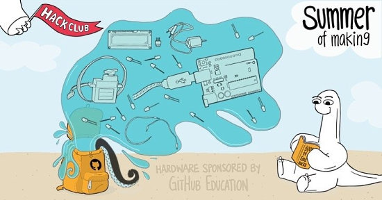](https://blog.adafruit.com/2020/05/28/summer-of-making-hack-club-github-is-sponsoring-50k-worth-of-hardware-grants-for-adafruit-hardware-hackclub-githubeducation-sam_poder/)

[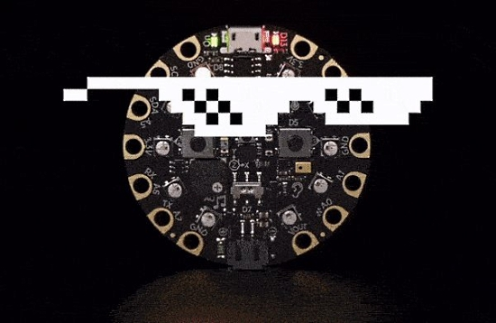](https://blog.adafruit.com/2020/05/28/summer-of-making-hack-club-github-is-sponsoring-50k-worth-of-hardware-grants-for-adafruit-hardware-hackclub-githubeducation-sam_poder/)

Free hardware! GitHub is sponsoring $50k worth of hardware grants for student makers, alongside support from Adafruit & Arduino for gear!! - [Adafruit Blog](https://blog.adafruit.com/2020/05/28/summer-of-making-hack-club-github-is-sponsoring-50k-worth-of-hardware-grants-for-adafruit-hardware-hackclub-githubeducation-sam_poder/) and [Hack Club signups](https://summer.hackclub.com/)

## Learning Resources

**Learning Python from Scratch**

An article with ten recommendations on resources on the internet for learning beginning Python, from someone knowing absolutely no coding to course catalogs - [GitHub](https://tonybaloney.github.io/posts/learning-python.html).

**Practical Python** - [David Beazley](https://dabeaz.com) has make this excellent course available under a Creative Commons license - [GitHub.io Post](https://dabeaz-course.github.io/practical-python/) and [GitHub Materials](https://github.com/dabeaz-course/practical-python)

> Students of this course are usually professional scientists, engineers, and programmers who already have experience in at least one other programming language. No prior knowledge of Python is required, but knowledge of common programming topics is assumed. Most participants find the course challenging–even if they’ve already been doing a bit of Python programming.

**An Overview of CircuitPython in Japanese**

Irieda presents an overview of CircuitPython (in Japanese) - [144Lab](https://tech.144lab.com/entry/2019/10/01/CircuitPython%E3%81%AE%E7%B4%B9%E4%BB%8B).

## Write code in a web browser with GitHub Classroom

Microsoft and GitHub announce that they are making online integrated development environments (IDEs) such that students can get right to work in a web browser, avoiding software conflicts that might happen with code installs on their local machines.

Code on a laptop or with a tablet—students won’t be slowed down by their devices. Students can get started quickly in the same coding environment, so educators may teach instead of troubleshooting.

Currently integration includes MakeCode Arcade which will likely receive Python programmability later this year as it is rolled out across the MakeCode family - [GitHub](https://github.blog/2020-05-26-code-in-the-browser-with-github-classroom/).

## CircuitPython Deep Dive Stream with Scott Shawcroft

This week, Scott streams his work on debugging the busio library for CircuitPython on the ESP32-S2.

You can see the latest video and past videos on the Adafruit YouTube channel under the Deep Dive playlist - [YouTube](https://www.youtube.com/playlist?list=PLjF7R1fz_OOXBHlu9msoXq2jQN4JpCk8A).

## Weekly Python Tea: A chat with the Python Community

[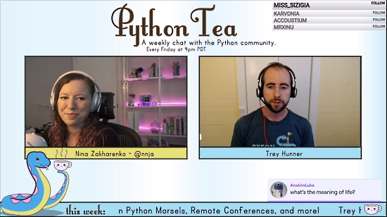](https://www.twitch.tv/videos/635831555)

CircuitPython/Pythonista Nina Zakharenko is starting a new video webcast - Weekly Python Tea: A chat with the Python Community. Fridays at 4 PM US PDT - [Twitch](https://www.twitch.tv/videos/635831555).

## Python 3.9: What’s new and better

[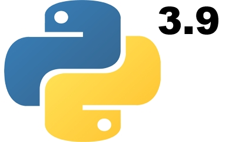](https://www.infoworld.com/article/3543885/python-39-whats-new-and-better.html)

The Python Software Foundation has announced the [first beta of Python 3.9](https://blog.python.org/2020/05/python-390b1-is-now-available-for.html), scheduled for production release in October. With the release of the beta, all of the major changes of Python 3.9 are set. Python has been previously developed and released every eighteen-months. [PEP 602](https://www.python.org/dev/peps/pep-0602/) was acceptetd with the Python development team adopting an annual release cycle.

The new timeline means Python 3.9 will ship in October 2020. Python 3.10 officially started pre-alpha development on May 19, 2020, will enter the alpha development phase when Python 3.9 ships, and will ship in October 2021. Future Python releases will follow the same pattern - [InfoWorld](https://www.infoworld.com/article/3543885/python-39-whats-new-and-better.html) and the [Python Blog](https://blog.python.org/2020/05/python-390b1-is-now-available-for.html).

## The Zen of Python, the PEP and a New Song

[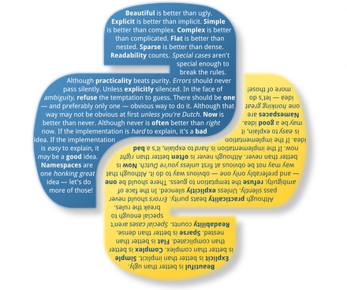](https://wefearchange.org/2020/05/zenofpython.rst.html)

The Zen of Python is a well-known collections of aphorisms, koans that describe the aesthetics of the Python language, as channeled by a famous early and still current Pythonista Tim Peters in 2004 and codified as PEP20 - [Python.org](https://www.python.org/dev/peps/pep-0020/).

> It was a throwaway python-list post. But like all great triumphs of literature, it was written during commercials breaks while watching professional wrestling on TV, and munching on a ham sandwich. All true!

Barry Warsaw recently wrote a song and lyrics based on the Zen of Python under the terms of a Creative Commons CC BY-NA-SA 4.0 license- [We Fear Change](https://wefearchange.org/2020/05/zenofpython.rst.html).

- "The Zen of Python" audio in both [WAV](https://www.dropbox.com/s/atd88p5vg41yg5c/The%20Zen%20of%20Python.wav?dl=0) and [MP3](https://www.dropbox.com/s/uymbarsh9nty6ob/The%20Zen%20of%20Python.mp3?dl=0) formats
- "The Zen of Python" [lyric video](https://youtu.be/i6G6dmVJy74)

## The Raspberry Pi Weekly Newsletter

The Raspberry Pi Foundarion has a weekly newsletter where you can the latest news on the Pi platform. Some items of note this week:

- 8GB Raspberry Pi 4 on sale now
- Latest Raspberry Pi OS update – May 2020
- A virtual tour of Raspberry Pi OS

[Newsletter](https://www.raspberrypi.org/weekly/ta-da-the-8gb-raspberry-pi-4-has-landed/).

And you can find all your favorite Raspberry Pi products and accessories available at Adafruit - [Shop](https://www.adafruit.com/category/105).

## Adafruit Update

**Adafruit is shipping regular (non-emergency) orders after priority orders are filled.**

If you have been waiting to order, read [Adafruit's announcement and FAQ](https://www.adafruit.com/opensafely) and then [Shop Adafruit](https://www.adafruit.com/).

Note: there may be a number of out of stock items as manufacturing gears back up. Adafruit suggests if an item is out of stock and needed, searching at [resellers](https://www.adafruit.com/distributors) may yield results. In the US, [Digi-Key](https://www.digikey.com/en/supplier-centers/a/adafruit?WT.z_link_source=Supplier%2520Index) is suggested.

## News from around the web!

Audiomixer in CircuitPython allows two voices to play simultaneously, with separate controls and levels! Here, on Feather M4 with a Propmaker FeatherWing for audio amp, tap trigger & NeoPixels - [Twitter](https://twitter.com/adafruit/status/1265750159113302025) and [YouTube](https://youtu.be/nYWfjZ9n9OU).

A few weeks ago Scott helped merge in [countio](https://circuitpython.readthedocs.io/en/latest/autoapi/countio/index.html) into Circuitpython. The StudioBot robot uses countio to drive a PID on the robot's motors to keep it driving straight. The encoder also counts to get a better idea of distance (this is close, but not correct yet and needs some work) - [YouTube](https://www.youtube.com/watch?v=X2pxJMzjheo).

Duplicating a USB keyboard to USB and BLE with CircuitPython. The USB keyboard is connected via the OTG port to a Trinket M0 running KBDADVUARTUSBH from [@gdsports1](https://twitter.com/gdsports1). The Trinket sends it via UART TX to the UART RX of a nRF52840 - [Twitter](https://twitter.com/DavidGlaude/status/1264245116664938497).

[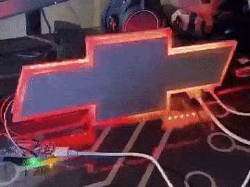](https://twitter.com/Kwalseth/status/1266449162679152640)

A colorful Chevrolet emblem animated with CircuitPython, controlled via a phone. The brains are an Adafruit Feather nRF52840 Bluefruit - [Twitter](https://twitter.com/Kwalseth/status/1266449162679152640).

A work-from-home "on air" light using CircuitPython and an Adafruit Circuit Playground Express - [Blog](https://johnkeefe.net/work-from-home-on-air-light), [Video](https://phaven-prod.s3.amazonaws.com/files/video_part/encoded/2428045/yLcr80WKlNFxiXL5suOCWbDZBA8/blocker.mp4), [GitHub](https://github.com/jkeefe/wfh-on-air-light) and [Twitter](https://twitter.com/jkeefe/status/1245695123503054850).

A line animation in CircuitPython on an Adafruit PyGamer - [Twitter](https://twitter.com/gbushta/status/1267338831797211136).

Programming with the CircuitPython PewPew M4 Kit - [Tindie](https://blog.tindie.com/2020/05/circuitpython-pewpew-m4-kit/) and [Twitter](https://twitter.com/tindie/status/1266040367754940417).

[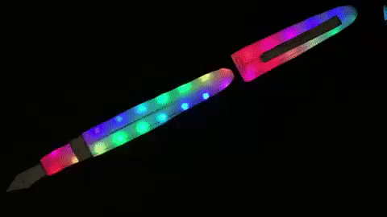](https://twitter.com/caitlinsdad/status/1267544369713774592)

A light up Rainbow Pride fountain pen with CircuitPython and NeoPixels - [Twitter](https://twitter.com/caitlinsdad/status/1267544369713774592).

[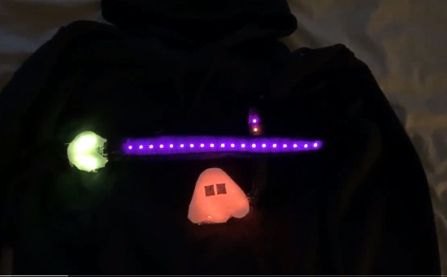](https://twitter.com/caitlinsdad/status/1266529744151085061)

An animated Pacman light up hoodie by @CaitlinsDad - [Twitter](https://twitter.com/caitlinsdad/status/1266529744151085061).

[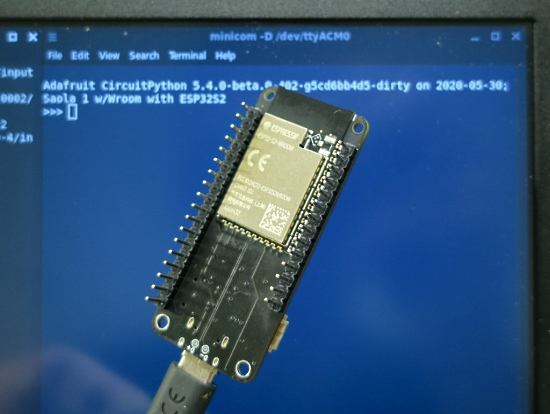](https://twitter.com/arturo182/status/1266522470913380352)

An early version of CircuitPython with the Espressif ESP32-S2 on a mysterious board - [Twitter](https://twitter.com/arturo182/status/1266522470913380352).

[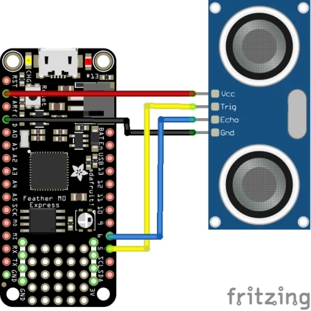](http://www.learnmicropython.com/circuitpython/adafruit-feather-m0-and-us-025-ultrasonic-sensor-circuitpython-example.php)

Adafruit Feather M0 and US-025 ultrasonic sensor CircuitPython example project - [Twitter](https://twitter.com/micromikemck/status/1266072496199004160) and [Tutorial](http://www.learnmicropython.com/circuitpython/adafruit-feather-m0-and-us-025-ultrasonic-sensor-circuitpython-example.php).

[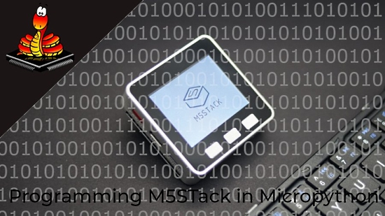](https://www.youtube.com/watch?v=SHylh5iaVXI&feature=youtu.be)

MicroPython tutorial: Computer science basics - M5Stack Binary Calculator - [YouTube](https://www.youtube.com/watch?v=SHylh5iaVXI&feature=youtu.be) and [Twitter](https://twitter.com/M5Stack/status/1266313539041419264).

The Micropython on U-BLOX NINA W102 work continues with MicroPython receiving voice commands from Amazon Alexa Voice! -
[Smartcore](https://micropython-nina-w102.blogspot.com/2020/05/w102-comandado-via-assistente-alexa.html)

[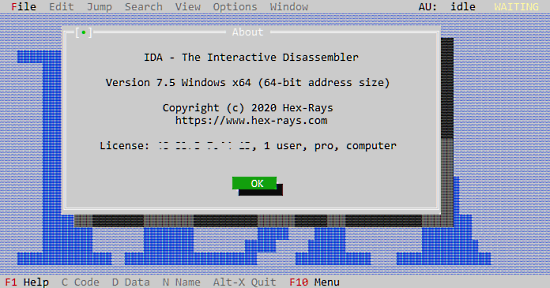](http://irq5.io/2020/05/25/batch-binary-analysis-with-ida-pro-7-4-automation/)

Interactive Disassembler (IDA) Pro Batch Binary Analysis with IDAPython scripts - [IRQ5](http://irq5.io/2020/05/25/batch-binary-analysis-with-ida-pro-7-4-automation/).

[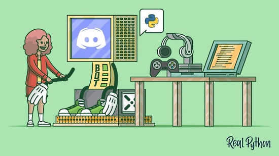](https://realpython.com/how-to-make-a-discord-bot-python/)

How to Make a Discord Bot in Python  - [Real Python](https://realpython.com/how-to-make-a-discord-bot-python/) and [Twitter](https://twitter.com/realpython/status/1266384615557775362).

[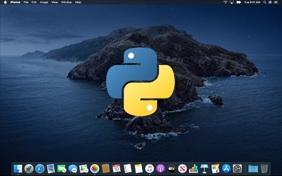](https://www.interglobalmedianetwork.com/blog/2020-05-29-installing-the-latest-version-of-python-on-mac-os-catalina-and-overriding-the-old-default-pre-installed-version/)

Installing the latest version of Python on Mac OS Catalina and overriding the old default pre-installed version - [Interglobalmedianetwork](https://www.interglobalmedianetwork.com/blog/2020-05-29-installing-the-latest-version-of-python-on-mac-os-catalina-and-overriding-the-old-default-pre-installed-version/) and [Twitter](https://twitter.com/letsbsocial1/status/1266474281380306945).

[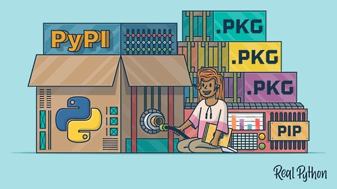](https://realpython.com/lessons/why-cant-python-find-my-modules/)

Why Can’t Python Find My Modules? - [Real Python](https://realpython.com/lessons/why-cant-python-find-my-modules/).

#ICYDNCI What was the most popular, most clicked link, in [last week's newsletter](https://www.adafruitdaily.com/2020/05/26/virtually-maker-faire-hackspace-magazine-and-more-python-adafruit-circuitpython-circuitpython-micropython-thepsf/)? [HackSpace Magazine Issue 31](https://hackspace.raspberrypi.org/issues/31).

## Made with Mu

Why Mu? Mu tries to make it as easy as possible to get started with programming but aims to help you graduate to "real" development tools soon after. Everything in Mu is the "real thing" but presented in as simple and obvious way possible. It's like the toddling stage in learning to walk: you're finding your feet and once you're confident, you should move on and explore! Put simply, Mu aims to foster autonomy. Try out Mu today! - [codewith.mu](https://codewith.mu/)

## Coming soon

## New Boards Supported by CircuitPython

The number of supported microcontrollers and Single Board Computers (SBC) grows every week. This section outlines which boards have been included in CircuitPython or added to [CircuitPython.org](https://circuitpython.org/).

This week we had X new boards added!

- [Board name](url)

Looking for adding a new board to CircuitPython? It's highly encouraged! Adafruit has four guides to help you do so:

- [How to Add a New Board to CircuitPython](https://learn.adafruit.com/how-to-add-a-new-board-to-circuitpython/overview)
- [How to add a New Board to the circuitpython.org website](https://learn.adafruit.com/how-to-add-a-new-board-to-the-circuitpython-org-website)
- [Adding a Single Board Computer to PlatformDetect for Blinka](https://learn.adafruit.com/adding-a-single-board-computer-to-platformdetect-for-blinka)
- [Adding a Single Board Computer to Blinka](https://learn.adafruit.com/adding-a-single-board-computer-to-blinka)

## New Learn Guides!

[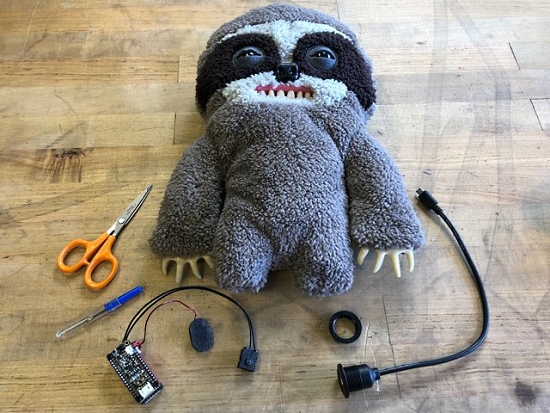](https://learn.adafruit.com/)

[CircuitPython LED Animations](https://learn.adafruit.com/circuitpython-led-animations) from [Kattni](https://learn.adafruit.com/users/kattni)

[MP3 Playback in CircuitPython with Lars the Sloth Puppet](https://learn.adafruit.com/mp3-circuitpython-lars) from [John Park](https://learn.adafruit.com/users/johnpark)

[Wireless BLE MIDI Robot Xylophone](https://learn.adafruit.com/wireless-ble-midi-robot-xylophone) from [Liz Clark](https://learn.adafruit.com/users/BlitzCityDIY)

## CircuitPython Libraries!

CircuitPython support for hardware continues to grow. We are adding support for new sensors and breakouts all the time, as well as improving on the drivers we already have. As we add more libraries and update current ones, you can keep up with all the changes right here!

For the latest drivers, download the [Adafruit CircuitPython Library Bundle](https://circuitpython.org/libraries).

If you'd like to contribute, CircuitPython libraries are a great place to start. Have an idea for a new driver? File an issue on [CircuitPython](https://github.com/adafruit/circuitpython/issues)! Interested in helping with current libraries? Check out the [CircuitPython.org Contributing page](https://circuitpython.org/contributing). We've included open pull requests and issues from the libraries, and details about repo-level issues that need to be addressed. We have a guide on [contributing to CircuitPython with Git and Github](https://learn.adafruit.com/contribute-to-circuitpython-with-git-and-github) if you need help getting started. You can also find us in the #circuitpython channel on the [Adafruit Discord](https://adafru.it/discord). Feel free to contact Kattni (@kattni) with any questions.

You can check out this [list of all the CircuitPython libraries and drivers available](https://github.com/adafruit/Adafruit_CircuitPython_Bundle/blob/master/circuitpython_library_list.md). 

The current number of CircuitPython libraries is **231**!

**New Libraries!**

Here's this week's new CircuitPython libraries:

 * [Adafruit_CircuitPython_PM25](https://github.com/adafruit/Adafruit_CircuitPython_PM25)

**Updated Libraries!**

Here's this week's updated CircuitPython libraries:

 * [Adafruit_CircuitPython_MLX90393](https://github.com/adafruit/Adafruit_CircuitPython_MLX90393)
 * [Adafruit_CircuitPython_AzureIoT](https://github.com/adafruit/Adafruit_CircuitPython_AzureIoT)
 * [Adafruit_CircuitPython_IRRemote](https://github.com/adafruit/Adafruit_CircuitPython_IRRemote)
 * [Adafruit_CircuitPython_ICM20X](https://github.com/adafruit/Adafruit_CircuitPython_ICM20X)
 * [Adafruit_CircuitPython_Display_Text](https://github.com/adafruit/Adafruit_CircuitPython_Display_Text)
 * [Adafruit_CircuitPython_LED_Animation](https://github.com/adafruit/Adafruit_CircuitPython_LED_Animation)

**PyPI Download Stats!**

We've written a special library called Adafruit Blinka that makes it possible to use CircuitPython Libraries on [Raspberry Pi and other compatible single-board computers](https://learn.adafruit.com/circuitpython-on-raspberrypi-linux/). Adafruit Blinka and all the CircuitPython libraries have been deployed to PyPI for super simple installation on Linux! Here are the top 10 CircuitPython libraries downloaded from PyPI in the last week, including the total downloads for those libraries:

KEep an eye out here for more updated download stats coming soon!

## What’s the team up to this week?

What is the team up to this week? Let’s check in!

**Bryan**

This past week has seen me returning to working on the libraries for the ST ICM20948 9-DoF motion sensor. You may recall from previous updates that this chip integrates its magnetometer a bit differently. While it's common to see multiple sensors integrated into the same package, it is not all that common to see one of the included sensors accessed through one of its neighbors in the package.

Like some other chips, the ICM20948 includes an external I2C bus that can be used to integrate with and control additional sensors through the same libraries. This is likely done to allow flexibility with what sensors are used to augment the existing ones. In the case of the ICM20948, the gyro and accelerometer are bundled together in the same register space, however the integrated [AK09916 3-axis magnetometer/compass by AsahiKASEI](https://www.y-ic.es/datasheet/78/SMDSW.020-2OZ.pdf) is connected to the external I2C bus controlled by the ICM20948!

The result of this is that the normal configuration of the magnetometer has to be orchestrated by the I2C master controller in the ICM20948. The biggest struggle I've had while working on these libraries, and indeed any library was surrounding this orchestration. To make a long story short, in certain situations the I2C master controller in the ICM20948 would get into a bad state and not be able to communicate with the magnetometer.

As the song goes, "I get by [with a little help from my friends](https://en.wikipedia.org/wiki/With_a_Little_Help_from_My_Friends)" and indeed our friends at SparkFun had already ran into and solved this issue in their [Arduino](https://github.com/sparkfun/SparkFun_ICM-20948_ArduinoLibrary) and [Python](https://github.com/sparkfun/Qwiic_9DoF_IMU_ICM20948_Py) libraries. The solution was to check for a bad connection by trying to read from the sensor a number of times, then resetting the I2C master if it was unsuccessful. Indeed I had tried this, however the key was that they continued this cycle until the sensor responded or a given number of failed attempts.

**Big thanks to SparkFun engineers Pete Lewis, Nathan Seidle, Owen and others** for saving my bacon!

As a result of the newfound stability of the magnetometer, I was able to add in support for adjusting the data rate of the magnetometer, so I have some pretty graphs for you! First is the magnetometer measuring at 10Hz:

**Dan**

I'm re-implementing the CircuitPython [\_bleio](https://circuitpython.readthedocs.io/en/latest/autoapi/_bleio/index.html) API using [bleak](https://pypi.org/project/bleak/). So far I've implemented scanning for advertisements. The bleak library uses Python's asyncio capabilities but \_bleio is a conventional "sync" interface. So I I spent time learning the details of using asyncio with threads, and used the [janus.queue](https://github.com/aio-libs/janus) library to pass data between the sync and async worlds as it arrives. It works on Linux and Windows, but I'm having issues with MacOS due to threads, and have submitted a bug report.

The next step is to extract as much information from the bleak scanning results as possible. The \_bleio scanning interface passes back more information than is available via bleak, so I have to figure out what is essential and simulate or avoid the rest.

**Jeff**

I've been working on support for SD cards using a potentially-faster interface called SDIO.  This is the way the SD card is connected on the STM32F405 Feather, and is not currently usable from CircuitPython, which only understands SD cards connected via SPI.  My early results show that when reading bulk data directly from the SD card (not using a FAT filesystem), some pretty impressive data rates.  Next up, I'll give the same treatment to the SAMD51 port of CircuitPython. 

[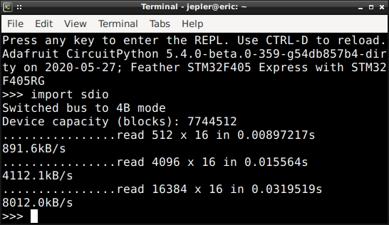](https://circuitpython.org/)

**Kattni**

This week I continued working with LED animations and published the CircuitPython LED Animations guide. There's nothing like writing a guide for a library to find bugs in that library. So, along with the guide came a series of bug fixes and GitHub issues for bugs that weren't as urgent. As for the guide, apparently making 31 animated GIFs takes much longer than I expected, so it took a bit longer than I originally planned. But the guide turned out really well. If you're interested in displaying animations on your NeoPixels or DotStars, check out the [CircuitPython LED Animation library](https://github.com/adafruit/Adafruit_CircuitPython_LED_Animation) and the [associated guide](https://learn.adafruit.com/circuitpython-led-animations).

Next up is porting the Arduino AHTx0 library to CircuitPython for the AHT10 sensor. 

**Lucian**

This past week I've mostly been bug-hunting on the mimxrt10xx, adding in pin reset features and stress testing busio as much as possible. My time has been cut a little by the fact that my home office has been unbearably hot during the summer days, but I'll be returning to the core of Boston soon for a (hopefully) more regular schedule. 

In the coming week I'll be working pulseio for the i.MX port, and possibly revisiting STM32 for some older bugs and other issues I turned up while working on the i.MX's implementations. 

**Melissa**

[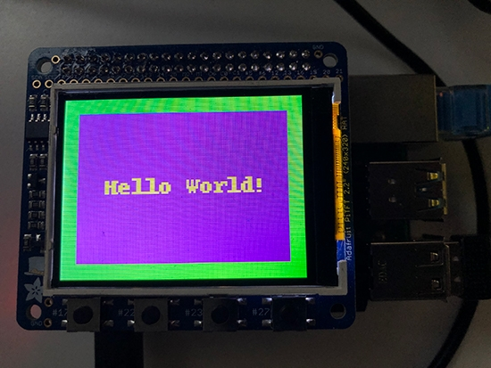](https://circuitpython.org/)

This past week, I was pretty focussed on porting displayio over to Blinka. This was really a lot of fun and I probably spent more time working on it than I normally do on projects, but I also got a lot out of it.

One of the more interesting challenges was having the Raspberry Pi writing to the display without blocking the user's script. The way I got around that was to implement threading for the display and as depending on whether auto_refresh was on or off, it would automatically start or stop the thread.

I also implemented fontio as part of it so that we could have even more compatibility between the CircuitPython and Blinka platforms. The way that it works is that it uses Pillow to render its fallback font and then converts that into a displayio Bitmap for complete compatibility. I was able to get the font transparencies working as well.

One of the more pleasant surprises I had was during testing in that I had written it to be compatible enough, that it ran the example for the Display Shapes library perfectly and I wasn't even expecting it to run.

There's still a lot of items to tackle to make it complete, but you can find the library at [https://github.com/adafruit/Adafruit_Blinka_Displayio](https://github.com/adafruit/Adafruit_Blinka_Displayio) if you would like to experiment with it or work on some of the issues.

**Scott**

The improvements to the ESP32S2 port for pin tracking and digitalio has been merged. I've started on busio and will stream more about that work this week. Thanks to Ivan for helping me get over some hurdles with that.

## Upcoming events!

FlaskCon is a community driven Flask event being held July 4th and 5th. It is intended for speakers and attendees all over the world to participate in technical and evangelical sessions related to Flask. Flask is a micro web framework written in Python - [Event](https://flaskcon.com/) and [Call for Papers](https://sessionize.com/flaskcon).

EuroPython 2020 this year will be an online conference from July 23-26. The schedule is now available - [Website](https://ep2020.europython.eu/schedule/).

Attending the conference days will require a ticket, participating in the sprint days will be free - [EuroPython](https://blog.europython.eu/post/614102095419850752/europython-2020-online-conference-from-july-23-26).

PyCon AU has announced they are holding PyConline AU, an online event, in August 2020 -  [pycon.org.au](https://2020.pycon.org.au/).

PyCon India 2020: the premier conference in India on using and developing the Python programming language. Held online October 3-5, 2020. A [call for proposals](https://in.pycon.org/cfp/2020/proposals/) is now open through August 14, 2020. - [Website](https://in.pycon.org/2020/) and [Twitter](https://twitter.com/pyconindia)

**Send Your Events In**

As for other events, with the COVID pandemic, most in-person events are postponed or cancelled. If you know of virtual events or events that may occur in the future, please let us know on Discord or on Twitter with hashtag #CircuitPython.

## Latest releases

CircuitPython's stable release is [#.#.#](https://github.com/adafruit/circuitpython/releases/latest) and its unstable release is [#.#.#-##.#](https://github.com/adafruit/circuitpython/releases). New to CircuitPython? Start with our [Welcome to CircuitPython Guide](https://learn.adafruit.com/welcome-to-circuitpython).

[2019####](https://github.com/adafruit/Adafruit_CircuitPython_Bundle/releases/latest) is the latest CircuitPython library bundle.

[v#.#.#](https://micropython.org/download) is the latest MicroPython release. Documentation for it is [here](http://docs.micropython.org/en/latest/pyboard/).

[#.#.#](https://www.python.org/downloads/) is the latest Python release. The latest pre-release version is [#.#.#](https://www.python.org/download/pre-releases/).

[1729 Stars](https://github.com/adafruit/circuitpython/stargazers) Like CircuitPython? [Star it on GitHub!](https://github.com/adafruit/circuitpython)

## Call for help -- Translating CircuitPython is now easier than ever!

[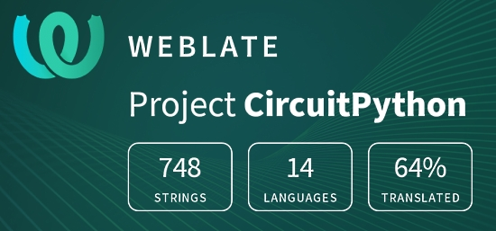](https://hosted.weblate.org/engage/circuitpython/)

One important feature of CircuitPython is translated control and error messages.

With the help of fellow open source project [Weblate](https://weblate.org/), we're making it even easier to add or improve translations.

Sign in with an existing account such as Github, Google or Facebook and start contributing through a simple web interface. No forks or pull requests needed!

As always, if you run into trouble join us on [Discord](https://adafru.it/discord), we're here to help.

## jobs.adafruit.com - Find a dream job, find great candidates!

[jobs.adafruit.com](https://jobs.adafruit.com/) has returned and folks are posting their skills (including CircuitPython) and companies are looking for talented makers to join their companies - from Digi-Key, to Hackaday, Microcenter, Raspberry Pi and more.

## ICYMI - In case you missed it

The wonderful world of Python on hardware! This is our first video-newsletter-podcast that we’ve started! The news comes from the Python community, Discord, Adafruit communities and more. It’s part of the weekly newsletter, then we have a segment on ASK an ENGINEER and this is the video slice from that! The complete Python on Hardware weekly videocast [playlist is here](https://www.youtube.com/playlist?list=PLjF7R1fz_OOXRMjM7Sm0J2Xt6H81TdDev). 

This video podcast is on [iTunes](https://itunes.apple.com/us/podcast/python-on-hardware/id1451685192?mt=2), [YouTube](http://adafru.it/pohepisodes), [IGTV (Instagram TV](https://www.instagram.com/adafruit/channel/)), and [XML](https://itunes.apple.com/us/podcast/python-on-hardware/id1451685192?mt=2).

[Weekly community chat on Adafruit Discord server CircuitPython channel - Audio / Podcast edition](https://itunes.apple.com/us/podcast/circuitpython-weekly-meeting/id1451685016) - Audio from the Discord chat space for CircuitPython, meetings are usually Mondays at 2pm ET, this is the audio version on [iTunes](https://itunes.apple.com/us/podcast/circuitpython-weekly-meeting/id1451685016), Pocket Casts, [Spotify](https://adafru.it/spotify), and [XML feed](https://adafruit-podcasts.s3.amazonaws.com/circuitpython_weekly_meeting/audio-podcast.xml).

And lastly, we are working up a one-spot destination for all things podcast-able here - [podcasts.adafruit.com](https://podcasts.adafruit.com/)

## Codecademy "Learn Hardware Programming with CircuitPython"

Codecademy, an online interactive learning platform used by more than 45 million people, has teamed up with the leading manufacturer in STEAM electronics, Adafruit Industries, to create a coding course, "Learn Hardware Programming with CircuitPython". The course is now available in the [Codecademy catalog](https://www.codecademy.com/learn/learn-circuitpython?utm_source=adafruit&utm_medium=partners&utm_campaign=circuitplayground&utm_content=pythononhardwarenewsletter).

Python is a highly versatile, easy to learn programming language that a wide range of people, from visual effects artists in Hollywood to mission control at NASA, use to quickly solve problems. But you don’t need to be a rocket scientist to accomplish amazing things with it. This new course introduces programmers to Python by way of a microcontroller — CircuitPython — which is a Python-based programming language optimized for use on hardware.

CircuitPython’s hardware-ready design makes it easier than ever to program a variety of single-board computers, and this course gets you from no experience to working prototype faster than ever before. Codecademy’s interactive learning environment, combined with Adafruit's highly rated Circuit Playground Express, present aspiring hardware hackers with a never-before-seen opportunity to learn hardware programming seamlessly online.

Whether for those who are new to programming, or for those who want to expand their skill set to include physical computing, this course will have students getting familiar with Python and creating incredible projects along the way. By the end, students will have built their own bike lights, drum machine, and even a moisture detector that can tell when it's time to water a plant.

Visit Codecademy to access the [Learn Hardware Programming with CircuitPython](https://www.codecademy.com/learn/learn-circuitpython?utm_source=adafruit&utm_medium=partners&utm_campaign=circuitplayground&utm_content=pythononhardwarenewsletter) course and Adafruit to purchase a [Circuit Playground Express](https://www.adafruit.com/product/3333).

Codecademy has helped more than 45 million people around the world upgrade their careers with technology skills. The company’s online interactive learning platform is widely recognized for providing an accessible, flexible, and engaging experience for beginners and experienced programmers alike. Codecademy has raised a total of $43 million from investors including Union Square Ventures, Kleiner Perkins, Index Ventures, Thrive Capital, Naspers, Yuri Milner and Richard Branson, most recently raising its $30 million Series C in July 2016.

## Contribute!

The CircuitPython Weekly Newsletter is a CircuitPython community-run newsletter emailed every Tuesday. The complete [archives are here](https://www.adafruitdaily.com/category/circuitpython/). It highlights the latest CircuitPython related news from around the web including Python and MicroPython developments. To contribute, edit next week's draft [on GitHub](https://github.com/adafruit/circuitpython-weekly-newsletter/tree/gh-pages/_drafts) and [submit a pull request](https://help.github.com/articles/editing-files-in-your-repository/) with the changes. Join our [Discord](https://adafru.it/discord) or [post to the forum](https://forums.adafruit.com/viewforum.php?f=60) for any further questions.
