- [X] Kattni updates
- [ ] change date
- [ ] update title
- [ ] Feature story
- [ ] Update  for images
- [ ] Update ICYDNCI
- [ ] All images 550w max only
- [ ] Link "View this email in your browser."

Template last updated on 06-02-2020 Another check and tweaks

View this email in your browser.

Hi everyone! It's the latest Python for Microcontrollers newsletter, brought you by the community! We're on [Discord](https://discord.gg/HYqvREz), [Twitter](https://twitter.com/search?q=circuitpython&src=typed_query&f=live), and for past newsletters - [view them all here](https://www.adafruitdaily.com/category/circuitpython/). If you're reading this on the web, [subscribe here](https://www.adafruitdaily.com/). Let's go:

## CircuitPython powered protest signs

[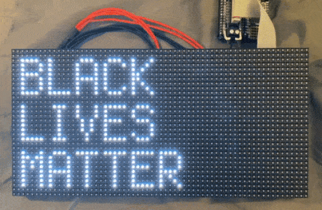](https://blog.adafruit.com/2020/06/08/how-to-make-python-powered-protest-signs-black-lives-matter-say-their-names/)

The Adafruit team made a Black Lives Matter light up protest sign for night time use that works and looks great using a [64×32 RGB LED Matrix](https://www.adafruit.com/product/2278), [Adafruit Feather](http://adafruit.com/feather), and [CircuitPython](https://circuitpython.org/) - [YouTube](https://youtu.be/h8MpAgh0oaE).

[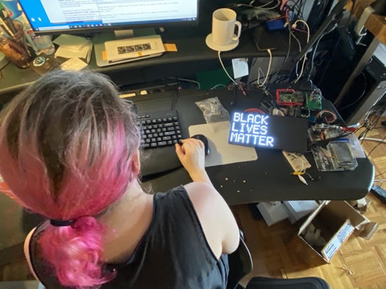](https://blog.adafruit.com/2020/06/08/how-to-make-python-powered-protest-signs-black-lives-matter-say-their-names/)

These panels are normally used to make video walls, here in New York we see them on the sides of busses and bus stops, to display animations or short video clips. You can make them portable and informative.

The matrix can also display the names of Black people killed by the police which the Washington Post compiled in to a database which is a datasource on [GitHub](https://github.com/washingtonpost/data-police-shootings/commit/fa143d9fc6258462a98b79ae7463752e953dad0d) & [saytheirnames.glitch.me](https://saytheirnames.glitch.me/)

Check out the guide [RGB LED Matrices with CircuitPython](https://learn.adafruit.com/rgb-led-matrices-matrix-panels-with-circuitpython) and the code is here: [Adafruit_Learning_System_Guides/Say_Their_Names_LEDMatrix/code.py on GitHub](https://github.com/adafruit/Adafruit_Learning_System_Guides/blob/master/Say_Their_Names_LEDMatrix/code.py). Join Adafruit's anti-racist efforts to end police brutality, reform the criminal justice system, and dismantle the many other forms of systemic racism at work in this country - [adafruit.com/blacklivesmatter](https://www.adafruit.com/blacklivesmatter)

## Real Python interviews CircuitPythonista Kattni Rembor

[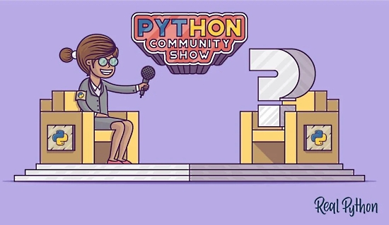](https://realpython.com/preview/interview-kattni-rembor/)

On Real Python this week, Ricky White interviews Kattni Rembor, creative engineer at Adafruit Industries. Kattni’s role is varied, as she covers embedded software, hardware design, technical writing, and community leadership.

They talk about Kattni's work developing CircuitPython and the role mentorship has played in her career to date. She also shares her advice for anyone looking to start their first hardware project using CircuitPython - [Real Python](https://realpython.com/preview/interview-kattni-rembor/).

## CircuitPython Deep Dive Stream with Scott Shawcroft

This week, Scott streams his work on a little ESP32-S2 and voting - [YouTube](https://www.youtube.com/watch?v=y8fyjH_MrSM&feature=youtu.be).

You can see the latest video and past videos on the Adafruit YouTube channel under the Deep Dive playlist - [YouTube](https://www.youtube.com/playlist?list=PLjF7R1fz_OOXBHlu9msoXq2jQN4JpCk8A).

[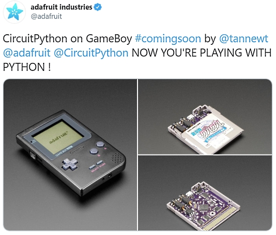](https://twitter.com/adafruit/status/1119323846857904128)

Scott is also author of the CircuitPython on GameBoy cartridge. If you wish to see, the design is on [OSHpark](https://t.co/DLouTVgrwM?amp=1). (It isn't currently reliable enough to sell.)

## Adafruit Update

**Adafruit is shipping orders as soon as possible, given NYC on-site staffing and safety.**

If you have been waiting to order, read [Adafruit's announcement and FAQ](https://www.adafruit.com/opensafely) and then [Shop Adafruit](https://www.adafruit.com/).

Note: there may be a number of out of stock items as manufacturing gears back up. Adafruit suggests if an item is out of stock and needed, searching at [resellers](https://www.adafruit.com/distributors) may yield results. In the US, [Digi-Key](https://www.digikey.com/en/supplier-centers/a/adafruit?WT.z_link_source=Supplier%2520Index) is suggested.

## News from around the web!

[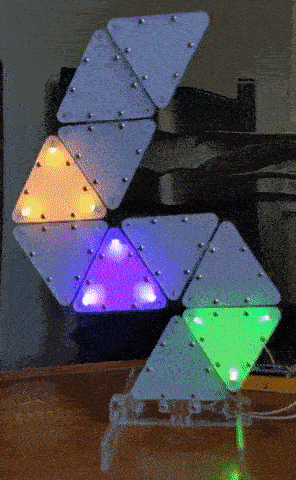](https://twitter.com/GeekMomProjects/status/1269671840512794624)

Geek Mom Projects has made a DIY "Nanoleaf" scuplture. Triangle PCBs use side-emitting LEDs which diffuse into a translucent acrylic layer.  It's free standing and modular. Assembled by screwing smaller PCB connectors to the back of adjoining boards. On the back, a system of spring connectors and pads on connector and triangle PCBs transmits signal/power. A thin buffer layer of clear acrylic keeps spring connectors from getting crushed. It is all powered by an Adafruit ItsyBitsy M4 Express running CircuitPython - [Twitter](https://twitter.com/GeekMomProjects/status/1269671840512794624).

[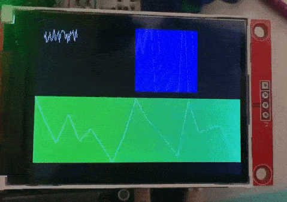](https://twitter.com/CycleMatch/status/1269659865779261440)

The sparkline class - a sparkline is a scrolling line graph, where any values added to sparkline using `add_value` are plotted. Kevin Matocha created a sparkline example for CircuitPython and displayio with inspiration from a [Hackaday article](https://hackaday.com/2020/06/06/sparklines-for-your-esp32-projects/) - [Twitter](https://twitter.com/CycleMatch/status/1269659865779261440) and [GitHub](https://github.com/kmatch98/Adafruit_CircuitPython_Display_Shapes/blob/master/examples/display_shapes_sparkline.py).

A Bluetooth Mandalorian Tracking Fob for Galaxy's Edge Droids using Adafruit Circuit Playground Bluefruit - [YouTube](https://www.youtube.com/watch?v=PLHUKUCu1Pk) and [Writeup](https://www.deadbothans.com/2020/05/27/bluetooth-droid-tracking-fob/).

[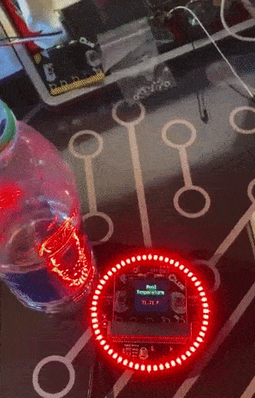](https://twitter.com/anne_engineer/status/1268694205637054469)

A pool temperature monitor using an Adafruit CLUE with a Kitronik Zip Halo HD. The LEDs change from red to blue when the temp drops below 69.5°F and the LCD shows the temperature - [Twitter](https://twitter.com/Kwalseth/status/1268656602954887169).

[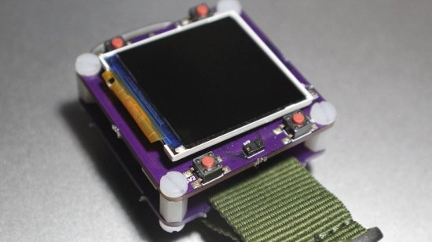](https://twitter.com/Hacksterio/status/1269968983723315200)

The ChronoPy is a hacker-friendly, CircuitPython-powered wristwatch based on the 2020 Open Hardware Summit badge. It will be released soon on [Hackster Launch](https://www.hackster.io/launch) - [Twitter](https://twitter.com/Hacksterio/status/1269968983723315200).

[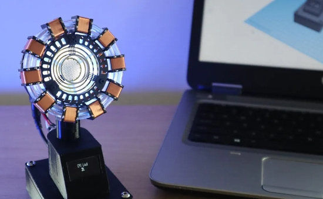](https://www.hackster.io/news/monitoring-cpu-performance-tony-stark-style-9aee9abea518)

A DIY Arc Readctor CPU Performance Monitor with Arduino and Python - [The DIY Life](https://www.the-diy-life.com/diy-arc-reactor-cpu-performance-monitor-powered-by-an-arduino/) and [Hackster.io](https://www.hackster.io/news/monitoring-cpu-performance-tony-stark-style-9aee9abea518).

[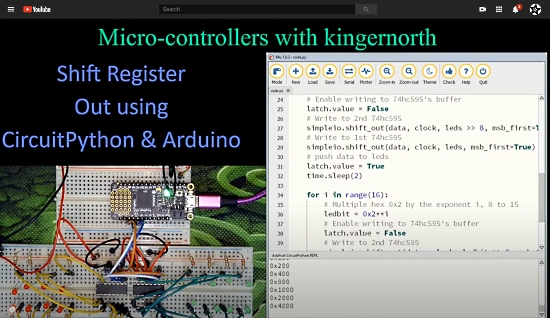](https://www.youtube.com/watch?v=DC0vphrMqAE)

Shift Register Out with CircuitPython and Arduino - [YouTube](https://www.youtube.com/watch?v=DC0vphrMqAE).

An Adafruit Feather M0 and VEML6075 ultraviolet light sensor CircuitPython, an example - [Learn MicroPython](http://www.learnmicropython.com/circuitpython/adafruit-feather-m0-and-veml6075-ultraviolet-light-sensor-circuitpython-example.php).

[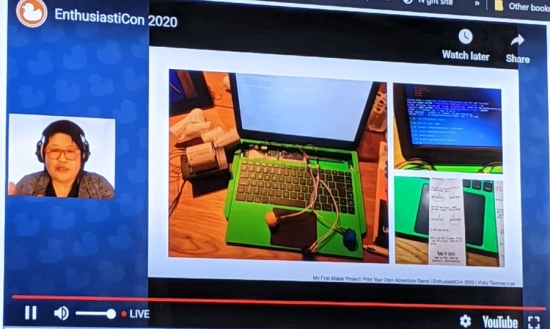](https://twitter.com/Naomi_Freeman/status/1269265367572021249)

An interactive choose your own adventure game using a Raspberry Pi, a thermal printer and some controls with CircuitPython - [Twitter](https://twitter.com/Naomi_Freeman/status/1269265367572021249).

[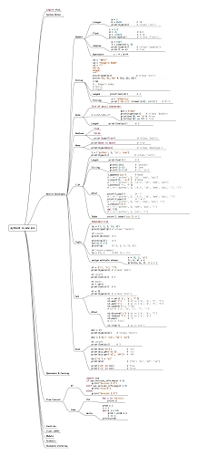](https://fossbytes.com/learn-it-faster-the-entire-python-language-in-a-single-image/)

Learn it Faster: The Entire Python Language in a Single Image - [FossBytes](https://fossbytes.com/learn-it-faster-the-entire-python-language-in-a-single-image/) via [Twitter](https://twitter.com/binitamshah/status/1269883672934715392) and [Image](https://fossbytes.com/wp-content/uploads/2015/09/python-3-in-one-pic.png).

[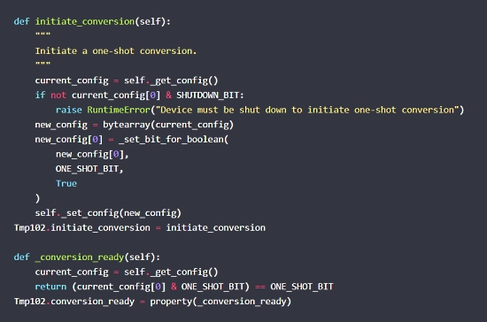](https://blog.hyperlinkyourheart.com/runtime-class-modification.html)

Runtime Class Modification - only using library features needed, saving RAM depending on the application - [Hyperlink Your Heart](https://blog.hyperlinkyourheart.com/runtime-class-modification.html).

MiniPB is a Mini Protobuf library in pure Python and it's small enough to run in MicroPython - [GitHub](https://github.com/dogtopus/minipb).

[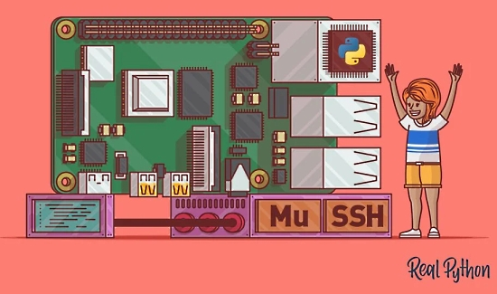](https://twitter.com/realpython/status/1269713275383615489)

Build Physical Projects With Python on the Raspberry Pi - [Real Python](https://realpython.com/python-raspberry-pi/) via [Twitter](https://twitter.com/realpython/status/1269713275383615489).

[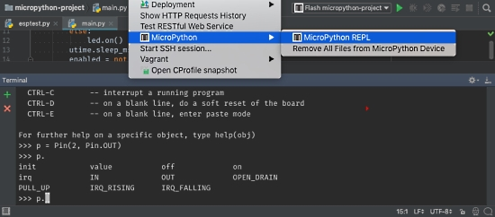](https://twitter.com/vlasovskikh/status/1269662346483564546)

A MicroPython plugin for PyCharm which auto-detects connected MicroPython devices, uses the nearest Sources Root as the device root for flashing files, ignore .git, .idea while flashing - [Twitter](https://twitter.com/vlasovskikh/status/1269662346483564546) and [JetBrains](https://plugins.jetbrains.com/plugin/9777-micropython).

Micropython tutorial: Networking basics on the M5Stack WiFi Scanner - [YouTube](https://www.youtube.com/watch?v=0TSsykPhH5Y).

Quick Python Tip: Suppress Known Exception Without Try Except - [Toward Data Science](https://towardsdatascience.com/quick-python-tip-suppress-known-exception-without-try-except-a93ec34d3704) via [Twitter](https://twitter.com/PythonHub/status/1267565388092620803).

When Python Practices Go Wrong - [RhodesMill](https://rhodesmill.org/brandon/slides/2019-11-codedive/) via [Twitter](https://twitter.com/realpython/status/1267864309314568197).

Glances - a cross platform, Python powered system monitoring tool that packs lots of data into a small package - [bigl.es](https://bigl.es/tuesday-tooling-glances/).

[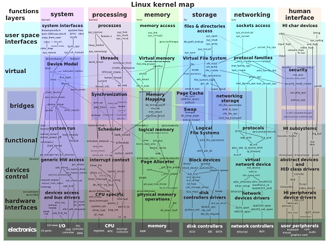](https://makelinux.github.io/kernel/map/)

An interactive map of Linux kernel - [GitHub.io](https://makelinux.github.io/kernel/map/) via [Twitter](https://twitter.com/binitamshah/status/1269883131173240834).

PyDev of the Week: Dong-hee Na on [Mouse vs Python](https://www.blog.pythonlibrary.org/2020/06/08/pydev-of-the-week-dong-hee-na/)

CircuitPython Weekly Meeting for June 8th, 2020 [on YouTube](https://youtu.be/k_vklLFGBog) and [on diode.zone](https://diode.zone/videos/watch/01ebebf0-4738-4031-b0b5-fc2cf7f2c469)

#ICYDNCI What was the most popular, most clicked link, in [last week's newsletter](https://www.adafruitdaily.com/2020/06/02/discord-20k-summer-of-making-python-3-9-and-more-python-adafruit-circuitpython-circuitpython-micropython-thepsf/)? [Summer of Making – Hack Club – GitHub is sponsoring $50k worth of hardware grants for Adafruit hardware!](https://blog.adafruit.com/2020/05/28/summer-of-making-hack-club-github-is-sponsoring-50k-worth-of-hardware-grants-for-adafruit-hardware-hackclub-githubeducation-sam_poder/)

## Made with Mu

Why Mu? Mu tries to make it as easy as possible to get started with programming but aims to help you graduate to "real" development tools soon after. Everything in Mu is the "real thing" but presented in as simple and obvious way possible. It's like the toddling stage in learning to walk: you're finding your feet and once you're confident, you should move on and explore! Put simply, Mu aims to foster autonomy. Try out Mu today! - [codewith.mu](https://codewith.mu/)

## New Boards Supported by CircuitPython

The number of supported microcontrollers and Single Board Computers (SBC) grows every week. This section outlines which boards have been included in CircuitPython or added to [CircuitPython.org](https://circuitpython.org/).

This week we had 2 new boards added!

- [Odroid XU4](https://circuitpython.org/blinka/odroid_xu4/)
- [Odroid XU4Q](https://circuitpython.org/blinka/odroid_xu4q/)

Looking for adding a new board to CircuitPython? It's highly encouraged! Adafruit has four guides to help you do so:

- [How to Add a New Board to CircuitPython](https://learn.adafruit.com/how-to-add-a-new-board-to-circuitpython/overview)
- [How to add a New Board to the circuitpython.org website](https://learn.adafruit.com/how-to-add-a-new-board-to-the-circuitpython-org-website)
- [Adding a Single Board Computer to PlatformDetect for Blinka](https://learn.adafruit.com/adding-a-single-board-computer-to-platformdetect-for-blinka)
- [Adding a Single Board Computer to Blinka](https://learn.adafruit.com/adding-a-single-board-computer-to-blinka)

## New Learn Guides!

[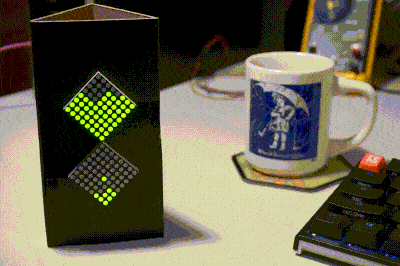](https://learn.adafruit.com/t-time-triangle-thing)

[T³ Time Triangle Thing](https://learn.adafruit.com/t-time-triangle-thing) from [Carter Nelson](https://learn.adafruit.com/users/caternuson)

[Adafruit AHT20 Temperature & Humidity Sensor](https://learn.adafruit.com/adafruit-aht20) from [Kattni](https://learn.adafruit.com/users/kattni)

## CircuitPython Libraries!

CircuitPython support for hardware continues to grow. We are adding support for new sensors and breakouts all the time, as well as improving on the drivers we already have. As we add more libraries and update current ones, you can keep up with all the changes right here!

For the latest libraries, download the [Adafruit CircuitPython Library Bundle](https://circuitpython.org/libraries). For the latest community contributed libraries, download the [CircuitPython Community Bundle](https://github.com/adafruit/CircuitPython_Community_Bundle/releases).

If you'd like to contribute, CircuitPython libraries are a great place to start. Have an idea for a new driver? File an issue on [CircuitPython](https://github.com/adafruit/circuitpython/issues)! Have you written a library you'd like to make available? Submit it to the [CircuitPython Community Bundle](https://github.com/adafruit/CircuitPython_Community_Bundle). Interested in helping with current libraries? Check out the [CircuitPython.org Contributing page](https://circuitpython.org/contributing). We've included open pull requests and issues from the libraries, and details about repo-level issues that need to be addressed. We have a guide on [contributing to CircuitPython with Git and Github](https://learn.adafruit.com/contribute-to-circuitpython-with-git-and-github) if you need help getting started. You can also find us in the #circuitpython channel on the [Adafruit Discord](https://adafru.it/discord).

You can check out this [list of all the Adafruit CircuitPython libraries and drivers available](https://github.com/adafruit/Adafruit_CircuitPython_Bundle/blob/master/circuitpython_library_list.md). 

The current number of CircuitPython libraries is **257**!

**New Libraries!**

Here's this week's new CircuitPython libraries:

 * [Adafruit_CircuitPython_AHTx0](https://github.com/adafruit/Adafruit_CircuitPython_AHTx0)

**Updated Libraries!**

Here's this week's updated CircuitPython libraries:

 * [Adafruit_CircuitPython_LED_Animation](https://github.com/adafruit/Adafruit_CircuitPython_LED_Animation)
 * [Adafruit_CircuitPython_FONA](https://github.com/adafruit/Adafruit_CircuitPython_FONA)
 * [Adafruit_CircuitPython_SSD1305](https://github.com/adafruit/Adafruit_CircuitPython_SSD1305)
 * [Adafruit_CircuitPython_MiniMQTT](https://github.com/adafruit/Adafruit_CircuitPython_MiniMQTT)
 * [Adafruit_CircuitPython_LSM6DS](https://github.com/adafruit/Adafruit_CircuitPython_LSM6DS)

**PyPI Download Stats!**

We've written a special library called Adafruit Blinka that makes it possible to use CircuitPython Libraries on [Raspberry Pi and other compatible single-board computers](https://learn.adafruit.com/circuitpython-on-raspberrypi-linux/). Adafruit Blinka and all the CircuitPython libraries have been deployed to PyPI for super simple installation on Linux! Here are the top 10 CircuitPython libraries downloaded from PyPI in the last week, including the total downloads for those libraries:

Keep checking back for more updated download stats coming soon!

## What’s the team up to this week?

What is the team up to this week? Let’s check in!

**Bryan**

With the work on the ICM20948 library completed, I moved on to finishing up the previously started tester code. Testers are the final arbiter of if a board is fit to be sold, so the tester code is where we make sure that we've tested all of the hardware on the breakout board. We can fix libraries later if we've missed something or haven't enabled a feature, however once the hardware ships to customers, that's how it's going to be for as long as they own it. Testers and the code that powers them are responsible for catching any glitches in manufacturing that while rare do occur, so making sure the tester code is right is in some ways more important than the library itself.

[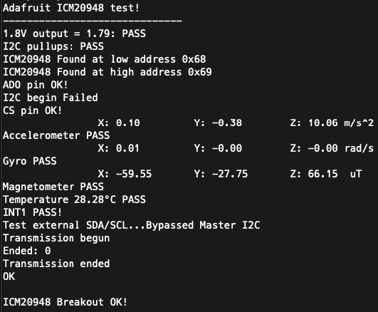](https://circuitpython.org/)

After finishing work on the ICM20948, I shifted to adding support for the LSP22 pressure sensor to the LPS2X library. The LPS22 is very similar to the LPS25 but not identical, so the libraries are able to share some but not all of the code. Ladyada had previously refactored the Adafruit_LPS2X Arduino library to add the LPS22HB, so my task was to do the same for the Adafruit_CircuitPython_LPS2X library. [This refactor](https://github.com/adafruit/Adafruit_CircuitPython_LPS2X/commit/824b0440ee89e662fd2581e888d0d4fd6cfbb586) is a good example of a fundamental technique of object oriented programming, [subclasses and superclasses](https://en.wikipedia.org/wiki/Inheritance\_(object-oriented_programming)#Subclasses\_and\_superclasses). The base class LPS2X takes up the bulk of the library and includes all of the code that is common to both sensors. The LPS22 and LPS25 subclasses then inherit from LPS2X and then make small but meaningful changes to allow it to fit their particular requirements.

The end result is that rather than repeating the process of writing code that fulfills the common needs of both sensors, I am able to write it once and share it between both sensors. This idea is often called [Don't repeat yourself](https://en.wikipedia.org/wiki/Don%27t\_repeat\_yourself) or DRY and in addition to reducing the amount of redundant code, it also centralizes the common code which makes it easier to fix or add features that are common across different uses.

**Dan**

I'm continuing the re-implementation of CircuitPython \_bleio on host computers using the [bleak](https://github.com/hbldh/bleak) Python library. I'm using the Heart [Rate Monitor library](https://github.com/adafruit/Adafruit_CircuitPython_BLE_Heart_Rate) as a test, and had to implement most of \_bleio to get even that simple library to work. I had to make some changes to the base [adafruit_ble library](https://github.com/adafruit/Adafruit_CircuitPython_BLE) to accommodate Python on the host machines, and I'm testing now.

**Jeff**

On the STM32F405 Feather, I have finished SDIO read and write code.  The performance is better than SPI, especially when you are moving more data around.  However, even just writing a log file in text, you can log over 1000 lines per second!  This is on a "fresh", class-4 4GB SD card, I'm not sure how performance changes as the card fills up.

This code is in an open pull request on GitHub, so if you are comfortable building CircuitPython from source you can give it a try today.

[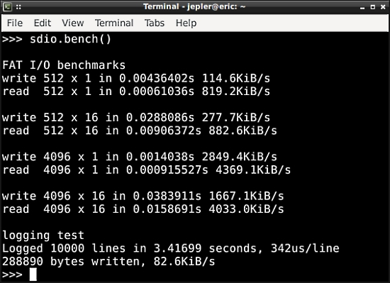](https://circuitpython.org/)

Next we want to bring SDIO code to the SAMD51.  However, all the existing adafruit boards use SPI.  Hopefully this "breakout", made from a micro SD adapter, will let me get the prototype code working:

[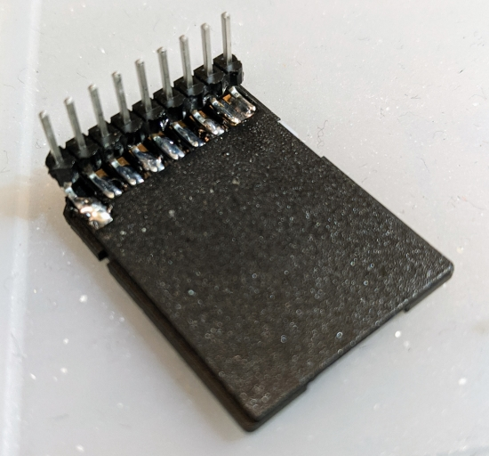](https://circuitpython.org/)

While taking a break from SD cards, I returned to a problem that had been reported but never addressed: When using AudioMixer, if voice[0] was not playing anything, the sounds from other voices was distorted.  I also discovered a reason for pops when starting/stopping playback on voice[0], with the same root cause.  These bugfixes are now in the latest master branch, and should be a part of 5.4.0 when it is released.

**Kattni**

This week I started the AHTx0 CircuitPython driver, but due to timing, finalising that was handed back to Ladyada. Instead, I completed the AHT20 product guide. The AHT20 is a low-cost temperature and humidity sensor on a breakout that includes STEMMA QT connectors so you can get started quickly without soldering. The guide covers pinouts, Arduino usage, CircuitPython usage and downloads related to board including schematic, Fritzing object, EagleCAD files, and data sheet. The board will be in the Adafruit shop soon, so if you're looking for a lower cost alternative for sending temperature and humidity, keep an eye out for that.

**Lucian**

This week had a couple of major bugs come up across the STM32 and i.MX, so I've been hopping between the two projects as issues emerge. My big project of the last few days has been revisiting the clock management of the STM32s, to both fix some low-power related Real Time Clock (RTC) setup issues that were causing crashes across several dev boards, but also to make it a bit more comprehensive and maintainable. It's been useful to learn about some of the features I've been taking for granted, and should allow new STM32 boards to enable more low power customization. 

I've also wrapped up my i.MX testing on the 1010, just in time to get some new reset issues on the 1060 series. I've been doing my best to get quick hotfixes in, and then following up with more comprehensive reworks later, so boards don't stay out of commission too long. I'm hoping my i.MX feather will arrive to complement my Teensy 4.0 soon, so I can have a wider range of easily debugged chips to test with. 

**Melissa**

[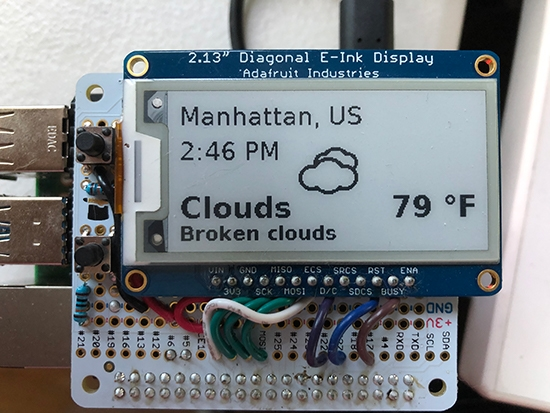](https://circuitpython.org/)

This past week I was working on catching up with some of my smaller projects. One of the projects that I really enjoyed working on was writing up a couple of demos for an eInk bonnet. Since I didn't actually have the eInk bonnet, I assembled one using the Adafruit Perma-Proto HAT for the Raspberry Pi along with an eInk breakout and a few passive components that I had on hand.

One of the demos I worked on went out and fetched weather data and displayed it on the eInk. This was a little challenging in that using too small of fonts would result in reduced readability, so I needed to experiment with font size, boldness, and the overall layout and it came together nicely. The code is based on the PyPortal weather code, but uses the meteocons font, which was inspired by Dan Cogliano, to display the weather image. So there's actually no graphics involved in the traditional sense.

[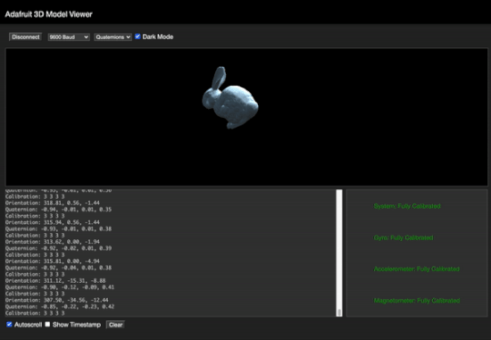](https://circuitpython.org/)

Another project that I worked on was updating the WebSerial 3D viewer that I had built a few months back in order to display calibration information for the BNO055. The cool part of this is that the calibration window will automatically appear only when calibration information is sent, so using the page with a board such as the CLUE will still look like it did before. I wrote up a guide page for that as well, which can be found inside the [Adafruit BNO055 guide](https://learn.adafruit.com/adafruit-bno055-absolute-orientation-sensor/webserial-visualizer).

**Scott**

This past week I finished up busio.I2C on the ESP32-S2. Thanks to MarkOlsson for pointing out a problem with ACK/NAK that got a sensor working. Once that was done, I added pin validation and pull up checking. Next up is UART and SPI. I'll also be doing a new beta release shortly.

## Upcoming events!

FlaskCon is a community driven Flask event being held July 4th and 5th. It is intended for speakers and attendees all over the world to participate in technical and evangelical sessions related to Flask. Flask is a micro web framework written in Python - [Event](https://flaskcon.com/) and [Call for Papers](https://sessionize.com/flaskcon).

EuroPython 2020 this year will be an online conference from July 23-26. The schedule is now available - [Website](https://ep2020.europython.eu/schedule/).

Attending the conference days will require a ticket, participating in the sprint days will be free - [EuroPython](https://blog.europython.eu/post/614102095419850752/europython-2020-online-conference-from-july-23-26).

PyCon AU has announced they are holding PyConline AU, an online event, in August 2020 -  [pycon.org.au](https://2020.pycon.org.au/).

PyCon India 2020: the premier conference in India on using and developing the Python programming language. Held online October 3-5, 2020. A [call for proposals](https://in.pycon.org/cfp/2020/proposals/) is now open through August 14, 2020. - [Website](https://in.pycon.org/2020/) and [Twitter](https://twitter.com/pyconindia)

**Send Your Events In**

As for other events, with the COVID pandemic, most in-person events are postponed or cancelled. If you know of virtual events or events that may occur in the future, please let us know on Discord or on Twitter with hashtag #CircuitPython.

## Latest releases

CircuitPython's stable release is [5.3.0](https://github.com/adafruit/circuitpython/releases/latest) and its unstable release is [5.4.0-beta.0](https://github.com/adafruit/circuitpython/releases). New to CircuitPython? Start with our [Welcome to CircuitPython Guide](https://learn.adafruit.com/welcome-to-circuitpython).

[20200605](https://github.com/adafruit/Adafruit_CircuitPython_Bundle/releases/latest) is the latest CircuitPython library bundle.

[v1.12](https://micropython.org/download) is the latest MicroPython release. Documentation for it is [here](http://docs.micropython.org/en/latest/pyboard/).

[3.8.3](https://www.python.org/downloads/) is the latest Python release. The latest pre-release version is [3.9.0b1](https://www.python.org/download/pre-releases/).

[1,739 Stars](https://github.com/adafruit/circuitpython/stargazers) Like CircuitPython? [Star it on GitHub!](https://github.com/adafruit/circuitpython)

## Call for help -- Translating CircuitPython is now easier than ever!

[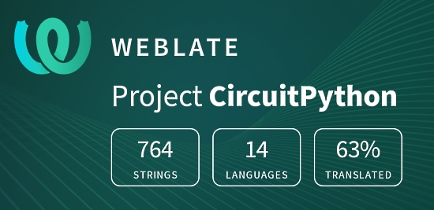](https://hosted.weblate.org/engage/circuitpython/)

One important feature of CircuitPython is translated control and error messages.

With the help of fellow open source project [Weblate](https://weblate.org/), we're making it even easier to add or improve translations.

Sign in with an existing account such as Github, Google or Facebook and start contributing through a simple web interface. No forks or pull requests needed!

As always, if you run into trouble join us on [Discord](https://adafru.it/discord), we're here to help.

## jobs.adafruit.com - Find a dream job, find great candidates!

[jobs.adafruit.com](https://jobs.adafruit.com/) has returned and folks are posting their skills (including CircuitPython) and companies are looking for talented makers to join their companies - from Digi-Key, to Hackaday, Microcenter, Raspberry Pi and more.

## 20,689 thanks!

The Adafruit Discord community, where we do all our CircuitPython development in the open, reached over 20,689 humans, thank you!  Adafruit believes Discord offers a unique way for CircuitPython folks to connect. Join today at [https://adafru.it/discord](https://adafru.it/discord).

## ICYMI - In case you missed it

The wonderful world of Python on hardware! This is our first video-newsletter-podcast that we’ve started! The news comes from the Python community, Discord, Adafruit communities and more. It’s part of the weekly newsletter, then we have a segment on ASK an ENGINEER and this is the video slice from that! The complete Python on Hardware weekly videocast [playlist is here](https://www.youtube.com/playlist?list=PLjF7R1fz_OOXRMjM7Sm0J2Xt6H81TdDev). 

This video podcast is on [iTunes](https://itunes.apple.com/us/podcast/python-on-hardware/id1451685192?mt=2), [YouTube](http://adafru.it/pohepisodes), [IGTV (Instagram TV](https://www.instagram.com/adafruit/channel/)), and [XML](https://itunes.apple.com/us/podcast/python-on-hardware/id1451685192?mt=2).

[Weekly community chat on Adafruit Discord server CircuitPython channel - Audio / Podcast edition](https://itunes.apple.com/us/podcast/circuitpython-weekly-meeting/id1451685016) - Audio from the Discord chat space for CircuitPython, meetings are usually Mondays at 2pm ET, this is the audio version on [iTunes](https://itunes.apple.com/us/podcast/circuitpython-weekly-meeting/id1451685016), Pocket Casts, [Spotify](https://adafru.it/spotify), and [XML feed](https://adafruit-podcasts.s3.amazonaws.com/circuitpython_weekly_meeting/audio-podcast.xml).

And lastly, we are working up a one-spot destination for all things podcast-able here - [podcasts.adafruit.com](https://podcasts.adafruit.com/)

## Codecademy "Learn Hardware Programming with CircuitPython"

Codecademy, an online interactive learning platform used by more than 45 million people, has teamed up with the leading manufacturer in STEAM electronics, Adafruit Industries, to create a coding course, "Learn Hardware Programming with CircuitPython". The course is now available in the [Codecademy catalog](https://www.codecademy.com/learn/learn-circuitpython?utm_source=adafruit&utm_medium=partners&utm_campaign=circuitplayground&utm_content=pythononhardwarenewsletter).

Python is a highly versatile, easy to learn programming language that a wide range of people, from visual effects artists in Hollywood to mission control at NASA, use to quickly solve problems. But you don’t need to be a rocket scientist to accomplish amazing things with it. This new course introduces programmers to Python by way of a microcontroller — CircuitPython — which is a Python-based programming language optimized for use on hardware.

CircuitPython’s hardware-ready design makes it easier than ever to program a variety of single-board computers, and this course gets you from no experience to working prototype faster than ever before. Codecademy’s interactive learning environment, combined with Adafruit's highly rated Circuit Playground Express, present aspiring hardware hackers with a never-before-seen opportunity to learn hardware programming seamlessly online.

Whether for those who are new to programming, or for those who want to expand their skill set to include physical computing, this course will have students getting familiar with Python and creating incredible projects along the way. By the end, students will have built their own bike lights, drum machine, and even a moisture detector that can tell when it's time to water a plant.

Visit Codecademy to access the [Learn Hardware Programming with CircuitPython](https://www.codecademy.com/learn/learn-circuitpython?utm_source=adafruit&utm_medium=partners&utm_campaign=circuitplayground&utm_content=pythononhardwarenewsletter) course and Adafruit to purchase a [Circuit Playground Express](https://www.adafruit.com/product/3333).

Codecademy has helped more than 45 million people around the world upgrade their careers with technology skills. The company’s online interactive learning platform is widely recognized for providing an accessible, flexible, and engaging experience for beginners and experienced programmers alike. Codecademy has raised a total of $43 million from investors including Union Square Ventures, Kleiner Perkins, Index Ventures, Thrive Capital, Naspers, Yuri Milner and Richard Branson, most recently raising its $30 million Series C in July 2016.

## Contribute!

The CircuitPython Weekly Newsletter is a CircuitPython community-run newsletter emailed every Tuesday. The complete [archives are here](https://www.adafruitdaily.com/category/circuitpython/). It highlights the latest CircuitPython related news from around the web including Python and MicroPython developments. To contribute, edit next week's draft [on GitHub](https://github.com/adafruit/circuitpython-weekly-newsletter/tree/gh-pages/_drafts) and [submit a pull request](https://help.github.com/articles/editing-files-in-your-repository/) with the changes. Join our [Discord](https://adafru.it/discord) or [post to the forum](https://forums.adafruit.com/viewforum.php?f=60) for any further questions.
