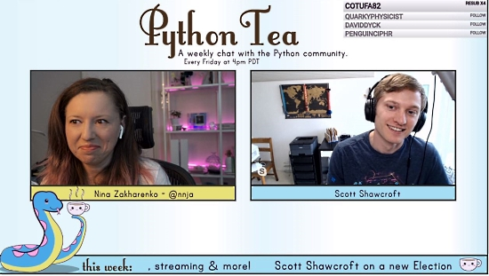
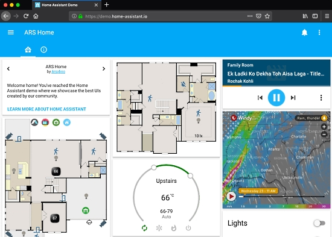
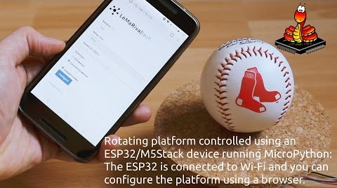
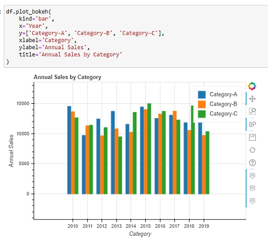
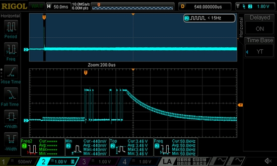

- [X] Kattni updates
- [ ] change date
- [ ] update title
- [ ] Feature story
- [ ] Update  for images
- [ ] Update ICYDNCI
- [ ] All images 550w max only
- [ ] Link "View this email in your browser."

Template last updated on 06-03-2020 by Kattni - updated "Updated guides" section and CP libraries copy to include community bundle.

View this email in your browser.

Hi everyone! It's the latest Python for Microcontrollers newsletter, brought you by the community! We're on [Discord](https://discord.gg/HYqvREz), [Twitter](https://twitter.com/search?q=circuitpython&src=typed_query&f=live), and for past newsletters - [view them all here](https://www.adafruitdaily.com/category/circuitpython/). If you're reading this on the web, [subscribe here](https://www.adafruitdaily.com/). Let's get started!

## Headline Article

Text

## Feature

Text

## CircuitPython Deep Dive Stream with Scott Shawcroft

This week, Scott streams a recap of his woprk on ESP32-S2 - [YouTube](https://www.youtube.com/watch?v=v2iXG6GISQI&feature=youtu.be).

You can see the latest video and past videos on the Adafruit YouTube channel under the Deep Dive playlist - [YouTube](https://www.youtube.com/playlist?list=PLjF7R1fz_OOXBHlu9msoXq2jQN4JpCk8A).

Right after the above Friday stream, [Nina Zakharenko](https://twitter.com/nnja) streamed the Python Tea Community Chat with Scott. They talked about ElectionCal.us, a tool for sharing voting info, CircuitPython & more! - [Twitch](https://www.twitch.tv/videos/649147971).

## Adafruit Update

**Adafruit is shipping**

If you have been waiting to order, read [Adafruit's announcement and FAQ](https://www.adafruit.com/opensafely) and then [Shop Adafruit](https://www.adafruit.com/).

Note: there may be a number of out of stock items as manufacturing gears back up. Adafruit suggests if an item is out of stock and needed, searching at [resellers](https://www.adafruit.com/distributors) may yield results. In the US, [Digi-Key](https://www.digikey.com/en/supplier-centers/a/adafruit?WT.z_link_source=Supplier%2520Index) is suggested.

## News from around the web!

The CircuitPython plug-in for the Atom editor has been updated with some awesome new features! - [Joseph Banks](https://josephbanks.me/atom-circuitpython-v0-7-1/) and [Atom](https://atom.io/packages/language-circuitpython).

Home Assistant, the Python IoT Hub - [LWN.net](https://lwn.net/SubscriberLink/822350/4bf25ca063706acf/).

A rotating platform controlled with an ESP32 running MicroPython - [GitHub](https://github.com/lemariva/uPySteppers) and [YouTube](https://www.youtube.com/watch?v=ZLaloms90uk).

Beautiful and Easy Plotting in Python — Pandas + Bokeh. A single line of code to create an interactive plot from Pandas dataframe to Bokeh - [Towards Data Science](https://towardsdatascience.com/beautiful-and-easy-plotting-in-python-pandas-bokeh-afa92d792167).

Web Scraping in Python: Tools, Techniques, and Legality. Kimberly Fessel discusses her excellent tutorial created for PyCon 2020 online titled "It's Officially Legal so Let's Scrape the Web" - [Real Python](https://realpython.com/podcasts/rpp/12/) and [Twitter](https://twitter.com/realpython/status/1270803930725875714).

#ICYDNCI What was the most popular, most clicked link, in [last week's newsletter](https://www.adafruitdaily.com/2020/06/09/the-python-on-microcontrollers-newsletter-a-sign-of-change-circuitpython-powered-protest-signs-python-adafruit-circuitpython-circuitpython-micropython-thepsf/)? [Learn it Faster: The Entire Python Language in a Single Image](https://fossbytes.com/learn-it-faster-the-entire-python-language-in-a-single-image/).

## Made with Mu

Why Mu? Mu tries to make it as easy as possible to get started with programming but aims to help you graduate to "real" development tools soon after. Everything in Mu is the "real thing" but presented in as simple and obvious way possible. It's like the toddling stage in learning to walk: you're finding your feet and once you're confident, you should move on and explore! Put simply, Mu aims to foster autonomy. Try out Mu today! - [codewith.mu](https://codewith.mu/)

## Coming soon

## New Boards Supported by CircuitPython

The number of supported microcontrollers and Single Board Computers (SBC) grows every week. This section outlines which boards have been included in CircuitPython or added to [CircuitPython.org](https://circuitpython.org/).

This week we had X new boards added!

- [Board name](url)

Looking for adding a new board to CircuitPython? It's highly encouraged! Adafruit has four guides to help you do so:

- [How to Add a New Board to CircuitPython](https://learn.adafruit.com/how-to-add-a-new-board-to-circuitpython/overview)
- [How to add a New Board to the circuitpython.org website](https://learn.adafruit.com/how-to-add-a-new-board-to-the-circuitpython-org-website)
- [Adding a Single Board Computer to PlatformDetect for Blinka](https://learn.adafruit.com/adding-a-single-board-computer-to-platformdetect-for-blinka)
- [Adding a Single Board Computer to Blinka](https://learn.adafruit.com/adding-a-single-board-computer-to-blinka)

## New Learn Guides!

[Adafruit H3LIS331 and LIS331 High-g 3-Axis Accelerometers](https://learn.adafruit.com/adafruit-h3lis331-and-lis331hh-high-g-3-axis-accelerometers) from [Bryan Siepert](https://learn.adafruit.com/users/siddacious)

[Adafruit 2.23" Monochrome OLED Bonnet](https://learn.adafruit.com/adafruit-2-23-monochrome-oled-bonnet) from [Melissa LeBlanc-Williams](https://learn.adafruit.com/users/MakerMelissa)

[Creating Your First Tilemap Game with CircuitPython](https://learn.adafruit.com/creating-your-first-tilemap-game-with-circuitpython) from [Tim C](https://learn.adafruit.com/users/Foamyguy)

[ItsyBitsy Keybow Mechanical Keypad](https://learn.adafruit.com/itsybitsy-keybow-mechanical-keypad) from [John Park](https://learn.adafruit.com/users/johnpark)

[PyPortal Guitar Tuner](https://learn.adafruit.com/pyportal-guitar-tuner) from [Noe, Pedro, and Liz Clark](https://learn.adafruit.com/users/pixil3d)

## CircuitPython Libraries!

CircuitPython support for hardware continues to grow. We are adding support for new sensors and breakouts all the time, as well as improving on the drivers we already have. As we add more libraries and update current ones, you can keep up with all the changes right here!

For the latest libraries, download the [Adafruit CircuitPython Library Bundle](https://circuitpython.org/libraries). For the latest community contributed libraries, download the [CircuitPython Community Bundle](https://github.com/adafruit/CircuitPython_Community_Bundle/releases).

If you'd like to contribute, CircuitPython libraries are a great place to start. Have an idea for a new driver? File an issue on [CircuitPython](https://github.com/adafruit/circuitpython/issues)! Have you written a library you'd like to make available? Submit it to the [CircuitPython Community Bundle](https://github.com/adafruit/CircuitPython_Community_Bundle). Interested in helping with current libraries? Check out the [CircuitPython.org Contributing page](https://circuitpython.org/contributing). We've included open pull requests and issues from the libraries, and details about repo-level issues that need to be addressed. We have a guide on [contributing to CircuitPython with Git and Github](https://learn.adafruit.com/contribute-to-circuitpython-with-git-and-github) if you need help getting started. You can also find us in the #circuitpython channel on the [Adafruit Discord](https://adafru.it/discord).

You can check out this [list of all the Adafruit CircuitPython libraries and drivers available](https://github.com/adafruit/Adafruit_CircuitPython_Bundle/blob/master/circuitpython_library_list.md). 

The current number of CircuitPython libraries is **260**!

**New Libraries!**

Here's this week's new CircuitPython libraries:

 * [Adafruit_CircuitPython_SHTC3](https://github.com/adafruit/Adafruit_CircuitPython_SHTC3)

**Updated Libraries!**

Here's this week's updated CircuitPython libraries:

 * [Adafruit_CircuitPython_BLE_BerryMed_Pulse_Oximeter](https://github.com/adafruit/Adafruit_CircuitPython_BLE_BerryMed_Pulse_Oximeter)
 * [Adafruit_CircuitPython_AHTx0](https://github.com/adafruit/Adafruit_CircuitPython_AHTx0)
 * [Adafruit_CircuitPython_LPS2X](https://github.com/adafruit/Adafruit_CircuitPython_LPS2X)
 * [Adafruit_CircuitPython_ESP32SPI](https://github.com/adafruit/Adafruit_CircuitPython_ESP32SPI)
 * [Adafruit_CircuitPython_Display_Text](https://github.com/adafruit/Adafruit_CircuitPython_Display_Text)
 * [Adafruit_CircuitPython_Wiznet5k](https://github.com/adafruit/Adafruit_CircuitPython_Wiznet5k)
 * [Adafruit_CircuitPython_ICM20X](https://github.com/adafruit/Adafruit_CircuitPython_ICM20X)
 * [Adafruit_CircuitPython_MiniMQTT](https://github.com/adafruit/Adafruit_CircuitPython_MiniMQTT)
 * [Adafruit_CircuitPython_LED_Animation](https://github.com/adafruit/Adafruit_CircuitPython_LED_Animation)
 * [Adafruit_CircuitPython_ILI9341](https://github.com/adafruit/Adafruit_CircuitPython_ILI9341)
 * [Adafruit_CircuitPython_HX8357](https://github.com/adafruit/Adafruit_CircuitPython_HX8357)
 * [Adafruit_CircuitPython_AzureIoT](https://github.com/adafruit/Adafruit_CircuitPython_AzureIoT)
 * [Adafruit_CircuitPython_GPS](https://github.com/adafruit/Adafruit_CircuitPython_GPS)
 * [Adafruit_CircuitPython_ST7735R](https://github.com/adafruit/Adafruit_CircuitPython_ST7735R)
 * [Adafruit_CircuitPython_ST7735](https://github.com/adafruit/Adafruit_CircuitPython_ST7735)
 * [Adafruit_CircuitPython_SSD1351](https://github.com/adafruit/Adafruit_CircuitPython_SSD1351)
 * [Adafruit_CircuitPython_ST7789](https://github.com/adafruit/Adafruit_CircuitPython_ST7789)

**PyPI Download Stats!**

We've written a special library called Adafruit Blinka that makes it possible to use CircuitPython Libraries on [Raspberry Pi and other compatible single-board computers](https://learn.adafruit.com/circuitpython-on-raspberrypi-linux/). Adafruit Blinka and all the CircuitPython libraries have been deployed to PyPI for super simple installation on Linux! Here are the top 10 CircuitPython libraries downloaded from PyPI in the last week, including the total downloads for those libraries:

Keep checking back for updated download stats coming soon!

## What’s the team up to this week?

What is the team up to this week? Let’s check in!

**Bryan**

**Dan**

I've finished the initial version of the [Adafruit_Blinka_bleio](https://github.com/adafruit/Adafruit_Blinka_bleio) library, which lets you use CircuitPython BLE code on host computers, like the rest of the [Blinka](https://github.com/adafruit/Adafruit_Blinka) library. The same programs that run on CircuitPython on our BLE-capable boards now run without change  on Linux and Windows. I'm testing with a heart rate monitor, BBQ thermometer, a BLE light bulb, and other such devices.

There are still some stumbling blocks for MacOS, and there are some limitations in the current implementation of [bleak](https://github.com/hbldh/bleak), the underlying library I'm using, that prevent using [Adafruit Services](https://github.com/adafruit/Adafruit_CircuitPython_BLE_Adafruit). We're looking into overcoming these issues. Nevertheless, bleak has worked out quite well so far, and it is impressive how it supports such disparate platforms with a single clean API.

**Jeff**

The overall structure of the code is in place, but it doesn't work yet.  The Grand Central board is trying to communicate with the card to retrieve the card ID, but nothing is received in return.  Investigation continues, and the vital clue is sure to turn up soon.

**Kattni**

I began this week by getting ahead on creating Fritzing objects for upcoming hardware so they're ready for the guides as the hardware becomes ready to ship. I did 10 in total, including two FeatherWings, which adds to the level of complication. I was also asked to update a guide to include a FeatherWing version of the LSM6DSOX + LIS3MDL - Precision 9 DoF IMU breakout, but it turns out the guide was never created in the first place. So, now I'm working on creating the guide.

I'll be working on going through a list of CircuitPython supported boards that have duplicate VID/PID numbers, and determining whether it's intentional or needs to be changed. We've added a check to verify duplicate VID/PIDs, so we won't have to deal with it moving forward, but it means going through all the current boards with duplicates and making judgement calls. Details can be found in [CircuitPython issue #2962](https://github.com/adafruit/circuitpython/issues/2962).

**Lucian**

This past week I rewrote the clock setup system for the STM32 port - a lot of the code was pretty old, and not especially flexible, so it was causing crashes and other issues when combined with the new low power code. The new system reduces all the clock settings (including both the primary clock controller, the RCC, and the low power real-time clock, the RTC) down to a set of defaults that a board can choose to overwrite. This gives board contributors a lot of flexibility over what clock settings they want in case they'd like to lower their power use, use specific peripherals that require certain frequencies, etc. It also resolves bugs with the low power code that were causing crashes with certain modules, and generally improves speed and power efficiency over most dev boards. 

I also spent some time working on the i.MX port, solving some simple but tricky-to-track bugs on the Teensy 4.0 and 4.1, and got set up with the RGBMatrix code on STM32. My current project is cleaning up a number of older issues with the H7 and F7 series that never quite got cleaned up. Yesterday I added tightly-coupled memory (TCM) support to the F7 series, and I'm currently wrapping up an issue with the calculation of I2C timing. With luck I'll be out of the debugging weeds soon, to get back to RGBMatrix support and hopefully submit some projects of my own to the community bundle. 

**Melissa**

This past week I've been focusing on displayio once again. I have been going through each of the displays and making sure they all work as well as adding features such as basic backlight control and display rotation. This will be really useful for making use of the displays that are designed specifically for the Raspberry Pi and other boards with similar 40-pin connectors.

**Scott**

This past week I finished up busio.I2C on the ESP32-S2. Thanks to MarkOlsson for pointing out a problem with ACK/NAK that got a sensor working. Once that was done, I added pin validation and pull up checking. Next up is UART and SPI. I'll also be doing a new beta release shortly.

## Upcoming events!

FlaskCon is a community driven Flask event being held July 4th and 5th. It is intended for speakers and attendees all over the world to participate in technical and evangelical sessions related to Flask. Flask is a micro web framework written in Python - [Event](https://flaskcon.com/) and [Call for Papers](https://sessionize.com/flaskcon).

EuroPython 2020 this year will be an online conference from July 23-26. The schedule is now available - [Website](https://ep2020.europython.eu/schedule/).

Attending the conference days will require a ticket, participating in the sprint days will be free - [EuroPython](https://blog.europython.eu/post/614102095419850752/europython-2020-online-conference-from-july-23-26).

PyCon AU has announced they are holding PyConline AU, an online event, in August 2020 -  [pycon.org.au](https://2020.pycon.org.au/).

PyCon India 2020: the premier conference in India on using and developing the Python programming language. Held online October 3-5, 2020. A [call for proposals](https://in.pycon.org/cfp/2020/proposals/) is now open through August 14, 2020. - [Website](https://in.pycon.org/2020/) and [Twitter](https://twitter.com/pyconindia)

**Send Your Events In**

As for other events, with the COVID pandemic, most in-person events are postponed or cancelled. If you know of virtual events or events that may occur in the future, please let us know on Discord or on Twitter with hashtag #CircuitPython.

## Latest releases

CircuitPython's stable release is [#.#.#](https://github.com/adafruit/circuitpython/releases/latest) and its unstable release is [#.#.#-##.#](https://github.com/adafruit/circuitpython/releases). New to CircuitPython? Start with our [Welcome to CircuitPython Guide](https://learn.adafruit.com/welcome-to-circuitpython).

[2019####](https://github.com/adafruit/Adafruit_CircuitPython_Bundle/releases/latest) is the latest CircuitPython library bundle.

[v#.#.#](https://micropython.org/download) is the latest MicroPython release. Documentation for it is [here](http://docs.micropython.org/en/latest/pyboard/).

[#.#.#](https://www.python.org/downloads/) is the latest Python release. The latest pre-release version is [#.#.#](https://www.python.org/download/pre-releases/).

[1746 Stars](https://github.com/adafruit/circuitpython/stargazers) Like CircuitPython? [Star it on GitHub!](https://github.com/adafruit/circuitpython)

## Call for help -- Translating CircuitPython is now easier than ever!

One important feature of CircuitPython is translated control and error messages.

With the help of fellow open source project [Weblate](https://weblate.org/), we're making it even easier to add or improve translations.

Sign in with an existing account such as Github, Google or Facebook and start contributing through a simple web interface. No forks or pull requests needed!

As always, if you run into trouble join us on [Discord](https://adafru.it/discord), we're here to help.

## jobs.adafruit.com - Find a dream job, find great candidates!

[jobs.adafruit.com](https://jobs.adafruit.com/) has returned and folks are posting their skills (including CircuitPython) and companies are looking for talented makers to join their companies - from Digi-Key, to Hackaday, Microcenter, Raspberry Pi and more.

## NUMBER thanks!

The Adafruit Discord community, where we do all our CircuitPython development in the open, reached over NUMBER humans, thank you!  Adafruit believes Discord offers a unique way for CircuitPython folks to connect. Join today at [https://adafru.it/discord](https://adafru.it/discord).

## ICYMI - In case you missed it

The wonderful world of Python on hardware! This is our first video-newsletter-podcast that we’ve started! The news comes from the Python community, Discord, Adafruit communities and more. It’s part of the weekly newsletter, then we have a segment on ASK an ENGINEER and this is the video slice from that! The complete Python on Hardware weekly videocast [playlist is here](https://www.youtube.com/playlist?list=PLjF7R1fz_OOXRMjM7Sm0J2Xt6H81TdDev). 

This video podcast is on [iTunes](https://itunes.apple.com/us/podcast/python-on-hardware/id1451685192?mt=2), [YouTube](http://adafru.it/pohepisodes), [IGTV (Instagram TV](https://www.instagram.com/adafruit/channel/)), and [XML](https://itunes.apple.com/us/podcast/python-on-hardware/id1451685192?mt=2).

[Weekly community chat on Adafruit Discord server CircuitPython channel - Audio / Podcast edition](https://itunes.apple.com/us/podcast/circuitpython-weekly-meeting/id1451685016) - Audio from the Discord chat space for CircuitPython, meetings are usually Mondays at 2pm ET, this is the audio version on [iTunes](https://itunes.apple.com/us/podcast/circuitpython-weekly-meeting/id1451685016), Pocket Casts, [Spotify](https://adafru.it/spotify), and [XML feed](https://adafruit-podcasts.s3.amazonaws.com/circuitpython_weekly_meeting/audio-podcast.xml).

And lastly, we are working up a one-spot destination for all things podcast-able here - [podcasts.adafruit.com](https://podcasts.adafruit.com/)

## Codecademy "Learn Hardware Programming with CircuitPython"

Codecademy, an online interactive learning platform used by more than 45 million people, has teamed up with the leading manufacturer in STEAM electronics, Adafruit Industries, to create a coding course, "Learn Hardware Programming with CircuitPython". The course is now available in the [Codecademy catalog](https://www.codecademy.com/learn/learn-circuitpython?utm_source=adafruit&utm_medium=partners&utm_campaign=circuitplayground&utm_content=pythononhardwarenewsletter).

Python is a highly versatile, easy to learn programming language that a wide range of people, from visual effects artists in Hollywood to mission control at NASA, use to quickly solve problems. But you don’t need to be a rocket scientist to accomplish amazing things with it. This new course introduces programmers to Python by way of a microcontroller — CircuitPython — which is a Python-based programming language optimized for use on hardware.

CircuitPython’s hardware-ready design makes it easier than ever to program a variety of single-board computers, and this course gets you from no experience to working prototype faster than ever before. Codecademy’s interactive learning environment, combined with Adafruit's highly rated Circuit Playground Express, present aspiring hardware hackers with a never-before-seen opportunity to learn hardware programming seamlessly online.

Whether for those who are new to programming, or for those who want to expand their skill set to include physical computing, this course will have students getting familiar with Python and creating incredible projects along the way. By the end, students will have built their own bike lights, drum machine, and even a moisture detector that can tell when it's time to water a plant.

Visit Codecademy to access the [Learn Hardware Programming with CircuitPython](https://www.codecademy.com/learn/learn-circuitpython?utm_source=adafruit&utm_medium=partners&utm_campaign=circuitplayground&utm_content=pythononhardwarenewsletter) course and Adafruit to purchase a [Circuit Playground Express](https://www.adafruit.com/product/3333).

Codecademy has helped more than 45 million people around the world upgrade their careers with technology skills. The company’s online interactive learning platform is widely recognized for providing an accessible, flexible, and engaging experience for beginners and experienced programmers alike. Codecademy has raised a total of $43 million from investors including Union Square Ventures, Kleiner Perkins, Index Ventures, Thrive Capital, Naspers, Yuri Milner and Richard Branson, most recently raising its $30 million Series C in July 2016.

## Contribute!

The CircuitPython Weekly Newsletter is a CircuitPython community-run newsletter emailed every Tuesday. The complete [archives are here](https://www.adafruitdaily.com/category/circuitpython/). It highlights the latest CircuitPython related news from around the web including Python and MicroPython developments. To contribute, edit next week's draft [on GitHub](https://github.com/adafruit/circuitpython-weekly-newsletter/tree/gh-pages/_drafts) and [submit a pull request](https://help.github.com/articles/editing-files-in-your-repository/) with the changes. Join our [Discord](https://adafru.it/discord) or [post to the forum](https://forums.adafruit.com/viewforum.php?f=60) for any further questions.
