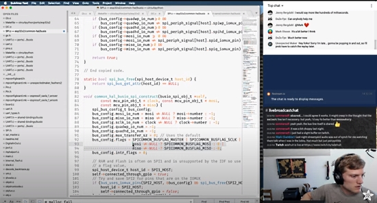
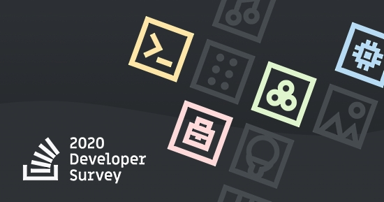
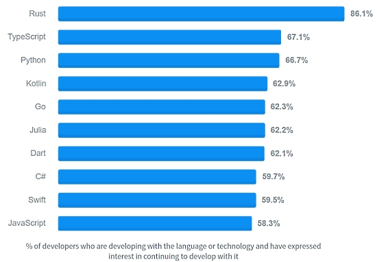
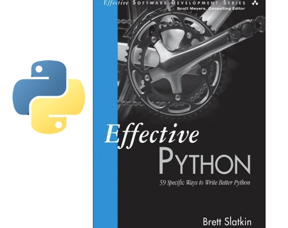
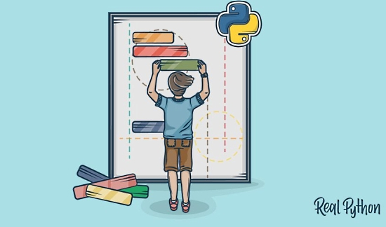
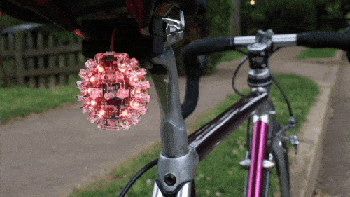
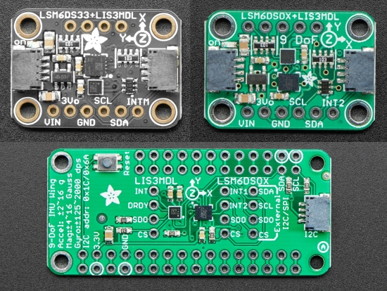
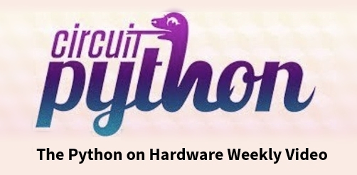

- [X] Kattni updates
- [ ] change date
- [ ] update title
- [ ] Feature story
- [ ] Update  for images
- [ ] Update ICYDNCI
- [ ] All images 550w max only
- [ ] Link "View this email in your browser."

Template last updated on 06-03-2020 by Kattni - updated "Updated guides" section and CP libraries copy to include community bundle.

View this email in your browser.

Hi everyone! It's the latest Python for Microcontrollers newsletter, brought you by the community! We're on [Discord](https://discord.gg/HYqvREz), [Twitter](https://twitter.com/search?q=circuitpython&src=typed_query&f=live), and for past newsletters - [view them all here](https://www.adafruitdaily.com/category/circuitpython/). If you're reading this on the web, [subscribe here](https://www.adafruitdaily.com/). Let's get started!

## Headline Article

Text

## A Scrolling LED Matrix Sign

CircuitPythonista Melissa LeBlanc-Williams has been working on a large multi-LED matrix display.

The LED Matrix Sign is a project  I have been wanting to work on for the last 30 years.  I saw that the Project MC2 Pink Pixel Purses were very inexpensive on Amazon,  I ordered 6 and disassembled them. Other hardware includes an Adafruit RGB Matrix bonnet and a Raspberry Pi 3B+.

One goal was to run this project with Python because I wanted to easily be able to script out messages or a series of messages. I was pleasantly surprised to find the Henner Zeller RGB Matrix library. Recently I have been working on developing the displayio library for Adafruit Blinka, which runs on Raspberry Pi, and is built on top of the Pillow library. 

At this point I got to work designing an enclosure that I could 3D print. The enclosure was designed around a couple of 3/4 inch pieces of angled aluminum. I ended up with a very modular design so that I could print multiple copies of parts on multiple printers simultaneously and just assemble them together. I designed a couple of wall mount pieces that just slid onto the aluminum so that I could mount it on my wall. To finish the enclosure off, I bought a sheet of chemist black LED acrylic from TAP plastics.

Once I had everything physically mounted, I went to work on developing a library that would allow easy scripting of the sign. I decided to have my library work directly with Pillow so that I could have some good control of the graphics. I looked up some instruction manuals for some commercially available signs to see what their available functions were and method of programming and decided on using a single background and foreground for simplicity’s sake. The foreground consists of a canvas that expands automatically as you add stuff to it and the main sign class that allows you to set a background and has some animation functions that will apply display the canvas in various way. I plan on releasing the library on Github so that others can make use of it.

## CircuitPython Deep Dive Stream with Scott Shawcroft

This week, Scott streams his work on .

You can see the latest video and past videos on the Adafruit YouTube channel under the Deep Dive playlist - [YouTube](https://www.youtube.com/playlist?list=PLjF7R1fz_OOXBHlu9msoXq2jQN4JpCk8A).

## Adafruit Update

**Adafruit is shipping regular (non-emergency) orders after priority orders are filled.**

If you have been waiting to order, read [Adafruit's announcement and FAQ](https://www.adafruit.com/opensafely) and then [Shop Adafruit](https://www.adafruit.com/).

Note: there may be a number of out of stock items as manufacturing gears back up. Adafruit suggests if an item is out of stock and needed, searching at [resellers](https://www.adafruit.com/distributors) may yield results. In the US, [Digi-Key](https://www.digikey.com/en/supplier-centers/a/adafruit?WT.z_link_source=Supplier%2520Index) is suggested.

## Sponsor MicroPython on GitHub

Become a sponsor to [MicroPython](https://micropython.org/) on GitHub!

Funds will go towards:
- Continued maintenance of the software
- Recruiting additional maintainers
- Offering bounties for finding and fixing critical bugs

More information - [GitHub](https://github.com/sponsors/micropython).

## Python is the Third Most Beloved Developer Language in 2020 Survey

In the 2020 Stackoverflow Developer Survey, Python slips to third place in the beloved languages category, behind Rust and the surge in TypeScript use - [StackOverflow](https://stackoverflow.blog/2020/05/27/2020-stack-overflow-developer-survey-results/).

## News from around the web!

The 2020 Python Software Foundation Board of Directors election recently concluded. The top four are:
- Nina Zakharenko
- Dustin Ingram
- Jeff Triplett
- Thomas Wouters

Each will serve a three year term on the Foundation board - [PSF Blog](https://pyfound.blogspot.com/2020/06/2020-python-software-foundation-board.html).

Code samples for the book "Effective Python: 59 Specific Ways to Write Better Python" by Brett Slatkin are on [GitHub](https://github.com/SigmaQuan/Better-Python-59-Ways) along with an outline to learn better Python practices. You can also get the book on [Amazon](https://www.amazon.com/Effective-Python-Specific-Software-Development/dp/0134034287) and other booksellers.

Structuring a Python Application - a video reference guide course to common Python application layouts and project structures for command-line applications, web applications, and more - [Real Python](https://realpython.com/courses/structuring-python-application/).

Using Python list comprehensions - [Real Python](https://realpython.com/python-tricks/).

#ICYDNCI What was the most popular, most clicked link, in [last week's newsletter](https://www.adafruitdaily.com/2020/06/16/the-python-on-microcontrollers-newsletter-circuitpython-5-4-0-beta-1-ble-on-desktops-and-more-python-adafruit-circuitpython-circuitpython-micropython-thepsf/)? [Trying out our NEW BLE CircuitPython library support for desktop](https://www.youtube.com/watch?v=uW1eNPrLBi8&feature=youtu.be).

## Made with Mu

Why Mu? Mu tries to make it as easy as possible to get started with programming but aims to help you graduate to "real" development tools soon after. Everything in Mu is the "real thing" but presented in as simple and obvious way possible. It's like the toddling stage in learning to walk: you're finding your feet and once you're confident, you should move on and explore! Put simply, Mu aims to foster autonomy. Try out Mu today! - [codewith.mu](https://codewith.mu/)

## Coming soon

## New Boards Supported by CircuitPython

The number of supported microcontrollers and Single Board Computers (SBC) grows every week. This section outlines which boards have been included in CircuitPython or added to [CircuitPython.org](https://circuitpython.org/).

This week we had X new boards added!

- [Board name](url)

Looking for adding a new board to CircuitPython? It's highly encouraged! Adafruit has four guides to help you do so:

- [How to Add a New Board to CircuitPython](https://learn.adafruit.com/how-to-add-a-new-board-to-circuitpython/overview)
- [How to add a New Board to the circuitpython.org website](https://learn.adafruit.com/how-to-add-a-new-board-to-the-circuitpython-org-website)
- [Adding a Single Board Computer to PlatformDetect for Blinka](https://learn.adafruit.com/adding-a-single-board-computer-to-platformdetect-for-blinka)
- [Adding a Single Board Computer to Blinka](https://learn.adafruit.com/adding-a-single-board-computer-to-blinka)

## New Learn Guides!

[Circuit Playground Bluefruit Automatic Bike Brake Light](https://learn.adafruit.com/circuit-playground-bluefruit-brake-light) from [Dylan Herrada](https://learn.adafruit.com/users/dherrada)

[ST 9-DoF Combo Breakouts and Wings](https://learn.adafruit.com/st-9-dof-combo) from [Kattni](https://learn.adafruit.com/users/kattni)

[Adafruit 2.23" Monochrome OLED Bonnet](https://learn.adafruit.com/adafruit-2-23-monochrome-oled-bonnet) from [Melissa LeBlanc-Williams](https://learn.adafruit.com/users/MakerMelissa)

[Adafruit Sensirion SHTC3 - Temperature & Humidity Sensor Breakout](https://learn.adafruit.com/adafruit-sensirion-shtc3-temperature-humidity-sensor) from [Bryan Siepert](https://learn.adafruit.com/users/siddacious)

[RGB Matrix Slot Machine](https://learn.adafruit.com/rgb-matrix-slot-machine) from [Noe and Pedro](https://learn.adafruit.com/users/pixil3d)

## CircuitPython Libraries!

CircuitPython support for hardware continues to grow. We are adding support for new sensors and breakouts all the time, as well as improving on the drivers we already have. As we add more libraries and update current ones, you can keep up with all the changes right here!

For the latest libraries, download the [Adafruit CircuitPython Library Bundle](https://circuitpython.org/libraries). For the latest community contributed libraries, download the [CircuitPython Community Bundle](https://github.com/adafruit/CircuitPython_Community_Bundle/releases).

If you'd like to contribute, CircuitPython libraries are a great place to start. Have an idea for a new driver? File an issue on [CircuitPython](https://github.com/adafruit/circuitpython/issues)! Have you written a library you'd like to make available? Submit it to the [CircuitPython Community Bundle](https://github.com/adafruit/CircuitPython_Community_Bundle). Interested in helping with current libraries? Check out the [CircuitPython.org Contributing page](https://circuitpython.org/contributing). We've included open pull requests and issues from the libraries, and details about repo-level issues that need to be addressed. We have a guide on [contributing to CircuitPython with Git and Github](https://learn.adafruit.com/contribute-to-circuitpython-with-git-and-github) if you need help getting started. You can also find us in the #circuitpython channel on the [Adafruit Discord](https://adafru.it/discord).

You can check out this [list of all the Adafruit CircuitPython libraries and drivers available](https://github.com/adafruit/Adafruit_CircuitPython_Bundle/blob/master/circuitpython_library_list.md). 

The current number of CircuitPython libraries is **260**!

**Updated Libraries!**

Here's this week's updated CircuitPython libraries:

 * [Adafruit_CircuitPython_SSD1331](https://github.com/adafruit/Adafruit_CircuitPython_SSD1331)
 * [Adafruit_CircuitPython_BME280](https://github.com/adafruit/Adafruit_CircuitPython_BME280)
 * [Adafruit_CircuitPython_BLE](https://github.com/adafruit/Adafruit_CircuitPython_BLE)
 * [Adafruit_CircuitPython_LIS3MDL](https://github.com/adafruit/Adafruit_CircuitPython_LIS3MDL)
 * [Adafruit_CircuitPython_CircuitPlayground](https://github.com/adafruit/Adafruit_CircuitPython_CircuitPlayground)
 * [Adafruit_CircuitPython_APDS9960](https://github.com/adafruit/Adafruit_CircuitPython_APDS9960)
 * [Adafruit_CircuitPython_BLE_BroadcastNet](https://github.com/adafruit/Adafruit_CircuitPython_BLE_BroadcastNet)
 * [Adafruit_CircuitPython_BLE_Eddystone](https://github.com/adafruit/Adafruit_CircuitPython_BLE_Eddystone)
 * [Adafruit_CircuitPython_BLE_Adafruit](https://github.com/adafruit/Adafruit_CircuitPython_BLE_Adafruit)
 * [Adafruit_CircuitPython_BLE_Radio](https://github.com/adafruit/Adafruit_CircuitPython_BLE_Radio)
 * [Adafruit_CircuitPython_Display_Text](https://github.com/adafruit/Adafruit_CircuitPython_Display_Text)

**PyPI Download Stats!**

We've written a special library called Adafruit Blinka that makes it possible to use CircuitPython Libraries on [Raspberry Pi and other compatible single-board computers](https://learn.adafruit.com/circuitpython-on-raspberrypi-linux/). Adafruit Blinka and all the CircuitPython libraries have been deployed to PyPI for super simple installation on Linux! Here are the top 10 CircuitPython libraries downloaded from PyPI in the last week, including the total downloads for those libraries:

Keep checking back for updated download stats coming soon!

## What’s the team up to this week?

What is the team up to this week? Let’s check in!

**Bryan**

Since we last spoke I've been as usual writing libraries, testing hardware, writing and updating guides, helping with support, and generally keeping busy.

In the library department, the last two weeks saw me

* Complete and release the ICM20X libraries,
* Update the LPS2X CircuitPython library to include the LSP22
* Test and merge some PRs for the still-very-alpha APDS9500 library
* Start and finish the SHTC3 CircuitPython library

Hardware wise I assembled and tested the SHTC3 and LPS22 breakouts, mostly do allow for development of the libraries as Ladyada had already vetted the designs while working on the Arduino libraries

To accompany the above library and hardware work, I also did a fair amount of guide work:

* Completed and published the LIS331/H3LIS331 guide
* Update the LPS25 guide to add coverage of the LPS22
* Wrote and published the the SHTC3 guide
* Helped out with example code and assets for Kattni's guide on the ST 9-DoF combo breakouts and wings

And lastly all the above guides I wrote or published had blog coverage written as well.

I also started research and ordered parts for a project I've been poking at for a while: a [CAN bus](https://en.wikipedia.org/wiki/CAN_bus) board. CAN bus is robust bus standard widely used in modern cars to allow different automated things like power windows, locking systems, radios, and even the engine controls and braking systems communicate as needed.

This is only just the beginning, and CAN bus is only the most low level part of these networks, comparable to ethernet or wifi, so there is a lot more to do [at higher levels](https://www.sti-innsbruck.at/sites/default/files/courses/fileadmin/documents/vn-ws0809/03-vn-CAN-HLP.pdf) to be able to get an idea of what is talking to what.  

**Dan**

Now that the first version of the [Adafruit_Blinka_bleio](https://github.com/adafruit/Adafruit_Blinka_bleio) library is essentially finished, my next BLE quest is to reimplement \_bleio again, this time using the ESP32 HCI interface as the low level. The ESP32 is what we use for WiFi on our AirLift boards, but it also supports bluetoothHCI, a serial protocol that is pretty standard among Bluetooth adapters. Most Bluetooth USB dongles implement it, for instance. So once I have it working on ESP32, it should also be usable for other adapters that implement HCI.

**Jeff**

Among other things, I've been working on improvements to our documentation, in two main areas.

First, I improved the ability to switch between the 5.x documentation and the latest documentation on ReadTheDocs with fewer "page not found" errors. Many URLs changed when we started using "autoapi" to help us generate documentation, but with configuration changes and redirects, many old URLs will continue to work automatically.

Second, I started work on removing offensive terminology from our documentation and from the names of modules and functions in the core of CircuitPython. While we are still coming to a consensus about replacement terms to use, this is something that the team agrees is important. As the draft document explaining our motivation says, "we disfavor language that due to historical and social context can make community members and potential community members feel unwelcome."

**Kattni**

This week I published a guide for 9-DoF combo breakouts and FeatherWings with sensors from ST. This guide includes three very similar boards that work with nearly identical code. The guide includes all kinds of information about these boards including pinouts, Arduino usage, CircuitPython and Python usage, and many resources to download, including datasheets, schematics and more. If you've picked up one of the new 9-DoF boards and you're looking for where to get started, check out the [ST 9-DoF Combo Breakouts and Wings guide](https://learn.adafruit.com/st-9-dof-combo).

Following the guide, I'm taking the opportunity to go through my assigned GitHub issues and any PRs I was tagged on. It's good to spend some time on this every so often to make sure things are getting addressed and completed. 

**Lucian**

This past week I worked on fixing an I2C timing issue on the F7 and H7 boards, RGB Matrix testing, adding the i.MX 1050 EVK board, and a variety of other minor bugs and annoyances. As always I'm trying to learn new things about bugs as they're resolved, so I can avoid issues in the future or fix deeper structural issues that could cause more instability later on.

In my own time I've been soldering together one of Joey Castillo's [E-Book Featherwing](https://www.tindie.com/products/joeycastillo/the-e-book-wing-pcb-bare-pcb/) e-readers, which I'm hoping to use for a language flashcard program. I'm looking forward to digging deeper into his unicode support platform, which looks pretty handy so far! I'm always excited to see new open source designs emerge to replace devices that are usually so complex we think of them as untouchable, like tablets, phones and readers

**Melissa**

This past week, I finished working some more on displayio for Blinka. One of the displays that I found particularly challenging was the SSD1331 despite the fact that I originally added the code to CircuitPython to get it working. The reason was that despite it wanting to accept all data as commands, sometimes it wanted commands sent as data which I found kind of weird. Using a combination of hooking up a logic probe to compare it the the Adafruit_CircuitPython_RGB_Display library and carefully comparing CircuitPython, Blinka displayio, and the RGB Display library, I was able to figure that out.

I also wrote a script for the Raspberry Pi, though it could really run on any board that supports Blinka and I2c, that will step you through calibrating a 9-DoF sensor using the command line. I'm currently working on writing up a guide page on using this script which will be one of the easiest ways to calibrate the sensor.

**Scott**

Since last week I've been focused on two ESP32-S2 tasks. The first is to finish busio by adding SPI support. It's been much trickier than I2C and UART because the API provided by the ESP IDF is higher level than the one CircuitPython exposes. It's highlighted memory management challenges that we ignored for the other two buses.

The second ESP related task is testing the UF2 bootloader that Thach has created. I tested it and also added the ability to double tap like other UF2 bootloaders. The double tap support requires an external resistor and capacitor to store one bit of memory because the reset button on ESP boards disables power to all ESP-powered memories.

I go over all of this in [my stream from last week](https://www.youtube.com/watch?v=v2iXG6GISQI).

## Upcoming events!

FlaskCon is a community driven Flask event being held July 4th and 5th. It is intended for speakers and attendees all over the world to participate in technical and evangelical sessions related to Flask. Flask is a micro web framework written in Python - [Event](https://flaskcon.com/) and [Call for Papers](https://sessionize.com/flaskcon).

EuroPython 2020 this year will be an online conference from July 23-26. The schedule is now available - [Website](https://ep2020.europython.eu/schedule/).

Attending the conference days will require a ticket, participating in the sprint days will be free - [EuroPython](https://blog.europython.eu/post/614102095419850752/europython-2020-online-conference-from-july-23-26).

PyCon AU has announced they are holding PyConline AU, an online event, in August 2020 -  [pycon.org.au](https://2020.pycon.org.au/).

PyCon India 2020: the premier conference in India on using and developing the Python programming language. Held online October 3-5, 2020. A [call for proposals](https://in.pycon.org/cfp/2020/proposals/) is now open through August 14, 2020. - [Website](https://in.pycon.org/2020/) and [Twitter](https://twitter.com/pyconindia)

**Send Your Events In**

As for other events, with the COVID pandemic, most in-person events are postponed or cancelled. If you know of virtual events or events that may occur in the future, please let us know on Discord or on Twitter with hashtag #CircuitPython.

## Latest releases

CircuitPython's stable release is [#.#.#](https://github.com/adafruit/circuitpython/releases/latest) and its unstable release is [#.#.#-##.#](https://github.com/adafruit/circuitpython/releases). New to CircuitPython? Start with our [Welcome to CircuitPython Guide](https://learn.adafruit.com/welcome-to-circuitpython).

[2019####](https://github.com/adafruit/Adafruit_CircuitPython_Bundle/releases/latest) is the latest CircuitPython library bundle.

[v#.#.#](https://micropython.org/download) is the latest MicroPython release. Documentation for it is [here](http://docs.micropython.org/en/latest/pyboard/).

[#.#.#](https://www.python.org/downloads/) is the latest Python release. The latest pre-release version is [#.#.#](https://www.python.org/download/pre-releases/).

[1,755 Stars](https://github.com/adafruit/circuitpython/stargazers) Like CircuitPython? [Star it on GitHub!](https://github.com/adafruit/circuitpython)

## Call for help -- Translating CircuitPython is now easier than ever!

One important feature of CircuitPython is translated control and error messages.

With the help of fellow open source project [Weblate](https://weblate.org/), we're making it even easier to add or improve translations.

Sign in with an existing account such as Github, Google or Facebook and start contributing through a simple web interface. No forks or pull requests needed!

As always, if you run into trouble join us on [Discord](https://adafru.it/discord), we're here to help.

## jobs.adafruit.com - Find a dream job, find great candidates!

[jobs.adafruit.com](https://jobs.adafruit.com/) has returned and folks are posting their skills (including CircuitPython) and companies are looking for talented makers to join their companies - from Digi-Key, to Hackaday, Microcenter, Raspberry Pi and more.

## 21,294 thanks!

The Adafruit Discord community, where we do all our CircuitPython development in the open, reached over 21,294 humans, thank you!  Adafruit believes Discord offers a unique way for CircuitPython folks to connect. Join today at [https://adafru.it/discord](https://adafru.it/discord).

## ICYMI - In case you missed it

The wonderful world of Python on hardware! This is our first video-newsletter-podcast that we’ve started! The news comes from the Python community, Discord, Adafruit communities and more. It’s part of the weekly newsletter, then we have a segment on ASK an ENGINEER and this is the video slice from that! The complete Python on Hardware weekly videocast [playlist is here](https://www.youtube.com/playlist?list=PLjF7R1fz_OOXRMjM7Sm0J2Xt6H81TdDev). 

This video podcast is on [iTunes](https://itunes.apple.com/us/podcast/python-on-hardware/id1451685192?mt=2), [YouTube](http://adafru.it/pohepisodes), [IGTV (Instagram TV](https://www.instagram.com/adafruit/channel/)), and [XML](https://itunes.apple.com/us/podcast/python-on-hardware/id1451685192?mt=2).

[Weekly community chat on Adafruit Discord server CircuitPython channel - Audio / Podcast edition](https://itunes.apple.com/us/podcast/circuitpython-weekly-meeting/id1451685016) - Audio from the Discord chat space for CircuitPython, meetings are usually Mondays at 2pm ET, this is the audio version on [iTunes](https://itunes.apple.com/us/podcast/circuitpython-weekly-meeting/id1451685016), Pocket Casts, [Spotify](https://adafru.it/spotify), and [XML feed](https://adafruit-podcasts.s3.amazonaws.com/circuitpython_weekly_meeting/audio-podcast.xml).

And lastly, we are working up a one-spot destination for all things podcast-able here - [podcasts.adafruit.com](https://podcasts.adafruit.com/)

## Codecademy "Learn Hardware Programming with CircuitPython"

Codecademy, an online interactive learning platform used by more than 45 million people, has teamed up with the leading manufacturer in STEAM electronics, Adafruit Industries, to create a coding course, "Learn Hardware Programming with CircuitPython". The course is now available in the [Codecademy catalog](https://www.codecademy.com/learn/learn-circuitpython?utm_source=adafruit&utm_medium=partners&utm_campaign=circuitplayground&utm_content=pythononhardwarenewsletter).

Python is a highly versatile, easy to learn programming language that a wide range of people, from visual effects artists in Hollywood to mission control at NASA, use to quickly solve problems. But you don’t need to be a rocket scientist to accomplish amazing things with it. This new course introduces programmers to Python by way of a microcontroller — CircuitPython — which is a Python-based programming language optimized for use on hardware.

CircuitPython’s hardware-ready design makes it easier than ever to program a variety of single-board computers, and this course gets you from no experience to working prototype faster than ever before. Codecademy’s interactive learning environment, combined with Adafruit's highly rated Circuit Playground Express, present aspiring hardware hackers with a never-before-seen opportunity to learn hardware programming seamlessly online.

Whether for those who are new to programming, or for those who want to expand their skill set to include physical computing, this course will have students getting familiar with Python and creating incredible projects along the way. By the end, students will have built their own bike lights, drum machine, and even a moisture detector that can tell when it's time to water a plant.

Visit Codecademy to access the [Learn Hardware Programming with CircuitPython](https://www.codecademy.com/learn/learn-circuitpython?utm_source=adafruit&utm_medium=partners&utm_campaign=circuitplayground&utm_content=pythononhardwarenewsletter) course and Adafruit to purchase a [Circuit Playground Express](https://www.adafruit.com/product/3333).

Codecademy has helped more than 45 million people around the world upgrade their careers with technology skills. The company’s online interactive learning platform is widely recognized for providing an accessible, flexible, and engaging experience for beginners and experienced programmers alike. Codecademy has raised a total of $43 million from investors including Union Square Ventures, Kleiner Perkins, Index Ventures, Thrive Capital, Naspers, Yuri Milner and Richard Branson, most recently raising its $30 million Series C in July 2016.

## Contribute!

The CircuitPython Weekly Newsletter is a CircuitPython community-run newsletter emailed every Tuesday. The complete [archives are here](https://www.adafruitdaily.com/category/circuitpython/). It highlights the latest CircuitPython related news from around the web including Python and MicroPython developments. To contribute, edit next week's draft [on GitHub](https://github.com/adafruit/circuitpython-weekly-newsletter/tree/gh-pages/_drafts) and [submit a pull request](https://help.github.com/articles/editing-files-in-your-repository/) with the changes. Join our [Discord](https://adafru.it/discord) or [post to the forum](https://forums.adafruit.com/viewforum.php?f=60) for any further questions.
