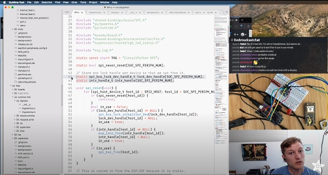
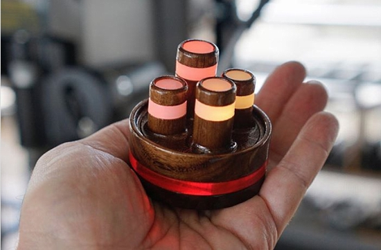
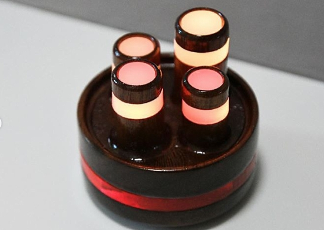
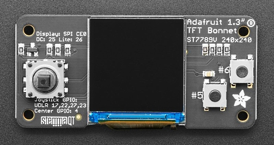
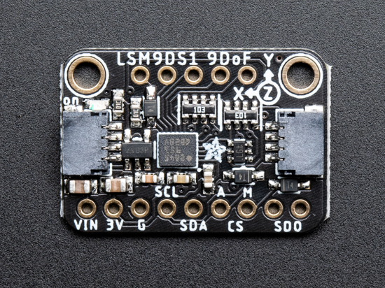
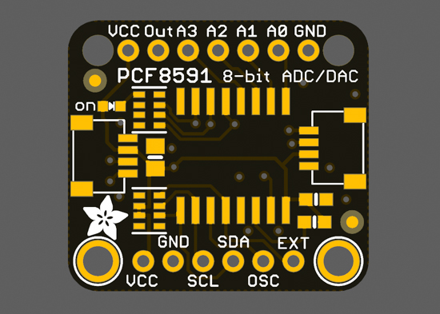
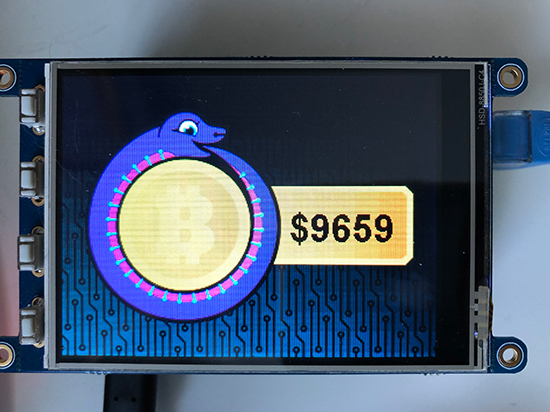
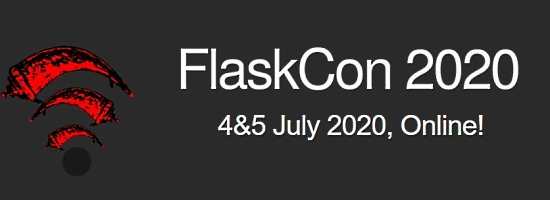
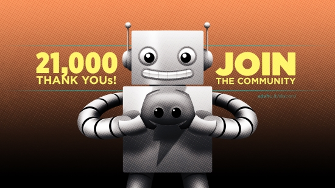

- [X] Kattni updates
- [ ] change date
- [ ] update title
- [ ] Feature story
- [ ] Update  for images
- [ ] Update ICYDNCI
- [ ] All images 550w max only
- [ ] Link "View this email in your browser."

View this email in your browser.

Hi everyone! It's the latest Python for Microcontrollers newsletter, brought you by the community! We're on [Discord](https://discord.gg/HYqvREz), [Twitter](https://twitter.com/search?q=circuitpython&src=typed_query&f=live), and for past newsletters - [view them all here](https://www.adafruitdaily.com/category/circuitpython/). If you're reading this on the web, [subscribe here](https://www.adafruitdaily.com/). Let's get started!

## Headline Article

Text

## Feature

Text

## CircuitPython Deep Dive Stream with Scott Shawcroft

This week, Scott streams his work on .

You can see the latest video and past videos on the Adafruit YouTube channel under the Deep Dive playlist - [YouTube](https://www.youtube.com/playlist?list=PLjF7R1fz_OOXBHlu9msoXq2jQN4JpCk8A).

## Adafruit Update

**Adafruit is shipping regular (non-emergency) orders after priority orders are filled.**

If you have been waiting to order, read [Adafruit's announcement and FAQ](https://www.adafruit.com/opensafely) and then [Shop Adafruit](https://www.adafruit.com/).

Note: there may be a number of out of stock items as manufacturing gears back up. Adafruit suggests if an item is out of stock and needed, searching at [resellers](https://www.adafruit.com/distributors) may yield results. In the US, [Digi-Key](https://www.digikey.com/en/supplier-centers/a/adafruit?WT.z_link_source=Supplier%2520Index) is suggested.

## News from around the web!

Tinytown is a palm-size light-emitting sculpture which is rechargeable and portable. A CircuitPython controller randomly and continually fades individual RGB LEDs through a range of warm colors. The piece can operate plugged to a USB outlet or untethered for more than 5 hours per recharge - [Instagram](https://www.instagram.com/p/CB1BtreB3Vj/?igshid=86i7e3y2oxyv).

**#ICYDNCI What was the most popular, most clicked link, in [last week's newsletter](https://link)? [title](url).**

## Coming soon

## New Boards Supported by CircuitPython

The number of supported microcontrollers and Single Board Computers (SBC) grows every week. This section outlines which boards have been included in CircuitPython or added to [CircuitPython.org](https://circuitpython.org/).

This week we had X new boards added!

- [Board name](url)

Looking for adding a new board to CircuitPython? It's highly encouraged! Adafruit has four guides to help you do so:

- [How to Add a New Board to CircuitPython](https://learn.adafruit.com/how-to-add-a-new-board-to-circuitpython/overview)
- [How to add a New Board to the circuitpython.org website](https://learn.adafruit.com/how-to-add-a-new-board-to-the-circuitpython-org-website)
- [Adding a Single Board Computer to PlatformDetect for Blinka](https://learn.adafruit.com/adding-a-single-board-computer-to-platformdetect-for-blinka)
- [Adding a Single Board Computer to Blinka](https://learn.adafruit.com/adding-a-single-board-computer-to-blinka)

## New Learn Guides!

[LED Protest Sign](https://learn.adafruit.com/led-protest-sign) from [John Park](https://learn.adafruit.com/users/johnpark)

[Pathfinder Robot Companion](https://learn.adafruit.com/pathfinder) from [John Park](https://learn.adafruit.com/users/johnpark)

[Esenciales para CircuitPython](https://learn.adafruit.com/esenciales-para-circuitpython) from [Àlvaro Figueroa](https://learn.adafruit.com/users/fede2)

[Adafruit 1.3" Color TFT Bonnet for Raspberry Pi](https://learn.adafruit.com/adafruit-1-3-color-tft-bonnet-for-raspberry-pi) from [Melissa LeBlanc-Williams and Kattni](https://learn.adafruit.com/users/MakerMelissa)

## CircuitPython Libraries!

CircuitPython support for hardware continues to grow. We are adding support for new sensors and breakouts all the time, as well as improving on the drivers we already have. As we add more libraries and update current ones, you can keep up with all the changes right here!

For the latest libraries, download the [Adafruit CircuitPython Library Bundle](https://circuitpython.org/libraries). For the latest community contributed libraries, download the [CircuitPython Community Bundle](https://github.com/adafruit/CircuitPython_Community_Bundle/releases).

If you'd like to contribute, CircuitPython libraries are a great place to start. Have an idea for a new driver? File an issue on [CircuitPython](https://github.com/adafruit/circuitpython/issues)! Have you written a library you'd like to make available? Submit it to the [CircuitPython Community Bundle](https://github.com/adafruit/CircuitPython_Community_Bundle). Interested in helping with current libraries? Check out the [CircuitPython.org Contributing page](https://circuitpython.org/contributing). We've included open pull requests and issues from the libraries, and details about repo-level issues that need to be addressed. We have a guide on [contributing to CircuitPython with Git and Github](https://learn.adafruit.com/contribute-to-circuitpython-with-git-and-github) if you need help getting started. You can also find us in the #circuitpython channel on the [Adafruit Discord](https://adafru.it/discord).

You can check out this [list of all the Adafruit CircuitPython libraries and drivers available](https://github.com/adafruit/Adafruit_CircuitPython_Bundle/blob/master/circuitpython_library_list.md). 

The current number of CircuitPython libraries is **260**!

**Updated Libraries!**

Here's this week's updated CircuitPython libraries:

 * [Adafruit_CircuitPython_RFM9x](https://github.com/adafruit/Adafruit_CircuitPython_RFM9x)
 * [Adafruit_CircuitPython_Debouncer](https://github.com/adafruit/Adafruit_CircuitPython_Debouncer)
 * [Adafruit_CircuitPython_BLE_BerryMed_Pulse_Oximeter](https://github.com/adafruit/Adafruit_CircuitPython_BLE_BerryMed_Pulse_Oximeter)
 * [Adafruit_CircuitPython_NTP](https://github.com/adafruit/Adafruit_CircuitPython_NTP)
 * [Adafruit_CircuitPython_MiniMQTT](https://github.com/adafruit/Adafruit_CircuitPython_MiniMQTT)
 * [Adafruit_CircuitPython_BMP280](https://github.com/adafruit/Adafruit_CircuitPython_BMP280)
 * [Adafruit_CircuitPython_Pypixelbuf](https://github.com/adafruit/Adafruit_CircuitPython_Pypixelbuf)
 * [Adafruit_CircuitPython_LED_Animation](https://github.com/adafruit/Adafruit_CircuitPython_LED_Animation)
 * [Adafruit_CircuitPython_BluefruitConnect](https://github.com/adafruit/Adafruit_CircuitPython_BluefruitConnect)
 * [Adafruit_CircuitPython_Display_Text](https://github.com/adafruit/Adafruit_CircuitPython_Display_Text)
 * [Adafruit_CircuitPython_PyBadger](https://github.com/adafruit/Adafruit_CircuitPython_PyBadger)
 * [Adafruit_CircuitPython_RGB_Display](https://github.com/adafruit/Adafruit_CircuitPython_RGB_Display)
 * [Adafruit_CircuitPython_ImageLoad](https://github.com/adafruit/Adafruit_CircuitPython_ImageLoad)

**PyPI Download Stats!**

We've written a special library called Adafruit Blinka that makes it possible to use CircuitPython Libraries on [Raspberry Pi and other compatible single-board computers](https://learn.adafruit.com/circuitpython-on-raspberrypi-linux/). Adafruit Blinka and all the CircuitPython libraries have been deployed to PyPI for super simple installation on Linux! Here are the top 10 CircuitPython libraries downloaded from PyPI in the last week, including the total downloads for those libraries:

Keep checking back for updated download stats coming soon!

## What’s the team up to this week?

What is the team up to this week? Let’s check in!

**Bryan**

This past week saw me updating the guide for the quite popular LSM9DS1 9-DoF IMU from ST. We've had a breakout for this capable little suite of sensors for a while and it has proven to be a favorite. Whenever you can get 9 degrees of freedom in a single package at an affordable price will be popular and the LSM9DS1 is quite popular.

With the LSM9DS1 as popular as it is, we decided it was due an update to join the Stemma QT family by shrinking it down a bit, moving a few things around, slapping on a few [SparkFun Quiic](https://www.sparkfun.com/qwiic ) compatible [Stemma QT](https://learn.adafruit.com/introducing-adafruit-stemma-qt) connectors, and giving it a fresh coat of Adafruit Black. The first version in Classic Blue is quite nice but I must admit the new one has caught my eye.

If you're a fan of the existing form factor, fear not! We're going to keep making the original version alongside the new Stemma QT version.

More recently I've been working on a CircuitPython library for the PCF8591 ADC+DAC combo sensor from NXP. This is a fairly simple but useful little package. It's 8-bit which doesn't quite measure up to the some of the more high-end ADCs and DACs out there but it comes with a DAC as well and it's relatively inexpensive as well as widely available. Having an ADC and DAC in a small package certainly has a lot of potential uses and the QT form factor will make it easy to squeeze into whatever use you find for it.

**Dan**

My main project now is implementing \_bleio yet again (third time!). This time I'm targeting the HCI Bluetooth implementation on ESP32 (not ESP32S2), which is used on our AirLift boards. HCI is a standard serial-based command protocol that’s used for many Bluetooth-capable co-processors.

I fixed a hang in `microcontroller.cpu.voltage` on SAMD51. The problem occurred on some samples of SAMD51 but not others, with identical chip versions. Having two pieces of supposedly identical hardware act differently can make testing difficult.

I'm experimenting with adding a flag to request that on brownout CircuitPython simply restart instead of going into safe mode. This is useful for solar-powered devices not hang up when their batteries start to get too low. 
 
We originally added safe mode to allow recovery when a board starts up and immediately draws so much power that the power supply voltage sags very low or shuts off. In that case you want to be able to fix the offending program. So these are two different use cases that both need to be accommodated.

**Jeff**

After failing to make progress on SDIO support with my crude setup, I ordered a development kit from Microchip with a properly wired SD card slot and an existing demo of its use that I could build from source.

This board, called SAM E54 Xplained Pro, is based on the SAM E54 microcontroller, which is very similar to the SAM D51 that is in so many of Adafruit's boards, but was not yet supported.  There is now an active pull request to support this board in CircuitPython and pave the way for other boards based on SAM E54, and I have also successfully used this board to read SD cards using SDIO, so work on that pull request has resumed.

**Kattni**

This week has been keeping up with miscellaneous. I assisted with the Spanish translation of the CircuitPython Essentials guide. I started the update of the guide [ST 9-DoF Combo Board](https://learn.adafruit.com/st-9-dof-combo) with another [FeatherWing](https://www.adafruit.com/product/4569) that was recently put into the shop. I also included a note about an issue with the silk on the 9-DoF FeatherWings (SCL and SDA are swapped on the silk, but the pins are fine!). I worked with Melissa to write up a guide for the [1.3" Color TFT Bonnet for Raspberry Pi](https://www.adafruit.com/product/4506). I also tested a few PRs and took care of some GitHub issues.

The most involved task ended up being one that I figured would take a minute or two. A while back I wrote a Learn guide for a [Circuit Playground Bluefruit NeoPixel Animation and Color Remote Control](https://learn.adafruit.com/circuit-playground-bluefruit-neopixel-animation-and-color-remote-control). It was brought to my attention that the code for the NeoPixel Animator was no longer working. The fix was obvious: the API had changed in the CircuitPython LED Animation library and so the imports in the NeoPixel Animator code needed to be updated to match. However, once I updated the imports, I noticed the code wasn't functioning as expected. It turns out some updates to the LED Animation library had introduced some bugs that we hadn't encountered until this very specific use case. And, that's how 2 minutes turns into 2 days. But! The bugs were addressed, the code now runs as expected, and the NeoPixel Animator code and guide have been updated to reflect the new import style. Thanks to Tim for helping test all the fixes!

**Lucian**

This past week I've been working on reviews and debugging on a variety of minor issues. My major project as of this week is reworking the timer system on the STM32 to be more flexible - currently, modules can only use a single timer or a subset of timers that have been allocated for them, but that leaves too few timers for new modules like RotaryIO. The new system will share various timers between modules, picking those that are least commonly used externally for internal purposes like PulseIO timing and RGBMatrix management. 

**Melissa**

This past week I started out by finishing updating a 9-DoF sensor calibration guide where I describe how to use a script to calibrate the sensor easily on a Raspberry Pi. You can check out that [guide page](https://learn.adafruit.com/adafruit-sensorlab-magnetometer-calibration/calibration-with-raspberry-pi-using-blinka.).

I have also been working on porting the PyPortal library over to Blinka. This was a fun project because it builds on top of the displayio library that I had already been working on. Since linux already has built in facilities for things like networking, a lot of it involved stripping out things like communicating with the airlift ESP module. Since things like displays are added onto the Raspberry Pi and not built in, I needed to add functionality to be able to define the display, so it likely won't be quite as clean as opening examples written for the PyPortal without modification. At this point I have the BitCoin example running and will be working to make the library more seamless.

Finally, I have been working with Kattni to write a guide for the 1.3" PiTFT Bonnet with Joystick. The learn guide should be out very soon.

**Scott**

This week my focus has been wrapping up SPI on the ESP32-S2. I've gotten TX going with DMA and RX is likely working (will test it tomorrow.) Yay! I made two more changes following this. First, I enabled `displayio` so FourWire (SPI) displays can now be used.

Second, since I was using a Saleae to check the SPI transaction, I noticed that the display initialization was kinda slow. So, I removed a 10ms delay we used to allow the idle task to run and disabled its watchdog. I also changed the CPU speed from 160mhz to 240mhz so that is also speedier.

Next up, I need to make a PR with all of the busio changes. After that, we need to tune up our background tasks and then we can work to releasing 6.0.0. (5.4.0 will be renamed 6.0.0 because we're renaming I2CSlave to I2CPeripheral.)

## Upcoming events!

FlaskCon is a community driven Flask event being held July 4th and 5th. It is intended for speakers and attendees all over the world to participate in technical and evangelical sessions related to Flask. Flask is a micro web framework written in Python - [Event](https://flaskcon.com/) and [Call for Papers](https://sessionize.com/flaskcon).

EuroPython 2020 this year will be an online conference from July 23-26. The schedule is now available - [Website](https://ep2020.europython.eu/schedule/).

Attending the conference days will require a ticket, participating in the sprint days will be free - [EuroPython](https://blog.europython.eu/post/614102095419850752/europython-2020-online-conference-from-july-23-26).

PyCon AU has announced they are holding PyConline AU, an online event, in August 2020 -  [pycon.org.au](https://2020.pycon.org.au/).

PyCon India 2020: the premier conference in India on using and developing the Python programming language. Held online October 3-5, 2020. A [call for proposals](https://in.pycon.org/cfp/2020/proposals/) is now open through August 14, 2020. - [Website](https://in.pycon.org/2020/) and [Twitter](https://twitter.com/pyconindia)

**Send Your Events In**

As for other events, with the COVID pandemic, most in-person events are postponed or cancelled. If you know of virtual events or events that may occur in the future, please let us know on Discord or on Twitter with hashtag #CircuitPython.

## Latest releases

CircuitPython's stable release is [#.#.#](https://github.com/adafruit/circuitpython/releases/latest) and its unstable release is [#.#.#-##.#](https://github.com/adafruit/circuitpython/releases). New to CircuitPython? Start with our [Welcome to CircuitPython Guide](https://learn.adafruit.com/welcome-to-circuitpython).

[2019####](https://github.com/adafruit/Adafruit_CircuitPython_Bundle/releases/latest) is the latest CircuitPython library bundle.

[v#.#.#](https://micropython.org/download) is the latest MicroPython release. Documentation for it is [here](http://docs.micropython.org/en/latest/pyboard/).

[#.#.#](https://www.python.org/downloads/) is the latest Python release. The latest pre-release version is [#.#.#](https://www.python.org/download/pre-releases/).

[1759 Stars](https://github.com/adafruit/circuitpython/stargazers) Like CircuitPython? [Star it on GitHub!](https://github.com/adafruit/circuitpython)

## Call for help -- Translating CircuitPython is now easier than ever!

One important feature of CircuitPython is translated control and error messages.

With the help of fellow open source project [Weblate](https://weblate.org/), we're making it even easier to add or improve translations.

Sign in with an existing account such as Github, Google or Facebook and start contributing through a simple web interface. No forks or pull requests needed!

As always, if you run into trouble join us on [Discord](https://adafru.it/discord), we're here to help.

## jobs.adafruit.com - Find a dream job, find great candidates!

[jobs.adafruit.com](https://jobs.adafruit.com/) has returned and folks are posting their skills (including CircuitPython) and companies are looking for talented makers to join their companies - from Digi-Key, to Hackaday, Microcenter, Raspberry Pi and more.

## NUMBER thanks!

The Adafruit Discord community, where we do all our CircuitPython development in the open, reached over NUMBER humans, thank you!  Adafruit believes Discord offers a unique way for CircuitPython folks to connect. Join today at [https://adafru.it/discord](https://adafru.it/discord).

## ICYMI - In case you missed it

The wonderful world of Python on hardware! This is our first video-newsletter-podcast that we’ve started! The news comes from the Python community, Discord, Adafruit communities and more. It’s part of the weekly newsletter, then we have a segment on ASK an ENGINEER and this is the video slice from that! The complete Python on Hardware weekly videocast [playlist is here](https://www.youtube.com/playlist?list=PLjF7R1fz_OOXRMjM7Sm0J2Xt6H81TdDev). 

This video podcast is on [iTunes](https://itunes.apple.com/us/podcast/python-on-hardware/id1451685192?mt=2), [YouTube](http://adafru.it/pohepisodes), [IGTV (Instagram TV](https://www.instagram.com/adafruit/channel/)), and [XML](https://itunes.apple.com/us/podcast/python-on-hardware/id1451685192?mt=2).

[Weekly community chat on Adafruit Discord server CircuitPython channel - Audio / Podcast edition](https://itunes.apple.com/us/podcast/circuitpython-weekly-meeting/id1451685016) - Audio from the Discord chat space for CircuitPython, meetings are usually Mondays at 2pm ET, this is the audio version on [iTunes](https://itunes.apple.com/us/podcast/circuitpython-weekly-meeting/id1451685016), Pocket Casts, [Spotify](https://adafru.it/spotify), and [XML feed](https://adafruit-podcasts.s3.amazonaws.com/circuitpython_weekly_meeting/audio-podcast.xml).

And lastly, we are working up a one-spot destination for all things podcast-able here - [podcasts.adafruit.com](https://podcasts.adafruit.com/)

## Codecademy "Learn Hardware Programming with CircuitPython"

Codecademy, an online interactive learning platform used by more than 45 million people, has teamed up with the leading manufacturer in STEAM electronics, Adafruit Industries, to create a coding course, "Learn Hardware Programming with CircuitPython". The course is now available in the [Codecademy catalog](https://www.codecademy.com/learn/learn-circuitpython?utm_source=adafruit&utm_medium=partners&utm_campaign=circuitplayground&utm_content=pythononhardwarenewsletter).

Python is a highly versatile, easy to learn programming language that a wide range of people, from visual effects artists in Hollywood to mission control at NASA, use to quickly solve problems. But you don’t need to be a rocket scientist to accomplish amazing things with it. This new course introduces programmers to Python by way of a microcontroller — CircuitPython — which is a Python-based programming language optimized for use on hardware.

CircuitPython’s hardware-ready design makes it easier than ever to program a variety of single-board computers, and this course gets you from no experience to working prototype faster than ever before. Codecademy’s interactive learning environment, combined with Adafruit's highly rated Circuit Playground Express, present aspiring hardware hackers with a never-before-seen opportunity to learn hardware programming seamlessly online.

Whether for those who are new to programming, or for those who want to expand their skill set to include physical computing, this course will have students getting familiar with Python and creating incredible projects along the way. By the end, students will have built their own bike lights, drum machine, and even a moisture detector that can tell when it's time to water a plant.

Visit Codecademy to access the [Learn Hardware Programming with CircuitPython](https://www.codecademy.com/learn/learn-circuitpython?utm_source=adafruit&utm_medium=partners&utm_campaign=circuitplayground&utm_content=pythononhardwarenewsletter) course and Adafruit to purchase a [Circuit Playground Express](https://www.adafruit.com/product/3333).

Codecademy has helped more than 45 million people around the world upgrade their careers with technology skills. The company’s online interactive learning platform is widely recognized for providing an accessible, flexible, and engaging experience for beginners and experienced programmers alike. Codecademy has raised a total of $43 million from investors including Union Square Ventures, Kleiner Perkins, Index Ventures, Thrive Capital, Naspers, Yuri Milner and Richard Branson, most recently raising its $30 million Series C in July 2016.

## Contribute!

The CircuitPython Weekly Newsletter is a CircuitPython community-run newsletter emailed every Tuesday. The complete [archives are here](https://www.adafruitdaily.com/category/circuitpython/). It highlights the latest CircuitPython related news from around the web including Python and MicroPython developments. To contribute, edit next week's draft [on GitHub](https://github.com/adafruit/circuitpython-weekly-newsletter/tree/gh-pages/_drafts) and [submit a pull request](https://help.github.com/articles/editing-files-in-your-repository/) with the changes. Join our [Discord](https://adafru.it/discord) or [post to the forum](https://forums.adafruit.com/viewforum.php?f=60) for any further questions.
