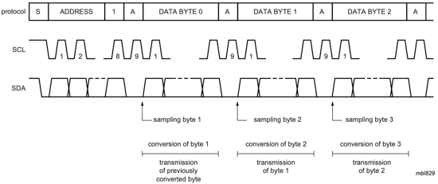
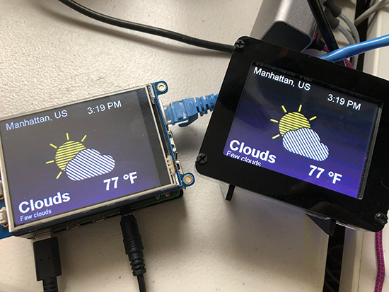
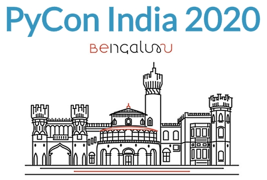

- [ ] Kattni updates
- [ ] change date
- [ ] update title
- [ ] Feature story
- [ ] Update  for images
- [ ] Update ICYDNCI
- [ ] All images 550w max only
- [ ] Link "View this email in your browser."

View this email in your browser.

Happy July! It's the latest Python for Microcontrollers newsletter, brought you by the community! We're on [Discord](https://discord.gg/HYqvREz), [Twitter](https://twitter.com/search?q=circuitpython&src=typed_query&f=live), and for past newsletters - [view them all here](https://www.adafruitdaily.com/category/circuitpython/). If you're reading this on the web, [subscribe here](https://www.adafruitdaily.com/). Let's get started!

## Headline Article

Text

## Feature

Text

## CircuitPython Deep Dive Stream with Scott Shawcroft

This week, Scott streams his work on .

You can see the latest video and past videos on the Adafruit YouTube channel under the Deep Dive playlist - [YouTube](https://www.youtube.com/playlist?list=PLjF7R1fz_OOXBHlu9msoXq2jQN4JpCk8A).

## Adafruit Update

**Adafruit is shipping regular (non-emergency) orders after priority orders are filled.**

If you have been waiting to order, read [Adafruit's announcement and FAQ](https://www.adafruit.com/opensafely) and then [Shop Adafruit](https://www.adafruit.com/).

Note: there may be a number of out of stock items as manufacturing gears back up. Adafruit suggests if an item is out of stock and needed, searching at [resellers](https://www.adafruit.com/distributors) may yield results. In the US, [Digi-Key](https://www.digikey.com/en/supplier-centers/a/adafruit?WT.z_link_source=Supplier%2520Index) is suggested.

## News from around the web!

Text

**#ICYDNCI What was the most popular, most clicked link, in [last week's newsletter](https://link)? [title](url).**

## Made with Mu

Why Mu? Mu tries to make it as easy as possible to get started with programming but aims to help you graduate to "real" development tools soon after. Everything in Mu is the "real thing" but presented in as simple and obvious way possible. It's like the toddling stage in learning to walk: you're finding your feet and once you're confident, you should move on and explore! Put simply, Mu aims to foster autonomy. Try out Mu today! - [codewith.mu](https://codewith.mu/)

## Coming soon

## New Boards Supported by CircuitPython

The number of supported microcontrollers and Single Board Computers (SBC) grows every week. This section outlines which boards have been included in CircuitPython or added to [CircuitPython.org](https://circuitpython.org/).

This week we had X new boards added!

- [Board name](url)

Looking for adding a new board to CircuitPython? It's highly encouraged! Adafruit has four guides to help you do so:

- [How to Add a New Board to CircuitPython](https://learn.adafruit.com/how-to-add-a-new-board-to-circuitpython/overview)
- [How to add a New Board to the circuitpython.org website](https://learn.adafruit.com/how-to-add-a-new-board-to-the-circuitpython-org-website)
- [Adding a Single Board Computer to PlatformDetect for Blinka](https://learn.adafruit.com/adding-a-single-board-computer-to-platformdetect-for-blinka)
- [Adding a Single Board Computer to Blinka](https://learn.adafruit.com/adding-a-single-board-computer-to-blinka)

## New Learn Guides!

[title](url) from [name](url)

## Updated Learn Guides!

[title](url) from [name](url)

## CircuitPython Libraries!

CircuitPython support for hardware continues to grow. We are adding support for new sensors and breakouts all the time, as well as improving on the drivers we already have. As we add more libraries and update current ones, you can keep up with all the changes right here!

For the latest libraries, download the [Adafruit CircuitPython Library Bundle](https://circuitpython.org/libraries). For the latest community contributed libraries, download the [CircuitPython Community Bundle](https://github.com/adafruit/CircuitPython_Community_Bundle/releases).

If you'd like to contribute, CircuitPython libraries are a great place to start. Have an idea for a new driver? File an issue on [CircuitPython](https://github.com/adafruit/circuitpython/issues)! Have you written a library you'd like to make available? Submit it to the [CircuitPython Community Bundle](https://github.com/adafruit/CircuitPython_Community_Bundle). Interested in helping with current libraries? Check out the [CircuitPython.org Contributing page](https://circuitpython.org/contributing). We've included open pull requests and issues from the libraries, and details about repo-level issues that need to be addressed. We have a guide on [contributing to CircuitPython with Git and Github](https://learn.adafruit.com/contribute-to-circuitpython-with-git-and-github) if you need help getting started. You can also find us in the #circuitpython channel on the [Adafruit Discord](https://adafru.it/discord).

You can check out this [list of all the Adafruit CircuitPython libraries and drivers available](https://github.com/adafruit/Adafruit_CircuitPython_Bundle/blob/master/circuitpython_library_list.md). 

The current number of CircuitPython libraries is **###**!

**New Libraries!**

Here's this week's new CircuitPython libraries:

* [library](url)

**Updated Libraries!**

Here's this week's updated CircuitPython libraries:

* [library](url)

**PyPI Download Stats!**

We've written a special library called Adafruit Blinka that makes it possible to use CircuitPython Libraries on [Raspberry Pi and other compatible single-board computers](https://learn.adafruit.com/circuitpython-on-raspberrypi-linux/). Adafruit Blinka and all the CircuitPython libraries have been deployed to PyPI for super simple installation on Linux! Here are the top 10 CircuitPython libraries downloaded from PyPI in the last week, including the total downloads for those libraries:

Keep checking back for updated download stats coming soon!

## What’s the team up to this week?

What is the team up to this week? Let’s check in!

**Bryan**

Another week, more libraries, and new revision of the CAN FeatherWing. We decided to switch to using an older CAN controller at least for early iterations because the available libraries for it are more mature. Once we get a handle on things we will consider moving to a newer and likely faster chip. I also worked on a quick and relatively simple CircuitPython library for the BH1750 ambient light sensor from Rohm.

Earlier in the week I worked on wrapping up the CircuitPython library for the PCF8591 ADC+DAC combo chip but ran into some strange behavior while testing before release. When I was reading the ADC for more than one channel, the results for the channel were getting switched around! To cut a long story slightly shorter, after verifying that my wiring was correct I dug into the datasheet to read about the timing of how the ADC reads are trigger and returned. As it turns out, an ADC reading is triggered on the rising/trailing edge of the ACK/NACK clock pulse. The _result_ for that measurement is returned in response to the _second_ read after the measurement is triggered.

To understand why this caused me a headache, I'll briefly explain how reading from a sensor on an I2C bus generally works. This is a very simplified diagram and not to scale so bear with  me:

Generally but not always, every I2C transaction between a microcontroller and a sensor on the bus starts with the address of the intended recipient

With that implied, to read a register, the normal pattern from the perspective of the micro:

In these cases, you're generally reading a register that already has the data available to send back, so after the mcu sends the address of the register it wants to read, it can immediately read the response back, even without giving up control of the bus.

Since in this case we're talking to an ADC that starts taking a new measurement as soon as it's requested, this won't work because the data hasn't been generated and it takes a bit of time to do so. Rather than sitting around waiting for the measurement to finish the ADC kindly does two things at once: it starts measuring the requested channel, and while it's doing that it returns the result for the previous request. That ends up looking approximately like:

This is explained in the datasheet of course, and it even includes this handy diagram:

So, you can see why our reads were delayed. It was by design! Once we accounted for this in the libraries all was well, but it took some head scratching  to figure out. Let this serve as a reminder: The Datasheet Has All The Answers (except for when it doesn't and it's in the errata that you neglected to read).

**Dan**

I'm continuing to work on an implementation of _bleio that supports the HCI Bluetooth protocol available on ESP32, used on our AirLift boards. I have "first light": I can talk to the ESP32 and ask it simple commands.

I've also fixed a number of small bugs in various BLE libraries, and there are more still to fix.

We have decided to move our next CircuitPython alpha or beta release from 5.4.0 to 6.0.0, so that we can make some incompatible changes, which are allowed when we do a major version change. Watch for a new release soon!

**Kattni**

I've been working on various guides this week. I updated the BNO055 guide to include the STEMMA QT version of the board. As this board is so popular, we will continue carrying the previous header-only version as well, so the guide update was simply integrating the STEMMA QT version. I finished updating the ST 9-DoF Combo Boards guide with the final FeatherWing. I started work on a guide to using the 74HC595 shift register. The guide will provide basic info about the chip including pinouts. It will also include an example of using it to control 8 LEDs using CircuitPython, with a detailed wiring diagram to help you get it going.

We haven't had PyPI download stats available for some time as the site we were getting them from instituted rate limiting and we were well over the limit with the number of libraries we were querying. Thanks to sommersoft's research, we now have a way to roll our own query, though it has a few necessary prerequisites before we can get that going. We should have it up and have download stats available again soon.

As well, thanks to sommersoft, I have the tools necessary to shift the CircuitPython libraries from using the default branch master on GitHub to using the default branch main. I am looking forward to updating all of the CircuitPython libraries to this change to welcoming and inclusive language. We have already shifted the CircuitPython core to main, and will be making the move across the rest of the project soon.

**Lucian**

This past week I worked on creating a timer management system for STM32, which allows various different modules in the port to share a pool of timer peripherals. The system allows modules to prioritize certain kinds of timers based on whether they have pins exposed, aiming for the minimum number of conflicts possible between internal timer use (such as in modules like PulseOut or RGBMatrix) and external use (PWMOut). I also worked on some miscellaneous bugfixes to modules and peripherals affected by this new timer mediator, and fixed a crash related to simplex SPI on the STM32. 

**Melissa**

This past week I ported the PyPortal library over to Blinka so that many of the PyPortal examples work with little modification. As I've ported over examples, I've found small bugs both in the PyPortal library and displayio for Blinka that I have been slowly fixing, which is leading to a more stable displayio for Raspberry Pi and other Single Board computers.

**Scott**

This last week I've tested and debugged the busio implementation on ESP32-S2. My stream last week was me stumped by internal seemingly being crossed when doing SPI. Only after the stream did I realize there was another setting that was messing me up. Luckily, I sorted it out and got the PR. It's been reviewed and will be checked in shortly.

This week, I'm starting to work on our network related libraries and brainstorming what the API should be from CircuitPython on the ESP32-S2. I'm also hoping to reduce the memory overhead of making json requests because they are very common. I may also add memory debugging/monitoring APIs to better track how many allocations occur and what size for a section of code.

## Upcoming events!

FlaskCon is a community driven Flask event being held July 4th and 5th. It is intended for speakers and attendees all over the world to participate in technical and evangelical sessions related to Flask. Flask is a micro web framework written in Python - [Event](https://flaskcon.com/) and [Call for Papers](https://sessionize.com/flaskcon).

EuroPython 2020 this year will be an online conference from July 23-26. The schedule is now available - [Website](https://ep2020.europython.eu/schedule/).

Attending the conference days will require a ticket, participating in the sprint days will be free - [EuroPython](https://blog.europython.eu/post/614102095419850752/europython-2020-online-conference-from-july-23-26).

PyCon AU has announced they are holding PyConline AU, an online event, in August 2020 -  [pycon.org.au](https://2020.pycon.org.au/).

PyCon India 2020: the premier conference in India on using and developing the Python programming language. Held online October 3-5, 2020. A [call for proposals](https://in.pycon.org/cfp/2020/proposals/) is now open through August 14, 2020. - [Website](https://in.pycon.org/2020/) and [Twitter](https://twitter.com/pyconindia)

**Send Your Events In**

As for other events, with the COVID pandemic, most in-person events are postponed or cancelled. If you know of virtual events or events that may occur in the future, please let us know on Discord or on Twitter with hashtag #CircuitPython.

## Latest releases

CircuitPython's stable release is [#.#.#](https://github.com/adafruit/circuitpython/releases/latest) and its unstable release is [#.#.#-##.#](https://github.com/adafruit/circuitpython/releases). New to CircuitPython? Start with our [Welcome to CircuitPython Guide](https://learn.adafruit.com/welcome-to-circuitpython).

[2019####](https://github.com/adafruit/Adafruit_CircuitPython_Bundle/releases/latest) is the latest CircuitPython library bundle.

[v#.#.#](https://micropython.org/download) is the latest MicroPython release. Documentation for it is [here](http://docs.micropython.org/en/latest/pyboard/).

[#.#.#](https://www.python.org/downloads/) is the latest Python release. The latest pre-release version is [#.#.#](https://www.python.org/download/pre-releases/).

[### Stars](https://github.com/adafruit/circuitpython/stargazers) Like CircuitPython? [Star it on GitHub!](https://github.com/adafruit/circuitpython)

## Call for help -- Translating CircuitPython is now easier than ever!

One important feature of CircuitPython is translated control and error messages.

With the help of fellow open source project [Weblate](https://weblate.org/), we're making it even easier to add or improve translations.

Sign in with an existing account such as Github, Google or Facebook and start contributing through a simple web interface. No forks or pull requests needed!

As always, if you run into trouble join us on [Discord](https://adafru.it/discord), we're here to help.

## jobs.adafruit.com - Find a dream job, find great candidates!

[jobs.adafruit.com](https://jobs.adafruit.com/) has returned and folks are posting their skills (including CircuitPython) and companies are looking for talented makers to join their companies - from Digi-Key, to Hackaday, Microcenter, Raspberry Pi and more.

## NUMBER thanks!

The Adafruit Discord community, where we do all our CircuitPython development in the open, reached over NUMBER humans, thank you!  Adafruit believes Discord offers a unique way for CircuitPython folks to connect. Join today at [https://adafru.it/discord](https://adafru.it/discord).

## ICYMI - In case you missed it

The wonderful world of Python on hardware! This is our first video-newsletter-podcast that we’ve started! The news comes from the Python community, Discord, Adafruit communities and more. It’s part of the weekly newsletter, then we have a segment on ASK an ENGINEER and this is the video slice from that! The complete Python on Hardware weekly videocast [playlist is here](https://www.youtube.com/playlist?list=PLjF7R1fz_OOXRMjM7Sm0J2Xt6H81TdDev). 

This video podcast is on [iTunes](https://itunes.apple.com/us/podcast/python-on-hardware/id1451685192?mt=2), [YouTube](http://adafru.it/pohepisodes), [IGTV (Instagram TV](https://www.instagram.com/adafruit/channel/)), and [XML](https://itunes.apple.com/us/podcast/python-on-hardware/id1451685192?mt=2).

[Weekly community chat on Adafruit Discord server CircuitPython channel - Audio / Podcast edition](https://itunes.apple.com/us/podcast/circuitpython-weekly-meeting/id1451685016) - Audio from the Discord chat space for CircuitPython, meetings are usually Mondays at 2pm ET, this is the audio version on [iTunes](https://itunes.apple.com/us/podcast/circuitpython-weekly-meeting/id1451685016), Pocket Casts, [Spotify](https://adafru.it/spotify), and [XML feed](https://adafruit-podcasts.s3.amazonaws.com/circuitpython_weekly_meeting/audio-podcast.xml).

And lastly, we are working up a one-spot destination for all things podcast-able here - [podcasts.adafruit.com](https://podcasts.adafruit.com/)

## Codecademy "Learn Hardware Programming with CircuitPython"

Codecademy, an online interactive learning platform used by more than 45 million people, has teamed up with the leading manufacturer in STEAM electronics, Adafruit Industries, to create a coding course, "Learn Hardware Programming with CircuitPython". The course is now available in the [Codecademy catalog](https://www.codecademy.com/learn/learn-circuitpython?utm_source=adafruit&utm_medium=partners&utm_campaign=circuitplayground&utm_content=pythononhardwarenewsletter).

Python is a highly versatile, easy to learn programming language that a wide range of people, from visual effects artists in Hollywood to mission control at NASA, use to quickly solve problems. But you don’t need to be a rocket scientist to accomplish amazing things with it. This new course introduces programmers to Python by way of a microcontroller — CircuitPython — which is a Python-based programming language optimized for use on hardware.

CircuitPython’s hardware-ready design makes it easier than ever to program a variety of single-board computers, and this course gets you from no experience to working prototype faster than ever before. Codecademy’s interactive learning environment, combined with Adafruit's highly rated Circuit Playground Express, present aspiring hardware hackers with a never-before-seen opportunity to learn hardware programming seamlessly online.

Whether for those who are new to programming, or for those who want to expand their skill set to include physical computing, this course will have students getting familiar with Python and creating incredible projects along the way. By the end, students will have built their own bike lights, drum machine, and even a moisture detector that can tell when it's time to water a plant.

Visit Codecademy to access the [Learn Hardware Programming with CircuitPython](https://www.codecademy.com/learn/learn-circuitpython?utm_source=adafruit&utm_medium=partners&utm_campaign=circuitplayground&utm_content=pythononhardwarenewsletter) course and Adafruit to purchase a [Circuit Playground Express](https://www.adafruit.com/product/3333).

Codecademy has helped more than 45 million people around the world upgrade their careers with technology skills. The company’s online interactive learning platform is widely recognized for providing an accessible, flexible, and engaging experience for beginners and experienced programmers alike. Codecademy has raised a total of $43 million from investors including Union Square Ventures, Kleiner Perkins, Index Ventures, Thrive Capital, Naspers, Yuri Milner and Richard Branson, most recently raising its $30 million Series C in July 2016.

## Contribute!

The CircuitPython Weekly Newsletter is a CircuitPython community-run newsletter emailed every Tuesday. The complete [archives are here](https://www.adafruitdaily.com/category/circuitpython/). It highlights the latest CircuitPython related news from around the web including Python and MicroPython developments. To contribute, edit next week's draft [on GitHub](https://github.com/adafruit/circuitpython-weekly-newsletter/tree/gh-pages/_drafts) and [submit a pull request](https://help.github.com/articles/editing-files-in-your-repository/) with the changes. Join our [Discord](https://adafru.it/discord) or [post to the forum](https://forums.adafruit.com/viewforum.php?f=60) for any further questions.
