- [X] Kattni updates
- [ ] change date
- [ ] update title
- [ ] Feature story
- [ ] Update  for images
- [ ] Update ICYDNCI
- [ ] All images 550w max only
- [ ] Link "View this email in your browser."

View this email in your browser.

Welcome, here's the latest Python for Microcontrollers newsletter, brought you by the community! We're on [Discord](https://discord.gg/HYqvREz), [Twitter](https://twitter.com/search?q=circuitpython&src=typed_query&f=live), and for past newsletters - [view them all here](https://www.adafruitdaily.com/category/circuitpython/). If you're reading this on the web, [subscribe here](https://www.adafruitdaily.com/). 

## Headline Article

Text

## An electronic security lock with CircuitPython and an Adafruit PyPortal

[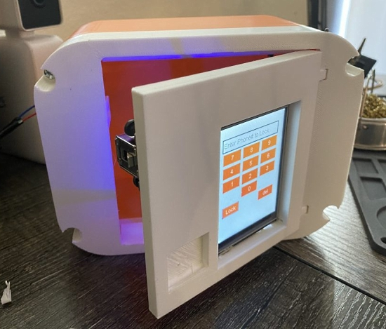](https://idk.dev/building-an-electronic-security-lock-using-serverless/)

Build an electronic security lock for package delivery, securing physical documents, or granting access to a secret lab. This project uses AWS Serverless to create a touchscreen keypad lock that uses SMS to alert a recipient with a custom message and unlock code.

CircuitPython runs on an Adafruit PyPortal open-source IoT touch display. A relay wired to the PyPortal acts as an electronic switch to bridge power to an electronic solenoid lock - [idk.dev](https://idk.dev/building-an-electronic-security-lock-using-serverless/).

## CLUE Internet Data Display

[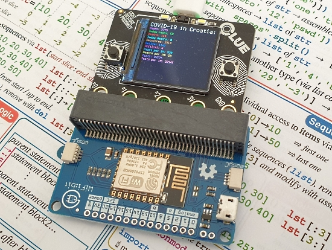](https://twitter.com/PlusPlusInt/status/1283004659913957376?s=09)

With Adafruit's CLUE, CircuitPython and e-radionica's WiFibit, it's simple to fetch data from the Internet and show it on screen - [Twitter](https://twitter.com/PlusPlusInt/status/1283004659913957376?s=09) and commented [example code](https://drive.google.com/file/d/1sJsW3r12_vnLUIJXL_1vZ0xPcK2UlQ62/edit).

## Events happening this coming week

### EuroPython Conference July 23 - 26

EuroPython 2020 this year will be an online conference from July 23-26. The schedule is now available - [Website](https://ep2020.europython.eu/schedule/).

Attending the conference days will require a ticket, participating in the sprint days will be free - [EuroPython](https://blog.europython.eu/post/614102095419850752/europython-2020-online-conference-from-july-23-26).

### PyOhio 2020 July 25-26

The 13th annual PyOhio will be July 25-26, 2020. The online event will consist of 5 and 10-minute talks, sprints, and discussion - [Events Overview](https://www.pyohio.org/2020/events/overview/) and [Registration](https://www.pyohio.org/2020/attend/register/).

PyOhio typically uses t-shirt sales as their primary fundraiser. Because the costs of running the virtual event this year are low and because they aren't able to host their Young Coders class, they've decided to use their fundraiser to support an organization that aligns with our mission: [Black Girls CODE](https://www.blackgirlscode.com/).

Shipping 2 weeks after the conference, they're available in 3 cuts. Be sure to check the sizing charts for each as they're all different! - [Order your t-shirts here!](https://www.customink.com/fundraising/pyohio-2020)

## Can you use Python with Google Maps? Yes, you can

[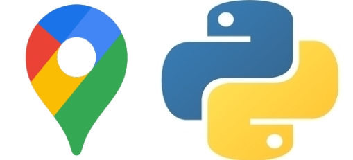](https://github.com/googlemaps/google-maps-services-python)

Did you know there is a Python Client for Google Maps Services? There is! It wouldn't exist but for [Mariatta](https://twitter.com/mariatta) who [posts](https://twitter.com/mariatta/status/1283097901443379200):

> Was trying to find a list of restaurants for future road trip then I thought "why not write the code for doing it?" One thing lead to another and that's how I got a merged pull request in Google Maps Python client library

See Mariatta's [Twitter Post](https://twitter.com/mariatta/status/1283097901443379200) and the API information on [GitHub](https://github.com/googlemaps/google-maps-services-python).

## CircuitPython Deep Dive Stream with Scott Shawcroft

[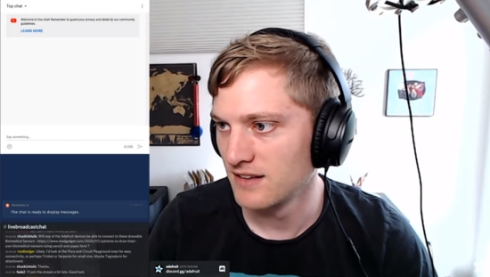](https://youtu.be/iQQLMhxAR34)

This week, Scott streams his work on allocation optimization. The plan is to recap the ESP32SPI memory optimizations, discuss the new `memorymonitor` module and polish everything up.

You can see the latest video and past videos on the Adafruit YouTube channel under the Deep Dive playlist - [YouTube](https://www.youtube.com/playlist?list=PLjF7R1fz_OOXBHlu9msoXq2jQN4JpCk8A).

## Using Real-time Clocks with CircuitPython

[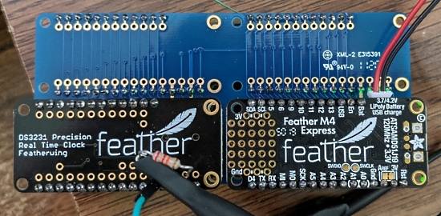](https://emergent.unpythonic.net/01594912346)

Jeff Epler has done a deep-dive into using the [PCF8523](https://www.adafruit.com/product/2922) and [DS3231](https://www.adafruit.com/product/3028) real-time clock circuits, which Adafruit sells in Feather form factor boards. Sample code is provided to detect which of these two boards may be connected to a CircuitPython host as they both use the same I2C addess but different register layouts - [Blog](https://emergent.unpythonic.net/01594912346).

In a companion post, Jeff discusses calibrating the DS3231 and PCF8523 RTCs against a known frequency source - [Blog](https://emergent.unpythonic.net/01594923755).

## Microsoft seeks a Senior Program Manager 

Microsoft's Developer Division is looking a Senior Program Manager to help make Azure the best cloud for Python developers - [Microsoft Careers](https://careers.microsoft.com/us/en/job/788078/Senior-Program-Manager) and [Twitter](https://twitter.com/qubitron/status/1283791148687880192).

And for more jobs in Maker and tech industries, visit the Adafruit Jobs Board - it's free for you and companies to use - [jobs.adafruit.com](https://jobs.adafruit.com/).

## News from around the web!

[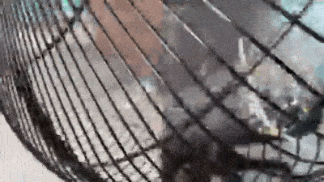](https://twitter.com/emwdx/status/1281070083280789505)

[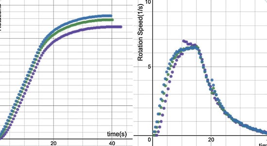](https://twitter.com/emwdx/status/1281070083280789505)

A device to measure the rotation speed of a fan (tachometer). Made with CircuitPython and the Adafruit Circuit Playground Express - [Twitter](https://twitter.com/emwdx/status/1281070083280789505) and [GitHub](https://github.com/emwdx/fan_tachometer).

[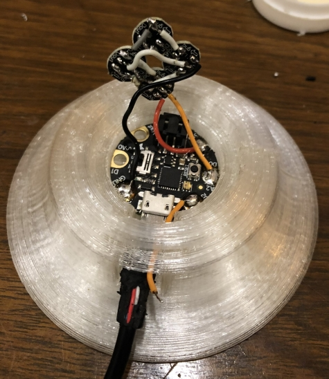](https://twitter.com/iAyanPahwa/status/1284183800579158016)

A light up owl, using an Adafruit [Gemma M0](https://www.adafruit.com/product/3501) microcontroller, [NeoPixels](https://www.adafruit.com/product/1260), and capacitive touch to change the colors with CircuitPython - [Twitter](https://twitter.com/iAyanPahwa/status/1284183800579158016).

A "Hello World" in CircuitPython using NeoPixels and an ADXL335 accelerometer to change the pixel direction according to the accelerometer inclination. Uses the Makerfabs [Maduino](https://www.makerfabs.com/maduino-iot.html) board - [Twitter](https://twitter.com/N10_SoJu3/status/1283422121251799046). 

[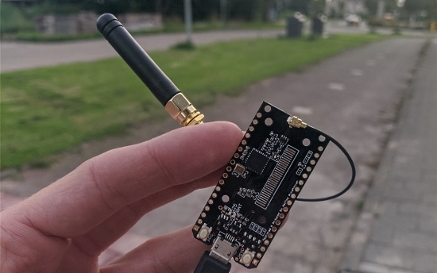](https://medium.com/@JoooostB/how-i-send-my-first-lorawan-message-to-the-things-network-using-a-ttgo-esp32-micropython-a3fe447fff82)

How I sent my first LoRaWAN message to The Things Network using a TTGO ESP32 & MicroPython - [Medium](https://medium.com/@JoooostB/how-i-send-my-first-lorawan-message-to-the-things-network-using-a-ttgo-esp32-micropython-a3fe447fff82).

This utilizes the uLoRa library, a port of the Adafruit CircuitPython Tiny LoRa / LoRaWAN driver to MicroPython. This allows IoT things to transmit light payloads to The Things Network (TTN) - [GitHub](https://github.com/fantasticdonkey/uLoRa).

[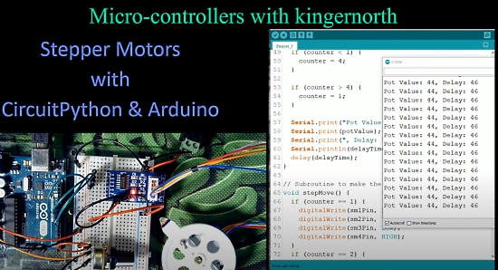](https://www.youtube.com/watch?v=Rs1MZx9vjmU)

Stepper Motors with CircuitPython and Arduino - [YouTube](https://www.youtube.com/watch?v=Rs1MZx9vjmU) and [Twitter](https://twitter.com/kingernorth/status/1284495718380711936).

[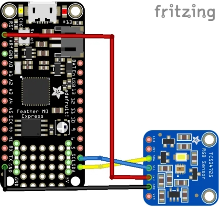](http://www.learnmicropython.com/code/adafruit-feather-m0-and-tcs34725-color-sensor-circuitpython-example.php)

Connecting a TCS34725 Color Sensor to an Adafruit Feather M0 running CircuitPython - [Learn MicroPython](http://www.learnmicropython.com/code/adafruit-feather-m0-and-tcs34725-color-sensor-circuitpython-example.php).

Citizen science MOOx sensor - [Twitter](https://twitter.com/caitlinsdad/status/1283573014869811201).

A Google Summer of Code project to write an Arduino to MicroPython transpiler. The main target is the Arduino Portenta H7 board - [GitHub](https://github.com/AshutoshPandey123456/GSocArduino2020/blob/master/proposal.md)

[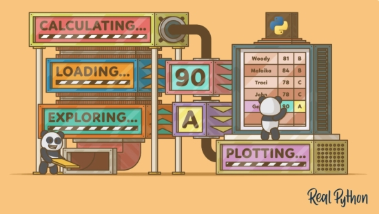](https://realpython.com/pandas-project-gradebook/)

Make a Gradebook With Python & Pandas - [Real Python](https://realpython.com/pandas-project-gradebook/).

[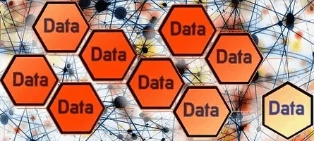](https://www.linuxlinks.com/python-data-science/)

Introduction to Python for Data Science - [LinuxLinks](https://www.linuxlinks.com/python-data-science/).

guietta - A tool for making simple Python GUIs - [GitHub](https://github.com/alfiopuglisi/guietta) and [Twitter](https://twitter.com/PythonWeekly/status/1283838930928971776).

Why doesn’t Python have a main function - [towards data science](https://towardsdatascience.com/why-doesnt-python-have-a-main-function-3afe6a8d093).

The Maxwell–Boltzmann distribution in two dimensions: relaxation towards equilibrium, animated with Python and Matplot - [Website](https://scipython.com/blog/the-maxwellboltzmann-distribution-in-two-dimensions/), [YouTube](https://youtu.be/GpTDkARVOuE) and [Twitter](https://twitter.com/scipython3/status/1283084795938054147).

Catch the midyear report from the Python pip installer team - [Python Blog](http://pyfound.blogspot.com/2020/07/pip-team-midyear-report.html)

Python Generators 101 - a video course on Python generators and the Python yield statement - [Real Python](https://realpython.com/lessons/python-generators-overview/).

[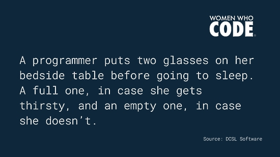](https://twitter.com/WomenWhoCode/status/1284187115950092289)

Women Who Code - [Twitter](https://twitter.com/WomenWhoCode/status/1284187115950092289).

#ICYDNCI What was the most popular, most clicked link, in [last week's newsletter](https://www.adafruitdaily.com/2020/07/14/python-on-microcontrollers-newsletter-summer-of-making-circuitpython-day-announced-and-more-python-adafruit-circuitpython-circuitpython-micropython-thepsf/)? [A Wireless and USB-C Keyboard Powered by CircuitPython](https://makerdiary.com/pages/m60-mechanical-keyboard).

## Made with Mu

Why Mu? Mu tries to make it as easy as possible to get started with programming but aims to help you graduate to "real" development tools soon after. Everything in Mu is the "real thing" but presented in as simple and obvious way possible. It's like the toddling stage in learning to walk: you're finding your feet and once you're confident, you should move on and explore! Put simply, Mu aims to foster autonomy. Try out Mu today! - [codewith.mu](https://codewith.mu/)

## Coming Soon: CircuitPython Day

Adafruit has chosen September 9, 2020 (9/9/2020) as the snakiest day of this year for CircuitPython Day! Much more to come on events and happenings to include a CircuitPython team livestream, collaboration with hardware and software folks, and highlighting all things Python and Python on Hardware. More information will be forthcoming. Ideas? Send them via email to circuitpythonday@adafruit.com.

## New Boards Supported by CircuitPython

The number of supported microcontrollers and Single Board Computers (SBC) grows every week. This section outlines which boards have been included in CircuitPython or added to [CircuitPython.org](https://circuitpython.org/).

This week we had X new boards added!

- [Board name](url)

Looking for adding a new board to CircuitPython? It's highly encouraged! Adafruit has four guides to help you do so:

- [How to Add a New Board to CircuitPython](https://learn.adafruit.com/how-to-add-a-new-board-to-circuitpython/overview)
- [How to add a New Board to the circuitpython.org website](https://learn.adafruit.com/how-to-add-a-new-board-to-the-circuitpython-org-website)
- [Adding a Single Board Computer to PlatformDetect for Blinka](https://learn.adafruit.com/adding-a-single-board-computer-to-platformdetect-for-blinka)
- [Adding a Single Board Computer to Blinka](https://learn.adafruit.com/adding-a-single-board-computer-to-blinka)

## New Learn Guides!

[CLUE BLE MIDI Glove](https://learn.adafruit.com/clue-midi-glove) from [John Park](https://learn.adafruit.com/users/johnpark)

[Adafruit PCF8591 Basic 4 x ADC + DAC Breakout](https://learn.adafruit.com/adafruit-pcf8591-adc-dac) from [Bryan Siepert](https://learn.adafruit.com/users/siddacious)

[Raspberry Pi E-Ink Weather Station using Python](https://learn.adafruit.com/raspberry-pi-e-ink-weather-station-using-python) from [Melissa LeBlanc-Williams](https://learn.adafruit.com/users/MakerMelissa)

[Glowing Bottle Castle and Capacitive Touch Piano](https://learn.adafruit.com/glowing-bottle-castle-and-capacitive-touch-piano) from [Erin St. Blaine](https://learn.adafruit.com/users/firepixie)

[LED Matrix Scoreboard](https://learn.adafruit.com/led-matrix-scoreboard) from [Noe and Pedro](https://learn.adafruit.com/users/pixil3d)

## Updated Learn Guides!

[CircuitPython on Linux and Raspberry Pi](https://learn.adafruit.com/circuitpython-on-raspberrypi-linux) from [Ladyada](https://learn.adafruit.com/users/adafruit2)

## CircuitPython Libraries!

CircuitPython support for hardware continues to grow. We are adding support for new sensors and breakouts all the time, as well as improving on the drivers we already have. As we add more libraries and update current ones, you can keep up with all the changes right here!

For the latest libraries, download the [Adafruit CircuitPython Library Bundle](https://circuitpython.org/libraries). For the latest community contributed libraries, download the [CircuitPython Community Bundle](https://github.com/adafruit/CircuitPython_Community_Bundle/releases).

If you'd like to contribute, CircuitPython libraries are a great place to start. Have an idea for a new driver? File an issue on [CircuitPython](https://github.com/adafruit/circuitpython/issues)! Have you written a library you'd like to make available? Submit it to the [CircuitPython Community Bundle](https://github.com/adafruit/CircuitPython_Community_Bundle). Interested in helping with current libraries? Check out the [CircuitPython.org Contributing page](https://circuitpython.org/contributing). We've included open pull requests and issues from the libraries, and details about repo-level issues that need to be addressed. We have a guide on [contributing to CircuitPython with Git and Github](https://learn.adafruit.com/contribute-to-circuitpython-with-git-and-github) if you need help getting started. You can also find us in the #circuitpython channel on the [Adafruit Discord](https://adafru.it/discord).

You can check out this [list of all the Adafruit CircuitPython libraries and drivers available](https://github.com/adafruit/Adafruit_CircuitPython_Bundle/blob/master/circuitpython_library_list.md). 

The current number of CircuitPython libraries is **263**!

**New Libraries!**

Here's this week's new CircuitPython libraries:

 * [Adafruit_CircuitPython_AS7341](https://github.com/adafruit/Adafruit_CircuitPython_AS7341)

**Updated Libraries!**

Here's this week's updated CircuitPython libraries:

 * [Adafruit_CircuitPython_ImageLoad](https://github.com/adafruit/Adafruit_CircuitPython_ImageLoad)
 * [Adafruit_CircuitPython_BLE_BroadcastNet](https://github.com/adafruit/Adafruit_CircuitPython_BLE_BroadcastNet)
 * [Adafruit_CircuitPython_Display_Text](https://github.com/adafruit/Adafruit_CircuitPython_Display_Text)
 * [Adafruit_CircuitPython_LED_Animation](https://github.com/adafruit/Adafruit_CircuitPython_LED_Animation)
 * [Adafruit_CircuitPython_BNO055](https://github.com/adafruit/Adafruit_CircuitPython_BNO055)
 * [Adafruit_CircuitPython_BLE](https://github.com/adafruit/Adafruit_CircuitPython_BLE)
 * [Adafruit_CircuitPython_ServoKit](https://github.com/adafruit/Adafruit_CircuitPython_ServoKit)
 * [Adafruit_CircuitPython_Pypixelbuf](https://github.com/adafruit/Adafruit_CircuitPython_Pypixelbuf)
 * [Adafruit_CircuitPython_Fingerprint](https://github.com/adafruit/Adafruit_CircuitPython_Fingerprint)

**PyPI Download Stats!**

We've written a special library called Adafruit Blinka that makes it possible to use CircuitPython Libraries on [Raspberry Pi and other compatible single-board computers](https://learn.adafruit.com/circuitpython-on-raspberrypi-linux/). Adafruit Blinka and all the CircuitPython libraries have been deployed to PyPI for super simple installation on Linux! Here are the top 10 CircuitPython libraries downloaded from PyPI in the last week, including the total downloads for those libraries:

Keep checking back for updated download stats coming soon!

## What’s the team up to this week?

What is the team up to this week? Let’s check in!

**Bryan**

[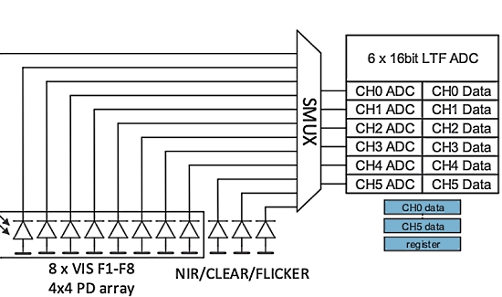](https://circuitpython.org/)

Continuing the story from last week, the AS7341 saw a good amount of time on my bench over the past week. As it so happens, I was incorrect when I mentioned "12 readable individual sensors". In addition to being a travesty of a sentence, it was incorrect! After spending time getting close with the sensor and what little example code I was able to find, I found that there are in fact 23 individual sensors that can be connected to any one of the six ADC channels. This by itself gives the sensor a large amount of flexibility; you can choose which color bands you wish to measure at any given time and even potentially change the configuration based on the data coming in.

Keeping in mind all the possible combinations from being able to select the sensor connected to each ADC, you can imagine my surprise when I found that *you can attach more than one sensor to an ADC channel at a time*. OK. Maybe my nerd is showing but I think that is *pretty dang cool*. This means that you can effectively adjust the sensitivity of the sensor without adjusting gain or integration time by selecting if you are measuring from one or two sensors for the given channel.

The possibility that intrigues me is that of connecting multiple sensors from different wavelength bands to the same ADC. The documentation is a bit sparse and doesn't explicitly state if this is possible or not, so we'll have to see if it works. I'm not entirely sure  how useful it would be, but it feels useful. 

**Dan**

[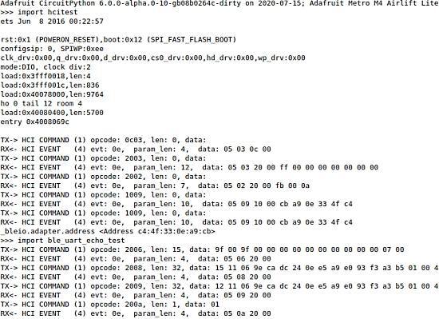](https://circuitpython.org/)

The [HCI](https://en.wikipedia.org/wiki/List_of_Bluetooth_protocols#Host_Controller_Interface_(HCI)) implementation of \_bleio is progressing. I've gotten advertising to work, and next will work on connecting as a peripheral. Unfortunately the ESP32 hardware doesn't support extended advertising, but that's not a serious limitation for most BLE applications.

**Jeff**

My work refining the way background tasks are handled in CircuitPython continues, hopefully concluding soon.  I've tested the code on a wider range of boards (initially I concentrated on SAMD51) and opened it up for review and testing by the community.

On a less technical note, for the first time I moderated the CircuitPython weekly meeting on Discord.  I particularly enjoyed getting to read the community news section, which is based on content from this very newsletter.

**Kattni**

This week I updated the BMP280 guide with the new STEMMA QT version of the breakout, including updated pinouts, downloads and wiring diagrams. I created all the wiring diagrams for the PCF8591 guide that Bryan completed. Melissa implemented PWMOut in Adafruit Blinka, our CircuitPython compatibility layer for Raspberry Pi and other single board computers, which means it's now super simple to pulse an LED or control a servo with your Raspberry Pi. To that end, I updated the CircuitPython on Linux and Raspberry Pi guide to include a PWM Outputs & Servos page with wiring diagrams and example code. 

Last week I started the PMSA300I air quality sensor guide. This week, I received the sensor, so I can continue with the code sections of the guide. It uses I2C and comes with STEMMA QT connectors, so it's super simple to get it wired up. It works with the Adafruit CircuitPython PM25 library, so it's easy to read air quality data using CircuitPython with this sensor. This guide will include an overview, pinouts, Arduino and CircuitPython usage, and resource downloads. Along with this, the PM2.5 air quality sensor guide will be updated to use the new PM25 library - it currently reads the data directly and is not as simple or intuitive as the library will make it. If you're looking to get started with your PMSA300I air quality sensor or looking for a simpler way to use your PM2.5 sensor, keep an eye out for these guides. 

**Lucian**

[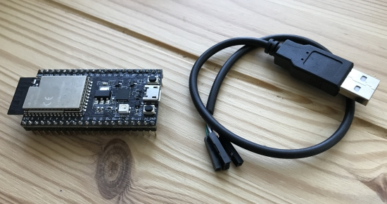](https://circuitpython.org/)

This week I set up the toolchains and control test setup for my ESP32-S2, and read up on the timer docs for when I start working on PulseIO. I also worked on some changes to the Protomatter RGBMatrix library so that it cooperates properly with my new timer allocator system, and investigated an issue with PulseIn that's related to IRQ management. 

I've also been chatting with some international folks about a possible implementation of the F1 family for STM32, which has some very cheap boards, especially when purchased direct from China. The F1 is on the low performance side for Circuitpython, but the upper end of the family is comparable to the SAMD 21 and 51 chips, and the prices are rock bottom for many packages. It'll be interesting to see how the project develops.

**Melissa**

[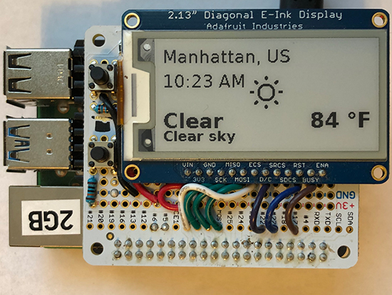](https://circuitpython.org/)

This week I finished up 2 guides around using an eInk display to to display some useful information. The first one I did was a weather station, which is based on the Weather Station available for PyPortal, but with some changes so that it works nicely on eInk displays such as less frequent updates. You can [check out that guide](https://learn.adafruit.com/raspberry-pi-e-ink-weather-station-using-python).

[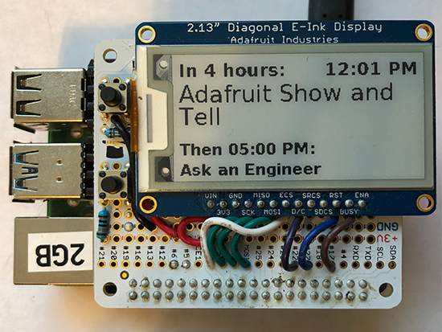](https://circuitpython.org/)

The second guide I wrote is an event calendar that was inspired by a project called Up Next, except this one is written in Python. This project goes out and connects with Google Calendar and retrieves the events from all of your calendars so that you can see what events are coming up soon. [That guide is also on the Adafruit Learning System](https://learn.adafruit.com/raspberry-pi-e-ink-desk-calendar-using-python/). 

**Scott**

This week I've continued work on improving our ESP32SPI and Requests libraries. I've been specifically trying to reduce the number and size of allocations when processing a request so that larger files can be loaded.

Last Friday on my stream I also optimized CircuitPython's json module so that we don't need to give it a stream of data instead of a full string of json. That should greatly reduce the largest single allocation. See the full stream on [YouTube](https://www.youtube.com/watch?v=jfRjlu3oCDA). 

I've gotten requests working with HTTP and decided to compare against the existing implementation. To do so, I needed a way to measure memory allocation counts. So, I'm adding a memorymonitor module that will help make it easier to understand the memory use of a section of CircuitPython code. Once I added that, I discovered I was allocating *more* smaller objects with the new code and want to reduce that. So, I'm also adding an AllocationAlarm class to memorymonitor that will simply throw an exception when an allocation occurs over a minimum block size. It should be helpful to know certain chunks of code are allocation free.

Check out my latest stream, Fridays at 2pm Pacific on youtube.com/adafruit for the latest.

## Upcoming events!

PyCon AU has announced they are holding PyConline AU, an online event, from 4–6 September 2020 -  [pycon.org.au](https://2020.pycon.org.au/).

PyGotham is a New York City based, eclectic, Py-centric conference covering many topics. PyGotham TV taking place October 2-3, 2020 with a single track of talks presented online - [Event Website](https://2020.pygotham.tv/) and [Call for Proposals](https://cfp.pygotham.tv/).

PyCon India 2020: the premier conference in India on using and developing the Python programming language. Held online October 3-5, 2020. A [call for proposals](https://in.pycon.org/cfp/2020/proposals/) is now open through August 14, 2020. - [Website](https://in.pycon.org/2020/) and [Twitter](https://twitter.com/pyconindia)

**Send Your Events In**

As for other events, with the COVID pandemic, most in-person events are postponed or cancelled. If you know of virtual events or events that may occur in the future, please let us know on Discord or on Twitter with hashtag #CircuitPython.

## Latest releases

CircuitPython's stable release is [#.#.#](https://github.com/adafruit/circuitpython/releases/latest) and its unstable release is [#.#.#-##.#](https://github.com/adafruit/circuitpython/releases). New to CircuitPython? Start with our [Welcome to CircuitPython Guide](https://learn.adafruit.com/welcome-to-circuitpython).

[2019####](https://github.com/adafruit/Adafruit_CircuitPython_Bundle/releases/latest) is the latest CircuitPython library bundle.

[v#.#.#](https://micropython.org/download) is the latest MicroPython release. Documentation for it is [here](http://docs.micropython.org/en/latest/pyboard/).

[#.#.#](https://www.python.org/downloads/) is the latest Python release. The latest pre-release version is [#.#.#](https://www.python.org/download/pre-releases/).

[1777 Stars](https://github.com/adafruit/circuitpython/stargazers) Like CircuitPython? [Star it on GitHub!](https://github.com/adafruit/circuitpython)

## Call for help -- Translating CircuitPython is now easier than ever!

[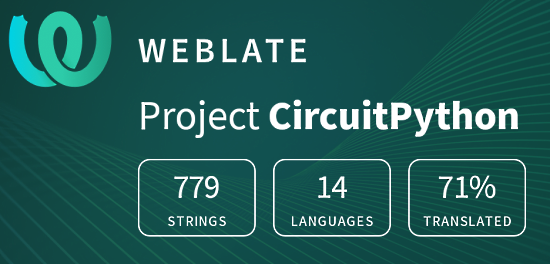](https://hosted.weblate.org/engage/circuitpython/)

One important feature of CircuitPython is translated control and error messages.

With the help of fellow open source project [Weblate](https://weblate.org/), we're making it even easier to add or improve translations.

Sign in with an existing account such as Github, Google or Facebook and start contributing through a simple web interface. No forks or pull requests needed!

As always, if you run into trouble join us on [Discord](https://adafru.it/discord), we're here to help.

## jobs.adafruit.com - Find a dream job, find great candidates!

[jobs.adafruit.com](https://jobs.adafruit.com/) has returned and folks are posting their skills (including CircuitPython) and companies are looking for talented makers to join their companies - from Digi-Key, to Hackaday, Microcenter, Raspberry Pi and more.

## 22,444 thanks!

The Adafruit Discord community, where we do all our CircuitPython development in the open, reached over 22,444 humans, thank you!  Adafruit believes Discord offers a unique way for CircuitPython folks to connect. Join today at [https://adafru.it/discord](https://adafru.it/discord).

## ICYMI - In case you missed it

The wonderful world of Python on hardware! This is our first video-newsletter-podcast that we’ve started! The news comes from the Python community, Discord, Adafruit communities and more. It’s part of the weekly newsletter, then we have a segment on ASK an ENGINEER and this is the video slice from that! The complete Python on Hardware weekly videocast [playlist is here](https://www.youtube.com/playlist?list=PLjF7R1fz_OOXRMjM7Sm0J2Xt6H81TdDev). 

This video podcast is on [iTunes](https://itunes.apple.com/us/podcast/python-on-hardware/id1451685192?mt=2), [YouTube](http://adafru.it/pohepisodes), [IGTV (Instagram TV](https://www.instagram.com/adafruit/channel/)), and [XML](https://itunes.apple.com/us/podcast/python-on-hardware/id1451685192?mt=2).

[Weekly community chat on Adafruit Discord server CircuitPython channel - Audio / Podcast edition](https://itunes.apple.com/us/podcast/circuitpython-weekly-meeting/id1451685016) - Audio from the Discord chat space for CircuitPython, meetings are usually Mondays at 2pm ET, this is the audio version on [iTunes](https://itunes.apple.com/us/podcast/circuitpython-weekly-meeting/id1451685016), Pocket Casts, [Spotify](https://adafru.it/spotify), and [XML feed](https://adafruit-podcasts.s3.amazonaws.com/circuitpython_weekly_meeting/audio-podcast.xml).

And lastly, we are working up a one-spot destination for all things podcast-able here - [podcasts.adafruit.com](https://podcasts.adafruit.com/)

## Codecademy "Learn Hardware Programming with CircuitPython"

Codecademy, an online interactive learning platform used by more than 45 million people, has teamed up with the leading manufacturer in STEAM electronics, Adafruit Industries, to create a coding course, "Learn Hardware Programming with CircuitPython". The course is now available in the [Codecademy catalog](https://www.codecademy.com/learn/learn-circuitpython?utm_source=adafruit&utm_medium=partners&utm_campaign=circuitplayground&utm_content=pythononhardwarenewsletter).

Python is a highly versatile, easy to learn programming language that a wide range of people, from visual effects artists in Hollywood to mission control at NASA, use to quickly solve problems. But you don’t need to be a rocket scientist to accomplish amazing things with it. This new course introduces programmers to Python by way of a microcontroller — CircuitPython — which is a Python-based programming language optimized for use on hardware.

CircuitPython’s hardware-ready design makes it easier than ever to program a variety of single-board computers, and this course gets you from no experience to working prototype faster than ever before. Codecademy’s interactive learning environment, combined with Adafruit's highly rated Circuit Playground Express, present aspiring hardware hackers with a never-before-seen opportunity to learn hardware programming seamlessly online.

Whether for those who are new to programming, or for those who want to expand their skill set to include physical computing, this course will have students getting familiar with Python and creating incredible projects along the way. By the end, students will have built their own bike lights, drum machine, and even a moisture detector that can tell when it's time to water a plant.

Visit Codecademy to access the [Learn Hardware Programming with CircuitPython](https://www.codecademy.com/learn/learn-circuitpython?utm_source=adafruit&utm_medium=partners&utm_campaign=circuitplayground&utm_content=pythononhardwarenewsletter) course and Adafruit to purchase a [Circuit Playground Express](https://www.adafruit.com/product/3333).

Codecademy has helped more than 45 million people around the world upgrade their careers with technology skills. The company’s online interactive learning platform is widely recognized for providing an accessible, flexible, and engaging experience for beginners and experienced programmers alike. Codecademy has raised a total of $43 million from investors including Union Square Ventures, Kleiner Perkins, Index Ventures, Thrive Capital, Naspers, Yuri Milner and Richard Branson, most recently raising its $30 million Series C in July 2016.

## Contribute!

The CircuitPython Weekly Newsletter is a CircuitPython community-run newsletter emailed every Tuesday. The complete [archives are here](https://www.adafruitdaily.com/category/circuitpython/). It highlights the latest CircuitPython related news from around the web including Python and MicroPython developments. To contribute, edit next week's draft [on GitHub](https://github.com/adafruit/circuitpython-weekly-newsletter/tree/gh-pages/_drafts) and [submit a pull request](https://help.github.com/articles/editing-files-in-your-repository/) with the changes. Join our [Discord](https://adafru.it/discord) or [post to the forum](https://forums.adafruit.com/viewforum.php?f=60) for any further questions.
