- [X] Kattni updates
- [ ] change date
- [ ] update title
- [ ] Feature story
- [ ] Update  for images
- [ ] Update ICYDNCI
- [ ] All images 550w max only
- [ ] Link "View this email in your browser."

View this email in your browser.

Hi everyone! It's the latest Python for Microcontrollers newsletter, brought you by the community! We're on [Discord](https://discord.gg/HYqvREz), [Twitter](https://twitter.com/search?q=circuitpython&src=typed_query&f=live), and for past newsletters - [view them all here](https://www.adafruitdaily.com/category/circuitpython/). If you're reading this on the web, [subscribe here](https://www.adafruitdaily.com/). Let's get started!

## Black Lives Matter Microcontroller Board Coming to CircuitPython

[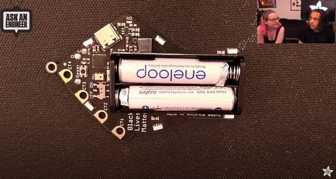](https://youtu.be/Tg-pRtRBCoA?t=48)

[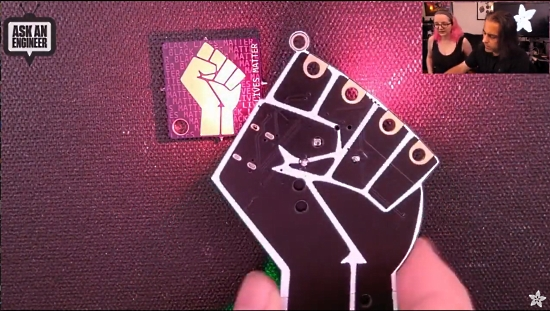](https://youtu.be/Tg-pRtRBCoA?t=48)

Ladyada is making final tests on the Adafruit Black Lives Matter Board. Shown on Ask an Engineer & Top Secret, this board shows up as a USB flash drive when connected to a computer to hold files, pictures, and CircuitPython code. It has 4 edge-lit LEDs and 4 capacitive touchpads and the iconic symbol on the front. Common alkalyne batteries power this board with a lanyard ring for wearing - [Top Secret](https://youtu.be/Tg-pRtRBCoA?t=48).

## RedMonk's Language Popularity Survey

[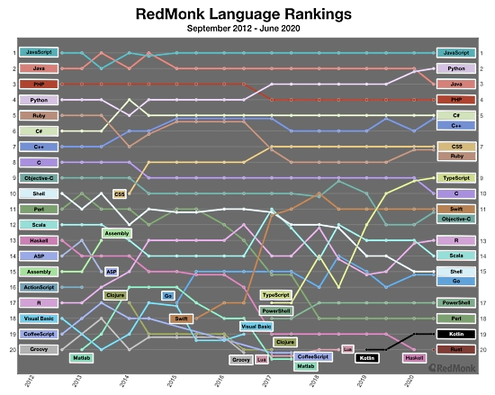](https://www.zdnet.com/article/programming-language-popularity-python-overtakes-java-as-rust-reaches-top-20/)

Yet another programming survey (YAPS): RedMonk's language popularity rankings - Programming language popularity: Python overtakes Java – as Rust reaches top 20

## A FeatherWing to Raspberry Pi Adapter Board

An adapter board for attaching a FeatherWing to a Raspberry Pi - [GitHub](https://github.com/ccadic/RPI_Feather).

## Python Releases This Week

Python 3.8.5 was released as a security hotfix. Python 3.9.0b5, the last beta before 3.9.0, is also available - [Python.Org](https://blog.python.org/2020/07/python-385-released-as-security-hotfix.html).

## An Smart LED Octohedron with CircuitPython

[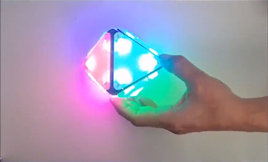](https://twitter.com/GeekMomProjects/status/1290047633906470912)

[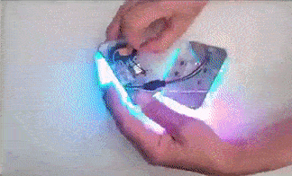](https://twitter.com/GeekMomProjects/status/1290047633906470912) 

A self contained edge-lit octohedron. It's controlled by a Serpente M0 running CircuitPython with a wire broken out for use as a capacitive touch switch. The halves snap together with homemade magnetic connectors - [Twitter](https://twitter.com/GeekMomProjects/status/1290047633906470912).

## Thermal Camera

[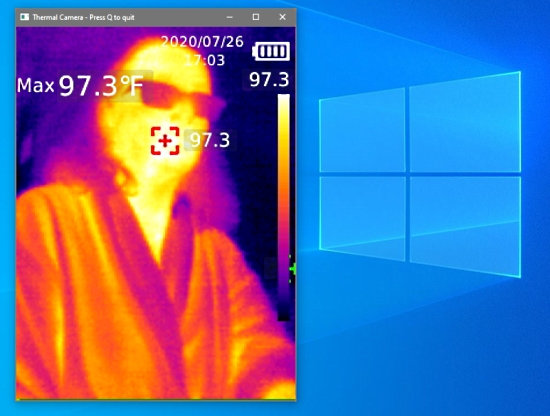](https://learn.adafruit.com/uti165-thermal-fever-scanner-camera/python-software)

UTi165 Thermal Camera Python example now works with Windows - thanks to whomever fixed the bug we were having in opencv for Python - you can now grab frames from these low-cost thermal cameras on Mac, Linux AND Windows  - [Adafruit Learning System](https://learn.adafruit.com/uti165-thermal-fever-scanner-camera/python-software).

## CircuitPython Deep Dive Stream with Scott Shawcroft

This week, Scott streams his work on FPGA APIs and ESP32-S2 WiFi scanning.

You can see the latest video and past videos on the Adafruit YouTube channel under the Deep Dive playlist - [YouTube](https://www.youtube.com/playlist?list=PLjF7R1fz_OOXBHlu9msoXq2jQN4JpCk8A).

## CircuitPython Day is 9-9-2020

Adafruit has chosen September 9, 2020 (9/9/2020) as the snakiest day of this year for CircuitPython Day! Much more to come on events and happenings to include a CircuitPython team livestream, collaboration with hardware and software folks, and highlighting all things Python and Python on Hardware. More information will be forthcoming. Ideas? Send them via email to circuitpythonday@adafruit.com.

## Adafruit Update

**Adafruit is shipping orders!**

Production is up and now is the best time to get the Adafruit items you've been waiting for - [Show Adafruit](https://www.adafruit.com/).

## News from around the web!

Animal Crossing: Nova Light time helper - inspired by Animal Crossing New Horizons. Powered by an Adafruit Feather M4, RTC, and NeoPixels using CircuitPython - [charlyn.codes](https://charlyn.codes/ac-nova-light-clock/).

[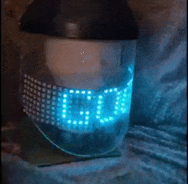](https://twitter.com/caitlinsdad/status/1288338773386895361)

An LED message scroller faceshield - add a real-time clock for face time - [Twitter](https://twitter.com/caitlinsdad/status/1288338773386895361).

[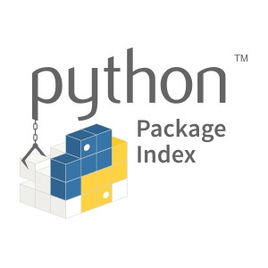](https://blog.ovalerio.net/archives/1971)

Why you shouldn’t remove your package from PyPI - [Ovalerio.net](https://blog.ovalerio.net/archives/1971).

[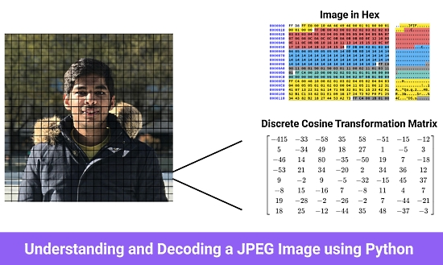](https://yasoob.me/posts/understanding-and-writing-jpeg-decoder-in-python/)

Understanding and Decoding a JPEG Image using Python - [yasoob.me](https://yasoob.me/posts/understanding-and-writing-jpeg-decoder-in-python/).

[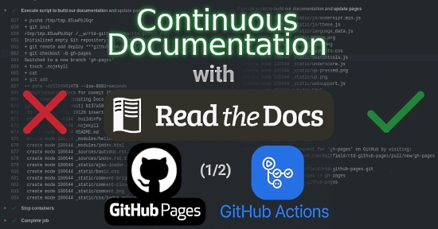](https://tech.michaelaltfield.net/2020/07/18/sphinx-rtd-github-pages-1/)

Continuous Documentation: Hosting Read the Docs on GitHub Pages - [Michael Altfield](https://tech.michaelaltfield.net/2020/07/18/sphinx-rtd-github-pages-1/) and [Twitter](https://twitter.com/PythonWeekly/status/1288534904561598470).

Documenting Python Code: A Complete Guide - [Real Python](https://realpython.com/courses/documenting-python-code/) and [Twitter](https://twitter.com/realpython/status/1238615869636464646).

[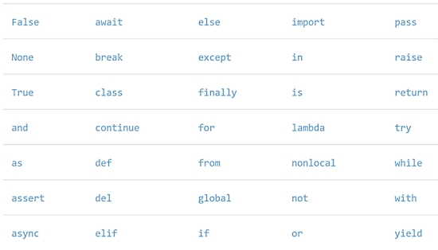](https://realpython.com/python-keywords/)

Python Keywords: An Introduction - [Real Python](https://realpython.com/python-keywords/) and [Twitter](https://twitter.com/realpython/status/1290022083141857280).

4 powerful features Python is still missing - [Infoworld](https://www.infoworld.com/article/3566382/4-powerful-features-python-is-still-missing.html).

[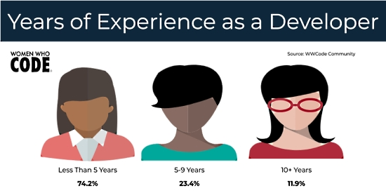](https://twitter.com/WomenWhoCode/status/1288916115750625280)

How many years of experience do you have as a developer, a breakdown - [Women Who Code](https://twitter.com/WomenWhoCode/status/1288916115750625280).

**#ICYDNCI What was the most popular, most clicked link, in [last week's newsletter](https://link)? [title](url).**

## Made with Mu

Why Mu? Mu tries to make it as easy as possible to get started with programming but aims to help you graduate to "real" development tools soon after. Everything in Mu is the "real thing" but presented in as simple and obvious way possible. It's like the toddling stage in learning to walk: you're finding your feet and once you're confident, you should move on and explore! Put simply, Mu aims to foster autonomy. Try out Mu today! - [codewith.mu](https://codewith.mu/)

## Coming soon

## New Boards Supported by CircuitPython

The number of supported microcontrollers and Single Board Computers (SBC) grows every week. This section outlines which boards have been included in CircuitPython or added to [CircuitPython.org](https://circuitpython.org/).

This week we had X new boards added!

- [Board name](url)

Looking for adding a new board to CircuitPython? It's highly encouraged! Adafruit has four guides to help you do so:

- [How to Add a New Board to CircuitPython](https://learn.adafruit.com/how-to-add-a-new-board-to-circuitpython/overview)
- [How to add a New Board to the circuitpython.org website](https://learn.adafruit.com/how-to-add-a-new-board-to-the-circuitpython-org-website)
- [Adding a Single Board Computer to PlatformDetect for Blinka](https://learn.adafruit.com/adding-a-single-board-computer-to-platformdetect-for-blinka)
- [Adding a Single Board Computer to Blinka](https://learn.adafruit.com/adding-a-single-board-computer-to-blinka)

## New Learn Guides!

[CLUE Altimeter](https://learn.adafruit.com/clue-altimeter) from [Carter Nelson](https://learn.adafruit.com/users/caternuson)

[CircuitPython Sin Complicaciones para la Circuit Playground Express y la Bluefruit](https://learn.adafruit.com/circuitpython-sin-complicaciones-para-la-circuit-playground-express) from [Álvaro Figueroa](https://learn.adafruit.com/users/fede2)

[Mini VOTE Keyboard](https://learn.adafruit.com/vote-keyboard) from [Collin Cunningham](https://learn.adafruit.com/users/collinmel)

[NeoPixel Run LED Arcade Game](https://learn.adafruit.com/pixel-chase-game) from [Noe and Pedro](https://learn.adafruit.com/users/pixil3d)

[Adafruit MicroSD SPI or SDIO Card Breakout Board](https://learn.adafruit.com/adafruit-microsd-spi-sdio) from [Jeff Epler](https://learn.adafruit.com/users/jepler)

## CircuitPython Libraries!

CircuitPython support for hardware continues to grow. We are adding support for new sensors and breakouts all the time, as well as improving on the drivers we already have. As we add more libraries and update current ones, you can keep up with all the changes right here!

For the latest libraries, download the [Adafruit CircuitPython Library Bundle](https://circuitpython.org/libraries). For the latest community contributed libraries, download the [CircuitPython Community Bundle](https://github.com/adafruit/CircuitPython_Community_Bundle/releases).

If you'd like to contribute, CircuitPython libraries are a great place to start. Have an idea for a new driver? File an issue on [CircuitPython](https://github.com/adafruit/circuitpython/issues)! Have you written a library you'd like to make available? Submit it to the [CircuitPython Community Bundle](https://github.com/adafruit/CircuitPython_Community_Bundle). Interested in helping with current libraries? Check out the [CircuitPython.org Contributing page](https://circuitpython.org/contributing). We've included open pull requests and issues from the libraries, and details about repo-level issues that need to be addressed. We have a guide on [contributing to CircuitPython with Git and Github](https://learn.adafruit.com/contribute-to-circuitpython-with-git-and-github) if you need help getting started. You can also find us in the #circuitpython channel on the [Adafruit Discord](https://adafru.it/discord).

You can check out this [list of all the Adafruit CircuitPython libraries and drivers available](https://github.com/adafruit/Adafruit_CircuitPython_Bundle/blob/master/circuitpython_library_list.md). 

The current number of CircuitPython libraries is **263**!

**Updated Libraries!**

Here's this week's updated CircuitPython libraries:

 * [Adafruit_CircuitPython_Display_Text](https://github.com/adafruit/Adafruit_CircuitPython_Display_Text)
 * [Adafruit_CircuitPython_SGP30](https://github.com/adafruit/Adafruit_CircuitPython_SGP30)
 * [Adafruit_CircuitPython_BusDevice](https://github.com/adafruit/Adafruit_CircuitPython_BusDevice)
 * [Adafruit_CircuitPython_RGB_Display](https://github.com/adafruit/Adafruit_CircuitPython_RGB_Display)
 * [Adafruit_CircuitPython_MiniMQTT](https://github.com/adafruit/Adafruit_CircuitPython_MiniMQTT)

**PyPI Download Stats!**

We've written a special library called Adafruit Blinka that makes it possible to use CircuitPython Libraries on [Raspberry Pi and other compatible single-board computers](https://learn.adafruit.com/circuitpython-on-raspberrypi-linux/). Adafruit Blinka and all the CircuitPython libraries have been deployed to PyPI for super simple installation on Linux! Here are the top 10 CircuitPython libraries downloaded from PyPI in the last week, including the total downloads for those libraries:

Keep checking back for updated download stats coming soon!

## What’s the team up to this week?

What is the team up to this week? Let’s check in!

**Bryan**

This week I made some updates to the CAN Bus Feather Wing and sent it off to the fine folks at OSH Park and OSH Stencils. I’m looking forward to working on this as there are lots of interesting applications for an interface for talking with CAN Bus. One of the most common places you’ll find a CAN bus is in your car itself. 

My car for example, a 2009 VW Rabbit has a pretty interesting network that connects all the different control modules (ECUs) that allow it to have all the features that make it an old but still relatively modern car. Keyless locks, power windows, radio, indicator lights, and even the engine all talk with each other through a CAN Bus powered network, allowing you to do fun things like rolling down the windows using the key fob. I’m excited to listen to this bus to see how the different parts are talking to each other. Keep in mind that if I had one I would with near certainty be voiding my car’s warranty, and there is of course always the chance of irreparable damage to the car.

My immediate goal is to be able to read OBD2 diagnostic information that is mandated  to be available on modern cars, at least in the US. Being an older and “aggressively loved” car that is long in the tooth, my Rabbit is no stranger to throwing codes (AKA Check Engine Lights) that would prevent me from passing a smog check. Fortunately, if you can read it there is a good amount of information available from the car that can help troubleshoot issues. Unfortunately you need a dedicated piece of hardware to be able to read the diagnostic codes from the car.

**Dan**

I'm continuing work on the ATT (attribute) protocol for HCI \_bleio. Currently I’m working on the code to populate the attribute table. The information in the attribute table is passed to a peer who wants to find out all the details of the services provided by a BLE device. This process is called "discovery". Once I have the attribute table set up, I can then implement the code that passes back the detail to the peer.

I just changed our CircuitPython builds so they upload the mpy-cross executables they build to a central place. We build executables for x64 Linux, Raspbian, Windows, and MacOS. These executables will now be easier to find.

With a logic analyzer, I got some timing data for the NeoPixel write operations for Adafruit's Arduino library and CircuitPython, on both SAMD21 and SAMD51 processors. Some non-standard NeoPixel-like RGB LED's were not working properly on CircuitPython but did work on Arduino, and this data will help us understand why.

**Jeff**

The bulk of my time has gone into a new guide which will cover both the SD card improvements in CircuitPython 6, as well as the new SD card breakout that supports SDIO. As a part of this, I have continued to prepare support for the SD card slot on the STM32F405 Feather, which requires SDIO.  Other work includes pulling in updates to microlab and investigating adding the "LSB first" mode to busio.SPI.

**Kattni**

This week, I created a many more fritzing objects for upcoming Adafruit products. This will continue as we work through a huge backlog of products, since production was put on hold during the initial stages of COVID.

One of the updated breakouts was the STEMMA QT version of the VL53L0X. I updated the guide to reflect the new version with a new Overview page, updated Pinouts page, updated fritzing diagrams, and new schematic and fab prints on the Downloads page. 

Next up is updating the BME680 guide with the STEMMA QT version, the same way I updated the VL53L0X. As well, I have a fairly long list of miscellaneous to attend to between other major things. The busy continues!

**Lucian**

This past week I worked on implementing the Neopixel and the PulseIn/PulseOut module combo on ESP32-S2, diving into the RMT (remote control) peripheral. Espressif has a funny habit of naming their peripherals in a way that makes them sound kind of limited, when the truth is just the opposite - just as the "LED Controller" is actually an extremely flexible and general purpose PWM controller that is also suitable for servos and tones, the "Remote Control" peripheral is capable of far more than just IR pulse trains (such as emulating the Neopixel protocol). I'm currently considering whether I should implement a port-level mediator system for the RMT, since it's possible we may also want to use it for things like RotaryIO, in which case it'd be good to have a similar channel-negotiator system like the one I implemented on the STM32.

Over the weekend, I also took some time to play with the Open Book Featherwing from Oddly Specific Objects. I've always enjoyed playing with language learning software/hardware and saw an opportunity to do something along those lines on the Open Book, which is a compact e-paper ereader that runs on Circuitpython via the Feather M4 Express (or presumably other feathers, I haven't checked yet). The really cool thing about the Open Book is that it has a NOR flash chip called Babel that is entirely dedicated to unicode character support - this is useful since good international embedded fonts are kind of hard to find and have a hard time fitting on the Feather 2MB NOR flash alongside Circuitpython.

Shown below is my flash card app, which assembles random Japanese sentences from a json file full of "cards" and "words", allowing you to make many variations of a particular sentence type. For instance, if you'd like to study conjugated verbs, you can design a card that will create many different sentences that focus on this topic but use different words and structures for variation. I'm hoping to expand on it to include tags and SRS features - it's been really cool how easy it was to move a python app designed on a PC over to Circuitpython! 

**Melissa**

This past week, I worked on the Matrix Portal library and wrote a couple of examples that will hopefully be used in some future projects. One of the examples displayed a scrolling message of YouTube subscriber and view counts for a given channel. This was based on a similar project done on the PyPortal with some changes for the lower resolution.

Another example displayed the current bitcoin price. This one was pretty simple in that the library initialized the display and WiFi connections and went out to the internet to get the price and display it. This was similar to another PyPortal example that did the same thing.

I'm still working on changing up the library so only certain components of it can be used and thus it will use less memory.

**Scott**

Last week I spent some time testing a PyPortal project with the refined requests library and following up on PRs from the week before. I also switched over to a desktop with Arch linux for development.

On Friday during my stream I verified ESP pinouts with my feather adapter and ordered v3 for testing. More confident with choosing pinouts for Adafruit designs.

This week I'm focussed on native wifi on the -S2. I've got the scanning and connection API done in shared-bindings and am starting to hook it to the IDF. Running into some linking issues due to bringing in the wifi stack. Good to sort out now. WIP branch is https://github.com/tannewt/circuitpython/tree/native_wifi Check out my streams for the latest progress!

Outside of CircuitPython, in my evenings, my interest in system on a chip (SoC) design has been renewed by the OrangeCrab, a feather form factor FPGA board, and the open PDK announcement from Google. I've been experimenting with nMigen, a Python powered hardware description library, to create "gateware" for the OrangeCrab.

## Upcoming events!

The Linux Plumbers Conference for 2020 will be an online event taking place 24-28 August. They are working hard to recreate as much of the feel of an in-person LPC as possible - [linuxplumbersconference.org](https://www.linuxplumbersconf.org/event/7/).

PyCon AU has announced they are holding PyConline AU, an online event, from 4–6 September 2020 -  [pycon.org.au](https://2020.pycon.org.au/).

PyGotham is a New York City based, eclectic, Py-centric conference covering many topics. PyGotham TV taking place October 2-3, 2020 with a single track of talks presented online - [Event Website](https://2020.pygotham.tv/) and [Call for Proposals](https://cfp.pygotham.tv/).

PyCon India 2020: the premier conference in India on using and developing the Python programming language. Held online October 3-5, 2020. A [call for proposals](https://in.pycon.org/cfp/2020/proposals/) is now open through August 14, 2020. - [Website](https://in.pycon.org/2020/) and [Twitter](https://twitter.com/pyconindia)

**Meetup Groups**

Data Science using Python is a consortium of 970 Meetup groups with over 700K members. There are meetings happening worldwide, see their main page for details - [Meetup](https://www.meetup.com/topics/data-science-using-python/).

PyData is a consortium of 175 groups with about 170K members, and provides a forum for the international community of users and developers of data analysis tools to share ideas and learn from each other - [Meetup](https://www.meetup.com/pro/pydata/).

PyLadies has 28 groups with over 28K members. Find out what's happening in PyLadies Meetup groups around the world and start meeting up with the ones near you - [Meetup](https://www.meetup.com/topics/pyladies/).

**Send Your Events In**

As for other events, with the COVID pandemic, most in-person events are postponed or cancelled. If you know of virtual events or events that may occur in the future, please let us know on Discord or on Twitter with hashtag #CircuitPython.

## Latest releases

CircuitPython's stable release is [#.#.#](https://github.com/adafruit/circuitpython/releases/latest) and its unstable release is [#.#.#-##.#](https://github.com/adafruit/circuitpython/releases). New to CircuitPython? Start with our [Welcome to CircuitPython Guide](https://learn.adafruit.com/welcome-to-circuitpython).

[2019####](https://github.com/adafruit/Adafruit_CircuitPython_Bundle/releases/latest) is the latest CircuitPython library bundle.

[v#.#.#](https://micropython.org/download) is the latest MicroPython release. Documentation for it is [here](http://docs.micropython.org/en/latest/pyboard/).

[#.#.#](https://www.python.org/downloads/) is the latest Python release. The latest pre-release version is [#.#.#](https://www.python.org/download/pre-releases/).

[1787 Stars](https://github.com/adafruit/circuitpython/stargazers) Like CircuitPython? [Star it on GitHub!](https://github.com/adafruit/circuitpython)

## Call for help -- Translating CircuitPython is now easier than ever!

[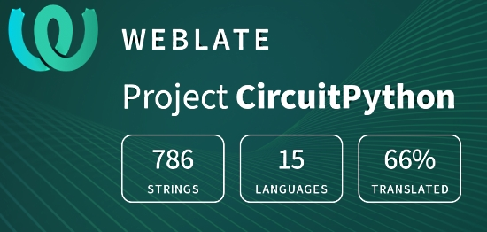](https://hosted.weblate.org/engage/circuitpython/)

One important feature of CircuitPython is translated control and error messages.

With the help of fellow open source project [Weblate](https://weblate.org/), we're making it even easier to add or improve translations.

Sign in with an existing account such as Github, Google or Facebook and start contributing through a simple web interface. No forks or pull requests needed!

As always, if you run into trouble join us on [Discord](https://adafru.it/discord), we're here to help.

## jobs.adafruit.com - Find a dream job, find great candidates!

[jobs.adafruit.com](https://jobs.adafruit.com/) has returned and folks are posting their skills (including CircuitPython) and companies are looking for talented makers to join their companies - from Digi-Key, to Hackaday, Microcenter, Raspberry Pi and more.

## 23,742 thanks!

The Adafruit Discord community, where we do all our CircuitPython development in the open, reached over 23,742 humans, thank you!  Adafruit believes Discord offers a unique way for CircuitPython folks to connect. Join today at [https://adafru.it/discord](https://adafru.it/discord).

## ICYMI - In case you missed it

The wonderful world of Python on hardware! This is our first video-newsletter-podcast that we’ve started! The news comes from the Python community, Discord, Adafruit communities and more. It’s part of the weekly newsletter, then we have a segment on ASK an ENGINEER and this is the video slice from that! The complete Python on Hardware weekly videocast [playlist is here](https://www.youtube.com/playlist?list=PLjF7R1fz_OOXRMjM7Sm0J2Xt6H81TdDev). 

This video podcast is on [iTunes](https://itunes.apple.com/us/podcast/python-on-hardware/id1451685192?mt=2), [YouTube](http://adafru.it/pohepisodes), [IGTV (Instagram TV](https://www.instagram.com/adafruit/channel/)), and [XML](https://itunes.apple.com/us/podcast/python-on-hardware/id1451685192?mt=2).

[Weekly community chat on Adafruit Discord server CircuitPython channel - Audio / Podcast edition](https://itunes.apple.com/us/podcast/circuitpython-weekly-meeting/id1451685016) - Audio from the Discord chat space for CircuitPython, meetings are usually Mondays at 2pm ET, this is the audio version on [iTunes](https://itunes.apple.com/us/podcast/circuitpython-weekly-meeting/id1451685016), Pocket Casts, [Spotify](https://adafru.it/spotify), and [XML feed](https://adafruit-podcasts.s3.amazonaws.com/circuitpython_weekly_meeting/audio-podcast.xml).

And lastly, we are working up a one-spot destination for all things podcast-able here - [podcasts.adafruit.com](https://podcasts.adafruit.com/)

## Codecademy "Learn Hardware Programming with CircuitPython"

Codecademy, an online interactive learning platform used by more than 45 million people, has teamed up with the leading manufacturer in STEAM electronics, Adafruit Industries, to create a coding course, "Learn Hardware Programming with CircuitPython". The course is now available in the [Codecademy catalog](https://www.codecademy.com/learn/learn-circuitpython?utm_source=adafruit&utm_medium=partners&utm_campaign=circuitplayground&utm_content=pythononhardwarenewsletter).

Python is a highly versatile, easy to learn programming language that a wide range of people, from visual effects artists in Hollywood to mission control at NASA, use to quickly solve problems. But you don’t need to be a rocket scientist to accomplish amazing things with it. This new course introduces programmers to Python by way of a microcontroller — CircuitPython — which is a Python-based programming language optimized for use on hardware.

CircuitPython’s hardware-ready design makes it easier than ever to program a variety of single-board computers, and this course gets you from no experience to working prototype faster than ever before. Codecademy’s interactive learning environment, combined with Adafruit's highly rated Circuit Playground Express, present aspiring hardware hackers with a never-before-seen opportunity to learn hardware programming seamlessly online.

Whether for those who are new to programming, or for those who want to expand their skill set to include physical computing, this course will have students getting familiar with Python and creating incredible projects along the way. By the end, students will have built their own bike lights, drum machine, and even a moisture detector that can tell when it's time to water a plant.

Visit Codecademy to access the [Learn Hardware Programming with CircuitPython](https://www.codecademy.com/learn/learn-circuitpython?utm_source=adafruit&utm_medium=partners&utm_campaign=circuitplayground&utm_content=pythononhardwarenewsletter) course and Adafruit to purchase a [Circuit Playground Express](https://www.adafruit.com/product/3333).

Codecademy has helped more than 45 million people around the world upgrade their careers with technology skills. The company’s online interactive learning platform is widely recognized for providing an accessible, flexible, and engaging experience for beginners and experienced programmers alike. Codecademy has raised a total of $43 million from investors including Union Square Ventures, Kleiner Perkins, Index Ventures, Thrive Capital, Naspers, Yuri Milner and Richard Branson, most recently raising its $30 million Series C in July 2016.

## Contribute!

The CircuitPython Weekly Newsletter is a CircuitPython community-run newsletter emailed every Tuesday. The complete [archives are here](https://www.adafruitdaily.com/category/circuitpython/). It highlights the latest CircuitPython related news from around the web including Python and MicroPython developments. To contribute, edit next week's draft [on GitHub](https://github.com/adafruit/circuitpython-weekly-newsletter/tree/gh-pages/_drafts) and [submit a pull request](https://help.github.com/articles/editing-files-in-your-repository/) with the changes. Join our [Discord](https://adafru.it/discord) or [post to the forum](https://forums.adafruit.com/viewforum.php?f=60) for any further questions.
