- [X] Kattni updates
- [ ] change date
- [ ] update title
- [ ] Feature story
- [ ] Update  for images
- [ ] Update ICYDNCI
- [ ] All images 550w max only
- [ ] Link "View this email in your browser."

View this email in your browser.

Hi everyone! It's the latest Python for Microcontrollers newsletter, brought you by the community! We're on [Discord](https://discord.gg/HYqvREz), [Twitter](https://twitter.com/search?q=circuitpython&src=typed_query&f=live), and for past newsletters - [view them all here](https://www.adafruitdaily.com/category/circuitpython/). If you're reading this on the web, [subscribe here](https://www.adafruitdaily.com/). Let's get started!

## Make: Magazine - The Rise of Python and Annual Microcontrollers Issue

[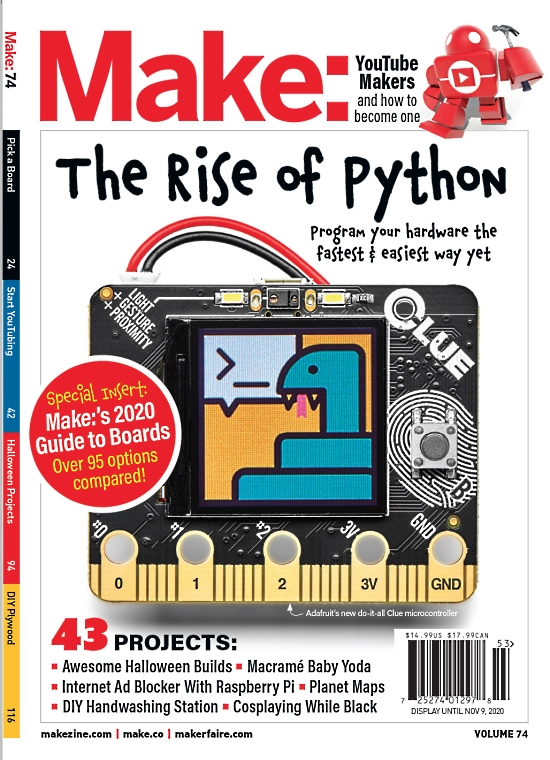](https://twitter.com/dalepd/status/1291475668157358081)

[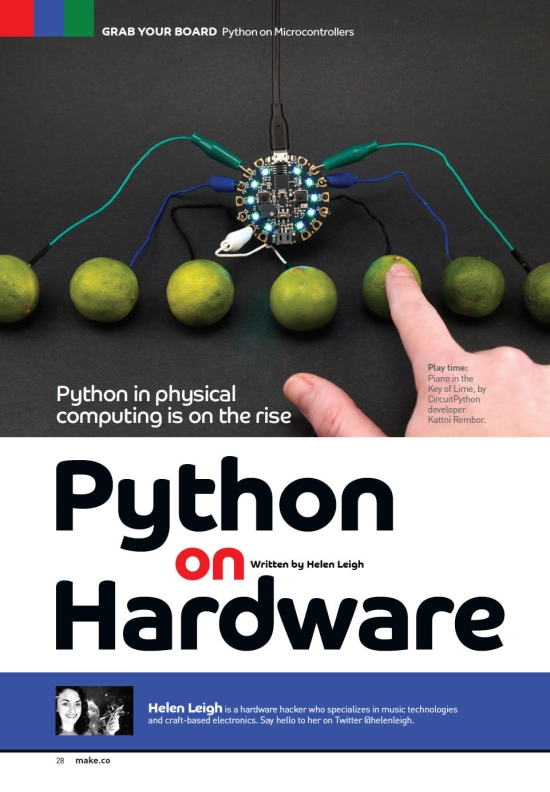](https://twitter.com/helenleigh/status/1291482212584566784)

Make: Magazine's new issue is on its way to subscribers. It's their annual guide to microcontroller boards and features the [new Adafruit CLUE board](https://www.adafruit.com/product/4500), which is programmable in CircuitPython - [Twitter](https://twitter.com/dalepd/status/1291475668157358081) and [Author](https://twitter.com/helenleigh/status/1291482212584566784)

The Make: Makers’ Guide to Boards is also on their website - [Makezine](https://makezine.com/comparison/boards/) and [Their CLUE Review](https://makezine.com/product-review/boards/adafruit-clue-nrf52840-express-with-bluetooth-le/)

## A pip user experience survey

[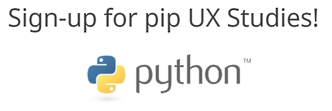](https://tools.simplysecure.org/survey/index.php?r=survey/index&sid=827389&lang=en)

The Python package manager (pip) team is working to improve the usability of pip, for **all** users. Right now, a lot of what pip does can be confusing and complicated for people who are not Python experts. The team's objective is to understand how to improve that.

You can read about the work on the [Python Software Foundation website](https://wiki.python.org/psf/Pip2020DonorFundedRoadmap) and can hear about the work on [this Python podcast](https://testandcode.com/124).

Right now, the team wants to speak with users about the following topics:

- Who uses pip?
- How do users' disabilities affect their usage of pip?
- How does pip documentation help users?
- What pip functionality is important to users?
- What problems do people have with pip? And how can we improve it for them?

They're interested in speaking with people of all levels of Python experience.

They can't stress enough - you don't need to be a programming expert to take part. In fact they are specifically looking to hear from those who are not programmers. They're looking for diverse users to take part in the research - if you use pip they are interested in hearing from you.

If you're interested in speaking with the team about your experiences, the first thing to do is to [sign up for UX Studies](https://tools.simplysecure.org/survey/index.php?r=survey/index&sid=827389&lang=en).

## Open Source at Google

[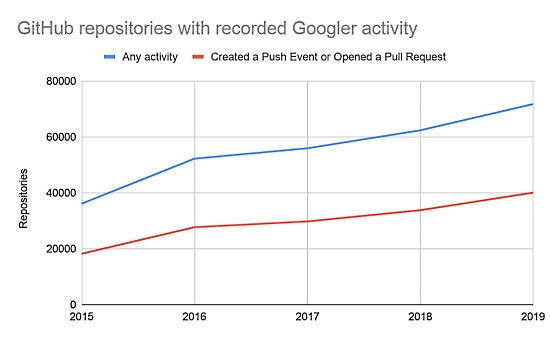](https://opensource.googleblog.com/2020/08/open-source-by-numbers-at-google.html)

A summary of the contributions Google has provided to Open Source Software:

> At Google, open source is at the core of our infrastructure, processes, and culture. As such, participation in these communities is vital to our productivity. Within OSPO (Open Source Programs Office), our mission is to bring the value of open source to Google and the resources of Google to open source. To ensure our actions match our commitment, in this post we will explore a variety of metrics intended to increase context, transparency, and accountability across all of the communities we engage with.

They state that their intentions are twofold: give back to the communities they depend on as well as expand support for open source overall. Google firmly believes in open source and its ability to bring together users, contributors, and companies alike to deliver better software - [Google Open Source Blog](https://opensource.googleblog.com/2020/08/open-source-by-numbers-at-google.html).

## CircuitPython Deep Dive Stream with Scott Shawcroft

[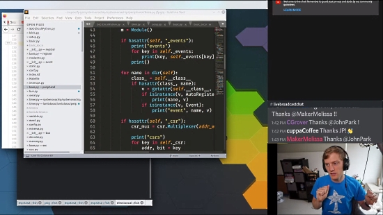](https://youtu.be/8WvLviAr8a0)

This week, Scott streams his work on FPGA and an ESP32-S2 IP address!

You can see the latest video and past videos on the Adafruit YouTube channel under the Deep Dive playlist - [YouTube](https://www.youtube.com/playlist?list=PLjF7R1fz_OOXBHlu9msoXq2jQN4JpCk8A).

## CircuitPython Day is 9-9-2020

Adafruit has chosen September 9, 2020 (9/9/2020) as the snakiest day of this year for CircuitPython Day! Much more to come on events and happenings to include a CircuitPython team livestream, collaboration with hardware and software folks, and highlighting all things Python and Python on Hardware. More information will be forthcoming. Ideas? Send them via email to circuitpythonday@adafruit.com.

## Adafruit - Back to School

**Adafruit is stocked and shipping orders!**

Now is the best time to get orders in for your favorite products, including items for students. 

Science is fun and educational when using Adafruit parts and free, easy to follow tutorials in the [Adafruit Learning System](https://learn.adafruit.com/). 

**[Shop Adafruit now](https://www.adafruit.com/).**

## News from around the web!

[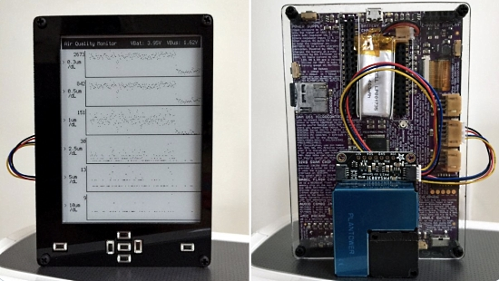](https://twitter.com/josecastillo/status/1291808150169976832)

Repurposing an Open Book prototype + a new [Adafruit air quality breakout](https://www.adafruit.com/product/4632) to make a CircuitPython air quality monitor - [Twitter](https://twitter.com/josecastillo/status/1291808150169976832) and [GitHub Gist](https://gist.github.com/joeycastillo/e70529e759756d3994640dee444d62d6).

[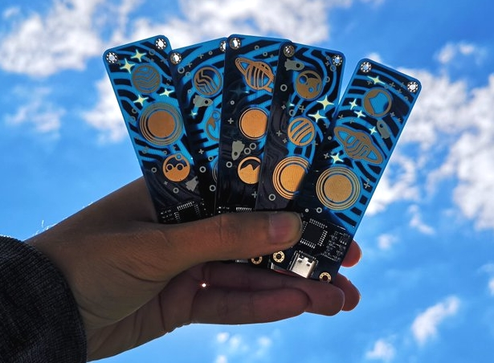](https://twitter.com/Bleeptrack/status/1291013322062659586)

[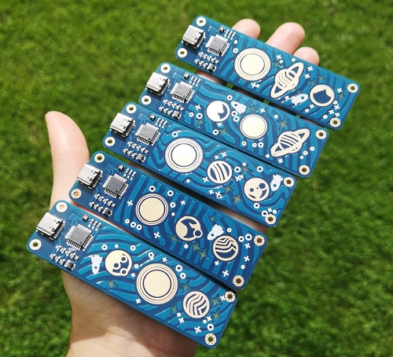](https://twitter.com/Bleeptrack/status/1291013322062659586)

PicoPlanet microcontroller boards each have a design which is procedurally generated and only 10 pieces per design are produced.

> I need a bit more work on the software side, then they will be available on Tindie.

More - [Twitter](https://twitter.com/Bleeptrack/status/1291013322062659586) and [GitHub](https://github.com/adafruit/circuitpython/issues/3253).

[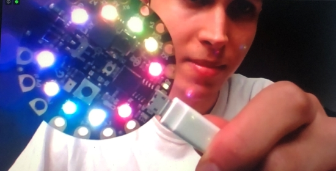](https://twitter.com/MorganStanley/status/1291791657483018243)

The Morgan Stanley Makerspace program helped a promising group of [@FinTechFocus](https://twitter.com/FinTechFocus) students learn how to code in Python using the [Adafruit CircuitPython Express](https://www.adafruit.com/product/3333) - [Twitter](https://twitter.com/MorganStanley/status/1291791657483018243).

**#ICYDNCI What was the most popular, most clicked link, in [last week's newsletter](https://link)? [title](url).**

## Made with Mu

Why Mu? Mu tries to make it as easy as possible to get started with programming but aims to help you graduate to "real" development tools soon after. Everything in Mu is the "real thing" but presented in as simple and obvious way possible. It's like the toddling stage in learning to walk: you're finding your feet and once you're confident, you should move on and explore! Put simply, Mu aims to foster autonomy. Try out Mu today! - [codewith.mu](https://codewith.mu/)

## Coming soon

## New Boards Supported by CircuitPython

The number of supported microcontrollers and Single Board Computers (SBC) grows every week. This section outlines which boards have been included in CircuitPython or added to [CircuitPython.org](https://circuitpython.org/).

This week we had X new boards added!

- [Board name](url)

Looking for adding a new board to CircuitPython? It's highly encouraged! Adafruit has four guides to help you do so:

- [How to Add a New Board to CircuitPython](https://learn.adafruit.com/how-to-add-a-new-board-to-circuitpython/overview)
- [How to add a New Board to the circuitpython.org website](https://learn.adafruit.com/how-to-add-a-new-board-to-the-circuitpython-org-website)
- [Adding a Single Board Computer to PlatformDetect for Blinka](https://learn.adafruit.com/adding-a-single-board-computer-to-platformdetect-for-blinka)
- [Adding a Single Board Computer to Blinka](https://learn.adafruit.com/adding-a-single-board-computer-to-blinka)

## New Learn Guides!

[PyRuler Video Conference Panic Buttons](https://learn.adafruit.com/PyRulerVideoPanic) from [John Thurmond](https://learn.adafruit.com/users/grajohnt)

[MIDI Solenoid Drum Kit](https://learn.adafruit.com/midi-solenoid-drum-kit) from [Noe and Pedro](https://learn.adafruit.com/users/pixil3d)

[Adafruit TDK InvenSense ICM-20948 9-DoF IMU](https://learn.adafruit.com/adafruit-tdk-invensense-icm-20948-9-dof-imu) from [Bryan Siepert](https://learn.adafruit.com/users/siddacious)

[DIY Robotic Sky Tracking Astrophotography Mount with CircuitPython](https://learn.adafruit.com/diy-robotic-sky-tracking-astrophotography-mount) from [Dylan Herrada](https://learn.adafruit.com/users/dherrada)

## CircuitPython Libraries!

CircuitPython support for hardware continues to grow. We are adding support for new sensors and breakouts all the time, as well as improving on the drivers we already have. As we add more libraries and update current ones, you can keep up with all the changes right here!

For the latest libraries, download the [Adafruit CircuitPython Library Bundle](https://circuitpython.org/libraries). For the latest community contributed libraries, download the [CircuitPython Community Bundle](https://github.com/adafruit/CircuitPython_Community_Bundle/releases).

If you'd like to contribute, CircuitPython libraries are a great place to start. Have an idea for a new driver? File an issue on [CircuitPython](https://github.com/adafruit/circuitpython/issues)! Have you written a library you'd like to make available? Submit it to the [CircuitPython Community Bundle](https://github.com/adafruit/CircuitPython_Community_Bundle). Interested in helping with current libraries? Check out the [CircuitPython.org Contributing page](https://circuitpython.org/contributing). We've included open pull requests and issues from the libraries, and details about repo-level issues that need to be addressed. We have a guide on [contributing to CircuitPython with Git and Github](https://learn.adafruit.com/contribute-to-circuitpython-with-git-and-github) if you need help getting started. You can also find us in the #circuitpython channel on the [Adafruit Discord](https://adafru.it/discord).

You can check out this [list of all the Adafruit CircuitPython libraries and drivers available](https://github.com/adafruit/Adafruit_CircuitPython_Bundle/blob/master/circuitpython_library_list.md). 

The current number of CircuitPython libraries is **264**!

**New Libraries!**

Here's this week's new CircuitPython libraries:

 * [Adafruit_CircuitPython_MS8607](https://github.com/adafruit/Adafruit_CircuitPython_MS8607)

**Updated Libraries!**

Here's this week's updated CircuitPython libraries:
 * [Adafruit_CircuitPython_BME680](https://github.com/adafruit/Adafruit_CircuitPython_BME680)
 * [Adafruit_CircuitPython_MCP230xx](https://github.com/adafruit/Adafruit_CircuitPython_MCP230xx)
 * [Adafruit_CircuitPython_ProgressBar](https://github.com/adafruit/Adafruit_CircuitPython_ProgressBar)
 * [Adafruit_CircuitPython_Display_Shapes](https://github.com/adafruit/Adafruit_CircuitPython_Display_Shapes)
 * [Adafruit_CircuitPython_GC_IOT_Core](https://github.com/adafruit/Adafruit_CircuitPython_GC_IOT_Core)
 * [Adafruit_CircuitPython_MiniMQTT](https://github.com/adafruit/Adafruit_CircuitPython_MiniMQTT)

**PyPI Download Stats!**

We've written a special library called Adafruit Blinka that makes it possible to use CircuitPython Libraries on [Raspberry Pi and other compatible single-board computers](https://learn.adafruit.com/circuitpython-on-raspberrypi-linux/). Adafruit Blinka and all the CircuitPython libraries have been deployed to PyPI for super simple installation on Linux! Here are the top 10 CircuitPython libraries downloaded from PyPI in the last week, including the total downloads for those libraries:

Keep checking back for updated download stats coming soon!

## What’s the team up to this week?

What is the team up to this week? Let’s check in!

**Bryan**

The last week was short for me thanks to a much-needed camping trip to my favorite sea-side campground. Alas I don't have any spectacular pictures to show, so a picture of my dog impatiently anticipating our arrival will have to suffice:

The remainder of my week saw me bouncing between a few tasks, but mostly focused on the MS8607 Pressure, Temperature, and Humidity (PHT) sensor from TE Connectivity. Because of their many applications, PHT sensors are a common offering from companies making sensors. This one is no different, and does an admirable job of measuring a wide range of all three environmental conditions. Each and every MS8607 sensor is calibrated at the factory and the calibration constants stored in the sensor itself.

As with other sensors with integrated calibration data, one of the most challenging parts of the driver writing process is implementing the algorithm used to convert the calibration constants into corrections to be applied to the raw sensor data. Here is the fun flow chart for applying corrections to the pressure and temperature data:

[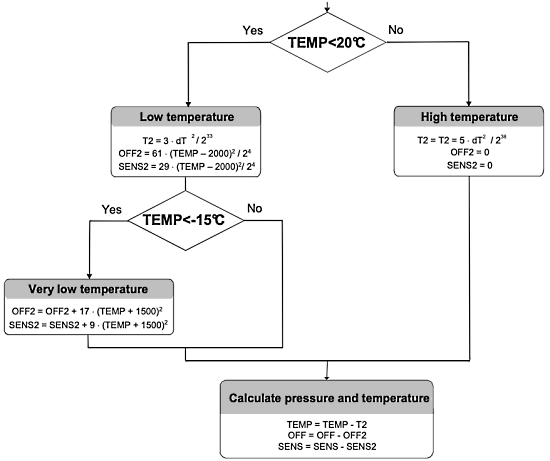](https://circuitpython.org/)

As I write this I'm finishing up the Arduino library and have finished the CircuitPython library. Once I wrap this up, I'll hopefully be moving onto assembling and testing the CAN Bus FeatherWing that's been sitting on my bench while I wrap up a handful of sensors.

**Dan**

I'm still doing the ATT (attribute) protocol implementation for HCI \_bleio. I've got service discovery working, and am finishing up characteristic and descriptor discovery. The next step after that is to implement read and write for characteristics, and to do characteristic notification. Once that is done I'll have all the pieces in place for Bluefruit Connect app to be able to talk over BLE to a board using an HCI BLE adapter, like the M4 Airlift or the PyPortal. Things are going smoothly and I'm looking forward to that end goal.

**Jeff**

[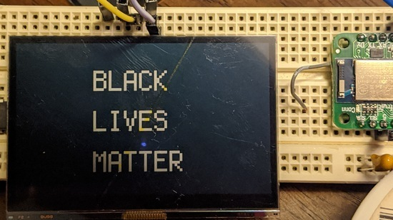](https://circuitpython.org/)

At the moment, I'm working on bringing the Sharp Memory Display forward into the world of displayio.  Right now you can already use these displays --both this large 2.7 inch 400x240 one and the 1.3 inch 144x168 one -- in CircuitPython, but you have to use an older "framebuf" API for interacting with them.  With the new support, it will work just like other black and white displays, with text, bitmaps and shapes all supported.  In addition to doing the coding, there will be a new page in the Sharp Memory Display guide showing you how to get started.

**Kattni**

**Lucian**

This week I worked on wrapping up testing for the Neopixel and implementing PulseIn and PulseOut on the ESP32-S2. Both have been fairly straightforward, since the ESP32 architecture has a dedicated pulse control peripheral for creating and decoding pulse trains. Interestingly, the trickiest part of the implementation has been working around assumptions within Circuitpython that a peripheral with these capabilities does *not* exist - PulseOut, for example, assumes that the implementation will need to bit-bang a PWM output up and down, and thus requires a PWM peripheral object as a parameter despite a dedicated pulse transmitter like the RMT not needing one. Thus, we've started thinking about a number of API changes to work through these assumptions, and even breaking PWMOut from PulseIO completely into its own module, PWMIO. I'll be planning out these changes more this coming week once PulseIn and PulseOut enter PR review. 

**Melissa**

[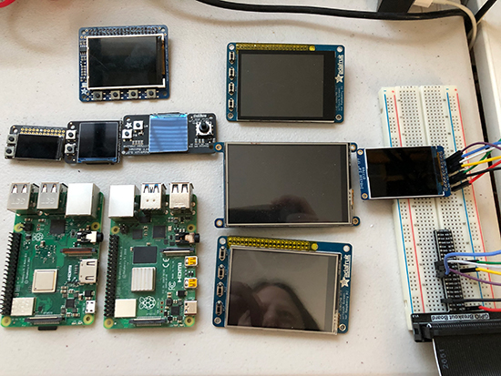](https://circuitpython.org/)

This past week, I mainly focused on refactoring the MatrixPortal library and finished that up. I had originally taken the PyPortal library as a single file and modified it to work with the RGB Matrix shield and Metro M4 Airlift Lite board. While it worked, it did require loading everything, which could be a bit memory intensive. With the refactoring, it is able to be used with just the portions you need, though the original ease of use from before refactoring is still present that ties everything together.

I also worked on testing some changes to the PiTFT install script that were done by Ladyada. I wanted to make sure that it was still working on each display. There were only a few minor issues that I found during testing and those were promptly fixed, so everything is working great with the latest version of Raspberry Pi OS.

**Scott**

This week I've been plugging away at adding Wifi support to the ESP32-S2. I've got network scanning working and connecting working. Next up is adding the socket APIs used to perform all sorts of internety things. Will also add ping to make debugging easier. The file system seems flakier so I'll likely need to debug that at some point too.

In my evenings I've continued to poke at Python FPGA stuff and made further progress on hooking everything up. I'm now working on testing it to make sure everything is hooked up right.

As always, you can get latest I'm working on by watching [my latest "Deep Dive" stream](https://www.youtube.com/playlist?list=PLjF7R1fz_OOXBHlu9msoXq2jQN4JpCk8A).

## Upcoming events!

PyCon AU has announced they are holding PyConline AU, an online event, from 4–6 September 2020 -  [pycon.org.au](https://2020.pycon.org.au/).

PyGotham is a New York City based, eclectic, Py-centric conference covering many topics. PyGotham TV taking place October 2-3, 2020 with a single track of talks presented online - [Event Website](https://2020.pygotham.tv/) and [Call for Proposals](https://cfp.pygotham.tv/).

PyCon India 2020: the premier conference in India on using and developing the Python programming language. Held online October 3-5, 2020. A [call for proposals](https://in.pycon.org/cfp/2020/proposals/) is now open through August 14, 2020. - [Website](https://in.pycon.org/2020/) and [Twitter](https://twitter.com/pyconindia)

**Meetup Groups**

[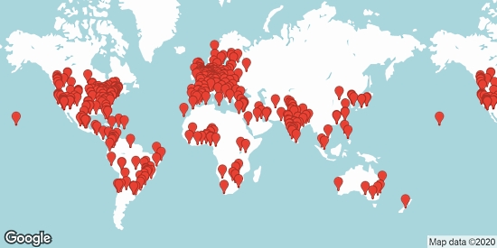](https://www.meetup.com/topics/data-science-using-python/)

Data Science using Python is a consortium of 970 Meetup groups with over 700K members. There are meetings happening worldwide, see their main page for details - [Meetup](https://www.meetup.com/topics/data-science-using-python/).

PyData is a consortium of 175 groups with about 170K members, and provides a forum for the international community of users and developers of data analysis tools to share ideas and learn from each other - [Meetup](https://www.meetup.com/pro/pydata/).

PyLadies has 28 groups with over 28K members. Find out what's happening in PyLadies Meetup groups around the world and start meeting up with the ones near you - [Meetup](https://www.meetup.com/topics/pyladies/).

**Send Your Events In**

As for other events, with the COVID pandemic, most in-person events are postponed or cancelled. If you know of virtual events or events that may occur in the future, please let us know on Discord or on Twitter with hashtag #CircuitPython.

## Latest releases

CircuitPython's stable release is [#.#.#](https://github.com/adafruit/circuitpython/releases/latest) and its unstable release is [#.#.#-##.#](https://github.com/adafruit/circuitpython/releases). New to CircuitPython? Start with our [Welcome to CircuitPython Guide](https://learn.adafruit.com/welcome-to-circuitpython).

[2019####](https://github.com/adafruit/Adafruit_CircuitPython_Bundle/releases/latest) is the latest CircuitPython library bundle.

[v#.#.#](https://micropython.org/download) is the latest MicroPython release. Documentation for it is [here](http://docs.micropython.org/en/latest/pyboard/).

[#.#.#](https://www.python.org/downloads/) is the latest Python release. The latest pre-release version is [#.#.#](https://www.python.org/download/pre-releases/).

[1791 Stars](https://github.com/adafruit/circuitpython/stargazers) Like CircuitPython? [Star it on GitHub!](https://github.com/adafruit/circuitpython)

## Call for help -- Translating CircuitPython is now easier than ever!

[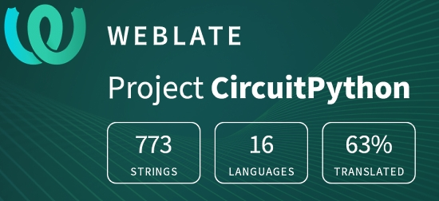](https://hosted.weblate.org/engage/circuitpython/)

One important feature of CircuitPython is translated control and error messages.

With the help of fellow open source project [Weblate](https://weblate.org/), we're making it even easier to add or improve translations.

Sign in with an existing account such as Github, Google or Facebook and start contributing through a simple web interface. No forks or pull requests needed!

As always, if you run into trouble join us on [Discord](https://adafru.it/discord), we're here to help.

## jobs.adafruit.com - Find a dream job, find great candidates!

[jobs.adafruit.com](https://jobs.adafruit.com/) has returned and folks are posting their skills (including CircuitPython) and companies are looking for talented makers to join their companies - from Digi-Key, to Hackaday, Microcenter, Raspberry Pi and more.

## NUMBER thanks!

The Adafruit Discord community, where we do all our CircuitPython development in the open, reached over NUMBER humans, thank you!  Adafruit believes Discord offers a unique way for CircuitPython folks to connect. Join today at [https://adafru.it/discord](https://adafru.it/discord).

## ICYMI - In case you missed it

The wonderful world of Python on hardware! This is our first video-newsletter-podcast that we’ve started! The news comes from the Python community, Discord, Adafruit communities and more. It’s part of the weekly newsletter, then we have a segment on ASK an ENGINEER and this is the video slice from that! The complete Python on Hardware weekly videocast [playlist is here](https://www.youtube.com/playlist?list=PLjF7R1fz_OOXRMjM7Sm0J2Xt6H81TdDev). 

This video podcast is on [iTunes](https://itunes.apple.com/us/podcast/python-on-hardware/id1451685192?mt=2), [YouTube](http://adafru.it/pohepisodes), [IGTV (Instagram TV](https://www.instagram.com/adafruit/channel/)), and [XML](https://itunes.apple.com/us/podcast/python-on-hardware/id1451685192?mt=2).

[Weekly community chat on Adafruit Discord server CircuitPython channel - Audio / Podcast edition](https://itunes.apple.com/us/podcast/circuitpython-weekly-meeting/id1451685016) - Audio from the Discord chat space for CircuitPython, meetings are usually Mondays at 2pm ET, this is the audio version on [iTunes](https://itunes.apple.com/us/podcast/circuitpython-weekly-meeting/id1451685016), Pocket Casts, [Spotify](https://adafru.it/spotify), and [XML feed](https://adafruit-podcasts.s3.amazonaws.com/circuitpython_weekly_meeting/audio-podcast.xml).

And lastly, we are working up a one-spot destination for all things podcast-able here - [podcasts.adafruit.com](https://podcasts.adafruit.com/)

## Codecademy "Learn Hardware Programming with CircuitPython"

Codecademy, an online interactive learning platform used by more than 45 million people, has teamed up with the leading manufacturer in STEAM electronics, Adafruit Industries, to create a coding course, "Learn Hardware Programming with CircuitPython". The course is now available in the [Codecademy catalog](https://www.codecademy.com/learn/learn-circuitpython?utm_source=adafruit&utm_medium=partners&utm_campaign=circuitplayground&utm_content=pythononhardwarenewsletter).

Python is a highly versatile, easy to learn programming language that a wide range of people, from visual effects artists in Hollywood to mission control at NASA, use to quickly solve problems. But you don’t need to be a rocket scientist to accomplish amazing things with it. This new course introduces programmers to Python by way of a microcontroller — CircuitPython — which is a Python-based programming language optimized for use on hardware.

CircuitPython’s hardware-ready design makes it easier than ever to program a variety of single-board computers, and this course gets you from no experience to working prototype faster than ever before. Codecademy’s interactive learning environment, combined with Adafruit's highly rated Circuit Playground Express, present aspiring hardware hackers with a never-before-seen opportunity to learn hardware programming seamlessly online.

Whether for those who are new to programming, or for those who want to expand their skill set to include physical computing, this course will have students getting familiar with Python and creating incredible projects along the way. By the end, students will have built their own bike lights, drum machine, and even a moisture detector that can tell when it's time to water a plant.

Visit Codecademy to access the [Learn Hardware Programming with CircuitPython](https://www.codecademy.com/learn/learn-circuitpython?utm_source=adafruit&utm_medium=partners&utm_campaign=circuitplayground&utm_content=pythononhardwarenewsletter) course and Adafruit to purchase a [Circuit Playground Express](https://www.adafruit.com/product/3333).

Codecademy has helped more than 45 million people around the world upgrade their careers with technology skills. The company’s online interactive learning platform is widely recognized for providing an accessible, flexible, and engaging experience for beginners and experienced programmers alike. Codecademy has raised a total of $43 million from investors including Union Square Ventures, Kleiner Perkins, Index Ventures, Thrive Capital, Naspers, Yuri Milner and Richard Branson, most recently raising its $30 million Series C in July 2016.

## Contribute!

The CircuitPython Weekly Newsletter is a CircuitPython community-run newsletter emailed every Tuesday. The complete [archives are here](https://www.adafruitdaily.com/category/circuitpython/). It highlights the latest CircuitPython related news from around the web including Python and MicroPython developments. To contribute, edit next week's draft [on GitHub](https://github.com/adafruit/circuitpython-weekly-newsletter/tree/gh-pages/_drafts) and [submit a pull request](https://help.github.com/articles/editing-files-in-your-repository/) with the changes. You may also tag your information on Twitter with #CircuitPython. 

Join our [Discord](https://adafru.it/discord) or [post to the forum](https://forums.adafruit.com/viewforum.php?f=60) for any further questions.
