- [X] Kattni updates
- [ ] change date
- [ ] update title
- [ ] Feature story
- [ ] Update  for images
- [ ] Update ICYDNCI
- [ ] All images 550w max only
- [ ] Link "View this email in your browser."

Template last updated on 08-10-2020 by Anne - format

View this email in your browser.

Hi everyone! It's the latest Python for Microcontrollers newsletter, brought you by the community! We're on [Discord](https://discord.gg/HYqvREz), [Twitter](https://twitter.com/search?q=circuitpython&src=typed_query&f=live), and for past newsletters - [view them all here](https://www.adafruitdaily.com/category/circuitpython/). If you're reading this on the web, [subscribe here](https://www.adafruitdaily.com/). Let's get started!

## CircuitPython Takes Flight in MS Flight Simulator

[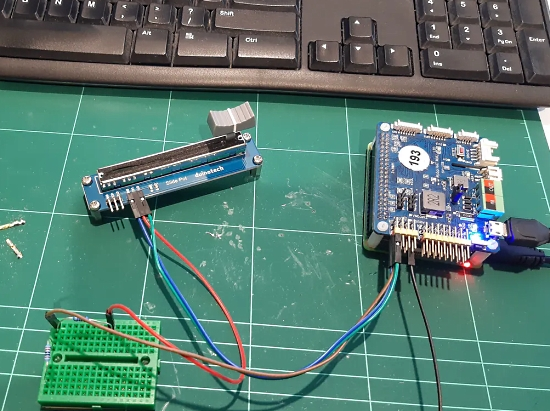](https://www.hackster.io/wallarug/custom-flight-control-column-part-1-f326a8)

[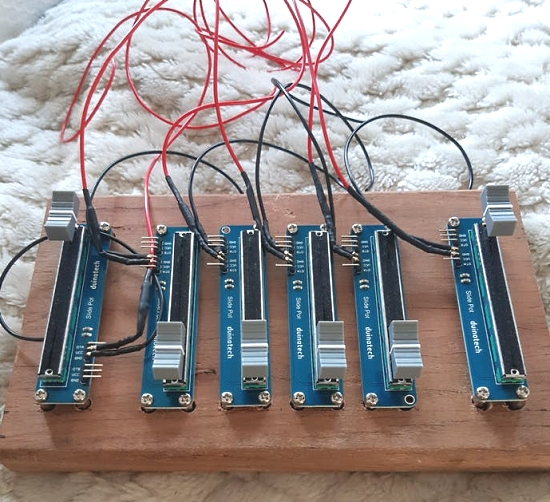](https://www.hackster.io/wallarug/custom-flight-control-column-part-1-f326a8)

Creating a flight controller for Microsoft Flight Simulator using CircuitPython and custom circuits - [Hackster.io](https://www.hackster.io/wallarug/custom-flight-control-column-part-1-f326a8) and [Twitter](https://twitter.com/wallarug/status/1294613671801323521).

> For many years, I have used and played in Microsoft Flight Simulator X. In anticipation of the upcoming release of the new version - Microsoft Flight Simulator 2020 - I wanted to ensure I had the best set up ready for flight! I knew that CircuitPython had a gamepad software library that makes your CircuitPython code appear like a Joystick. I had an idea that this could be hacked up (easily) and make to suit my purpose. CircuitPython also makes working with hardware easy.

## CircuitPython CLUE Cutebot

[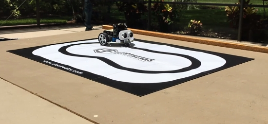](https://github.com/jisforjt/CircuitPython_CLUE_Cutebot)

CircuitPython-CLUE-Cutebot is a higher-level library to allow Adafruit's CLUE and ElecFreak's micro:bit Smart Cutebot to communicate while maintaining all the functionality of the CLUE, except for touch features - [GitHub](https://github.com/jisforjt/CircuitPython_CLUE_Cutebot) and [YouTube](https://www.youtube.com/watch?v=jVEu-UyjuIc&feature=youtu.be).

> I am a teacher of young learns and as such the code was purposefully left simple so I can use it with them. There is also a comment on nearly every line to help explain to my students what each line is doing.

## A 14-segment Internet Display

[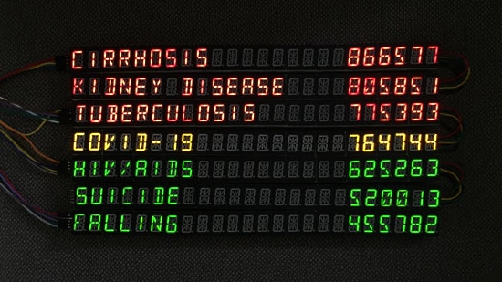](https://www.hackster.io/news/it-s-the-leaderboard-that-nobody-wants-to-sit-atop-joey-castillo-s-keeping-tabs-on-the-end-of-times-d28c7a986c1b)

[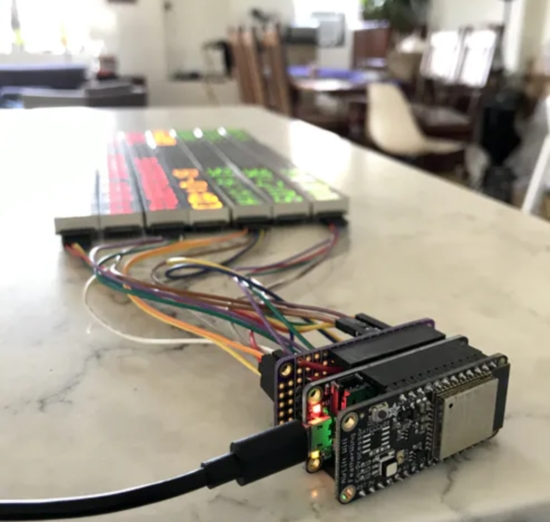](https://www.hackster.io/news/it-s-the-leaderboard-that-nobody-wants-to-sit-atop-joey-castillo-s-keeping-tabs-on-the-end-of-times-d28c7a986c1b)

A somber scoreboard keeps real-time tabs on COVID-19, and other such adversaries - the big board of death. This project uses 21 custom HT16K33 14-segment display modules driven from an Adafruit Feather M4 Feather, which has 4 I2C buses to drive so many displays. The microcontroller is mated to an Adafruit AirLift FeatherWing to connect to WiFi. Data is collected via JSON format and displayed on the board - [Hackster.io](https://www.hackster.io/news/it-s-the-leaderboard-that-nobody-wants-to-sit-atop-joey-castillo-s-keeping-tabs-on-the-end-of-times-d28c7a986c1b) and [Twitter](https://twitter.com/Hacksterio/status/1295085221763842053).

[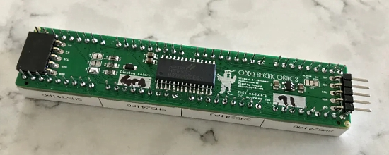](https://www.hackster.io/news/it-s-the-leaderboard-that-nobody-wants-to-sit-atop-joey-castillo-s-keeping-tabs-on-the-end-of-times-d28c7a986c1b)

The display boards are custom and the design is available - [GitHub](https://github.com/joeycastillo/Feather-Projects/tree/master/Totally%20Not%20Feather%20Related).

## A CircuitPython Telescope Drive Controller

[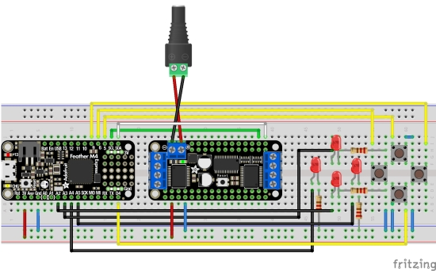](https://github.com/Antelope-IT/telescope-controller)

The source code and design schematics for a simple telescope drive controller for a telescope with basic stepper motor drives. The controller uses an Adafruit M4 Feather Express microcontroller and the Adafruit Stepper + DC Motor FeatherWing motor drive. The software is written in CircuitPython - [GitHub](https://github.com/Antelope-IT/telescope-controller).

## bip - using Python with IDA

Bip is a project aimed to simplify the usage of Python for interacting with IDA. Its main goals are to facilitate the usage of Python in the interactive console of IDA and for writing plugins. In a more general way, the goal is to automate the recurrent task done through the Python API. Bip is also developed for providing a more object oriented, "Python-like" API and real documentation. It includes both the traditional API and the hexrays API - [GitHub](https://github.com/synacktiv/bip/) aand [Twitter](https://twitter.com/brunopujos/status/1294211283546497024?s=11).

## CircuitPython Deep Dive Stream with Scott Shawcroft

[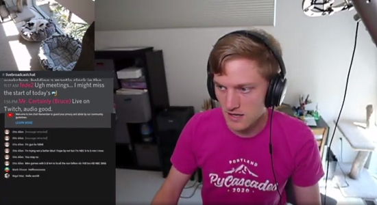](https://youtu.be/574I1r-yNEk)

This week, Scott streams his work on ESP32-S2 TLS web access and memory - [YouTube](https://youtu.be/574I1r-yNEk).

You can see the latest video and past videos on the Adafruit YouTube channel under the Deep Dive playlist - [YouTube](https://www.youtube.com/playlist?list=PLjF7R1fz_OOXBHlu9msoXq2jQN4JpCk8A).

## CircuitPython Day is 9-9-2020

Adafruit has chosen September 9, 2020 (9/9/2020) as the snakiest day of this year for CircuitPython Day! Much more to come on events and happenings to include a CircuitPython team livestream, collaboration with hardware and software folks, and highlighting all things Python and Python on Hardware. More information will be forthcoming. Ideas? Send them via email to circuitpythonday@adafruit.com.

## Adafruit Update

[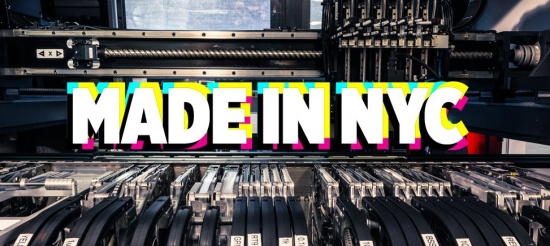](https://blog.adafruit.com/2020/05/26/adafruit-is-open-safely-and-shipping-all-orders/)

**Adafruit is shipping orders!**

Production is up and now is the best time to get the Adafruit items you've been waiting for.

## News from around the web!

CircuitPython_CLUE_Menu - make your Adafruit CLUE multi-functional by adding a nifty startup menu to select the program you want to run. You no longer need to rename your files to code or main to run them. Simply drag and drop your files into your CIRCUITPY drive and this menu program does the rest - [GitHub](https://github.com/jisforjt/CircuitPython_CLUE_Menu) and [YouTube](https://www.youtube.com/watch?v=ZTE-hqM6GPo&feature=youtu.be).

A video example with complete code of Adafruit CircuitPython on M4 chips doing capsense touchio - [Twitter](https://twitter.com/todbot/status/1294012752566992896).

[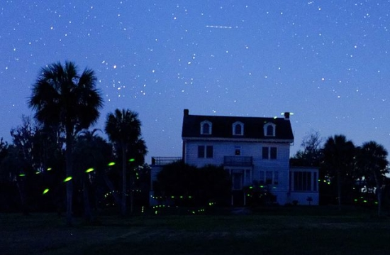](https://github.com/mwweinberg/firefly)

Simulating firefly flashes with NeoPixel LEDs in CircuitPython - [GitHub](https://github.com/mwweinberg/firefly).

Pi OS for Zynqberry: Adafruit RFM69 Radio with Python, CircuitPython and Adafruit Blinka - [hackster.io](https://www.hackster.io/whitney-knitter/pi-os-for-zynqberry-adafruit-rfm69-radio-with-circuitpython-1ae658) and [Twitter](https://twitter.com/knitronics/status/1293989403308830725).

Scripts for using an ILI9341 LCD with an Odroid XU4 in Python via Adafruit Blinka and CircuitPython - [GitHub](https://github.com/mateo/Odroid-ILI9341).

Two new books on using CircuitPython:

- [Ten Games for the Circuit Playground Express](https://www.amazon.com/gp/product/B08CL3BTZS/)
- [Make Music with the Circuit Playground Express: Twelve projects that make music, sound and noise](https://www.amazon.com/gp/product/B088LV7Q8Y/)

[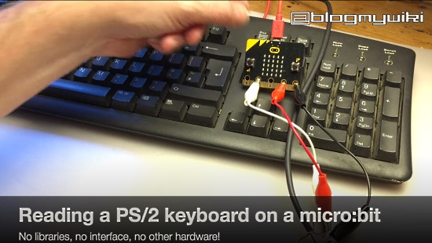](http://www.suppertime.co.uk/blogmywiki/2020/08/ps2-keyboard-microbit/)

Read a PS/2 keyboard on a BBC micro:bit with MicroPython - [Twitter](https://twitter.com/blogmywiki/status/1291446632287019009), [BlogMyWiki](http://www.suppertime.co.uk/blogmywiki/2020/08/ps2-keyboard-microbit/) and [YouTube](https://www.youtube.com/watch?v=6EP4AaF8HHE&feature=emb_logo).

[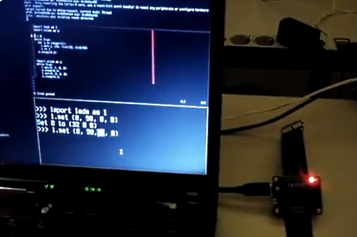](https://twitter.com/schne1der_/status/1293072572519796736)

Using MicroPython to interact with the [Card10 Badge](https://twitter.com/card10badge) - [Twitter](https://twitter.com/schne1der_/status/1293072572519796736).

Conway's Game of Life on an ESP32 with MicroPython and an LCD display - [Twitter](https://twitter.com/markwinap/status/1292243132134948864), [YouTube](https://www.youtube.com/watch?v=jnX7DAfHiMM&feature=youtu.be) and [GitHub](https://github.com/markwinap/Pycom-SH1107-I2C-John-Conway-Game-of-Life).

[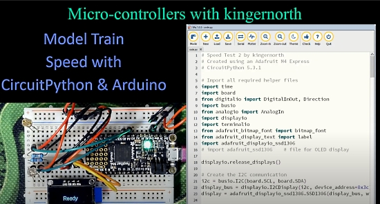](https://www.youtube.com/watch?v=qfeTMSwESA8)

Model Train Speed with CircuitPython & Arduino - [YouTube](https://www.youtube.com/watch?v=qfeTMSwESA8).

Speeding up line rewriting of monochrome liquid crystal (LS027B4DH01) with MicroPython (ESP32) using SPI communications - [ymt-lab](https://ymt-lab.com/micropython-esp32-ls027b4dh01-all-line-replace/).

[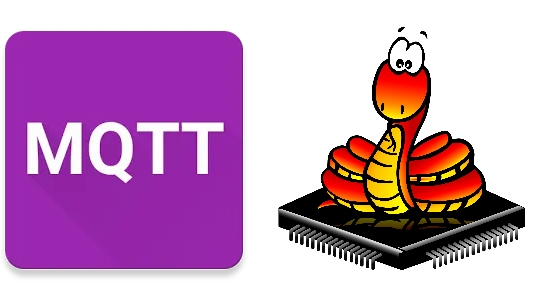](https://twitter.com/marlonscarvalho/status/1293544190203305985)

Using mqtt_as over umqtt.robust in MicroPython - [Twitter](https://twitter.com/marlonscarvalho/status/1293544190203305985) and [GitHub](https://github.com/peterhinch/micropython-mqtt/tree/master/mqtt_as).

ulab Samples - links, examples, benchmarks, etc, about ulab module, a NumPy-like array manipulation library for MicroPython and CircuitPython - [GitHub](https://github.com/rcolistete/ulab_samples#benchmark-of-fft-with-1024-points).

[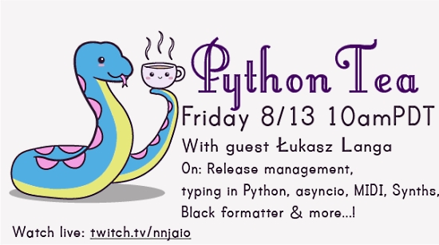](https://www.twitch.tv/videos/710142195)

Python Tea #10: Special Guest Łukasz Langa on release management, typing in Python, asyncio, MIDI, Synths - [Twitch](https://www.twitch.tv/videos/710142195).

[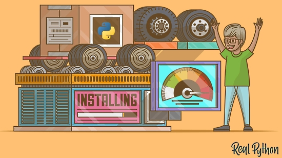](https://realpython.com/python-wheels/)

What Are Python Wheels and Why Should You Care? - [Real Python](https://realpython.com/python-wheels/).

Thr Raspberry Pi Foundation is seeking a Managing Director of Education Products, Director of Clubs - [Twitter](https://twitter.com/philipcolligan/status/1294010866749382656) and [workable.com](https://apply.workable.com/raspberrypi/).

#ICYDNCI What was the most popular, most clicked link, in [last week's newsletter](https://www.adafruitdaily.com/2020/08/11/python-on-microcontrollers-newsletter-make-the-rise-of-python-clue-circuitpython-6-and-more-python-adafruit-circuitpython-circuitpython-micropython-thepsf/)? [Make Magazine: The Rise of Python](https://twitter.com/dalepd/status/1291475668157358081).

## Made with Mu

Why Mu? Mu tries to make it as easy as possible to get started with programming but aims to help you graduate to "real" development tools soon after. Everything in Mu is the "real thing" but presented in as simple and obvious way possible. It's like the toddling stage in learning to walk: you're finding your feet and once you're confident, you should move on and explore! Put simply, Mu aims to foster autonomy. Try out Mu today! - [codewith.mu](https://codewith.mu/)

## New Boards Supported by CircuitPython

The number of supported microcontrollers and Single Board Computers (SBC) grows every week. This section outlines which boards have been included in CircuitPython or added to [CircuitPython.org](https://circuitpython.org/).

This week we had X new boards added!

- [Board name](url)

Looking for adding a new board to CircuitPython? It's highly encouraged! Adafruit has four guides to help you do so:

- [How to Add a New Board to CircuitPython](https://learn.adafruit.com/how-to-add-a-new-board-to-circuitpython/overview)
- [How to add a New Board to the circuitpython.org website](https://learn.adafruit.com/how-to-add-a-new-board-to-the-circuitpython-org-website)
- [Adding a Single Board Computer to PlatformDetect for Blinka](https://learn.adafruit.com/adding-a-single-board-computer-to-platformdetect-for-blinka)
- [Adding a Single Board Computer to Blinka](https://learn.adafruit.com/adding-a-single-board-computer-to-blinka)

## New Learn Guides!

[RGB Matrix Automatic YouTube ON AIR Sign](https://learn.adafruit.com/rgb-matrix-automatic-youtube-on-air-sign) from [John Park](https://learn.adafruit.com/users/johnpark)

[Lego Neon NeoPixel Sign with CircuitPython](https://learn.adafruit.com/lego-neon-sign) from [Noe and Pedro](https://learn.adafruit.com/users/pixil3d)

[Ocean Epoxy Resin Lightbox with RGB LED Matrix Image Scroller](https://learn.adafruit.com/ocean-epoxy-resin-lightbox-with-rgb-led-matrix-image-scroller) from [Erin St. Blaine](https://learn.adafruit.com/users/firepixie)

[Adafruit AS7341 10-Channel Light / Color Sensor Breakout](https://learn.adafruit.com/adafruit-as7341-10-channel-light-color-sensor-breakout) from [Bryan Siepert](https://learn.adafruit.com/users/siddacious)

## CircuitPython Libraries!

CircuitPython support for hardware continues to grow. We are adding support for new sensors and breakouts all the time, as well as improving on the drivers we already have. As we add more libraries and update current ones, you can keep up with all the changes right here!

For the latest libraries, download the [Adafruit CircuitPython Library Bundle](https://circuitpython.org/libraries). For the latest community contributed libraries, download the [CircuitPython Community Bundle](https://github.com/adafruit/CircuitPython_Community_Bundle/releases).

If you'd like to contribute, CircuitPython libraries are a great place to start. Have an idea for a new driver? File an issue on [CircuitPython](https://github.com/adafruit/circuitpython/issues)! Have you written a library you'd like to make available? Submit it to the [CircuitPython Community Bundle](https://github.com/adafruit/CircuitPython_Community_Bundle). Interested in helping with current libraries? Check out the [CircuitPython.org Contributing page](https://circuitpython.org/contributing). We've included open pull requests and issues from the libraries, and details about repo-level issues that need to be addressed. We have a guide on [contributing to CircuitPython with Git and Github](https://learn.adafruit.com/contribute-to-circuitpython-with-git-and-github) if you need help getting started. You can also find us in the #circuitpython channel on the [Adafruit Discord](https://adafru.it/discord).

You can check out this [list of all the Adafruit CircuitPython libraries and drivers available](https://github.com/adafruit/Adafruit_CircuitPython_Bundle/blob/master/circuitpython_library_list.md). 

The current number of CircuitPython libraries is **266**!

**New Libraries!**

Here's this week's new CircuitPython libraries:

 * [Adafruit_CircuitPython_MatrixPortal](https://github.com/adafruit/Adafruit_CircuitPython_MatrixPortal)

**Updated Libraries!**

Here's this week's updated CircuitPython libraries:

 * [Adafruit_CircuitPython_AdafruitIO](https://github.com/adafruit/Adafruit_CircuitPython_AdafruitIO)
 * [Adafruit_CircuitPython_BNO055](https://github.com/adafruit/Adafruit_CircuitPython_BNO055)
 * [Adafruit_CircuitPython_RSA](https://github.com/adafruit/Adafruit_CircuitPython_RSA)
 * [Adafruit_CircuitPython_RFM9x](https://github.com/adafruit/Adafruit_CircuitPython_RFM9x)
 * [Adafruit_CircuitPython_BitmapSaver](https://github.com/adafruit/Adafruit_CircuitPython_BitmapSaver)

**PyPI Download Stats!**

We've written a special library called Adafruit Blinka that makes it possible to use CircuitPython Libraries on [Raspberry Pi and other compatible single-board computers](https://learn.adafruit.com/circuitpython-on-raspberrypi-linux/). Adafruit Blinka and all the CircuitPython libraries have been deployed to PyPI for super simple installation on Linux! Here are the top 10 CircuitPython libraries downloaded from PyPI in the last week, including the total downloads for those libraries:

Keep checking back for updated download stats coming soon!

## What’s the team up to this week?

What is the team up to this week? Let’s check in!

**Bryan**

Last week saw me wrap up the MS8607 and move onto the CAN Bus feather. Unfortunately as it turns out I made a mistake while ordering the board and it came back from OSH Park just as I had requested it, bugs and all.

I've ordered a new, bug free board and in the meanwhile have switched gears to looking at the BNO080 from Hillcrest Laboratories. This is a sensor closely related to the BNO055 by Bosch Sensortec. In fact the BNO055 and BNO080 share the same hardware and only differ in the sensor fusion algorithms running on them and the company supporting them

From https://www.digikey.com/en/product-highlight/h/hillcrest-labs/bno080-imu

> Due to a unique partnership with Bosch, Hillcrest Labs' is able to base the BNO080/BNO085 on a Bosch sensor (BMF055) running Hillcrest Labs proprietary SH-2 software. The Bosch equivalent is the BNO055. Though both can be used in inertial sensing applications, choose the BNO085 for applications that demand high dynamic accuracy, low latency, and context/event classification. For embedded applications, the BNO080/BNO085 also includes RTOS support.

If you're not familiar with the BNO055, it is very interesting and fairly unique sensor package. Like other high end motion sensors it includes an accelerometer, gyroscope, and magnetometer, all with three axes for a total of 9 degrees of freedom. Unlike other sensors it also includes a Cortex M0 processor running a sensor fusion algorithm that does the heavy lifting of taking all of the raw sensor data and calculating useful measurements  like absolute orientation and vectors for angular velocity, acceleration, and magnetic field strength.

An interesting difference between the two is the communication protocol that the BNO080 uses to communicate with the host. Communications take place using a packet based protocol that rides on top of the the underlying USART, I2C or SPI transport layer. Writing the support code to handle that should be an interesting challenge.

**Dan**

I now have HCI \_bleio working completely for Nordic UART as a peripheral. This means I can use the Bluefruit LE Connect app to talk to CircuitPython over BLE using an ESP32 co-processor, available on, for example, the M4 Airlift or the PyPortal. It is satisfying to finally see an end-to-end test working after being head down in this code for weeks. I have a little cleanup to do but will be submitting a PR soon.

**Jeff**

I've continued working on the Sharp Memory Display PR which may be merged by the time this newsletter goes out. STM32 support for SDIO was also belatedly merged after some neglect. Right at this moment, I'm working on reducing Flash memory usage on certain boards so that we can add a new Japanese translation of the CircuitPython core.

**Kattni**

Over the last week, I've created a number of fritzing objects, some fritzing wiring diagrams, updated a couple of guides, and created the beginnings of a guide for Ladyada to finish up. I also took care of plenty of miscellaneous items I have had on my list, including adding the CircuitPython Library cookiecutter to our Adabot script so the issues and PRs are included in our tracked list.

I created a new role on the Adafruit Discord, at the suggestion of Hierphect (Lucian): PCB Helpers. I invited three community members who have been helping out a ton in the #pcb-design channel already - Hierophect, deshipu, and electronic_harry. If you're interested in PCB design, but have questions about where to get started or how to optimise what you're already working on, feel free to check out the #pcb-design channel and get assistance from the new Helpers.

I spent a couple of hours on Friday working with John Park to learn more about Adobe Premiere, which I use to record the newsletter video recap. I've been meaning to do this for a while. There are parts of the videos that are identical across all of them, and so it makes the most sense to record these sections once, and then create reusable assets for adding to subsequent videos. I put it off for ages, and finally got around to making the time to learn how. Now I just need to find the time to do it...

**Lucian**

This past week, I wrestled with the PulseIO module on the ESP32-S2, which ran into some speedbumps related to the internal buffer system on FreeRTOS. In general, I've found that the ESP32-S2 documentation has been high quality, but there are occasional moments where they designed a system to be used at a higher level than what Circuitpython needs - these cases can require wrangling with some highly abstracted internal code. But despite getting briefly bogged down with the IR receiver, I've finally gotten it to start spitting out the required data, and I'm moving on to cleanup and API fixes for the rest of the module.

I've also been looking at some various documentation and website changes, such as fixing the tendency for old APIs to show up first on Google, and reworking the build flags system to be consistent across all ports. I'm also waiting for a new STM32F103 development board to arrive so I can assist with fixing the flash system and getting that port submitted proper. 

**Melissa**

Over this past week, I finally got the MatrixPortal library merged in and it is now part of the bundle. If you're interested, you can take a look at it over at https://github.com/adafruit/Adafruit_CircuitPython_MatrixPortal. It has also been used in a project that has a learn guide written. You can check out John Park's On Air sign available at: https://learn.adafruit.com/rgb-matrix-automatic-youtube-on-air-sign. I've been working with John Park to write some additional demos using this library, so be sure to catch John Park's Workshop each week to learn more.

Another big project that I have been working on is to try and get the STM32MP1 working with Blinka. I spent some time building a custom Debian image so that installing Blinka on it would be much easier. Although the image currently isn't working, I am working with an engineer on the Digi-Key forums to figure out the issue and then I can resume getting it working.

In the meantime, I'm working on porting the PiTFT installation from a shell script over to Python so that it will be simpler and easier to add new displays and maintain.

**Scott**

I've made a lot of progress this week! I fleshed out the ipaddress module, got ping working and the core of socket needed for TCP working. I'm able to fetch HTTP websites and will be adding HTTPS support soon.

The filesystem bug I was hitting the last few weeks was really slowing me down so I decided to tackle it head on on Monday. It turned out to be simpler to debug and fix than I expected. So, the fix for that is already checked in and it's full speed ahead on the core socket APIs.

## Upcoming events!

PyCon AU has announced they are holding PyConline AU, an online event, from 4–6 September 2020 -  [pycon.org.au](https://2020.pycon.org.au/).

PyGotham is a New York City based, eclectic, Py-centric conference covering many topics. PyGotham TV taking place October 2-3, 2020 with a single track of talks presented online - [Event Website](https://2020.pygotham.tv/) and [Call for Proposals](https://cfp.pygotham.tv/).

PyCon India 2020: the premier conference in India on using and developing the Python programming language. Held online October 3-5, 2020. A [call for proposals](https://in.pycon.org/cfp/2020/proposals/) is now open through August 14, 2020. - [Website](https://in.pycon.org/2020/) and [Twitter](https://twitter.com/pyconindia)

The Hackaday Remoticon will take place everywhere November 6th – 8th, 2020. It’s a weekend packed with workshops about hardware creation, held virtually for all to enjoy - [Hackaday](https://hackaday.com/2020/08/04/hackaday-remoticon-our-2020-conference-is-packed-with-workshops-and-were-calling-for-proposals/).

**Send Your Events In**

As for other events, with the COVID pandemic, most in-person events are postponed or cancelled. If you know of virtual events or events that may occur in the future, please let us know on Discord or on Twitter with hashtag #CircuitPython.

## Latest releases

CircuitPython's stable release is [#.#.#](https://github.com/adafruit/circuitpython/releases/latest) and its unstable release is [#.#.#-##.#](https://github.com/adafruit/circuitpython/releases). New to CircuitPython? Start with our [Welcome to CircuitPython Guide](https://learn.adafruit.com/welcome-to-circuitpython).

[2019####](https://github.com/adafruit/Adafruit_CircuitPython_Bundle/releases/latest) is the latest CircuitPython library bundle.

[v#.#.#](https://micropython.org/download) is the latest MicroPython release. Documentation for it is [here](http://docs.micropython.org/en/latest/pyboard/).

[#.#.#](https://www.python.org/downloads/) is the latest Python release. The latest pre-release version is [#.#.#](https://www.python.org/download/pre-releases/).

[1795 Stars](https://github.com/adafruit/circuitpython/stargazers) Like CircuitPython? [Star it on GitHub!](https://github.com/adafruit/circuitpython)

## Call for help -- Translating CircuitPython is now easier than ever!

[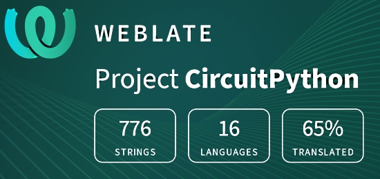](https://hosted.weblate.org/engage/circuitpython/)

One important feature of CircuitPython is translated control and error messages.

With the help of fellow open source project [Weblate](https://weblate.org/), we're making it even easier to add or improve translations.

Sign in with an existing account such as Github, Google or Facebook and start contributing through a simple web interface. No forks or pull requests needed!

As always, if you run into trouble join us on [Discord](https://adafru.it/discord), we're here to help.

## jobs.adafruit.com - Find a dream job, find great candidates!

[jobs.adafruit.com](https://jobs.adafruit.com/) has returned and folks are posting their skills (including CircuitPython) and companies are looking for talented makers to join their companies - from Digi-Key, to Hackaday, Microcenter, Raspberry Pi and more.

## NUMBER thanks!

The Adafruit Discord community, where we do all our CircuitPython development in the open, reached over NUMBER humans, thank you!  Adafruit believes Discord offers a unique way for CircuitPython folks to connect. Join today at [https://adafru.it/discord](https://adafru.it/discord).

## ICYMI - In case you missed it

The wonderful world of Python on hardware! This is our first video-newsletter-podcast that we’ve started! The news comes from the Python community, Discord, Adafruit communities and more. It’s part of the weekly newsletter, then we have a segment on ASK an ENGINEER and this is the video slice from that! The complete Python on Hardware weekly videocast [playlist is here](https://www.youtube.com/playlist?list=PLjF7R1fz_OOXRMjM7Sm0J2Xt6H81TdDev). 

This video podcast is on [iTunes](https://itunes.apple.com/us/podcast/python-on-hardware/id1451685192?mt=2), [YouTube](http://adafru.it/pohepisodes), [IGTV (Instagram TV](https://www.instagram.com/adafruit/channel/)), and [XML](https://itunes.apple.com/us/podcast/python-on-hardware/id1451685192?mt=2).

[Weekly community chat on Adafruit Discord server CircuitPython channel - Audio / Podcast edition](https://itunes.apple.com/us/podcast/circuitpython-weekly-meeting/id1451685016) - Audio from the Discord chat space for CircuitPython, meetings are usually Mondays at 2pm ET, this is the audio version on [iTunes](https://itunes.apple.com/us/podcast/circuitpython-weekly-meeting/id1451685016), Pocket Casts, [Spotify](https://adafru.it/spotify), and [XML feed](https://adafruit-podcasts.s3.amazonaws.com/circuitpython_weekly_meeting/audio-podcast.xml).

And lastly, we are working up a one-spot destination for all things podcast-able here - [podcasts.adafruit.com](https://podcasts.adafruit.com/)

## Codecademy "Learn Hardware Programming with CircuitPython"

Codecademy, an online interactive learning platform used by more than 45 million people, has teamed up with the leading manufacturer in STEAM electronics, Adafruit Industries, to create a coding course, "Learn Hardware Programming with CircuitPython". The course is now available in the [Codecademy catalog](https://www.codecademy.com/learn/learn-circuitpython?utm_source=adafruit&utm_medium=partners&utm_campaign=circuitplayground&utm_content=pythononhardwarenewsletter).

Python is a highly versatile, easy to learn programming language that a wide range of people, from visual effects artists in Hollywood to mission control at NASA, use to quickly solve problems. But you don’t need to be a rocket scientist to accomplish amazing things with it. This new course introduces programmers to Python by way of a microcontroller — CircuitPython — which is a Python-based programming language optimized for use on hardware.

CircuitPython’s hardware-ready design makes it easier than ever to program a variety of single-board computers, and this course gets you from no experience to working prototype faster than ever before. Codecademy’s interactive learning environment, combined with Adafruit's highly rated Circuit Playground Express, present aspiring hardware hackers with a never-before-seen opportunity to learn hardware programming seamlessly online.

Whether for those who are new to programming, or for those who want to expand their skill set to include physical computing, this course will have students getting familiar with Python and creating incredible projects along the way. By the end, students will have built their own bike lights, drum machine, and even a moisture detector that can tell when it's time to water a plant.

Visit Codecademy to access the [Learn Hardware Programming with CircuitPython](https://www.codecademy.com/learn/learn-circuitpython?utm_source=adafruit&utm_medium=partners&utm_campaign=circuitplayground&utm_content=pythononhardwarenewsletter) course and Adafruit to purchase a [Circuit Playground Express](https://www.adafruit.com/product/3333).

Codecademy has helped more than 45 million people around the world upgrade their careers with technology skills. The company’s online interactive learning platform is widely recognized for providing an accessible, flexible, and engaging experience for beginners and experienced programmers alike. Codecademy has raised a total of $43 million from investors including Union Square Ventures, Kleiner Perkins, Index Ventures, Thrive Capital, Naspers, Yuri Milner and Richard Branson, most recently raising its $30 million Series C in July 2016.

## Contribute!

The CircuitPython Weekly Newsletter is a CircuitPython community-run newsletter emailed every Tuesday. The complete [archives are here](https://www.adafruitdaily.com/category/circuitpython/). It highlights the latest CircuitPython related news from around the web including Python and MicroPython developments. To contribute, edit next week's draft [on GitHub](https://github.com/adafruit/circuitpython-weekly-newsletter/tree/gh-pages/_drafts) and [submit a pull request](https://help.github.com/articles/editing-files-in-your-repository/) with the changes. You may also tag your information on Twitter with #CircuitPython. 

Join our [Discord](https://adafru.it/discord) or [post to the forum](https://forums.adafruit.com/viewforum.php?f=60) for any further questions.
