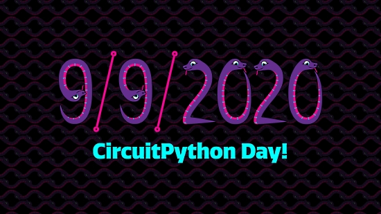
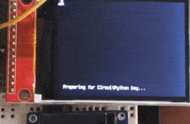
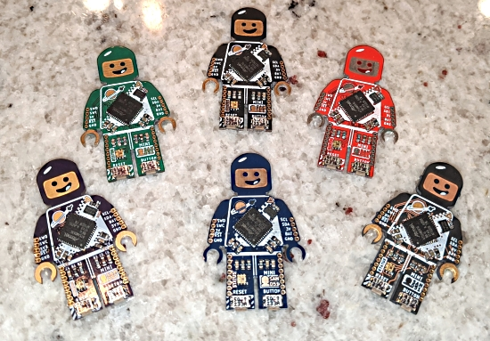
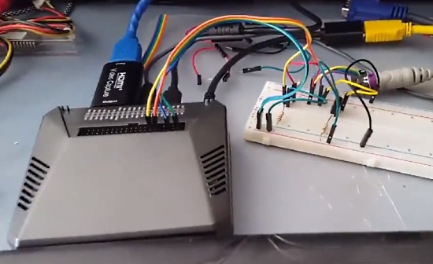
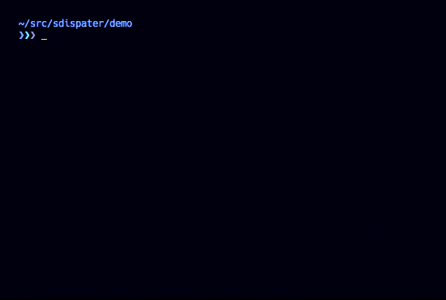
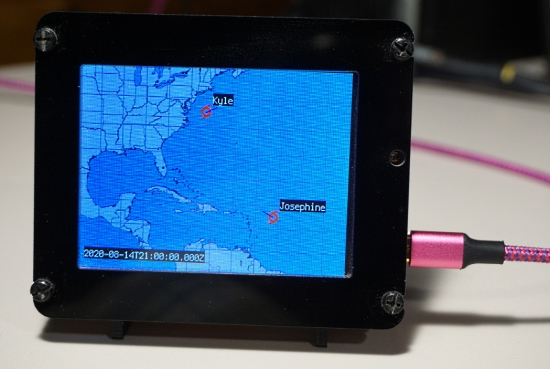
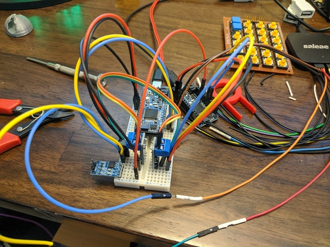
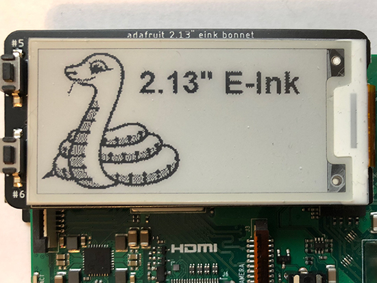
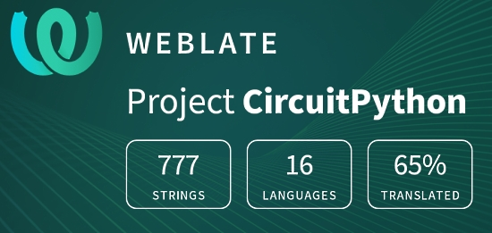

- [X] Kattni updates
- [ ] change date
- [ ] update title
- [ ] Feature story
- [ ] Update  for images
- [ ] Update ICYDNCI
- [ ] All images 550w max only
- [ ] Link "View this email in your browser."

Template last updated on 08-18-2020 by Anne - events tweak

View this email in your browser.

Hi everyone! It's the latest Python for Microcontrollers newsletter, brought you by the community! We're on [Discord](https://discord.gg/HYqvREz), [Twitter](https://twitter.com/search?q=circuitpython&src=typed_query&f=live), and for past newsletters - [view them all here](https://www.adafruitdaily.com/category/circuitpython/). If you're reading this on the web, [subscribe here](https://www.adafruitdaily.com/). Let's get started!

## Headline Article

Text

## Feature

Text

## CircuitPython Deep Dive Stream with Scott Shawcroft

This week, Scott streams his work on .

You can see the latest video and past videos on the Adafruit YouTube channel under the Deep Dive playlist - [YouTube](https://www.youtube.com/playlist?list=PLjF7R1fz_OOXBHlu9msoXq2jQN4JpCk8A).

## CircuitPython Day is 9-9-2020

Adafruit has chosen September 9, 2020 (9/9/2020) as the snakiest day of this year for CircuitPython Day! Much more to come on events and happenings to include a CircuitPython team livestream, collaboration with hardware and software folks, and highlighting all things Python and Python on Hardware. More information will be forthcoming. Ideas? Send them via email to circuitpythonday@adafruit.com.

## Adding Bitmap Blitting to CircuitPython...

Kevin Matocha states 'I’m leaning how to contribute to the CircuitPython core code. I added a faster way of copying (blitting) bitmaps. With this bitmap.blit function it’s possible to “rainbow-ify” text.' And, that CircuitPython Day 2020 graphics looks great! - [Twitter](https://twitter.com/CycleMatch/status/1296513023033696256).

## ... and Graphics Magic

CircuitPythonista Liz Clark also has the graphics bug, making versions of the dancing parrot on an Adafruit CLUE board - [Twitter](https://twitter.com/BlitzCityDIY/status/1295842598255562753).

## Adafruit Update

**Adafruit is shipping orders!**

Production is up and now is the best time to get the Adafruit items you've been waiting for.

## News from around the web!

New dark blue colored mini SAM boards are now available along with previous colors. Each packs a hefty SAMD51 processor and are CircuitPython compatible - [Tindie](https://www.minifigboards.com/product/mini-sam-m4-blue) and [Twitter](https://twitter.com/bwshockley/status/1296639857738100742).

Turning a Raspberry Pi into a PS/2 keyboard emulator. Essentially the reverse of a PS/2 to USB adapter except the keyboard can come from the network and not just a USB keyboard, similar to an IP KVM, using a Python script - [Twitter](https://twitter.com/FozzTexx/status/1297200968824569856).

Humble Bundle is offering a “Pay what you want” offer for programming and productivity by Mercury Learning texts. $883 worth of materials. And portion of each sale goes to the American Red Cross and Whale and Dolphin Conservation – [Humble Bundle](https://www.humblebundle.com/books/programming-productivity-mercury-books).

Erica Joy Baker, Director of Software Engineering at GitHub, is featured in a recent Olay add with a Python script noting the STEM gap based on gender and ethnicity - [Twitter](https://twitter.com/EricaJoy/status/1295628386849550337).

Playwright is a Python library to automate Chromium, Firefox and WebKit with a single API. Playwright is built to enable cross-browser web automation that is ever-green, capable, reliable and fast - [GitHub](https://github.com/microsoft/playwright-python)

Poetry: Dependency Management for Python - Poetry helps you declare, manage and install dependencies of Python projects, ensuring you have the right stack everywhere - [GitHub](https://github.com/python-poetry/poetry).

**#ICYDNCI What was the most popular, most clicked link, in [last week's newsletter](https://link)? [title](url).**

## Made with Mu

Why Mu? Mu tries to make it as easy as possible to get started with programming but aims to help you graduate to "real" development tools soon after. Everything in Mu is the "real thing" but presented in as simple and obvious way possible. It's like the toddling stage in learning to walk: you're finding your feet and once you're confident, you should move on and explore! Put simply, Mu aims to foster autonomy. Try out Mu today! - [codewith.mu](https://codewith.mu/)

## New Boards Supported by CircuitPython

The number of supported microcontrollers and Single Board Computers (SBC) grows every week. This section outlines which boards have been included in CircuitPython or added to [CircuitPython.org](https://circuitpython.org/).

This week we had X new boards added!

- [Board name](url)

Looking for adding a new board to CircuitPython? It's highly encouraged! Adafruit has four guides to help you do so:

- [How to Add a New Board to CircuitPython](https://learn.adafruit.com/how-to-add-a-new-board-to-circuitpython/overview)
- [How to add a New Board to the circuitpython.org website](https://learn.adafruit.com/how-to-add-a-new-board-to-the-circuitpython-org-website)
- [Adding a Single Board Computer to PlatformDetect for Blinka](https://learn.adafruit.com/adding-a-single-board-computer-to-platformdetect-for-blinka)
- [Adding a Single Board Computer to Blinka](https://learn.adafruit.com/adding-a-single-board-computer-to-blinka)

## New Learn Guides!

[PyPortal Hurricane Tracker](https://learn.adafruit.com/pyportal-hurricane-tracker) from [Carter Nelson](https://learn.adafruit.com/users/caternuson)

[Adafruit TE MS8607 PHT Sensor](https://learn.adafruit.com/adafruit-te-ms8607-pht-sensor) from [Bryan Siepert](https://learn.adafruit.com/users/siddacious)

[Square NeoPixel Display with Black LED Acrylic](https://learn.adafruit.com/sqaure-neopixel-display-with-black-led-acrylic) from [Noe and Pedro](https://learn.adafruit.com/users/pixil3d)

[Adafruit 2.13" Monochrome E-Ink Bonnet for Raspberry Pi](https://learn.adafruit.com/2-13-in-e-ink-bonnet) from [Melissa LeBlanc-Williams](https://learn.adafruit.com/users/MakerMelissa)

[Network Connected RGB Matrix Clock](https://learn.adafruit.com/network-connected-metro-rgb-matrix-clock) from [John Park](https://learn.adafruit.com/users/johnpark)

## CircuitPython Libraries!

CircuitPython support for hardware continues to grow. We are adding support for new sensors and breakouts all the time, as well as improving on the drivers we already have. As we add more libraries and update current ones, you can keep up with all the changes right here!

For the latest libraries, download the [Adafruit CircuitPython Library Bundle](https://circuitpython.org/libraries). For the latest community contributed libraries, download the [CircuitPython Community Bundle](https://github.com/adafruit/CircuitPython_Community_Bundle/releases).

If you'd like to contribute, CircuitPython libraries are a great place to start. Have an idea for a new driver? File an issue on [CircuitPython](https://github.com/adafruit/circuitpython/issues)! Have you written a library you'd like to make available? Submit it to the [CircuitPython Community Bundle](https://github.com/adafruit/CircuitPython_Community_Bundle). Interested in helping with current libraries? Check out the [CircuitPython.org Contributing page](https://circuitpython.org/contributing). We've included open pull requests and issues from the libraries, and details about repo-level issues that need to be addressed. We have a guide on [contributing to CircuitPython with Git and Github](https://learn.adafruit.com/contribute-to-circuitpython-with-git-and-github) if you need help getting started. You can also find us in the #circuitpython channel on the [Adafruit Discord](https://adafru.it/discord).

You can check out this [list of all the Adafruit CircuitPython libraries and drivers available](https://github.com/adafruit/Adafruit_CircuitPython_Bundle/blob/master/circuitpython_library_list.md). 

The current number of CircuitPython libraries is **266**!

**Updated Libraries!**

Here's this week's updated CircuitPython libraries:

 * [Adafruit_CircuitPython_MS8607](https://github.com/adafruit/Adafruit_CircuitPython_MS8607)
 * [Adafruit_CircuitPython_LSM6DS](https://github.com/adafruit/Adafruit_CircuitPython_LSM6DS)
 * [Adafruit_CircuitPython_PM25](https://github.com/adafruit/Adafruit_CircuitPython_PM25)
 * [Adafruit_CircuitPython_Display_Button](https://github.com/adafruit/Adafruit_CircuitPython_Display_Button)
 * [Adafruit_CircuitPython_LED_Animation](https://github.com/adafruit/Adafruit_CircuitPython_LED_Animation)
 * [Adafruit_CircuitPython_TLC59711](https://github.com/adafruit/Adafruit_CircuitPython_TLC59711)
 * [Adafruit_CircuitPython_ProgressBar](https://github.com/adafruit/Adafruit_CircuitPython_ProgressBar)
 * [Adafruit_CircuitPython_BLE_Adafruit](https://github.com/adafruit/Adafruit_CircuitPython_BLE_Adafruit)
 * [Adafruit_CircuitPython_Bitmap_Font](https://github.com/adafruit/Adafruit_CircuitPython_Bitmap_Font)
 * [Adafruit_CircuitPython_INA219](https://github.com/adafruit/Adafruit_CircuitPython_INA219)
 * [Adafruit_CircuitPython_EPD](https://github.com/adafruit/Adafruit_CircuitPython_EPD)
 * [Adafruit_CircuitPython_BLE](https://github.com/adafruit/Adafruit_CircuitPython_BLE)
 * [Adafruit_CircuitPython_PN532](https://github.com/adafruit/Adafruit_CircuitPython_PN532)
 * [Adafruit_CircuitPython_Display_Text](https://github.com/adafruit/Adafruit_CircuitPython_Display_Text)
 * [Adafruit_CircuitPython_PCT2075](https://github.com/adafruit/Adafruit_CircuitPython_PCT2075)
 * [Adafruit_CircuitPython_DHT](https://github.com/adafruit/Adafruit_CircuitPython_DHT)
 * [Adafruit_CircuitPython_MatrixPortal](https://github.com/adafruit/Adafruit_CircuitPython_MatrixPortal)
 * [Adafruit_CircuitPython_ImageLoad](https://github.com/adafruit/Adafruit_CircuitPython_ImageLoad)
 * [Adafruit_CircuitPython_HCSR04](https://github.com/adafruit/Adafruit_CircuitPython_HCSR04)
 * [Adafruit_CircuitPython_PyBadger](https://github.com/adafruit/Adafruit_CircuitPython_PyBadger)
 * [Adafruit_CircuitPython_Motor](https://github.com/adafruit/Adafruit_CircuitPython_Motor)
 * [Adafruit_Blinka](https://github.com/adafruit/Adafruit_Blinka)
 * [CircuitPython_Community_Bundle](https://github.com/adafruit/CircuitPython_Community_Bundle)

**PyPI Download Stats!**

We've written a special library called Adafruit Blinka that makes it possible to use CircuitPython Libraries on [Raspberry Pi and other compatible single-board computers](https://learn.adafruit.com/circuitpython-on-raspberrypi-linux/). Adafruit Blinka and all the CircuitPython libraries have been deployed to PyPI for super simple installation on Linux! Here are the top 10 CircuitPython libraries downloaded from PyPI in the last week, including the total downloads for those libraries:

Keep checking back for updated download stats coming soon!

## What’s the team up to this week?

What is the team up to this week? Let’s check in!

**Bryan**

The last week has seen me mostly working on the CircuitPython library for the BNO080. It's been an enjoyable process as things have, at least until recently, gone swimmingly. I was able to get packets sent and received over I2C fairly quickly, and not too long after I was able to get quaternion data!

It's a testiment to the utility that CircuitPython can provide to seasoned programmers that I was able to get a relatively complex sensor working so quickly. Iteration times are fast thanks to CircuitPython's auto-reload on write functionality, and when paired with a "watcher" it's nearly as fast as I type! What I'm calling are small programs that run in the background looking for file change events and the do _something_. They're essentially the same as what is powering the CircuitPython auto-reload behavior, however in my case I have them set up to write any changes to the library I'm working on to the lib directory on my CIRCUITPY drive. All of that combined with an editor (VSCode) that auto saves, and I rarely have to wait more than a handful of seconds to see my work.

The development of the BNO080 library will benefit from this as it's a very substantial chip with lots of bells and whistles, which means even in the unlikely event that I don't hit any snags, it's going to take a while to write. I'm looking forward to seeing what fun stuff I can do with the sensor. Perhaps I'll finally start working on that autonomous glider I've been daydreaming about (probably not).

In other news, I got back the latest revision of the CAN Bus Feather Wing from OSH Park, and after a bit of assembly I was able to use a pair of them to get a Metro 328 talking to a feather M4 over a very simple interface. "Talking" is being generous; the Metro sends incrementing numbers and the Feather prints them out. But! It's working! Huzzah!

**Dan**

While finishing up HCI \_bleio work for a pull request that if I turn off the debug logging I created to help monitor the HCI commands and responses, it stops working :( . I'm currently debugging this. Needless to say, bugs that go away when you add print statements to help diagnose them are harder to find. I'm now sending debug information directly to pins and monitoring them with a Saleae. I'm making progress and hope to submit a PR soon.

**Jeff**

I've started researching CAN bus. We'd like to implement it in CircuitPython for the SAM E5x series microcontrollers. So far I'm very much in learning mode, with a small network of STM32F405 Feathers sending and receiving packets using code in MicroPython, which already supports CAN bus on the STM32 family of chipsr.  The smaller boards in the foreground are CAN bus tranceivers, which translate from logic levels to special voltages and back.

CANbus is an interesting protocol, and the way it can reconstruct the digital signal (top two traces) from two analog signals (bottom two traces) is pretty fascinating. CANbus incorporates error detection features absent from simpler protocols like I2C. The Saleae logic analyzer is pretty handy because it provides its own decoder for the CAN protocol.

Do you have an application for CAN bus?  Know of hobbyist-level hardware that works with it?  We'd love to hear about it!  Drop us a note on Discord or Twitter.

**Kattni**

Thursday and Friday were mostly creating Fritzing objects. We have so many upcoming products, that we're trying to get ahead on making the Fritzing objects. If you're interested in seeing some sneak peeks, take a look at the Adafruit Fritzing library.

I have one complicated one in progress that required some changes to the component parts, and will require seeing a photo before I can complete it. I put that on hold until I receive the necessary information.

I was finally given time to do a library PR sweep. This is something that is good to do every so often, as sometimes we miss PRs or comments go unnoticed, etc. I went through all the open PRs across all of the library GitHub repos and either commented, merged, delegated or closed every PR that hasn't seen activity in the last few days. I did quite a few on Monday, and on Wednesday the first thing I did was follow up on all the responses I received from the Monday part of the sweep. There are a large number from Wednesday waiting on replies from different folks, so I hope to be fielding that over the next week or so. I also intend to follow up on a few that I will be closing if I don't hear back. 

**Lucian**

This week I wrapped up the PulseOut and PulseIn PRs, and have moved on to working on some bugfixes. I've also received a development board for the STM32F103RE, which will allow me to help test and develop for the F1 port for STM32. 

**Melissa**

This past week I started converting some of our shell scripts to Python scripts. I got the first two done, but I have come to the conclusion that I need to make a library with shell-like functions to make it so I don't repeat some much code as I go along. This will also speed up the conversion process as I'm able to reuse a lot of the functions.

I also worked with Kattni to write an eInk bonnet guide. I worked on the usage page and described ho to use the eInk bonnet on the Raspberry Pi by going over a few examples including how to force dithering for grayscale images. While I was at it, I added grayscale image mode support to the EPD library. You can check out the guide at https://learn.adafruit.com/2-13-in-e-ink-bonnet

I also worked on updating the Sharp Memory display guide that Jeff Epler had started. I mostly did a little light editing and verified everything was working as intended. I also added a section on the steps needed to sett up the Bad Apple demo that you see on the product page. You can check out that guide at: https://learn.adafruit.com/adafruit-sharp-memory-display-breakout

**Scott**

I've continued to make progress on the native wifi APIs. I've added HTTPS support and fixed closing sockets so that memory is freed as needed.

My focus this week has been testing and polishing the Socket class to better handle errors. Networking has a lot of different pieces that can all cause errors so it's a wide variety of errors to cover. I'm making good progress though and hope to have a first version of the code out for review by the end of the week.

## Upcoming events!

PyCon AU has announced they are holding PyConline AU, an online event, from 4–6 September 2020 -  [pycon.org.au](https://2020.pycon.org.au/).

PyGotham is a New York City based, eclectic, Py-centric conference covering many topics. PyGotham TV taking place October 2-3, 2020 with a single track of talks presented online - [Event Website](https://2020.pygotham.tv/) and [Call for Proposals](https://cfp.pygotham.tv/).

PyCon India 2020: the premier conference in India on using and developing the Python programming language. Held online October 3-5, 2020. A [call for proposals](https://in.pycon.org/cfp/2020/proposals/) is now open through August 14, 2020. - [Website](https://in.pycon.org/2020/) and [Twitter](https://twitter.com/pyconindia)

The Hackaday Remoticon will take place everywhere November 6th – 8th, 2020. It’s a weekend packed with workshops about hardware creation, held virtually for all to enjoy - [Hackaday](https://hackaday.com/2020/08/04/hackaday-remoticon-our-2020-conference-is-packed-with-workshops-and-were-calling-for-proposals/).

**Send Your Events In**

As for other events, with the COVID pandemic, most in-person events are postponed or cancelled. If you know of virtual events or events that may occur in the future, please let us know on Discord or on Twitter with hashtag #CircuitPython.

## Latest releases

CircuitPython's stable release is [#.#.#](https://github.com/adafruit/circuitpython/releases/latest) and its unstable release is [#.#.#-##.#](https://github.com/adafruit/circuitpython/releases). New to CircuitPython? Start with our [Welcome to CircuitPython Guide](https://learn.adafruit.com/welcome-to-circuitpython).

[2019####](https://github.com/adafruit/Adafruit_CircuitPython_Bundle/releases/latest) is the latest CircuitPython library bundle.

[v#.#.#](https://micropython.org/download) is the latest MicroPython release. Documentation for it is [here](http://docs.micropython.org/en/latest/pyboard/).

[#.#.#](https://www.python.org/downloads/) is the latest Python release. The latest pre-release version is [#.#.#](https://www.python.org/download/pre-releases/).

[1,806 Stars](https://github.com/adafruit/circuitpython/stargazers) Like CircuitPython? [Star it on GitHub!](https://github.com/adafruit/circuitpython)

## Call for help -- Translating CircuitPython is now easier than ever!

One important feature of CircuitPython is translated control and error messages.

With the help of fellow open source project [Weblate](https://weblate.org/), we're making it even easier to add or improve translations.

Sign in with an existing account such as Github, Google or Facebook and start contributing through a simple web interface. No forks or pull requests needed!

As always, if you run into trouble join us on [Discord](https://adafru.it/discord), we're here to help.

## jobs.adafruit.com - Find a dream job, find great candidates!

[jobs.adafruit.com](https://jobs.adafruit.com/) has returned and folks are posting their skills (including CircuitPython) and companies are looking for talented makers to join their companies - from Digi-Key, to Hackaday, Microcenter, Raspberry Pi and more.

## NUMBER thanks!

The Adafruit Discord community, where we do all our CircuitPython development in the open, reached over NUMBER humans, thank you!  Adafruit believes Discord offers a unique way for CircuitPython folks to connect. Join today at [https://adafru.it/discord](https://adafru.it/discord).

## ICYMI - In case you missed it

The wonderful world of Python on hardware! This is our first video-newsletter-podcast that we’ve started! The news comes from the Python community, Discord, Adafruit communities and more. It’s part of the weekly newsletter, then we have a segment on ASK an ENGINEER and this is the video slice from that! The complete Python on Hardware weekly videocast [playlist is here](https://www.youtube.com/playlist?list=PLjF7R1fz_OOXRMjM7Sm0J2Xt6H81TdDev). 

This video podcast is on [iTunes](https://itunes.apple.com/us/podcast/python-on-hardware/id1451685192?mt=2), [YouTube](http://adafru.it/pohepisodes), [IGTV (Instagram TV](https://www.instagram.com/adafruit/channel/)), and [XML](https://itunes.apple.com/us/podcast/python-on-hardware/id1451685192?mt=2).

[Weekly community chat on Adafruit Discord server CircuitPython channel - Audio / Podcast edition](https://itunes.apple.com/us/podcast/circuitpython-weekly-meeting/id1451685016) - Audio from the Discord chat space for CircuitPython, meetings are usually Mondays at 2pm ET, this is the audio version on [iTunes](https://itunes.apple.com/us/podcast/circuitpython-weekly-meeting/id1451685016), Pocket Casts, [Spotify](https://adafru.it/spotify), and [XML feed](https://adafruit-podcasts.s3.amazonaws.com/circuitpython_weekly_meeting/audio-podcast.xml).

And lastly, we are working up a one-spot destination for all things podcast-able here - [podcasts.adafruit.com](https://podcasts.adafruit.com/)

## Codecademy "Learn Hardware Programming with CircuitPython"

Codecademy, an online interactive learning platform used by more than 45 million people, has teamed up with the leading manufacturer in STEAM electronics, Adafruit Industries, to create a coding course, "Learn Hardware Programming with CircuitPython". The course is now available in the [Codecademy catalog](https://www.codecademy.com/learn/learn-circuitpython?utm_source=adafruit&utm_medium=partners&utm_campaign=circuitplayground&utm_content=pythononhardwarenewsletter).

Python is a highly versatile, easy to learn programming language that a wide range of people, from visual effects artists in Hollywood to mission control at NASA, use to quickly solve problems. But you don’t need to be a rocket scientist to accomplish amazing things with it. This new course introduces programmers to Python by way of a microcontroller — CircuitPython — which is a Python-based programming language optimized for use on hardware.

CircuitPython’s hardware-ready design makes it easier than ever to program a variety of single-board computers, and this course gets you from no experience to working prototype faster than ever before. Codecademy’s interactive learning environment, combined with Adafruit's highly rated Circuit Playground Express, present aspiring hardware hackers with a never-before-seen opportunity to learn hardware programming seamlessly online.

Whether for those who are new to programming, or for those who want to expand their skill set to include physical computing, this course will have students getting familiar with Python and creating incredible projects along the way. By the end, students will have built their own bike lights, drum machine, and even a moisture detector that can tell when it's time to water a plant.

Visit Codecademy to access the [Learn Hardware Programming with CircuitPython](https://www.codecademy.com/learn/learn-circuitpython?utm_source=adafruit&utm_medium=partners&utm_campaign=circuitplayground&utm_content=pythononhardwarenewsletter) course and Adafruit to purchase a [Circuit Playground Express](https://www.adafruit.com/product/3333).

Codecademy has helped more than 45 million people around the world upgrade their careers with technology skills. The company’s online interactive learning platform is widely recognized for providing an accessible, flexible, and engaging experience for beginners and experienced programmers alike. Codecademy has raised a total of $43 million from investors including Union Square Ventures, Kleiner Perkins, Index Ventures, Thrive Capital, Naspers, Yuri Milner and Richard Branson, most recently raising its $30 million Series C in July 2016.

## Contribute!

The CircuitPython Weekly Newsletter is a CircuitPython community-run newsletter emailed every Tuesday. The complete [archives are here](https://www.adafruitdaily.com/category/circuitpython/). It highlights the latest CircuitPython related news from around the web including Python and MicroPython developments. To contribute, edit next week's draft [on GitHub](https://github.com/adafruit/circuitpython-weekly-newsletter/tree/gh-pages/_drafts) and [submit a pull request](https://help.github.com/articles/editing-files-in-your-repository/) with the changes. You may also tag your information on Twitter with #CircuitPython. 

Join our [Discord](https://adafru.it/discord) or [post to the forum](https://forums.adafruit.com/viewforum.php?f=60) for any further questions.
