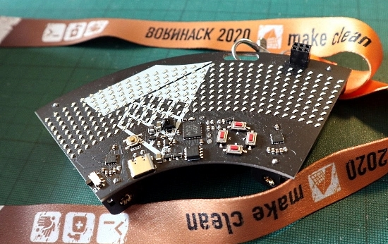
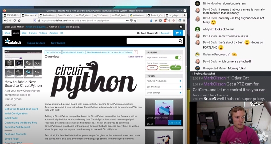
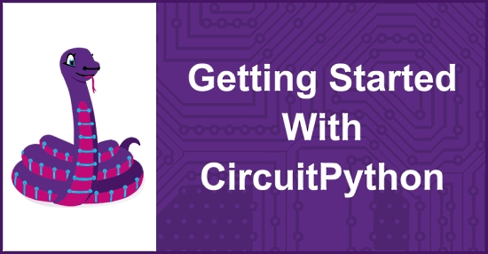
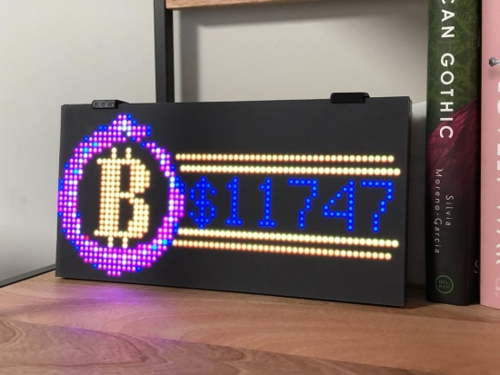
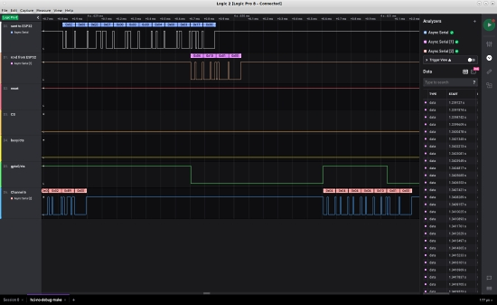
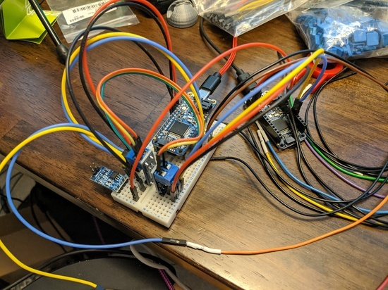
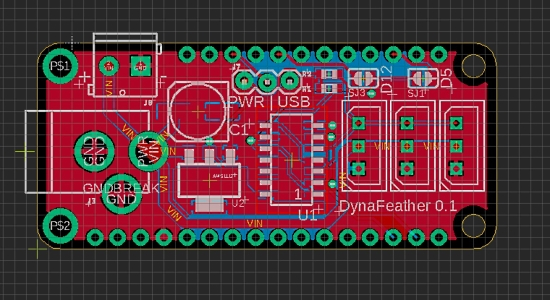
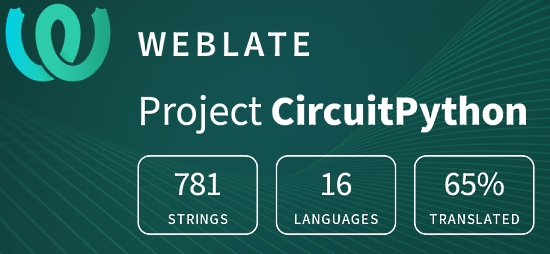

- [X] Kattni updates
- [ ] change date
- [ ] update title
- [ ] Feature story
- [ ] Update  for images
- [ ] Update ICYDNCI
- [ ] All images 550w max only
- [ ] Link "View this email in your browser."

Template last updated on 08-25-2020 by Kattni - Modernization tweaks

View this email in your browser.

Hi everyone! It's the latest Python for Microcontrollers newsletter, brought you by the community! We're on [Discord](https://discord.gg/HYqvREz), [Twitter](https://twitter.com/search?q=circuitpython&src=typed_query&f=live), and for past newsletters - [view them all here](https://www.adafruitdaily.com/category/circuitpython/). If you're reading this on the web, [subscribe here](https://www.adafruitdaily.com/). Let's get started!

## Headline Article

Text

## The Bornhack Badge

BornHack still happened this year and they once again provided an electronic badge to all attendees - the [2020 BornHack badge](https://github.com/bornhack/badge2020)!

> Similar to the last couple of years, this badge has an ARM cortex M0+ as the main controller, but on this badge it's the SAMD21 from Microchip, with 4 times as much flash and RAM compared to the chips from the previous badges. This makes it possible to run Adafruit CircuitPython, which lowers the bar for how easy it is to get started hacking on the badge.

Read more - [Hackaday](https://hackaday.com/2020/08/27/hands-on-bornhack-2020-badge-has-9x32-of-bling-fed-by-circuitpython/), [GitHub](https://github.com/bornhack/badge2020) and [YouTube](https://youtu.be/1t1gyQ_yyU8).

## CircuitPython Deep Dive Stream with Scott Shawcroft

[This week](link), Scott streams his work on .

You can see the latest video and past videos on the Adafruit YouTube channel under the Deep Dive playlist - [YouTube](https://www.youtube.com/playlist?list=PLjF7R1fz_OOXBHlu9msoXq2jQN4JpCk8A).

## CircuitPython Day is 9-9-2020

Adafruit has chosen September 9, 2020 (9/9/2020) as the snakiest day of this year for CircuitPython Day! Much more to come on events and happenings to include a CircuitPython team livestream, collaboration with hardware and software folks, and highlighting all things Python and Python on Hardware.

### Dia CircuitPython

CircuitPython fans in Central America are planning additional activities.

> Costa Rican artist isabelootag has been commissioned to create a mascot for us for this event, taking into account our roots and culture as Central Americans. pet. You may already know Blinka, the snake mascot Adafruit has chosen for CircuitPython. With his talent he has created us who we are sure will be loved by all. I present to you Quetzalblinka .

See their website (in Spanish) for their planned activities - [DiaCircuitPython.org](https://diacircuitpython.org/).

### Dedication

This year CircuitPython Day is being dedicated to Lamba Labs Makerspace, who are helping during the Beirut disaster.

More information on CircuitPython Day is forthcoming. Ideas? Send them via email to circuitpythonday@adafruit.com and add your event to the working calendar - [GitHub](https://github.com/adafruit/circuitpython-weekly-newsletter/blob/gh-pages/circuitpythonday2020.md).

## Adafruit Update

**Adafruit is shipping orders!**

Adafruit is stocked and shipping orders!

Now is the best time to get orders in for your favorite products, including items for students.

Science is fun and educational when using Adafruit parts and free, easy to follow tutorials in the [Adafruit Learning System](https://learn.adafruit.com/).

[Shop Adafruit now](https://www.adafruit.com/)

## News from around the web!

The [Getting Started With CircuitPython On Compatible Microcontroller Boards](https://www.woolseyworkshop.com/2020/08/28/getting-started-with-circuitpython-on-compatible-microcontroller-boards/) guide is now available to help people get up and running with CircuitPython - [Woolsey Workshop](https://www.woolseyworkshop.com/2020/08/28/getting-started-with-circuitpython-on-compatible-microcontroller-boards/) and [Twitter](https://twitter.com/JohnWWoolsey/status/1299444645441699843).

**#ICYDNCI What was the most popular, most clicked link, in [last week's newsletter](https://link)? [title](url).**

## Made with Mu

Why Mu? Mu tries to make it as easy as possible to get started with programming but aims to help you graduate to "real" development tools soon after. Everything in Mu is the "real thing" but presented in as simple and obvious way possible. It's like the toddling stage in learning to walk: you're finding your feet and once you're confident, you should move on and explore! Put simply, Mu aims to foster autonomy. Try out Mu today! - [codewith.mu](https://codewith.mu/)

## New Boards Supported by CircuitPython

The number of supported microcontrollers and Single Board Computers (SBC) grows every week. This section outlines which boards have been included in CircuitPython or added to [CircuitPython.org](https://circuitpython.org/).

This week we had X new boards added!

- [Board name](url)

Looking for adding a new board to CircuitPython? It's highly encouraged! Adafruit has four guides to help you do so:

- [How to Add a New Board to CircuitPython](https://learn.adafruit.com/how-to-add-a-new-board-to-circuitpython/overview)
- [How to add a New Board to the circuitpython.org website](https://learn.adafruit.com/how-to-add-a-new-board-to-the-circuitpython-org-website)
- [Adding a Single Board Computer to PlatformDetect for Blinka](https://learn.adafruit.com/adding-a-single-board-computer-to-platformdetect-for-blinka)
- [Adding a Single Board Computer to Blinka](https://learn.adafruit.com/adding-a-single-board-computer-to-blinka)

## New Learn Guides!

[NeoPixel Flame Torch](https://learn.adafruit.com/neopixel-flame-torch) from [Noe and Pedro](https://learn.adafruit.com/users/pixil3d)

[Bitcoin Value RGB Matrix Display](https://learn.adafruit.com/bitcoin-value-rgb-matrix-display) from [John Park](https://learn.adafruit.com/users/johnpark)

## CircuitPython Libraries!

CircuitPython support for hardware continues to grow. We are adding support for new sensors and breakouts all the time, as well as improving on the drivers we already have. As we add more libraries and update current ones, you can keep up with all the changes right here!

For the latest libraries, download the [Adafruit CircuitPython Library Bundle](https://circuitpython.org/libraries). For the latest community contributed libraries, download the [CircuitPython Community Bundle](https://github.com/adafruit/CircuitPython_Community_Bundle/releases).

If you'd like to contribute, CircuitPython libraries are a great place to start. Have an idea for a new driver? File an issue on [CircuitPython](https://github.com/adafruit/circuitpython/issues)! Have you written a library you'd like to make available? Submit it to the [CircuitPython Community Bundle](https://github.com/adafruit/CircuitPython_Community_Bundle). Interested in helping with current libraries? Check out the [CircuitPython.org Contributing page](https://circuitpython.org/contributing). We've included open pull requests and issues from the libraries, and details about repo-level issues that need to be addressed. We have a guide on [contributing to CircuitPython with Git and Github](https://learn.adafruit.com/contribute-to-circuitpython-with-git-and-github) if you need help getting started. You can also find us in the #circuitpython channel on the [Adafruit Discord](https://adafru.it/discord).

You can check out this [list of all the Adafruit CircuitPython libraries and drivers available](https://github.com/adafruit/Adafruit_CircuitPython_Bundle/blob/master/circuitpython_library_list.md). 

The current number of CircuitPython libraries is **267**!

**New Libraries!**

Here's this week's new CircuitPython libraries:

* [Adafruit_CircuitPython_TC74](https://github.com/adafruit/Adafruit_CircuitPython_TC74)

**Updated Libraries!**

Here's this week's updated CircuitPython libraries:

 * [Adafruit_CircuitPython_CLUE](https://github.com/adafruit/Adafruit_CircuitPython_CLUE)
 * [Adafruit_CircuitPython_MotorKit](https://github.com/adafruit/Adafruit_CircuitPython_MotorKit)
 * [Adafruit_CircuitPython_BLE](https://github.com/adafruit/Adafruit_CircuitPython_BLE)
 * [Adafruit_CircuitPython_LSM6DS](https://github.com/adafruit/Adafruit_CircuitPython_LSM6DS)
 * [Adafruit_CircuitPython_VS1053](https://github.com/adafruit/Adafruit_CircuitPython_VS1053)
 * [Adafruit_CircuitPython_VL6180X](https://github.com/adafruit/Adafruit_CircuitPython_VL6180X)
 * [Adafruit_CircuitPython_VL53L0X](https://github.com/adafruit/Adafruit_CircuitPython_VL53L0X)
 * [Adafruit_CircuitPython_VEML6075](https://github.com/adafruit/Adafruit_CircuitPython_VEML6075)
 * [Adafruit_CircuitPython_VEML6070](https://github.com/adafruit/Adafruit_CircuitPython_VEML6070)
 * [Adafruit_CircuitPython_VCNL4010](https://github.com/adafruit/Adafruit_CircuitPython_VCNL4010)
 * [Adafruit_CircuitPython_VC0706](https://github.com/adafruit/Adafruit_CircuitPython_VC0706)
 * [Adafruit_CircuitPython_TSL2591](https://github.com/adafruit/Adafruit_CircuitPython_TSL2591)
 * [Adafruit_CircuitPython_TSL2561](https://github.com/adafruit/Adafruit_CircuitPython_TSL2561)
 * [Adafruit_CircuitPython_Trellis](https://github.com/adafruit/Adafruit_CircuitPython_Trellis)
 * [Adafruit_CircuitPython_TMP006](https://github.com/adafruit/Adafruit_CircuitPython_TMP006)
 * [Adafruit_CircuitPython_Thermal_Printer](https://github.com/adafruit/Adafruit_CircuitPython_Thermal_Printer)
 * [Adafruit_CircuitPython_TCS34725](https://github.com/adafruit/Adafruit_CircuitPython_TCS34725)
 * [Adafruit_CircuitPython_SSD1306](https://github.com/adafruit/Adafruit_CircuitPython_SSD1306)
 * [Adafruit_CircuitPython_SSD1305](https://github.com/adafruit/Adafruit_CircuitPython_SSD1305)
 * [Adafruit_CircuitPython_SI5351](https://github.com/adafruit/Adafruit_CircuitPython_SI5351)
 * [Adafruit_CircuitPython_SI4713](https://github.com/adafruit/Adafruit_CircuitPython_SI4713)
 * [Adafruit_CircuitPython_SGP30](https://github.com/adafruit/Adafruit_CircuitPython_SGP30)
 * [Adafruit_CircuitPython_RFM9x](https://github.com/adafruit/Adafruit_CircuitPython_RFM9x)
 * [Adafruit_CircuitPython_PN532](https://github.com/adafruit/Adafruit_CircuitPython_PN532)
 * [Adafruit_CircuitPython_PCT2075](https://github.com/adafruit/Adafruit_CircuitPython_PCT2075)
 * [Adafruit_CircuitPython_PCF8523](https://github.com/adafruit/Adafruit_CircuitPython_PCF8523)
 * [Adafruit_CircuitPython_MPU6050](https://github.com/adafruit/Adafruit_CircuitPython_MPU6050)
 * [Adafruit_CircuitPython_MPRLS](https://github.com/adafruit/Adafruit_CircuitPython_MPRLS)
 * [Adafruit_CircuitPython_MPR121](https://github.com/adafruit/Adafruit_CircuitPython_MPR121)
 * [Adafruit_CircuitPython_MPL3115A2](https://github.com/adafruit/Adafruit_CircuitPython_MPL3115A2)
 * [Adafruit_CircuitPython_MPL115A2](https://github.com/adafruit/Adafruit_CircuitPython_MPL115A2)
 * [Adafruit_CircuitPython_MMA8451](https://github.com/adafruit/Adafruit_CircuitPython_MMA8451)
 * [Adafruit_CircuitPython_LSM303_Accel](https://github.com/adafruit/Adafruit_CircuitPython_LSM303_Accel)
 * [Adafruit_CircuitPython_MAX9744](https://github.com/adafruit/Adafruit_CircuitPython_MAX9744)
 * [Adafruit_CircuitPython_MAX31865](https://github.com/adafruit/Adafruit_CircuitPython_MAX31865)
 * [Adafruit_CircuitPython_MAX31855](https://github.com/adafruit/Adafruit_CircuitPython_MAX31855)
 * [Adafruit_CircuitPython_LSM9DS1](https://github.com/adafruit/Adafruit_CircuitPython_LSM9DS1)
 * [Adafruit_CircuitPython_LSM9DS0](https://github.com/adafruit/Adafruit_CircuitPython_LSM9DS0)
 * [Adafruit_CircuitPython_LSM303DLH_Mag](https://github.com/adafruit/Adafruit_CircuitPython_LSM303DLH_Mag)
 * [Adafruit_CircuitPython_LPS35HW](https://github.com/adafruit/Adafruit_CircuitPython_LPS35HW)
 * [Adafruit_CircuitPython_INA219](https://github.com/adafruit/Adafruit_CircuitPython_INA219)
 * [Adafruit_CircuitPython_LIS2MDL](https://github.com/adafruit/Adafruit_CircuitPython_LIS2MDL)
 * [Adafruit_CircuitPython_DS3231](https://github.com/adafruit/Adafruit_CircuitPython_DS3231)
 * [Adafruit_CircuitPython_INA260](https://github.com/adafruit/Adafruit_CircuitPython_INA260)
 * [Adafruit_CircuitPython_ICM20X](https://github.com/adafruit/Adafruit_CircuitPython_ICM20X)
 * [Adafruit_CircuitPython_FXOS8700](https://github.com/adafruit/Adafruit_CircuitPython_FXOS8700)
 * [Adafruit_CircuitPython_FXAS21002C](https://github.com/adafruit/Adafruit_CircuitPython_FXAS21002C)
 * [Adafruit_CircuitPython_DS3502](https://github.com/adafruit/Adafruit_CircuitPython_DS3502)
 * [Adafruit_CircuitPython_DS1307](https://github.com/adafruit/Adafruit_CircuitPython_DS1307)
 * [Adafruit_CircuitPython_DRV2605](https://github.com/adafruit/Adafruit_CircuitPython_DRV2605)
 * [Adafruit_CircuitPython_DPS310](https://github.com/adafruit/Adafruit_CircuitPython_DPS310)
 * [Adafruit_CircuitPython_CAP1188](https://github.com/adafruit/Adafruit_CircuitPython_CAP1188)
 * [Adafruit_CircuitPython_BMP3XX](https://github.com/adafruit/Adafruit_CircuitPython_BMP3XX)
 * [Adafruit_CircuitPython_BD3491FS](https://github.com/adafruit/Adafruit_CircuitPython_BD3491FS)
 * [Adafruit_CircuitPython_APDS9960](https://github.com/adafruit/Adafruit_CircuitPython_APDS9960)
 * [Adafruit_CircuitPython_ADXL34x](https://github.com/adafruit/Adafruit_CircuitPython_ADXL34x)
 * [Adafruit_CircuitPython_ADS1x15](https://github.com/adafruit/Adafruit_CircuitPython_ADS1x15)
 * [Adafruit_CircuitPython_miniesptool](https://github.com/adafruit/Adafruit_CircuitPython_miniesptool)
 * [Adafruit_CircuitPython_PyBadger](https://github.com/adafruit/Adafruit_CircuitPython_PyBadger)
 * [Adafruit_CircuitPython_AMG88xx](https://github.com/adafruit/Adafruit_CircuitPython_AMG88xx)
 * [Adafruit_CircuitPython_ProgressBar](https://github.com/adafruit/Adafruit_CircuitPython_ProgressBar)
 * [Adafruit_CircuitPython_CharLCD](https://github.com/adafruit/Adafruit_CircuitPython_CharLCD)
 * [Adafruit_CircuitPython_BluefruitSPI](https://github.com/adafruit/Adafruit_CircuitPython_BluefruitSPI)
 * [Adafruit_CircuitPython_LIS3DH](https://github.com/adafruit/Adafruit_CircuitPython_LIS3DH)
 * [Adafruit_CircuitPython_MatrixPortal](https://github.com/adafruit/Adafruit_CircuitPython_MatrixPortal)
 * [Adafruit_CircuitPython_MCP4725](https://github.com/adafruit/Adafruit_CircuitPython_MCP4725)
 * [Adafruit_CircuitPython_Display_Text](https://github.com/adafruit/Adafruit_CircuitPython_Display_Text)

**PyPI Download Stats!**

We've written a special library called Adafruit Blinka that makes it possible to use CircuitPython Libraries on [Raspberry Pi and other compatible single-board computers](https://learn.adafruit.com/circuitpython-on-raspberrypi-linux/). Adafruit Blinka and all the CircuitPython libraries have been deployed to PyPI for super simple installation on Linux! Here are the top 10 CircuitPython libraries downloaded from PyPI in the last week, including the total downloads for those libraries:

Keep checking back for updated download stats coming soon!

## What’s the team up to this week?

What is the team up to this week? Let’s check in!

**Bryan**

This pass week has been busy with development, primarily on the BNO080 but also a new project! The work on the BNO080 has been attempting to get the SPI mode working correctly and reliably. The I2C mode has been working excellently and without issue, however it seems that the sensor is less willing to work without issue when the user/developer hasn’t quite gotten everything correct with SPI. My testing leads me to believe that the issue is due to responding to packets being received correctly, however I can’t confirm it.

Taking a break from the SPI support, I was able to do some refactoring and cleanup the code, which allowed me to relatively easily add support for new sensor report types. In BNO080/Hillcrest Labs speak, a sensor report is a packet of information that represents a measurement from a sensor or sensor fusion algorithm. I’ve added the gyro, magnetometer, and linear acceleration (acceleration with the gravity offset removed), in addition to the rotation vector quaternion. There are still a few remaining report types to include in addition to a multitude of configuration options, so it’s not quite done yet but it is progressing well.

To take a break from the BNO which had been monopolizing my time, I switched gears to getting the latest revision of the CAN FeatherWing up and running. After a bit of wrangling, I was able to get a Feather M4 Express, Feather Sense, and a Edge Badge all talking to each other on a shared bus. For now they’re only sending simple messages to each other, however it should be enough to allow me to start working on CircuitPython support for the MCP2515 CAN controller that it uses. I also spent some time working with Jepler on brainstorming about CAN APIs so that we can ensure a common interface for native and SPI CAN controllers.

**Dan**

I finished debugging HCI \_bleio and submitted a [PR](https://github.com/adafruit/circuitpython/pull/3310). I had to use a Saleae (see above), and add code to output extra data on a spare pin to see what was going on internally. Scott has reviewed the PR, and I'm now making a few fixes. The PR should be merged within a few days.

The next CircuitPython 6.0.0 alpha release, 6.0.0-alpha.3, is nearly ready, and by the time you read this, it should be out. The release after that we hope will include both HCI \_bleio and also Scott's [Wifi support for the ESP32-S2](https://github.com/adafruit/circuitpython/pull/3326), so watch for that soon.

I've been trying to automate or at least facilitate the data-gathering we do to prepare the release notes for each CircuitPython release. Right now it's pretty much done by hand. To this end, I've been [trying out the GraphQL interface to GitHub](https://developer.github.com/v4/explorer/), which facilitates some but not all of the queries I want to do.

**Jeff**

New project time, which means a new rat's nest of wires on my desk.

We're starting on CAN bus support in CircuitPython.  The first hardware we'll add it to is the SAM E54 Xplained board, because the E54 microcontroller has a built in CAN peripheral.  However, my testing network here consists of two STM32F405 Feathers running MicroPython, which has its own implementation of CAN.

CAN is interesting because it is used inside of automobiles but can also be used as a small network between microcontrollers.  If you have any use cases for CAN bus let us know on Discord #circuitpython so we can keep them in mind as we create this API.

**Kattni**

I finally finished the fritzing object for the BrainCraft HAT. That one was a beast, including a fix to the board file, updating some of the sub-components, and bringing in parts from other objects. But it's done! Looks great.

I finished the library pull request sweep, and have been following up with replies to my comments and messages. It was good to go through everything and make sure we hadn't missed anything.

I did a bunch of misc that had been assigned to me over time. I tested a PR to Adafruit CircuitPython Motor. I updated the MotorKit guide to show how to use multiple I2C devices. Followed up on GitHub assignments. I update the RGB Matrix FeatherWing guide with the new nRF FeatherWing. Reviewed various PRs.

Spent some time updating the LIS3DH guide to include the new STEMMA QT version, so whether you have the original or have gotten your hands on one of the new versions, you'll know how to wire it up and get it going.

Next up is updating some motor driver guides to include CircuitPython usage.

**Lucian**

This week I've been working on fixing a variety of bugs across multiple ports. I started out with a bug that was crashing the Meowbit at startup, which turned out to be multiple issues related to low power, displayio changes, and pulseio pointer problems. I also revisited some older issues on the STM32 which were simply out of date, having been fixed a long time ago by wider-scale improvements to the port. After that, I've been spending time on a variety of problems on the ESP32-S2 and STM32, including fixing the TRNG module across both ports, debugging a crash related to DisplayIO on the ESP32, dealing with problems related to Makefile comment style, and logging some potential issues with the filesystem. It's somewhat scattered work, but it's good to make sure that major bugs don't linger in the issues list for too long, and I've often found that investigating an issue in one port turns up undocumented problems in others.

In my off time, this past week I finished a breakout Featherwing for the Dynamixel AX-12 servo motor to go with my [library](https://github.com/hierophect/Circuitpython_Dynamixel). I've been meaning to get back into making my own hardware, and it seems like the assembly options for PCBs have gotten a lot cheaper recently, which really lowers the barrier to entry for my projects. I'm excited to see how these ones turned out when they arrive this week.

**Melissa**

This past week I took a little time off, so I only ended up working a couple of days. I was doing a bit of catching up, so I had a mix of small projects. I wrote a basic weather demo that uses the MatrixPortal library. I also wrote another quick demo to display some information about the phase of the moon. I  updated some GitHub issues and tested out some code. Finally, I started creating a library to contain some shell scripting functions to make it easier to convert some of our Raspberry Pi Installation scripts over to Python.

**Scott**

I've finally gotten a pull request (PR) out for [native wifi support on the ESP32-S2](https://github.com/adafruit/circuitpython/pull/3326)! I also sent out a [PR for PSRAM support](https://github.com/adafruit/circuitpython/pull/3315) as well. So, things are picking up. We're going to be finding and fixing bugs as folks test all of this new stuff.

This coming week I'll be refining the open PRs to get them merged and also working to get PRs out for my improvements to the Requests library. The improvements tweak the API to work with the native wifi support and reduce the memory overhead of loading JSON.

## Upcoming events!

PyCon AU has announced they are holding PyConline AU, an online event, from 4–6 September 2020 -  [pycon.org.au](https://2020.pycon.org.au/).

PyGotham is a New York City based, eclectic, Py-centric conference covering many topics. PyGotham TV taking place October 2-3, 2020 with a single track of talks presented online - [Event Website](https://2020.pygotham.tv/).

PyCon India 2020: the premier conference in India on using and developing the Python programming language. Held online October 3-5, 2020. A [call for proposals](https://in.pycon.org/cfp/2020/proposals/) is now open through August 14, 2020. - [Website](https://in.pycon.org/2020/) and [Twitter](https://twitter.com/pyconindia)

The Hackaday Remoticon will take place everywhere November 6th – 8th, 2020. It’s a weekend packed with workshops about hardware creation, held virtually for all to enjoy - [Hackaday](https://hackaday.com/2020/08/04/hackaday-remoticon-our-2020-conference-is-packed-with-workshops-and-were-calling-for-proposals/).

**Send Your Events In**

As for other events, with the COVID pandemic, most in-person events are postponed or cancelled. If you know of virtual events or events that may occur in the future, please let us know on Discord or on Twitter with hashtag #CircuitPython.

## Latest releases

CircuitPython's stable release is [#.#.#](https://github.com/adafruit/circuitpython/releases/latest) and its unstable release is [#.#.#-##.#](https://github.com/adafruit/circuitpython/releases). New to CircuitPython? Start with our [Welcome to CircuitPython Guide](https://learn.adafruit.com/welcome-to-circuitpython).

[2020####](https://github.com/adafruit/Adafruit_CircuitPython_Bundle/releases/latest) is the latest CircuitPython library bundle.

[v#.#.#](https://micropython.org/download) is the latest MicroPython release. Documentation for it is [here](http://docs.micropython.org/en/latest/pyboard/).

[#.#.#](https://www.python.org/downloads/) is the latest Python release. The latest pre-release version is [#.#.#](https://www.python.org/download/pre-releases/).

[1813 Stars](https://github.com/adafruit/circuitpython/stargazers) Like CircuitPython? [Star it on GitHub!](https://github.com/adafruit/circuitpython)

## Call for help -- Translating CircuitPython is now easier than ever!

One important feature of CircuitPython is translated control and error messages.

With the help of fellow open source project [Weblate](https://weblate.org/), we're making it even easier to add or improve translations.

Sign in with an existing account such as Github, Google or Facebook and start contributing through a simple web interface. No forks or pull requests needed!

As always, if you run into trouble join us on [Discord](https://adafru.it/discord), we're here to help.

## jobs.adafruit.com - Find a dream job, find great candidates!

[jobs.adafruit.com](https://jobs.adafruit.com/) has returned and folks are posting their skills (including CircuitPython) and companies are looking for talented makers to join their companies - from Digi-Key, to Hackaday, Microcenter, Raspberry Pi and more.

## NUMBER thanks!

The Adafruit Discord community, where we do all our CircuitPython development in the open, reached over NUMBER humans, thank you!  Adafruit believes Discord offers a unique way for CircuitPython folks to connect. Join today at [https://adafru.it/discord](https://adafru.it/discord).

## ICYMI - In case you missed it

The wonderful world of Python on hardware! This is our first video-newsletter-podcast that we’ve started! The news comes from the Python community, Discord, Adafruit communities and more. It’s part of the weekly newsletter, then we have a segment on ASK an ENGINEER and this is the video slice from that! The complete Python on Hardware weekly videocast [playlist is here](https://www.youtube.com/playlist?list=PLjF7R1fz_OOXRMjM7Sm0J2Xt6H81TdDev). 

This video podcast is on [iTunes](https://itunes.apple.com/us/podcast/python-on-hardware/id1451685192?mt=2), [YouTube](http://adafru.it/pohepisodes), [IGTV (Instagram TV](https://www.instagram.com/adafruit/channel/)), and [XML](https://itunes.apple.com/us/podcast/python-on-hardware/id1451685192?mt=2).

[Weekly community chat on Adafruit Discord server CircuitPython channel - Audio / Podcast edition](https://itunes.apple.com/us/podcast/circuitpython-weekly-meeting/id1451685016) - Audio from the Discord chat space for CircuitPython, meetings are usually Mondays at 2pm ET, this is the audio version on [iTunes](https://itunes.apple.com/us/podcast/circuitpython-weekly-meeting/id1451685016), Pocket Casts, [Spotify](https://adafru.it/spotify), and [XML feed](https://adafruit-podcasts.s3.amazonaws.com/circuitpython_weekly_meeting/audio-podcast.xml).

And lastly, we are working up a one-spot destination for all things podcast-able here - [podcasts.adafruit.com](https://podcasts.adafruit.com/)

## Codecademy "Learn Hardware Programming with CircuitPython"

Codecademy, an online interactive learning platform used by more than 45 million people, has teamed up with the leading manufacturer in STEAM electronics, Adafruit Industries, to create a coding course, "Learn Hardware Programming with CircuitPython". The course is now available in the [Codecademy catalog](https://www.codecademy.com/learn/learn-circuitpython?utm_source=adafruit&utm_medium=partners&utm_campaign=circuitplayground&utm_content=pythononhardwarenewsletter).

Python is a highly versatile, easy to learn programming language that a wide range of people, from visual effects artists in Hollywood to mission control at NASA, use to quickly solve problems. But you don’t need to be a rocket scientist to accomplish amazing things with it. This new course introduces programmers to Python by way of a microcontroller — CircuitPython — which is a Python-based programming language optimized for use on hardware.

CircuitPython’s hardware-ready design makes it easier than ever to program a variety of single-board computers, and this course gets you from no experience to working prototype faster than ever before. Codecademy’s interactive learning environment, combined with Adafruit's highly rated Circuit Playground Express, present aspiring hardware hackers with a never-before-seen opportunity to learn hardware programming seamlessly online.

Whether for those who are new to programming, or for those who want to expand their skill set to include physical computing, this course will have students getting familiar with Python and creating incredible projects along the way. By the end, students will have built their own bike lights, drum machine, and even a moisture detector that can tell when it's time to water a plant.

Visit Codecademy to access the [Learn Hardware Programming with CircuitPython](https://www.codecademy.com/learn/learn-circuitpython?utm_source=adafruit&utm_medium=partners&utm_campaign=circuitplayground&utm_content=pythononhardwarenewsletter) course and Adafruit to purchase a [Circuit Playground Express](https://www.adafruit.com/product/3333).

Codecademy has helped more than 45 million people around the world upgrade their careers with technology skills. The company’s online interactive learning platform is widely recognized for providing an accessible, flexible, and engaging experience for beginners and experienced programmers alike. Codecademy has raised a total of $43 million from investors including Union Square Ventures, Kleiner Perkins, Index Ventures, Thrive Capital, Naspers, Yuri Milner and Richard Branson, most recently raising its $30 million Series C in July 2016.

## Contribute!

The CircuitPython Weekly Newsletter is a CircuitPython community-run newsletter emailed every Tuesday. The complete [archives are here](https://www.adafruitdaily.com/category/circuitpython/). It highlights the latest CircuitPython related news from around the web including Python and MicroPython developments. To contribute, edit next week's draft [on GitHub](https://github.com/adafruit/circuitpython-weekly-newsletter/tree/gh-pages/_drafts) and [submit a pull request](https://help.github.com/articles/editing-files-in-your-repository/) with the changes. You may also tag your information on Twitter with #CircuitPython. 

Join our [Discord](https://adafru.it/discord) or [post to the forum](https://forums.adafruit.com/viewforum.php?f=60) for any further questions.
